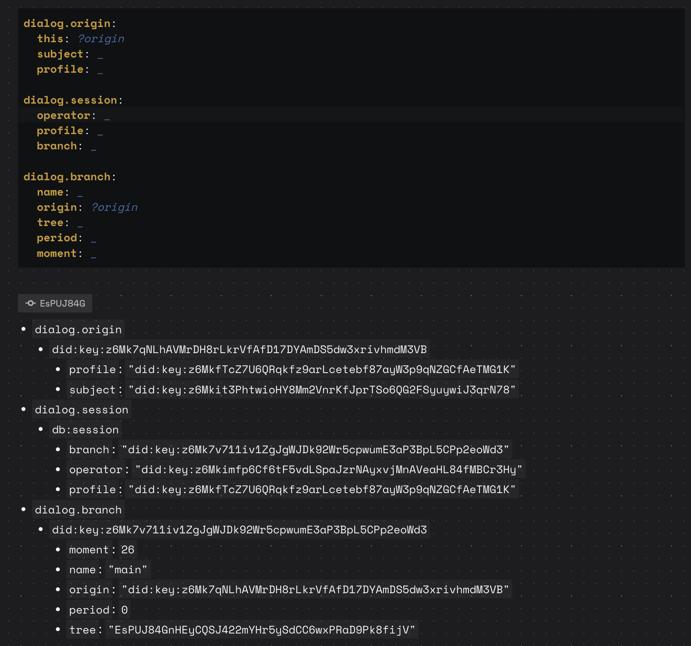

# May 21

# Respondence

> How are stable `this:` identifiers generated for columns? Is it derived from the initial content then stable thereafter, in which case we don't worry about concurrency across devices?

I have not put much deliberation into this and it is certainly not long term solution. Long term solution IMO is to use deterministic  identifiers that capture just enough detail to make them distinct, bot not more. I go at length about this in [deterministically biased fractional indexing](https://observablehq.com/@gozala/deterministically-biased-fractional-indexing) essay. In our context I suspect solution would be following redesign of the [proposed schema](https://github.com/tonk-labs/tonk/blob/feat/window-manager/plan/tonk-layout.md)

```yaml
concept!: &board
  description: A named, vertically scrolling stack of rows
  with:
    name:
      description: Board name (selects which board to render)
      the: xyz.tonk.board/name
      as: text
    focus:
      description: Currently focused tile
      the: xyz.tonk.board/focus
      as: entity
    legacy:
    	description: |
    		Last tile added to this board, which is derived by combining following entity seed
    		
    		environment:
    			# operator did
    			operator: ?operator
    			board: ?board
    			
    		board:
    			this: ?board
    			legacy: ?legacy
    			focus: ?focused-tile
    			

    		tile!: &temp-tile
    			# derive entity by combining legacy with the operator
    			# ensuring no collisions across devices even if everyone inserts
    			# tile in the same place
    		  this:
    		  	legacy: ?legacy
    		  	operator: ?operator
    		  board: ?board
    		  # ......
    		 
    		# update board to focus new tile and rachet legacy
        board!:
    			this: ?board
    			legacy: temp-tile
    			focus: temp-tile
    	the: xyz.tonk.board/legacy
    	as: entity
```


-------------


> If we put these declarations into the yaml itself then the system can query views by the data they access, but if we put them in the html like this we won't be able to do that.

@goblinoats was wondering why can't we identify connections between concepts and effects with script tag based approach [described in previous entry](./2026-05-20.md#causing-effects). Fair provocation, I suppose it is conceivable but there are some challenges. Specifically mutation scripts query things and can mutate several concepts and there is no conceptual thing that represents that script as an entity, we could probably define such an entity folding queries under premises and assertions under conclusions but then that is basically what effects (inductive rules) are as a coherent unit and it is [backed by science](https://www.neilconway.org/docs/dedalus_dl2.pdf). Another subtlety is that in scripts we make up this `environment` concept holding arguments that will be populated by `data` from `postMessage`, but there is no declaration of `environment` concept so what does it even hold or how do we visualize it ? This actually points to a gap in my sketch & we'd need to hove some definition for the concept being messaged & ideally it will have `description` and types just like other concepts because that is the information that will help with discovery and visualization & if we do that also then we've basically defined different notation for effects. It may prove to be a better notation, but once we have concepts we should be able to project it from and into this script style notation just as well as with effect notation.

All this to say that my statements were misleading & indeed you could have it all if we address couple of wrinkles pointed out which probably need addressing anyhow if we were to implement this.

> [!note]
>
> It is also worth noting that query subscriptions in that script is working around known gap in dialog capabilities (that I'd like to close) that does not currently allow you to express graph queries

Namely following example could be expressed a lot more conveniently if we implemented support

```html 
<script language="application/dialog+yaml">
  # figure out entity being rendered 
  environment:
    subject: ?list

  # query subject as a todo-list
  todo-list:
    this: ?list
    name: ?list-name
    item: ?todo

  # query items of the todo-list
  todo:
    this: ?todo
    done: ?done
    title: ?title
</script>
```

It would be a lot more convenient to express same query as follows instead if concepts could have referred to other concepts inside them

```yaml
todo-list:
  this: ?list
  name: ?list-name
  item:
		this: ?todo
		done: ?done
		title: ?title
```

## Effect as macro

I was thinking how would one describe effect as a macro if we had them so I ended up typing it up

> [!note]
>
> I want *macros* to be just like dialog rules, or better yet be rules. It is mind bendy though, because unlike functions we're used to program they do not take arguments and compute things on them. Instead they are fully declarative, they describe how certain outcome can be deduced *(or what are the circumstances in which you can deduce for inductive rules)*. You don't get an imperative control over calling things, instead you have to create circumstances for deduction to be made.

In order to get macro rule to deduce expanded form of the source syntax form we need to define a concept that can cause this deduction which is what we do below. Think of it as arguments you'd be passing to a function, and just like arguments it is transient unless you capture them. 

```yaml
concept!: &expand
  transient:
  description: |
  	Transient concept that hold source syntax form with all references resolved and inlined.
  	Evaluator asserts notation into database which will cause matching macros to deduce expanded
    forms from it.
  with:
    source:
      the: dialog.syntax/source
```

I think macros is just like a deductive rule but bit more low level, kind of how you can query facts through associative layer as opposed concepts in semantic layer. In other words macro is like deductive rule of associative layer as it deduces multiple facts as opposed to single concept

```yaml
macro!:
	this: ?effect-macro
	description: |
		Macro for expanding the effect (inductive rule) from notation you write
		into a form it's represented in the substrate
  assert:
  	# every effect is tagged with db:effect relation so you could list tem
    - fact!:
        the: dialog.meta/effect
        of: ?form
        is: db:effect
    # raw syntax form (AST) is stored as JSON
    - fact!:
        the: dialog.effect/source
        of: ?effect
        is: ?source
    # description is stored separately
    - fact!:
        the: dialog.meta/description
        of: ?effect
        is: ?description
    # associate concept effect concludes so we
    # can find what are the effects that can update concept
    - fact!:
        the: dialog.effect/conclusion 
        of: ?effect
        is: ?conclusion
    # associate domain/name pair of the transient concepts
    # that may cause effect make new deduction. This allows
    # transactor to identify what effects to evaluate based
    # on changes being transacted
    - fact!:
        the: dialog.effect/on
        of: ?effect
        is: ?on
  when:
  	# whenever expand is asserted on this macro definition
  	# we capture source syntax form
    - assert: expand
      where:
        this: ?effect-macro
        source: ?form
		# Then match the form against patter (using built-in syntax/match formula)
    - assert: syntax/match
      where:
        this: ?form
        case:
        	# This is kind of like quasi quoted form is scheme (lisp) and variables
        	# are forms we capture
          effect!:
          	# we wan to know what the entity for this syntax is
            this: ?effect
            description: ?description
            assert!:
            	# what concept does this effect concludes
              this: ?conclusion
              with:
              	# what are the fields defined by the concept
                ?concept-field:
                  the: ?concept-field-domain/?concept-field-name
                  cardinality: ?concept-field-cardinality
                  as: ?concept-field-type
            when:
            	# we also capture all the primises this effect has
              - assert:
                  this: ?predicate
                  with:
                  	# we only care about transient concept premises because
                  	# they narrow down effecs to likely just a handful few
                  	transient:
                    ?premise-field:
                      the: ?premise-domain/?premise-name
                      cardinality: ?premise-cardinality
                      as: ?premise-type
                where:
                  ?premise-key: ?premise-value

		# compute entity for each premises each attribute domain+name by formatting it
		# as on:{domain}/{name} which will be used as a reverse index for the transactor
    - assert: ==
    	where:
    		of: on:?premise-domain/?premise-name
    		is: ?on
		
		# We also serialize source as JSON so we can store it in substrate so that transactor
		# can load it and evaluate when necessary
    - assert: json/encode
      where:
        of: ?form
        is: ?source
```

I do not love how it looks right, but I think it is mostly because use of formulas is pretty awkward, but if we had macros we'd have a way to improve it easily without wire or storage representation. Despite verbosity it's still pretty cool that you can express this in this hypothetical macro system. I think it would be interesting to see if "concept" concept can also be defined through the macros and if so schemer in me will feel really accomplished.


## Query Environment


> [!note]
>
> Now you can query environment just like you can query other facts stored in the database. This means you can find out what is the root of the tree now _(something that can't be stored in the tree)_ and what is operator or profile DID or an origin where these queries happening.



All these are useful sources of entropy for deriving deterministic identifiers.

### Fixing Jitter in the Eval output

Evaluating `concept:` kept an endless evaluation loop going, ~7 requests a second, looking like the language server firing diagnostics non-stop. It was not the LSP though: the loop was entirely client-side. `<tonk-code>` fires its `diagnostics` event for any CodeMirror transaction carrying `setDiagnosticsEffect`, assuming that only ever means a fresh server frame. But `setDiagnosticsEffect` also comes from `@codemirror/lint`'s `setDiagnostics`, which our `<tonk-diagnostics-provider>` calls on every pushed-diagnostic update, including the empty clear the auto-evaluate issues on success. So each auto-evaluate manufactured a fake "fresh frame" that triggered the next one. The fix tags pushed-diagnostic transactions with an annotation and has `<tonk-code>` skip annotated transactions when deciding whether a real server frame landed. Fixed in https://github.com/tonk-labs/tonk/pull/465

