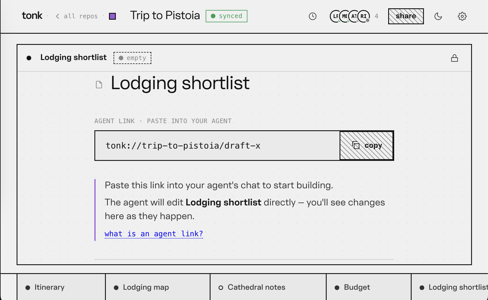

# May 28

Last night I have tried to migrate current UI into self contained `tonk-inspector` web component, so that in the future I'd be able to create an artifact that represents it. I was also experimenting with tiling manager so what I ended up with something like this

```yaml
concept!: &inspector
  description: An inspector of a specific repositiory
  with:
    source:
      description: Space name to inspect (passed through as the source attribute)
      the: xyz.tonk.inspector/source
      cardinality: one
      as: text

view!:
  model: inspector
  name: "basic"
  display: |
    <tonk-inspector source={source} />
    
tile!:
  order: "a"
  view: "basic"
  model: inspector
  entity: id:tonk-board/demo/home-inspector
```

Here it is a demo of it in action

<video width="640" height="360" controls="">
  <source src="https://pub-5627f9dd8db047268a0809a396390152.r2.dev/tonk-inspector-tile.mov" type="video/quicktime">
  Your browser does not support the video tag.
</video>

> [!caution]
>
> It seems that [codemirror LSP client](https://code.haverbeke.berlin/codemirror/lsp-client) has issues with two editors having same document open that renders LSP unusable in other tiles, but that is something I imagine we could fix and also having tiles with the same thing isn't really a goal.

I basically would like to build up to pull-open prototype from few days ago but there are practical challenges with doing so using dialog's templates and effects. Sprint animations are running in tight loop and bombarding SW and waiting for it to then send back state updates through query subscription is going to be overwhelming. There is also some computation that takes place based on scroll and expressing that as a rule in the formula is definitely going to be a lot.

<video width="640" height="360" controls="">
  <source src="https://pub-5627f9dd8db047268a0809a396390152.r2.dev/pull-open.mov" type="video/quicktime">
  Your browser does not support the video tag.
</video>

I think proper solution here is to what I've being preaching - build custom web component to do fancy things. General idea is that `tonk-column` could be a web component that basically renders its children in vertical column. It also has "reveal" slot for the view that will be rendered when you pull open that in the prototype revealed launcher. This way launcher is just another tile and everything is driven by our view and effect system, but thing doing physics is encapsulated piece of code in a component.


## Artifacts

After chatting with  @eileen today for some time I think I finally have conceptual model of what the artifact is and how it is manifested. It is basically sheet (as in spreadsheet) with just two slots one for the view and other for the entity to be viewed, so something along these lines I think

```yaml
concept!: &artifact
  description: An entity displayed through specific view
  with:
  	title:
  		description: A title shown in the tap
  		the: xyz.tonk.artifact/title
  		as: text
  	icon:
  		description: An icon displayed for this artifact
  		the: xyz.tonk.artifact/icon
  		as: text
  	view:
  		description: A view instance used for displaying an entity
  		the: xyz.tonk.artifact/view
  		as: entity
  	source:
  		description: An entity displayed through a corresponding view
  		the: xyz.tonk.artifact/source
  		as: entity
```

> [!caution]
>
> Dialog currently does not support optionals [there is ongoing effort](https://github.com/dialog-db/dialog-db/pull/336) but I can't seem to find time to prioritize it over other work in order to finish it.

Without optionals I think idea would be to use sentinel values like perhaps `about:blank` or such for both `source` and a `view` slots. In which case we show a "new sheet"

> Not sure where does the "Lodging shortlist" name come from though




> 💡 
>
> Perhaps we can have `artifact:new` view that is basically template with the instruction content shown above, that way we don't have to have conditional views (which we don't currently have). Then agents job would be to update `source` of artifact to point to whatever it created.
>
> I really hope we can then grow this into luncher and allow to open things without asking agent to do it for them.

## Performance Challenges

Demo showing tonk inspectors loading through views revealed pretty noticeable performance issues as I started profiling few things became clear

### Same query happening over and over

We end up with many elements like `<tonk-view entity=subject model=concept view=basic />`, each one when mounted will send a query to resolve `concept`, establish query subscription for  `view`  and query subscription for `concept: {this: subject}` so that we can project results an update them whenever view or data changes.

This means if we have set of such elements with the same `counter` model we will be issuing same query when element is inserted.

> [!note]
>
> To address this I have added LRU cache to the `<tonk-host />` which is used by other components to perform queries, which cut down number or request significantly.

While this mostly addressed this specific deficiency we still need to subscribe to a view in each element and entity. This got me thinking that perhaps better solution would be to turn `view!` declarations into web components. That way we would have `<tonk-counter source=entity>` and such instead and we could have a single ` view:` subscription that could drive web component registration in the dom. It will require some proxy component so we could swap out actual implementations, but it does feel like a much less overhead.

### Bootstrap overhead

In my `<tonk-board />` implementation I added bootstrap code that evaluates set of concepts when element connects, ensuring that all definitions needed are in the system. I though it was better idea than having to seed branch with concepts on creation because things can adapt as you add more things or change them as opposed to old repos not having needed concepts.

In practice that added visible overhead to a page load, because no queries could be send until that is done. 

To address the issue I went down the rabbit hole of  creating `tonk::claim!(bootstrap.yaml)` macro that does compile time parsing and analysis of the source and uses it during repo creation eliminating runtime failure due to bad definitions & removed the bootstrap process from the page load flow.

> [!note]
>
> I think we'll need to seed repos with built-in definitions so this seems like right move even if it ended up being a rabbit hole causing deep changes to the syntax analyzer.

### Cache it all

In an effort to optimize things 

## Mapping out Relations

Concepts are most basic primitive to map facts to a desired data model. They also offer bidirectional mapping but there are limitations to what you currently can express. I feel like we've being running into some of these already - Ideally our data model for tiles, columns and boards would be of the this shape

```yaml
concept!: &tile
  description: One tile in a column
  with:
  	board:
  		description: Board this tile belongs to
  		the: xyz.tonk.tile/board
  		as: entity
  		cardinality: many
  	column:
  		description: Column this tile is in
  		the: xyz.tonk.tile/column
  		cardinality: many
    order:
      description: Order key within the column
      the: xyz.tonk.tile/order
      cardinality: one
      as: text

    view:
      description: View name to render the tile body with
      the: xyz.tonk.tile/view
      cardinality: one
      as: text
    model:
      description: Concept name the tile body renders
      the: xyz.tonk.tile/model
      cardinality: one
      as: text
    entity:
      description: Entity the tile body renders
      the: xyz.tonk.tile/entity
      cardinality: one
      as: entity
      
concept!: &board
	description: Board for organizing workspace
	with:
		name:
			descrption: Name of the board
			the: xyz.tonk.board/name
			as: text

concept!: &column
	description: Column of the board
	with:
	  width:
		  description: Width of the column
		  the: xyz.tonk.column/width
		  as: unsigned-integer
		order:
      description: LexoRank-style order key within the board
      the: xyz.tonk.column/order
      as: text
```

In the above shape first three relations are specific to the layout tile can appear & in some other layout tile may have different relation. However mapping this model is inconvenient for describing view where you have a board, with columns containing rows of tiles, what you want there is something like this

```yaml
concept!: &board-view
  description: A named board
  with:
    name:
      description: Display name
      the: xyz.tonk.board/name
      cardinality: one
      as: text
    column:
      description: Columns in this board
      the: xyz.tonk.board/column
      cardinality: many
      as: entity
      
concept!: &column-view
  description: A column on a board
  with:
    order:
      description: LexoRank-style order key within the board
      the: xyz.tonk.column/order
      cardinality: one
      as: text
    width:
      description: Column width in grid units (1 unit is 64px)
      the: xyz.tonk.column/width
      cardinality: one
      as: unsigned-integer
    tile:
      description: Tiles in this column
      the: xyz.tonk.column/row
      cardinality: many
      as: entity

concept!: &tile-view
  description: One tile in a column
  with:
    order:
      description: Order key within the column
      the: xyz.tonk.tile/order
      cardinality: one
      as: text
     
    # tile information
    view:
      description: View name to render the tile body with
      the: xyz.tonk.tile/view
      cardinality: one
      as: text
    model:
      description: Concept name the tile body renders
      the: xyz.tonk.tile/model
      cardinality: one
      as: text
    entity:
      description: Entity the tile body renders
      the: xyz.tonk.tile/entity
      cardinality: one
      as: entity
```

However two seem incompatible because of the way relations are represented in last case it's hierarchical where's in former case it's pretty flat. Arguably flat is better and more flexible model, but it makes it hard to express views because you have board → column → tile structure.

> [!note]
>
> We actually have a way to do the mapping in dialog through *(deductive)* rules, which are more powerful primitive for mapping facts into desired data model, but unlike concepts they are unidirectional.

```yaml
rule!:
	assert: board-view
	when:
		- assert: board
		  where:
			  this: ?this
			  name: ?name
		- assert: tile
			where:
				this: ?tile
				board: ?this
				column: ?column
				
rule!:
  assert: column-view
  when:
  	assert: tile
  	where:
  		this: ?tile
  		column: ?this
  	assert: column
  	where:
  		this: ?this
  		width: ?width
  		order: ?order	
```

With above rules in place now we can query for `board-view` to get a desired board which will have `column`s that can be queried via `column-view` to get their tiles. Basically projecting structure that makes sense for the problem domain without forcing it onto logical data model. 

> [!warning]
>
> Unfortunately (deductive) rules aren't fully integrated into a system yet. 

Deductive rules exist in dialog, but when I designed them I assumed rust client opening session and installing them explicitly as shown below

```rust
fn employee_from_person(employee: Query<Employee>) -> impl When {
    (
        Query::<Person> {
            this: employee.this.clone(),
            name: employee.name.clone(),
            title: employee.role.clone(),
        },
    )
}

// Installing both rules means querying Employee finds conclusions from either source
let session = Session::open(store)
    .install(employee_from_person)?;
```

Rules were compiled and kept in memory keyed by concept they assert, so when you query by that concept we pull all the rules defined for it execute them all and return union of all deductions.

> [!note]
>
> Concepts also come with an implicit rule that query for facts and join by `this` entity

With our yaml notation and live system this needs to be revisited and we should be storing deductive rules in the database itself just like we are storing inductive rules. That when we query by a specific concept, we'll load all rules that assert them and execute them also and union conclusions. Complicating factor is that I do not want to impose reading rules from database on dialog, but allow it as an option, which requires some careful deliberation.


