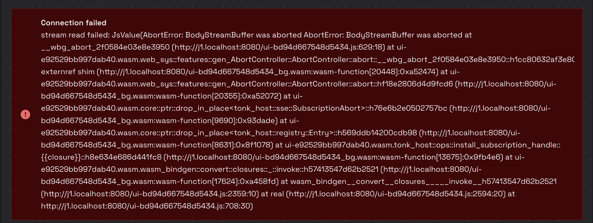
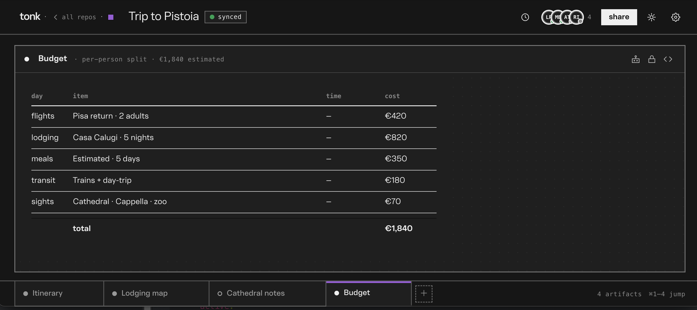

# June 2nd

## Building system from within

 It is lot of fun to be building system from within, but it is not all joy. One thing that you quickly realize that somehow you need to bootstrap runtime with set of built-in concepts standard library of sorts, which raises questions like:

1. How do you expose a standard library
2. How do you update a standard library

Emboldened by [idempotence](https://en.wikipedia.org/wiki/Idempotence) that system is carefully designed for I went with just  asserting all of the concepts & rules on every load, turns out it can make loads unacceptably slow so I had to be bit more deliberate and avoid doing this on every load.

My next best idea was to assert all of them on repository initialization. It happens once when you create it removing overhead from reloads.

> [!warning]
>
> This made load times acceptable, but now any time I update standard library I have to delete repository and create one from scratch, which is starting to annoy me a lot.

However if standard library lives in the database itself how do you update standard library ? Working on that library I do actively feel that pain.

> [!note]
>
> I really like the idea of standard library being distributed as public (read-only) repository itself that you can pull from to get updates.

While pull to update seems pretty neat it also seems like something I really do not have time for

### Hotswap Concepts

I got so tired of nuking my DB I redid the bootstrapping, now built-in concepts live in core.yaml file in `tonk-core`. When new repository is created we fetch `core.yaml` and evaluate it to seed the repository. Then I disabled [trunk](https://trunk-rs.github.io/)'s auto refresh script and instead add `cfg` gated `<hot-swap>` component, that receives notifications trunk & if wasm blob changed refreshes a page, but if `core.yaml` changed it simply evaluates new contents upgrading builtin concepts and rules.

<video controls="">
  <source src="https://pub-5627f9dd8db047268a0809a396390152.r2.dev/hot-swap.mov" type="video/quicktime">
  Your browser does not support the video tag.
</video>

As an added bonus you can disable automatic hot-swap / and refresh, which I often feel like gets in my way.

### Graceful Shutdown

I did run into the following error a lot, which was caused by various tonk-display elements being removed which caused subscriptions to abort and receiving an HTTP error from the host.



Fix: both SSE transports (direct fetch and the iframe bridge) now map to a uniform Rust frame stream behind one `EventSource` abstraction whose single invariant is that dropping it never reports an error. The reader races the stream against a drop signal and re-checks it before surfacing anything, so tonk-host aborting its own subscription closes cleanly instead of raising the `AbortError`. A wasm test drops a live `EventSource` mid-read and asserts no error is reported.

### Support for name spacing

Here is a snippet from the bootstrap.yaml that defines part of the system and illustrates use of name spacing

```yaml
# Tab selection. Clicking a tab fires the `activate-sheet`
# command, reading which sheet was clicked from the bound element's
# `data-sheet`. The inductive rule below finds the workspace that owns
# that sheet and points its cardinality-one `active` field at the
# clicked sheet (replacing the prior selection). The command itself is
# swept after the cycle - only the `active` pointer persists.
command!: &workspace/activate-sheet
  description: A click asking to make `sheet` the active sheet of its workspace.
  with:
    sheet:
      description: The sheet to activate
      the: dom.event.current-target.dataset/sheet
      as: entity

# A minimal projection of the workspace's `active` pointer: the
# workspace entity (`this`) and its `active` sheet, on the same
# `xyz.tonk.workspace/active` attribute the `workspace` concept reads.
# The rule asserts THIS (binding only `this` + `active`), rather than
# re-asserting the whole `workspace` concept (which would force
# binding every field). Writing `active` here updates the same triple
# the workspace view sees.
concept!: &workspace/active-sheet
  description: The active-sheet pointer of a workspace, as a standalone fact.
  with:
    active:
      description: The selected sheet
      the: xyz.tonk.workspace/active
      cardinality: one
      as: entity
```

## Building Wireframes

> [!note]
>
> This is intended for @goblinoats who expressed desire to help with things

### Modeling Data

I personally like starting with building up a data model for the what we will be displaying, which happens via concepts. Looking at the wire frames below I think we roughly need

- Sheets
  - That have names displayed in the tab
  - Titles displayed in the header
  - Content loaded which is some **entity** conforming to some **model** rendered via some **view**
- Binder (of all the open sheets)
- Contributors (circles at the top)

All of the above can be represented by some  **workspace** concept



So my data model will reflect what I described above

#### Sheets

Main concept in this model is a sheet. One more thing we add to it is `order` because it is very likely that we'd want to order tabs in some way.

> [!note]
>
> Usually you don't need to specify `this` it will be computed from content, but for builtins we do specify them. This way even if updates what `workspace/sheet` refers to built-in concept below could still be referred by `tonk:sheet`.

```yaml
concept!: &workspace/sheet
  this: tonk:sheet
  description: A workspace tab - an artifact plus a lexicographic order key.
  with:
    title:
      description: Title shown in the tab
      the: xyz.tonk.artifact/title
      cardinality: one
      as: text
    subtitle:
      description: Dimmed metadata line shown after the name in the card header
      the: xyz.tonk.artifact/subtitle
      cardinality: one
      as: text
    icon:
      description: Icon shown in the tab
      the: xyz.tonk.artifact/icon
      cardinality: one
      as: text
    entity:
      description: Entity displayed in the sheet
      the: xyz.tonk.artifact/entity
      cardinality: one
      as: entity
    model:
      description: Model concept used to display the entity
      the: xyz.tonk.artifact/model
      cardinality: one
      as: entity
    view:
      description: View concept used to display the entity
      the: xyz.tonk.artifact/view
      cardinality: one
      as: entity
    order:
      description: Lexicographic order key positioning the tab
      the: xyz.tonk.sheet/order
      cardinality: one
      as: text
```

### Workspace

All these sheets would need to belong to a workspace, as our UI will provide an interface for it. Workspace in addition to holding sheets would also need a name so we can display "Trip to Pistoria" in the header. 

One other piece of state we did not talk about is "active sheet", which we will add to the workspace.

> [!warning]
>
> It may be tempting to have an `active` flag on the `sheet` instead, but that is pretty bad model because in distributed settings it's easy to wind up with multiple active `sheets`.

```yaml
concept!: &workspace
  this: tonk:workspace
  description: A workspace surface - a named set of sheets shown as tabs.
  with:
    name:
      description: Workspace name, shown in the header
      the: xyz.tonk.workspace/name
      cardinality: one
      as: text
    sheet:
      description: The sheets (tabs) in this workspace
      the: xyz.tonk.workspace/sheet
      cardinality: many
      as: entity
    active:
      description: |
        The currently selected sheet, shown in the canvas. Cardinality
        one, so re-asserting it replaces the previous selection - a
        single moving pointer driven by the `activate-sheet` command.
      the: xyz.tonk.workspace/active
      cardinality: one
      as: entity
```

### Modeling Behavior

But how do we update which sheet is `active` in the workspace ? General idea is to model this through commands that can be invoked on user events. Then if there are rules that react to commands they can update state. To make this clear lets think how tab strip may look like

```html
<div class=tab-strip>
  <button class=tab onclick=workspace/activate-sheet data-sheet={this}>{title}</button>
</div>
```

Here we say that when tab button is clicked we will assert `workspace/activate-sheet` defined as follows

```yaml
command!: &workspace/activate-sheet
  description: A request to make `sheet` the active sheet of its workspace.
  with:
    sheet:
      description: The sheet to activate, from the binder's `activate` event detail
      the: dom.event.current-target.dataset/sheet
      as: entity
```

> [!note]
>
> Notice that `sheet` is mapped to `dom.event.current-target.dataset/sheet` which in JS would be be `event.currentTarget.dataset.sheet` *(dataset is how `data-` prefixed attributes can be accessed in JS)*

So when user clicks tab, system will assert `workspace/activate-sheet` command and we need a rule that will update state what that happens.

```yaml
rule!:
  assert!: workspace/active-sheet
  when:
    - assert: workspace/activate-sheet
      where: { sheet: ?active }
    - assert: workspace
      where: { this: ?this, sheet: ?active }
```

Above rule asserts `workspace/active-sheet` concept (shown below) when there is `workspace/activate-sheet`, with a `sheet` that we'll capture in `?active` variable. And there is a workspace that `?active` sheet belongs to, we'll capture workspace entity in `?this`  variable. 

> [!note]
>
> All variables in our case `?active` and `?this` are implicitly bound to same named fields on asserted concept, in our case `workspace/active-sheet`

```yaml
concept!: &workspace/active-sheet
  description: The active-sheet pointer of a workspace, as a standalone fact.
  with:
    active:
      description: The selected sheet
      the: xyz.tonk.workspace/active
      as: entity
```

Above concept defines just a subset of our `workspace` concept that we care about. In our case we only care about `active` field of the workspace so that is only thing concept has. Because entity (`this`) is the workspace and `active` is an attribute of the workspace  above rule basically updates which `sheet` is active in the workspace.

### Modeling Views

In order to render our conceptual model, we need to define a view for our `workspace` concept. Here is a simplified version of it

```yaml
view!: &workspace/view
  this: id:tonk-workspace/workspace-view
  model: workspace
  display: |
    <div class="workspace">
      <div class="workspace-topbar">
        <span class="workspace-brand">tonk</span>
        <span class="workspace-crumb">&lsaquo; all repos</span>
        <span class="workspace-title">{name}</span>
        <span class="workspace-sync">synced</span>
        <span class="workspace-spacer"></span>
      </div>

      <tonk-sheet-binder class="sheet-binder" active={active} onactivate=workspace/activate-sheet>
        <tonk-display entity={sheet} model=tonk:sheet />
      </tonk-sheet-binder>
```

Instead of inlining everything we could have subviews in the example above `tonk:sheet` is used to display sheets via concept below

```yaml
view!:
  this: id:tonk-workspace/sheet-mount
  model: tonk:sheet
  display: |
    <tonk-sheet sheet={this} order={order} title={title} icon={icon} summary={subtitle}>
      <tonk-display entity={this} model={model} view={view} />
    </tonk-sheet>
```

> [!note]
>
> Worth noting that splitting into subviews is something Claude did without me instructing it to do so. Which I take as a positive signal that abstractions encourage this.

#### Escape Hatches

If you are wondering what is `tonk-sheet-binder` or `tonk-sheet` those are escape hatches I realized I needed. Specifically template engine is _intentionally_ limited, which makes it hard for example to set `class=active` on the tab that is active, because it requires comparing each one to the one that workspace says is active.

To overcome this limitation we can simply define a web component like `tonk-sheet-binder` that holds `tonk-sheet`s elements and has `active` attribute to specify which of the sheets is currently active. With such a component in place we can have everything else stay in declarative world and let web component do some imperative DOM manipulations when attribute updates.

> [!warning]
>
> In dialog everything is a set, which do not have order. This means when you query you get matches in some order which may not match desired one. We also do not (yet) have sort by in query engine so we can't ask query engine to sort it for us by some field.

Presenting sheets / tabs sorted by `order` attribute is another thing our `tonk-sheet-binder` does for us. Worth noting that CSS has [`order`](https://developer.mozilla.org/en-US/docs/Web/CSS/Reference/Properties/order) property that allows projecting in desired order, however in CSS it's integers which are troublesome in distributed settings.

> [!note]
>
> I think sprinkling web components like this is a really good idea. They end up doing a very simple and well defined task while enabling rest of the system to stay declarative.

### Portals

@jackddouglas has landed portals - views that are loaded inside sandboxed iframes. But just like any other view you can embed them just like any other view using `tonk-display` element. Below is an example of adding a sheet to a workspace that uses portal based view

```yaml
workspace/sheet!:
  this: id:tonk-workspace/sheet/sketch
  title: "Sketch"
  subtitle: "an imperative canvas in a sandboxed iframe"
  icon: "palette"
  entity: id:tonk-workspace/sketch
  model: portal
  view: tonk:view
  order: "c"
```

And here is a definition of the content for the portal

```yaml
portal!:
  this: id:tonk-workspace/sketch
  height: 520
  content: |
    <!doctype html>
    <html>
      <head>
        <meta charset="utf-8" />
        <style>
          html, body { margin: 0; height: 100%; }
          body {
            display: grid;
            place-items: center;
            font-family: system-ui, sans-serif;
            background: #1b1130;
            color: #efe7ff;
          }
          canvas { display: block; }
        </style>
      </head>
      <body>
        <canvas id="c" width="600" height="480"></canvas>
        <script>
          const canvas = document.getElementById("c");
          const ctx = canvas.getContext("2d");
          const { width: w, height: h } = canvas;
          let t = 0;
          function frame() {
            t += 0.02;
            ctx.fillStyle = "#1b1130";
            ctx.fillRect(0, 0, w, h);
            for (let i = 0; i < 64; i++) {
              const a = (i / 64) * Math.PI * 2 + t;
              const r = 150 + 60 * Math.sin(t * 1.5 + i * 0.3);
              const x = w / 2 + r * Math.cos(a);
              const y = h / 2 + r * Math.sin(a);
              ctx.beginPath();
              ctx.arc(x, y, 6, 0, Math.PI * 2);
              ctx.fillStyle = `hsl(${(i * 6 + t * 60) % 360} 80% 65%)`;
              ctx.fill();
            }
            requestAnimationFrame(frame);
          }
          frame();
        </script>
      </body>
    </html>
```


### Workspace View

Workspace itself has a view which is basically a UI in the target wireframes. It being just a view means we could use our existing endpoint for exploring views. I build this interactively and watch things evolve under

http://localhost:8080/space/home/branch/main/display/work:space?model=workspace

Once we feel ready we'll just rewire primary URL to show same `<tonk-display entity=work:space model=workspace />` and it will it, UI expressed within itself.

> [!note]
>
> Above assumes running `nix develop --command dev:web`
