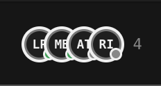

# June 3rd

## Updating deployed repositories

I have [merged all the work](https://github.com/tonk-labs/tonk/pull/484) from yesterday that brings workspace and portals together. Then loaded [workspace from staging.tonk.xyz](https://staging.tonk.xyz/space/home/branch/main/display/work%3Aspace?model=workspace) and got error message saying concept was not found 😖Well that is because fancy hot swapping upgrades are triggered by trunk dev server and there is nothing telling my existing repository it needs to upgrade.

> [!note]
>
> I was able to get it upgraded by opening up repository inspector and evaluating contents of the `core.yaml` and it everything is working now 😮‍💨

I think we need to add some additional code path in the SW activation that checks if `library/core.yaml` has changed and if so perform an upgrade.

### Modeling Membership

Membership needs to power piece of user interface shown below, basically set of members that have joined the space.



In fulness of time, we should probably be storing UCANs in the repository that would carry details


### Revisiting Routes

My current thinking about routing is as follows

### API route is reserved

```sh
/api/*
```

### Tonk Hub

Base route is for tonk hub providing listing of repositories. It is effectively what `/profile/` route is today but with a different view, one that lists repositories profile has access to and allows you to navigate to desired one

```sh
/
```

This can be implemented as `view/directory` for `tonk/space` model

```html
<tonk-host>
	<tonk-repository name={profile} profile>
    <tonk-branch name=main>
      <div class="repository selector">
        <wa-card with={this}
                 orientation="horizontal" 
                 class="horizontal-card repository" >
          <tonk-display entity={this} model=space/card />
        </wa-card>
      </div>
    </tonk-branch>
  </tonk-repository>
</tonk-host>
```

Car is probably a link that navigates to `/space/{name}/`

### Tonk Space

Specific repository could be navigated to by name

```sh
/space/{name}/
```

In this route we serve something along the lines of

```html
<tonk-host>
	<tonk-repository name={name}>
    <tonk-branch name=main>
      <tonk-display model=tonk/space />
    </tonk-branch>
  </tonk-repository>
</tonk-host>
```

> [!note]
>
> By using `tonk/space` as a model we are making it possible for user to override primary interface they see when loading a repository. It will be preset to `tonk:workspace` which is an interface in the wireframes.

### Branches

We could allow specifying a branch as follows

```yaml
/space/{branch}@{name}/
```

In which case we can render following page

```html
<tonk-host>
	<tonk-repository name={name}>
    <tonk-branch name={branch}>
      <tonk-display model=tonk/space />
    </tonk-branch>
  </tonk-repository>
</tonk-host>
```

## Tonk Directory

You could view arbitrary artifacts in the space by navigating to them, but you could also navigate to artifact selector of certain model by just navigating to the model

```sh
/space/{name}/{model}/
```

For example you could navigate to `/space/home/trip/` in which case we'd render same thing as `/space/home/` except `model` of the `tonk-display` will be set to a provided model.

> [!note]
>
> `tonk-display` will use `directory` view  as opposed to default view for the model when entity is not specified, allowing it to render catalog of artifacts matching a model to pick from.

### Tonk Artifact

You could either navigate to a specific artifact from the directory or directly via address bar.

```sh
/space/{name}/{entity}@{model}/*
```

This would render page like this one

```html
<tonk-host>
	<tonk-repository name={name}>
    <tonk-branch name=main>
      <tonk-display entity={entity} model={model} />
    </tonk-branch>
  </tonk-repository>
</tonk-host>
```

Giving you a full screen view of the artifact itself.

>  [!note]
>
> Neat thing is that `tonk:workspace` is basically an artifact itself, and you can set whichever artifact as a default.

### Ad hock composition

Only thing we were not yet able yet to express is viewing an `entity` as a desired `model` but a different `view`. This is what ad-hock composition can allow us to do

```yaml
/space/{name}/{entity}@{model}!{view}/*
```

This should render following page

```html
<tonk-host>
	<tonk-repository name={name}>
    <tonk-branch name=main>
      <tonk-display entity={entity} model={model} view={view} />
    </tonk-branch>
  </tonk-repository>
</tonk-host>
```

