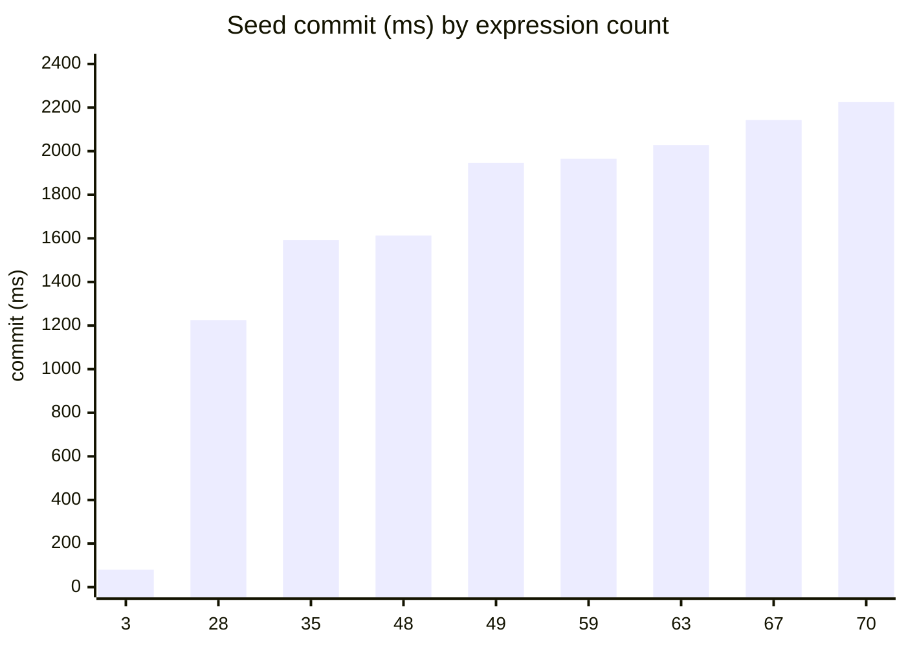

# June 4th

## Tonk Hub, and the long road to a fresh first load

Picking up the reroute work from yesterday, today was supposed to be a victory lap: land the Tonk Hub at `/`, exclude the profile's own replica from the list, ship it. Instead it turned into an afternoon (and most of a night) of peeling an onion that kept having more layers. By the end the Hub works, but the interesting part was everything underneath.

### Telling the profile replica apart from spaces

The Hub lists the spaces a profile can open by querying `Replica` records on the profile's meta branch. Trouble is the profile keeps a self-replica too (it is its own repository), and that one rides in on the same query, so the picker showed a stray `tonk` card pointing at the profile itself.

There is no `!=` in the query language, so I could not just filter it out. I gave `Replica` a `kind` attribute instead (`tonk:profile` for the self-replica, `tonk:repository` for a real space), derived right in `Replica::new` from whether the subject is the profile itself. The Hub view then hides the profile card in CSS:

```css
.hub-card[data-kind="tonk:profile"] {
  display: none;
}
```

> [!caution]
>
> Existing repositories predate the `kind` field, so their replicas carry no `kind` and will not match the Hub's query: they simply vanish from the list. To bring an old repo forward, hit `GET /api/migrate/repo-vs-profile`, which backfills `kind` on every replica (`tonk:profile` for the self-replica, `tonk:repository` for the rest) and redirects you to `/`. It is idempotent, so re-running it is harmless.

### Reads and writes that skipped the reactor

> The reactor is the reactivity engine: it manages query subscriptions, and when a change is committed the open subscriptions are rerun and fresh results are sent to their subscribers. The catch is that writes have to go through the reactor, otherwise it does not know to rerun the queries and update the subscribers.

On a brand new profile the Hub showed *nothing*: created repos never appeared in the list. Some profile code paths wrote replicas while sidestepping the reactor, so readers subscribed through the reactor never noticed and the Hub stayed empty. The fix was to route *everything* on the profile through the reactor, reads and writes alike. The same class of bug showed up in `reactor.shutdown()`, which drained named-repo subscriptions but not the profile's, leaving the Hub's stream open and pinning the outgoing worker in `waiting` on every update.

### Hot-swap across tabs

Smaller thing: the hot-swap toggle persisted to localStorage but each tab only read it once and never reacted to the others, so one tab could auto-apply a library change (propagating through the SW to everyone) while another thought it was off. Now a flip fires the `storage` event, and the receiving tab re-reads localStorage. The event is just the nudge, localStorage is the source of truth.

## Slow bootstrap

A first load of `/` took around **5** seconds, while reloads after that were a couple of ms. That was just unacceptably slow, so I had to investigate. A conversation earlier with @cdata about a new search-tree optimization was fresh in my head, and I wanted to know whether that would address this or whether it was something else. My suspicion was DB writes, but I wanted to verify.

The initial profile confirmed it. Bootstrap is almost entirely **DB writes**, and we pay them **twice**, seeding the full `core.yaml` into both the profile and `home`:

| phase | exprs | parse | analyze+eval | commit (DB) |
|---|---:|---:|---:|---:|
| profile bootstrap | 70 | 8 ms | 45 ms | **2094 ms** |
| home seed | 70 | 6 ms | 20 ms | **2241 ms** |

Parse and analyze are noise. The whole bill is the prolly-tree commit. The original critical path:

```mermaid
gantt
  title Before (critical path ≈ 4.6 s)
  dateFormat x
  axisFormat %S s
  section profile
  open + operator       :0, 24
  bootstrap commit (70) :crit, 24, 2255
  section home
  create repo           :2255, 2335
  seed commit (70)      :crit, 2335, 4635
```



### Splitting profile.yaml out

Profile, and consequently the Hub view, needed only a couple of things from `core.yaml`. The profile repo backs nothing but the Hub: it does not need workspaces, boards, sheets, inspectors, just the `space` concept and the Hub view. So I carved a lean `profile.yaml` (3 expressions) and seeded *that* onto the profile instead of all 70. That alone could cut load time almost in half, and it was a first look at how the size of a change impacts write times.

Profile boot went from **2255 ms to ~140 ms**. The profile section all but vanishes; the `home` seed is now the whole story.

```mermaid
gantt
  title After profile split (critical path ≈ 2.5 s)
  dateFormat x
  axisFormat %S s
  section profile
  open + operator       :0, 24
  bootstrap commit (3)  :crit, 24, 140
  section home
  create repo           :140, 220
  seed commit (70)      :crit, 220, 2440
```



### Large values

With the profile half handled, the `home` seed (still the full library) was the remaining long pole. Next I wanted to see how the large values, the embedded CSS blocks in the view definitions, impacted write times.

> [!warning]
>
> The new search tree will not help with embedding large text strings, so if those were the main culprit we would probably need to be thinking about switching to a dedicated blob store.

I moved the inline CSS out of the view templates and into the page stylesheet, expecting improvement. The result surprised me: the home seed got *worse*, climbing to **~4.4 s**, and I read a tree-layout story into it, that moving the large values around lands us on a less favorable write path.

```mermaid
gantt
  title After moving CSS out (≈ 4.5 s)
  dateFormat x
  axisFormat %S s
  section profile
  open + operator       :0, 24
  bootstrap commit (3)  :crit, 24, 140
  section home
  create repo           :140, 220
  seed commit (70)      :crit, 220, 4620
```



That read turned out to be wrong, and the way it was wrong is itself a puzzle. Those slow numbers were measured while the extra rules were sitting in `styles.css`, and once I reverted the stylesheet the same seed dropped back to its earlier time. A page stylesheet is not something the worker reads or seeds, so it has no business touching a service-worker commit at all, yet leaving it in place reliably coincided with the slow readings. So the tree-layout hypothesis was most likely a red herring; something else I do not understand yet was inflating those numbers.

### Removing demo data

Setting that puzzle aside, I removed the demo data, none of which belongs in a fresh user's repo anyway, to see how reducing the number of changes would affect things. `core.yaml` went from 46 KB to 18 KB, the home seed dropped from 70 expressions to 28, and the commit came down to **~1160 ms**.

```mermaid
gantt
  title After demo removed (critical path ≈ 1.4 s)
  dateFormat x
  axisFormat %S s
  section profile
  open + operator       :0, 24
  bootstrap commit (3)  :crit, 24, 140
  section home
  create repo           :140, 220
  seed commit (28)      :crit, 220, 1360
```



### Putting the CSS back

By inlining the CSS back in, with the demo still removed, I wanted to see how the number of expressions affected write times, and to compare the inline and extracted versions at the same expression count. The 28-expression seed came in at **~1224 ms** with the CSS inline, against ~1160 ms with it in the stylesheet. So pulling the large values out does help, but only marginally, not the dramatic effect I had read into earlier (noisier) measurements.

To map the count properly I then stripped expressions out of `core.yaml` one group at a time, all inline, measuring the home seed at each step, with the 3-expression profile seed as the low anchor. The relationship is clean and monotonic: fewer expressions, less time.



The count is the lever, but the steps are not uniform. One stood out: removing a single expression dropped the seed by ~330 ms on its own (the 49-to-48 step in the chart), far more than a typical expression. The likely reason is structural rather than about that expression's value. Dropping the right key shrinks the tree by a level, and a shallower tree means every other `set` in the commit builds one less node on its update path, so the saving multiplies across all the writes. That fits the bulk-insert picture: the cost is in the per-key update paths, not the size of any one value. Which is also why the CSS extraction did nothing for seed time. Avoiding large string values is not a lever worth pulling.

### It is the bulk insert, not the values

Putting the pieces together: the large values are not the culprit. Moving the CSS in and out barely moved the number, and the count curve is clean and monotonic. What dominates is simply the number of changes in a single commit. That is good news, because it is exactly what the new search tree @cdata is working on fixes.

The reason is in how the current prolly tree writes. For each key in a commit it builds the path of altered nodes down to where that key lands and persists every node on the way. The final tree is the only part that matters; the intermediate nodes are redundant. With a handful of changes that overhead is negligible, but it compounds with the number of changes in one commit, which is exactly the shape of a seed: dozens of facts written at once. So reducing the number of changes, by splitting the profile out and trimming the demo, helped not because the final tree got smaller but because there were fewer redundant intermediate writes.

The new search tree builds those node permutations in memory and flushes only the final tree, so the intermediate nodes never touch disk. That removes both the storage and the disk-write overhead, which makes bulk inserts, exactly what seeding is, far cheaper. It also reworks the in-memory layout to cut encode and decode costs and adds on-disk compression, but those help general performance more than bulk inserts specifically. The one large value worth watching, the sketch portal, is the kind of thing a blob store would handle better, but it is a single expression, not the shape of the problem.

## Landing the capability + repository + query stack

Separately, the long-running `dialog-db` rework has landed on `main`. The whole thing went in as a single squash commit, [`a898b5d`](https://github.com/dialog-db/dialog-db/commit/a898b5de44a29e5be30a1faa99f11ef7a5332d69), folding in 39 stacked PRs that had been queuing up behind each other. I closed every one of them as merged. Grouping by theme:

**Artifacts and storage core**

- [#233](https://github.com/dialog-db/dialog-db/pull/233) use borrowed storage in a tree
- [#234](https://github.com/dialog-db/dialog-db/pull/234) remove the exclusivity constraint imposed by the capability system
- [#235](https://github.com/dialog-db/dialog-db/pull/235) gen router address
- [#237](https://github.com/dialog-db/dialog-db/pull/237) artifacts strict clippy
- [#289](https://github.com/dialog-db/dialog-db/pull/289) adapt artifacts to the capability system

**Capabilities and UCAN**

- [#245](https://github.com/dialog-db/dialog-db/pull/245) add Checksum types and `#[derive(Attenuate)]`
- [#246](https://github.com/dialog-db/dialog-db/pull/246) remove the S3 backend, network provider, and `dialog-s3-credentials`
- [#249](https://github.com/dialog-db/dialog-db/pull/249) redesign access capabilities
- [#251](https://github.com/dialog-db/dialog-db/pull/251) add credential newtypes and key export
- [#252](https://github.com/dialog-db/dialog-db/pull/252) add the `derive(Provider)` compose macro, Issuer, and Command
- [#267](https://github.com/dialog-db/dialog-db/pull/267) add effects hierarchy modules
- [#268](https://github.com/dialog-db/dialog-db/pull/268) rename `dialog-ucan` to `dialog-ucan-core`
- [#269](https://github.com/dialog-db/dialog-db/pull/269) add the UCAN container format
- [#270](https://github.com/dialog-db/dialog-db/pull/270) add the `dialog-ucan` capability protocol crate

**Storage runtime, remotes, network**

- [#279](https://github.com/dialog-db/dialog-db/pull/279) add credential providers, the FileSystemHandle API, Space, and preludes
- [#280](https://github.com/dialog-db/dialog-db/pull/280) add CertificateStore implementations for all backends
- [#282](https://github.com/dialog-db/dialog-db/pull/282) add the Storage runtime with DID-routed dispatch
- [#290](https://github.com/dialog-db/dialog-db/pull/290) add the `dialog-remote-s3` crate
- [#291](https://github.com/dialog-db/dialog-db/pull/291) add the `dialog-remote-ucan-s3` crate
- [#292](https://github.com/dialog-db/dialog-db/pull/292) add the `dialog-operator` crate
- [#296](https://github.com/dialog-db/dialog-db/pull/296) add UCAN fork and S3 memory integration tests
- [#317](https://github.com/dialog-db/dialog-db/pull/317) `dialog-network` providing network capability composition

**Repository**

- [#321](https://github.com/dialog-db/dialog-db/pull/321) add the `dialog-repository` crate (base)
- [#322](https://github.com/dialog-db/dialog-db/pull/322) add the Branch module
- [#323](https://github.com/dialog-db/dialog-db/pull/323) add the Remote module
- [#324](https://github.com/dialog-db/dialog-db/pull/324) add branch sync operations and integration tests
- [#328](https://github.com/dialog-db/dialog-db/pull/328) add `From<Profile> for Repository<SignerCredential>`
- [#340](https://github.com/dialog-db/dialog-db/pull/340) implement the layer abstraction enabling layered repositories
- [#345](https://github.com/dialog-db/dialog-db/pull/345) inject schema metadata in `Transaction::query`

**Query engine and macros**

- [#294](https://github.com/dialog-db/dialog-db/pull/294) adapt the query engine and add repository query integration
- [#297](https://github.com/dialog-db/dialog-db/pull/297) add pluggable import/export for artifacts with CSV support
- [#326](https://github.com/dialog-db/dialog-db/pull/326) use different directory resolution in tests without altering behavior
- [#327](https://github.com/dialog-db/dialog-db/pull/327) synthesize docs on Concept/Formula derive-generated items
- [#331](https://github.com/dialog-db/dialog-db/pull/331) fix ucan proof chain order
- [#333](https://github.com/dialog-db/dialog-db/pull/333) cardinality-one assertions
- [#334](https://github.com/dialog-db/dialog-db/pull/334) strip the raw-identifier prefix from field names
- [#335](https://github.com/dialog-db/dialog-db/pull/335) make `ConceptQuery` (de)serializable
- [#339](https://github.com/dialog-db/dialog-db/pull/339) add `InductiveRule` as a sibling of `DeductiveRule`
- [#343](https://github.com/dialog-db/dialog-db/pull/343) carry the concept doc comment into the descriptor

