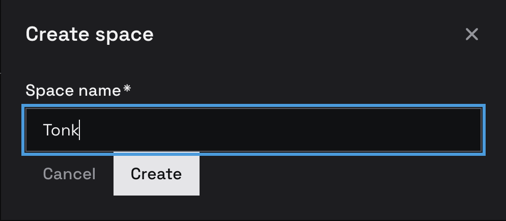

# June 5th

## Effect System

I worked on the interface to create new repository and realized I can not express it fully with our declarative engine because when user enters the name, it is posted to SW which then does whole bunch of effectful things like generating key pairs storing various records etc…

 

### First Though

My first thought was I could in fact use [`<form />`](https://developer.mozilla.org/en-US/docs/Web/HTML/Reference/Elements/form) element which can point to desired endpoint, specify HTTP method and even various headers and have global listener that prevent default submission and performs `fetch` instead. You would not be able to get response this way but in this specific scenario route handler writes `Space` concept int profile database with `status: about:blank` and spawns a task that does actual repo creation, which on completion asserts `status: tonk:initialized` which is how UI picks it up.

At first it seemed strange not to get response & I was sure I would not responses in some other cases. However as I thought more on this I realized it's actually good limitation. Instead you can always have handler assert response (ok or error) into database allowing you to react to it just like to any other state change.

> [!note]
>
> This is similar shift in mindset as going from functions to (inductive) rules - Describe circumstances in which conclusion is made as opposed to describing what to do when you're called.

Still though it seems like I'd be now mapping forms to HTTP request, that have handler query database to obtain state, do something then write state back. Why introduce HTTP into all this, how about assert command like with any other event and then have handler react to it just like rules do our how our UI elements react to changes.

### Second Thought

Sounds like it would be a lot nicer if I could do something like this instead

```rust
use dialog_capability::{Command, Provider};
use dialog_query::{Attribute, Concept};

pub struct System;

#[derive(Attribute)]
#[domain("xyz.tonk.space")]
pub struct Name(String);

#[derive(Concept)]
struct CreateSpace {
  this: Entity
  name: Name
}

impl Command for CreateSpace {
  type Input = Self;
  type Output = Result<(), Err>;
}

impl Provider<CreateSpace> for System {
  async fn execute(&self, input: CreateSpace) → <CreateSpace as Command>::Output {
    // Do whatever IO you need here
  }
}
```

> [!note]
>
> Dialog already has capability system with capability based routing designed for different goal, but surprisingly a good fit for this

One thing that is not super obvious for me right now what to do in case of error. Maybe error should not be allowed you effectively queued a command and system handles it asynchronously on it's own schedule.It would imply no standard for error handling which does not seem idea, but perhaps that could be a protocol layered above. 


## Unique Space Addresses

One thing we discovered early on was that having a URL that is different 