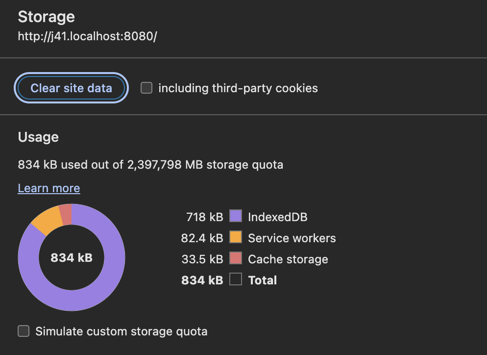
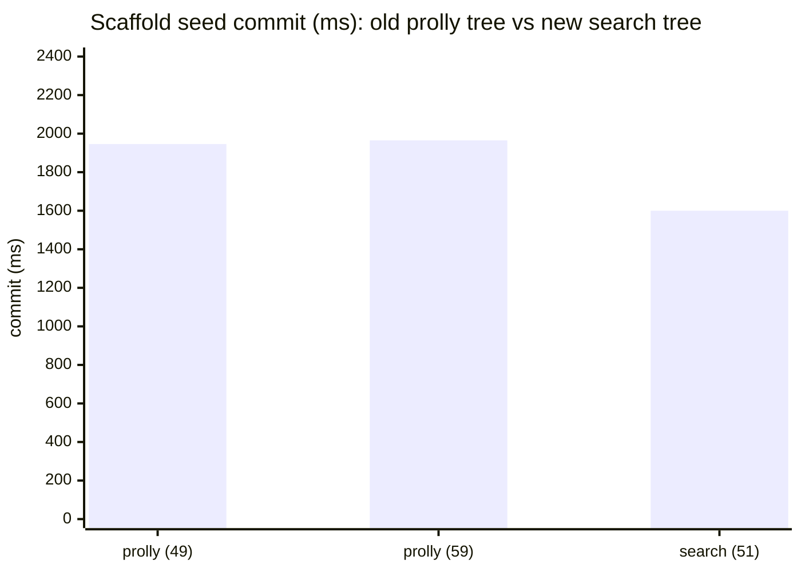
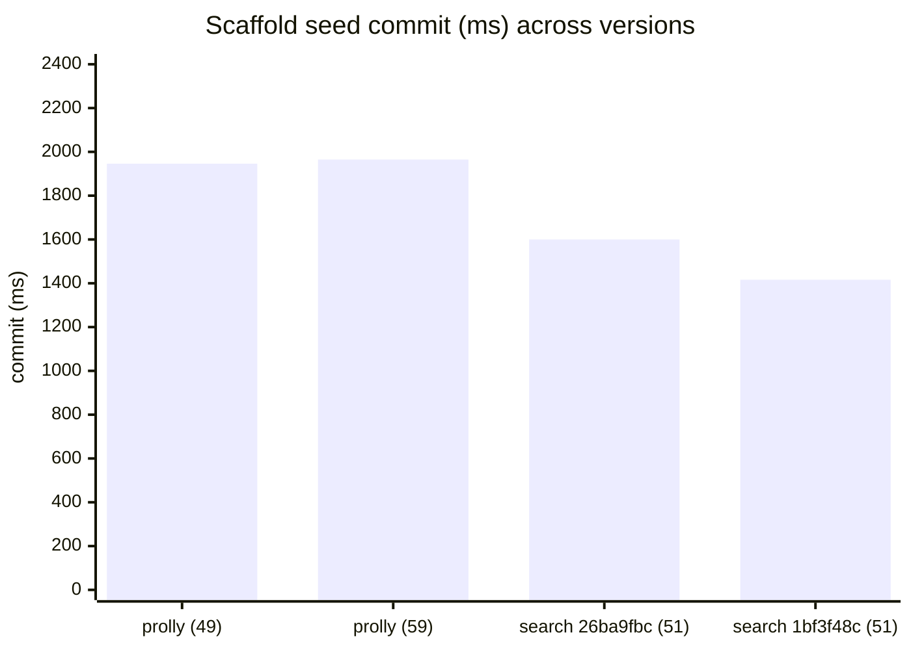

# June 11th

> [!caution]
>
> ```
> [Tonk Service Worker] Failed to forward updatefound: Error: Failed to bootstrap profile meta: Internal repository error: Failed to bootstrap profile meta: commit failed: Artifact decode failed during commit: Tree operation failed: Failed to access part of the tree: unaligned pointer: ptr 0x00236e83 unaligned for alignment 4
>     at __wbg_Error_8c4e43fe74559d73 (worker.js:539:25)
>     at worker-934a6013e2bffa0f.wasm.wasm_bindgen::__wbindgen_error_new::__wbg_Error_8c4e43fe74559d73::hcd580cde8d9d5654 externref shim (worker_bg.wasm:0x7d6904)
>     at worker-934a6013e2bffa0f.wasm.wasm_bindgen::__wbindgen_error_new::h845d831fd594b712 (worker_bg.wasm:0x7dc92e)
>     at worker-934a6013e2bffa0f.wasm.tonk_worker::worker::TonkServiceWorker::new::{{closure}}::h766b08bb995e8e97 (worker_bg.wasm:0xaa51f)
>     at worker-934a6013e2bffa0f.wasm.wasm_bindgen_futures::future_to_promise::{{closure}}::{{closure}}::hd4056c12d0428c09 (worker_bg.wasm:0x5006f2)
>     at worker-934a6013e2bffa0f.wasm.wasm_bindgen_futures::task::singlethread::Task::run::{{closure}}::h21e28b9e79efe3ca (worker_bg.wasm:0x7bf9e5)
>     at worker-934a6013e2bffa0f.wasm.wasm_bindgen::convert::closures::_::invoke::h9ea55ef6e7ab13cb (worker_bg.wasm:0x7d3c5f)
>     at wasm_bindgen__convert__closures_____invoke__h9ea55ef6e7ab13cb (worker.js:1621:22)
>     at cb0 (worker.js:1319:32)
>     at __wbg_run_bcde7ea43ea6ed7c (worker.js:1324:34)
> ```


## Observations




## Search tree vs prolly tree: seed timings

> **Correction (June 12):** the commit numbers below were measured on a low-battery machine. Low Power Mode throttles the CPU on macOS, and the seed commit is CPU-bound, so these readings are inflated 3-6x off the same binary. Reran clean on [June 12](2026-06-12.md): the same `1bf3f48c` scaffold commits in ~384 ms, not ~1416 ms. Against [June 4th's](2026-06-04.md) recorded prolly-tree baseline (49 exprs -> 1946 ms, 70-expr home -> 2241 ms), the search tree is ~5x faster, not the ~27% concluded here. The methodology below is sound; the throttled timings and the "only incremental" read are not.

Pointed the `dialog-*` deps at the `feat/switch-to-search-tree` branch (commit `26ba9fbc`) to see whether @cdata's new search tree moves the seed-commit number that dominated the [June 4th](2026-06-04.md) bootstrap. Same instrumentation seam as last time: in `evaluate_on_branch` I timed parse, analyze+eval, and the prolly/search commit separately, then teed the line onto a `BroadcastChannel('tonk-timing')` so a page could read the SW-side seed numbers without the service-worker console (the seed runs background in the SW via `spawn_seed`, so its logs never reach the page).

Measuring took some care. Three things contaminated early readings and had to be ruled out one by one: the **hot-swap dev client** kept firing on a freshly-built bundle and throwing `tonk-evaluate not handled (no <tonk-host> ancestor)` on the Hub, aborting the in-flight create (disabled it via `tonk:hot-swap:enabled=0`); a **stale service worker** that predated the rebuild had no timing tee at all, so nothing was captured until a hard `ignoreCache` reload swapped in the new bundle; and a **concurrent cargo build** stealing CPU. With those removed (fresh suborigin, hot-swap off, no build running), the numbers tightened right up.

A space create seeds the whole scaffold in one commit per branch. The default `home` also gets the showcase demo, so it lands more expressions.

| seed | exprs | parse | analyze+eval | commit (search tree) |
|---|---:|---:|---:|---:|
| scaffold (any space) | 51 | 5 ms | 20 ms | **1556–1705 ms** (median ~1600) |
| home + demo | 85 | 10 ms | 72 ms | **2657 ms** |

Parse and analyze are still noise; the bill is still the commit. As before, the commit time tracks the number of changes in the commit, not the size of any one value.

### How it compares

On June 4th the old prolly tree, all inline, charted cleanly by expression count: 49 → 1946 ms, 59 → 1965 ms, so a 51-expression scaffold would have landed around **~1950 ms**. The same seed on the search tree is **~1600 ms** — faster, but not the step change I was hoping for.

```mermaid
gantt
  title New search tree — home create (51 scaffold) critical path ≈ 1.6 s
  dateFormat x
  axisFormat %S s
  section home
  open + analyze     :0, 25
  seed commit (51)   :crit, 25, 1625
  name commit (4)    :1625, 1627
```





The single biggest commit on a cold load is still the `home` seed with the demo on top: **85 expressions, 2.66 s**. That, not the bare scaffold, is what a brand-new user waits on.

### Read

The search tree's win on bulk insert is real but smaller than the theory predicted. The June 4th model was that the old tree persists every intermediate node on each key's update path, and the search tree flushes only the final tree — so the redundant intermediate writes disappear. If that overhead were the whole story the seed should have dropped much further than 18%. So either the intermediate-write overhead was a smaller fraction of the commit than assumed, or the search tree trades some of that saving back elsewhere (encode/decode, compression on the flush). The storage-usage screenshots above point the same way: the new tree is leaner on disk, but the wall-clock commit is only moderately faster.

Repo initialization is still not as fast as I want it. The levers from June 4th still apply and matter more than the tree swap: the profile already seeds a lean `profile.yaml` (3 exprs, ~140 ms), and trimming what lands in a fresh space's commit would move the 1.6 s scaffold and the 2.7 s home-with-demo more than the engine underneath them does.

### A newer commit

@cdata pushed more onto the branch, so I re-pointed the dep at `1bf3f48c` and reran the same clean create-a-space measurement (fresh suborigin, hot-swap off, no build running).

| commit | scaffold seed (51 exprs) |
|---|---|
| `26ba9fbc` | 1556 / 1600 / 1705 ms (median ~1600) |
| `1bf3f48c` | 1331 / 1416 / 1586 ms (median ~1416) |



Each search-tree commit shaves a bit more: ~1950 ms on the old prolly tree → ~1600 → ~1416, roughly a **27%** drop from the prolly baseline. Still incremental rather than the order-of-magnitude I'd been hoping bulk insert would unlock, which keeps the read above: the seed's expression count is the lever that moves this most.