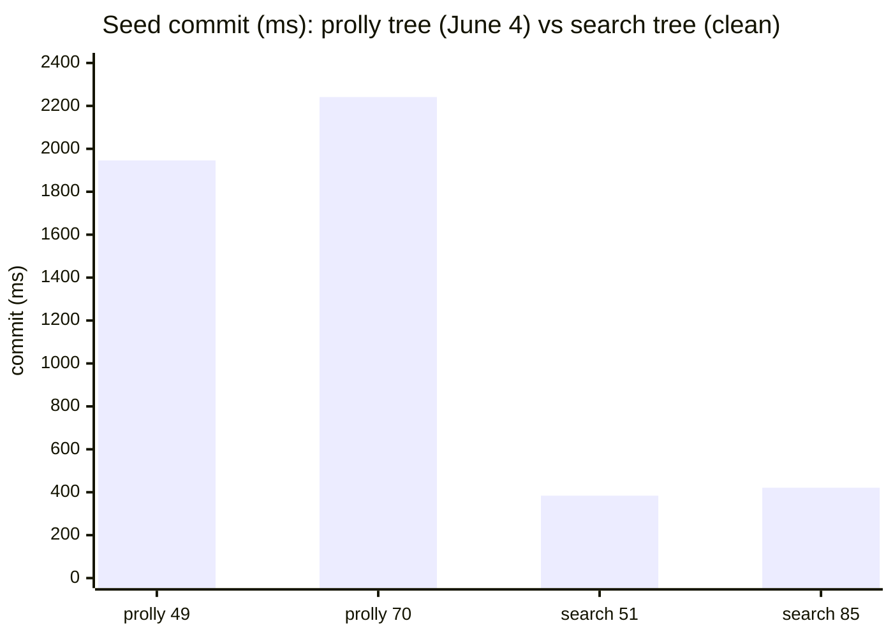
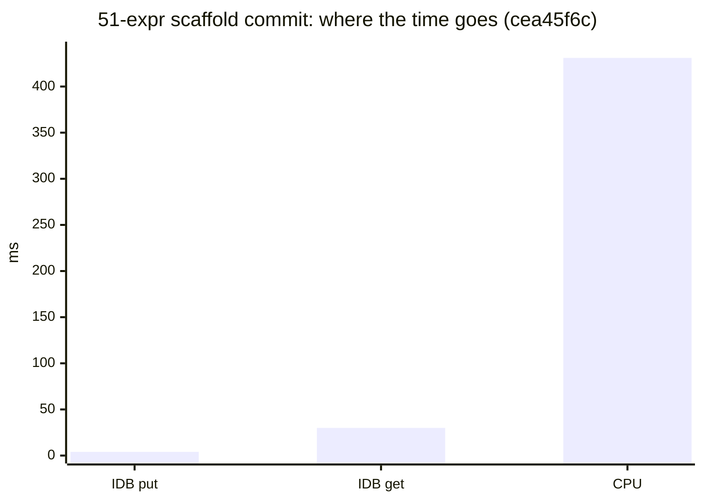

# June 12

## Seed timings, clean: prolly tree vs the search tree

Reran the seed-commit measurement on a quiet, plugged-in machine. Same instrumentation as before, same `BroadcastChannel('tonk-timing')` tee, same protocol (hot-swap off, no concurrent cargo build), with one refinement: a fresh suborigin per run (an isolated browser context, storage wiped between runs) so every create is a genuine cold load rather than a torn-down service worker layered on existing storage.

Checked first that this is actually the new tree, because the numbers came out low: yes. Both served wasm bundles (`worker_bg.wasm` and the UI bundle) carry `dialog-search-tree/.../1bf3f48/...` symbols and zero `prolly` symbols. The dep is pinned to dialog-db commit `1bf3f48c`.

The comparison that matters is against the old prolly tree, and [June 4th](2026-06-04.md) has the recorded baseline rather than an extrapolation. That day, all prolly, all inline: a 70-expression home seed committed in **2241 ms**, and the trimmed count curve ran 49 exprs -> 1946 ms, 48 -> 1616 ms, 28 -> 1224 ms. Lining the closest measured points up against today's clean search-tree numbers:

| seed | exprs | commit, prolly tree (June 4) | commit, search tree (`1bf3f48c`) |
|---|---:|---:|---:|
| scaffold (new space) | 51 | 1946 ms (at 49 exprs) | 384 / 317 / 416 ms (median ~384) |
| home + demo | 85 | 2241 ms (at 70 exprs) | 453 / 421 / 365 ms (median ~421) |

The expression counts do not line up exactly, and they favor the prolly side: today's 51-expr scaffold beats prolly's 49-expr point, and today's 85-expr home beats prolly's 70-expr point. Since the prolly curve climbed monotonically with count, an 85-expr seed there would have cost *more* than the 70-expr 2241 ms, so the real gap is wider than the table shows. Parse and analyze stayed in the noise (2-8 ms parse, 10-43 ms analyze+eval). The whole move is in the commit.

## Read

The search tree's win on bulk insert is large once it's measured on a clean machine. The scaffold went from prolly's 1946 ms at 49 exprs to ~384 ms at 51 exprs, roughly a 5x drop, and the home seed from prolly's 2241 ms at 70 exprs to ~421 ms at 85 exprs, over 5x even though the search-tree seed carries more expressions. That is the step change the bulk-insert model predicted, where the old tree persists every intermediate node on each key's update path and the search tree flushes only the final tree, so the redundant intermediate writes disappear.

The biggest commit a fresh user actually waits on is the `home` seed with the demo on top: 85 expressions, ~420 ms. That is the cold-start cost now, and it is dominated by expression count, not the engine underneath. The lever from before still stands: trimming what lands in a fresh space's commit moves the number more than anything in the tree.

## Where the commit time actually goes: CPU, not IDB

The open question was what to optimize: is the commit bound by IndexedDB I/O or by CPU (hashing, encode)? June 4's read was "the bill is DB writes," which was true for the prolly tree's redundant intermediate-node persistence. The search tree changes that, so I measured it directly.

Instrumented IndexedDB in the service worker by wrapping `IDBObjectStore.prototype.put/get` to tally call count, byte volume, and request-to-success wall time, posting snapshots on a `tonk-idb` channel. Reset the counters immediately before each create and snapshot right after the commit line, so the ops are attributable to the commit alone (not the Hub's post-seed re-queries, which on the full-bootstrap snapshot added ~500 ms of their own `get` time and would otherwise mislead).

Three isolated 51-expression scaffold creates:

| run | commit | put (writes) | get (reads) | IDB total | rest = CPU |
|---|---:|---:|---:|---:|---:|
| 1 | 271 ms | 52 ops / 51 ms | 568 ops / 30 ms | ~81 ms | ~190 ms (70%) |
| 2 | 478 ms | 73 ops / 81 ms | 602 ops / 29 ms | ~110 ms | ~368 ms (77%) |
| 3 | 293 ms | 28 ops / 41 ms | 548 ops / 29 ms | ~70 ms | ~223 ms (76%) |

The answer is clear and stable: **IDB I/O is ~25-30% of the commit; CPU is ~70-77%.** Two signals stand out. Read time is rock-steady at ~29-30 ms across all runs (~550-600 gets) regardless of how long the commit ran, so reads are served warm from cache and are not the bottleneck. Write time is also modest, ~40-110 ms (the put *counts* in the table overcount the commit; see the correction below). What remains, the ~190-370 ms between the IDB calls, is compute: blake3 content addressing, rkyv encode, and in-memory tree restructuring.

So the lever to pull next is **CPU, specifically hashing and encode, not IndexedDB.** Optimizing the storage path further would chase a quarter of the cost; the three-quarters is in the WASM compute between writes. (Counters captured via a temporary `idb-probe.js` prelude injected into the dev service worker, removed after.)

### What the blocks actually are: a few big nodes, not many small ones

The put counts above (28-73) were misleading: the probe tallied `put` globally across every open IndexedDB, so it swept in the `tonk.profile` and `home` databases and post-commit metadata rewrites, not just the one commit. Reading the live IDB instead, a fresh scaffold space's `archive/index` store holds **23-25 resident blocks**, and that is the true per-commit block count. There is no write amplification: the storage is append-only (no delete/gc), and the search tree's `Delta` is a `HashMap<Blake3Hash, Buffer>`, so intermediate node versions built during the commit coalesce in memory and `flush()` yields only the final deduplicated node set. The search tree's in-memory-flush optimization is doing exactly what it promised; the prolly tree's redundant intermediate writes are genuinely gone.

The block *count* varies run to run (23 vs 25) because entity identifiers are random `did:key`s and the prolly tree's node boundaries are content-defined: different random keys chunk into a slightly different number of nodes for the same logical facts.

The real shape is in the size distribution, not the count. A 51-expression scaffold is ~543 KB across ~23 blocks, but the sizes are wildly skewed: the median block is under 1 KB while the single largest is **~150 KB**, and the top few (150 / 62 / 59 KB) hold most of the bytes. The 85-expression home seed is the same shape: 41 blocks, biggest ~128 KB. So the commit's CPU cost is not "hash 23 small nodes," it is "blake3 + rkyv-encode a handful of 60-150 KB nodes in one shot." When any key in a large node's range changes, the whole node is re-serialized and re-hashed, not just the changed entry.

That locates the optimization precisely: the **large nodes**. Two levers fall out, both pointing back to June 4's unfinished thread. Cap node size / improve chunking so no single node reaches 150 KB, which cuts the per-commit re-encode. And move large values (the view templates with inline CSS, the sketch portal) out of tree nodes into a blob store so a node carries references rather than 150 KB of inline payload. The inline-CSS question June 4 set aside as "not worth pulling" looks worth pulling again here, not because the large value is slow to write once, but because it inflates the node it lands in and that node is re-encoded on every commit that touches its key range.

> [!note]
>
> [Yesterday's](2026-06-11.md) readings on this same `1bf3f48c` binary were much higher: ~1416 ms scaffold, 2657 ms home. That was a low-battery machine. Low Power Mode throttles the CPU on macOS, and the seed commit is CPU-bound, so a throttled clock inflated the commit 3-6x off the same binary. It made the search tree look only incrementally faster than the prolly tree (~27%) when clean it is ~5x. The reading to keep: the seed commit is sensitive to power state, and any "the tree got faster / slower" claim has to be made plugged in on a quiet machine or it is measuring battery and scheduler noise rather than code.

## Single IDB transaction per commit: confirms the write path was never the bottleneck

@cdata pushed more onto the branch and tagged it `tonk-2026-06-12` (commit `cea45f6c`). The headline change is that the new dialog writes all of a commit's blocks in a single IndexedDB transaction instead of one transaction per block. The prediction above was that this would barely move the wall clock, because the IDB breakdown put writes at only ~25-30% of the commit and CPU at ~70-77%. Switched the dep to the tag (PR #511), which needed a small downstream fix: the tag added a `Provider<Import>` capability bound to `Commit`/`Pull`, so I threaded it through the env-bound aliases on every commit and pull path. Then reran the same clean protocol (fresh suborigin per run, hot-swap off, plugged in), plus the SW-side IDB probe from above to isolate the write path directly.

The seed commit wall clock is unchanged, exactly as predicted:

| seed | exprs | commit `1bf3f48c` | commit `cea45f6c` (single txn) |
|---|---:|---:|---:|
| scaffold (new space) | 51 | 384 / 317 / 416 (med ~384) | 336 / 385 / 381 (med ~381) |
| home + demo | 85 | 453 / 421 / 365 (med ~421) | 409 / 413 / 520 / 411 / 414 / 420 (med ~413) |

But the write path itself collapsed. The probe, scoped to a single 51-expression scaffold commit, shows IDB `put` time dropping from ~40-80 ms to ~4 ms for the same ~45-49 puts and ~700 KB of blocks:

| metric (51-expr scaffold) | `1bf3f48c` | `cea45f6c` |
|---|---:|---:|
| put write time | 41-81 ms | **3.9-4.4 ms** |
| put ops / bytes | 28-73 / ~543 KB | 45-49 / ~700 KB |
| readwrite archive transactions | one per block | **~5** |
| get read time | ~29-30 ms | ~30-39 ms |
| resident blocks (home seed) | 41, max ~128 KB | 36, max ~117 KB |

The probe wrapped `IDBDatabase.prototype.transaction` to count readwrite-vs-readonly transactions on the archive store. The signal is clean: a scaffold commit now opens ~5 readwrite archive transactions where it used to open one per block, and those writes complete in ~4 ms total. The ~540 archive transactions that still show up are nearly all readonly, one per `get` during the read-modify-write tree walk, not writes. No write amplification: block counts and the large-node size skew (top node ~117 KB) are unchanged from before.

## Read

The batching worked and is measurable, and it confirms the CPU read decisively. Of a ~465 ms commit, IDB is now put ~4 ms plus get ~30 ms, about 34 ms or ~7%. The other ~93% is CPU: blake3 hashing, rkyv encode, in-memory tree restructuring over a handful of large nodes. The single-transaction change removed the smaller quarter of the cost that the prolly-tree write pattern used to carry, so the end-to-end commit barely moved, just as the IDB breakdown predicted it wouldn't.

This closes the question of whether storage I/O was worth chasing: it was not. The lever that moves the seed number is the one from above and from June 4, and it is entirely CPU. Cap and chunk the large nodes so no single node reaches ~117-150 KB and gets re-encoded on every commit that touches its key range, and move large inline values (the view-template CSS, the sketch portal) out of tree nodes into a blob store so a node carries references rather than inline payload. Every remaining win is in the WASM compute between the writes, not in the writes.

