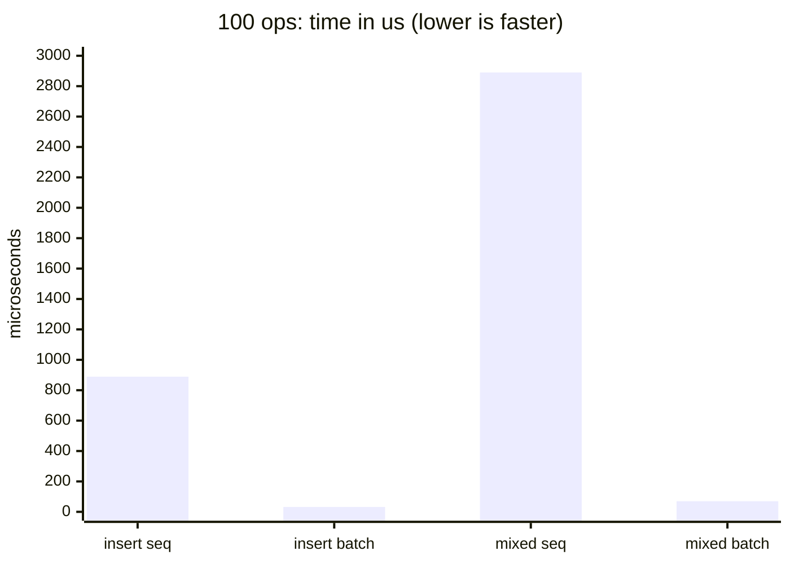
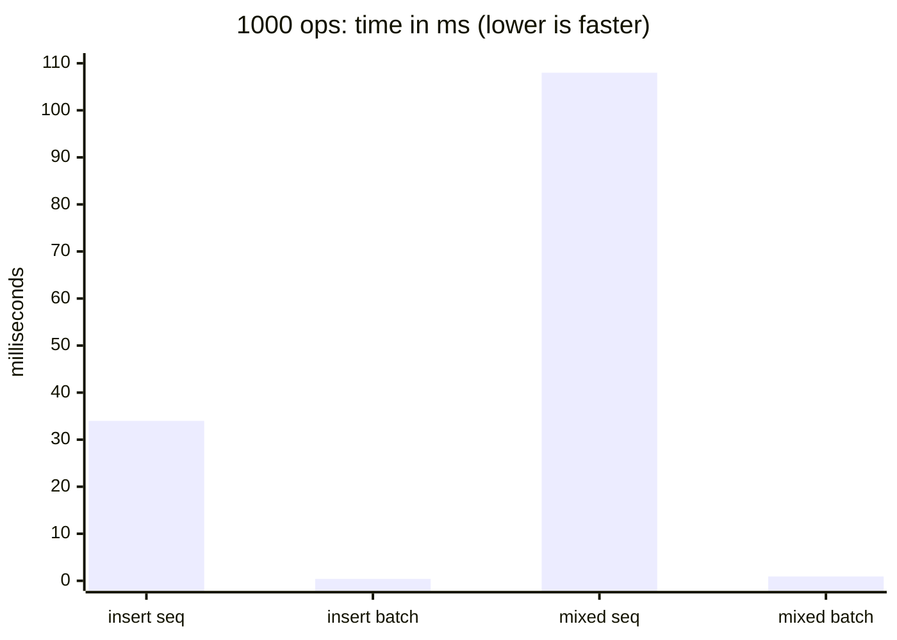
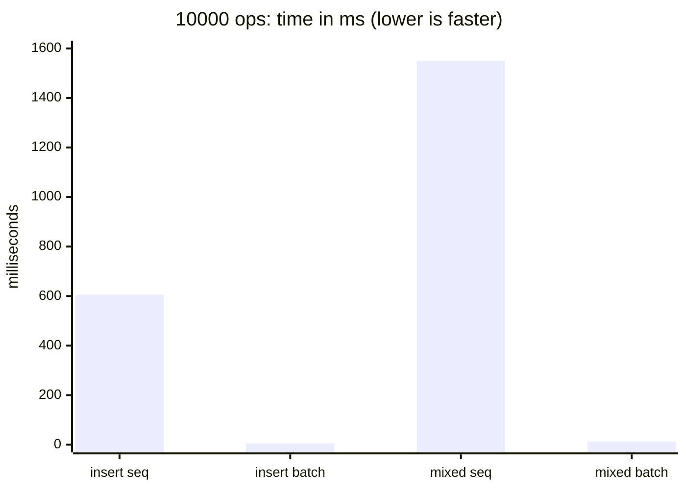
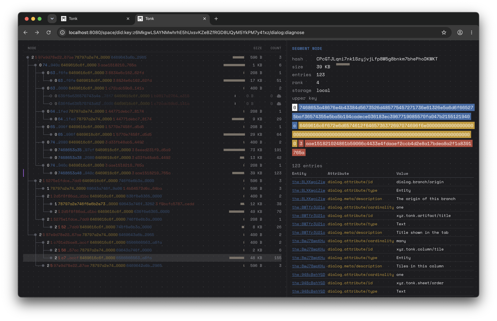

# June 15th

## Batched tree edits: amortizing the per-op commit CPU

June 12 closed on a clear lever: the seed commit is ~93% CPU (blake3 + rkyv encode + in-memory restructuring), and storage I/O is not worth chasing. The search tree already flushes only the final deduplicated node set, so within one commit there is no write amplification. But the *commit* still pays per-operation CPU: every `Tree::insert` / `Tree::delete` rebuilds and re-hashes its whole root-to-leaf path, then returns a new tree, and the seed runs hundreds of these in sequence. That is the CPU the June 12 read pointed at, and it is the thing batched edits remove.

The idea (Datomic-style, and the same shape as a Clojure transient): open one editing session over the tree, apply the whole batch of inserts/deletes mutating an in-memory working copy in place, and serialize once at the end. The catch is that the working copy has to stay cheap, copy-on-write off the persistent tree, or you just trade redundant hashing for redundant copying.

Built this as `Tree::edit(storage) -> Edit`, with `edit.insert(k, v, storage)`, `edit.delete(k, storage)`, and `edit.persist() -> (root, delta)`. The whole feature is pinned by property oracles that assert the batched result is **byte-identical** to the same operations applied one at a time through the existing `Tree::insert` / `Tree::delete` (the per-op shaper). Five of them: random-order inserts, every single-key delete over a range (covers boundary keys at every level), random batched deletes, and the strongest, a random interleaving of 400 inserts and deletes over a small colliding key domain, across 200 seeds each. Equivalence is exact root-hash match, so any shape divergence fails loudly.

## The model that worked: copy-on-write, shape at edit time, no copy until mutate

The node type is a two-arm enum: `Node::Persistent(Link)` is a cheap shared reference (hash plus upper bound, never decoded), and `Node::Transient(...)` is an in-memory editable node. An edit descends from the root to the target leaf, lifting only the nodes on that path from `Persistent` to `Transient`; untouched siblings stay as shared `Link`s and are never copied. `persist` then walks the transient frontier bottom-up, serializing only the touched spine and re-emitting every untouched child's existing link verbatim. Reads (`get`, range scans) are untouched and still zero-copy; the `Edit` code runs only on writes.

Two design questions came up that I had wrong assumptions about, and the benchmark settled both.

**Where to shape.** A prior parallel branch deferred all the tree re-shaping (the rank-based cut/merge that keeps the tree canonical) to `persist`, keeping each per-op edit a trivial `Vec` insert. I assumed that deferral was the source of its speed. It is not. Shaping at edit time, so the tree is canonical after every op and `persist` is a dumb serializer, costs essentially nothing once the shaping is gated correctly (below). The always-canonical version is the better invariant anyway: reads and intermediate inspection are always valid, and `persist` makes no decisions. The deferred-vs-edit-time choice turned out to be a wash on the clock.

**Don't copy until you mutate.** This was the actual lever, and I found it the hard way. My first correct-but-unoptimized version re-cut every node on the path on every op, and clocked ~2x over sequential, nowhere near the deferred branch's reported numbers. Gating the re-shape so it only fires when the touched key is actually a segment boundary (rank above the leaf threshold; a non-boundary insert or delete moves no cut and is a pure in-place `Vec` edit) barely helped, which was the surprise. The bottleneck was not re-shaping at all. It was a single `segment.entries.clone()` I was doing on every insert to probe whether the leaf stayed canonical before committing to the fast path. Replacing that clone-and-restore with a non-mutating predictive check (a binary search that decides, without touching the leaf, whether the edit keeps it canonical) was a roughly 16x jump on its own.

## Numbers

Benchmarked batched `Tree::edit` against the same operations applied sequentially through `Tree::insert` / `Tree::delete`, random 16-byte keys, on a quiet plugged-in machine (criterion, reduced sampling). Two workloads: pure batch insert, and a mixed batch (insert a base set, insert more fresh keys, delete half the base).

| workload | size | sequential | batched | speedup |
|---|---:|---:|---:|---:|
| insert | 100 | 889 µs | 32 µs | 27x |
| insert | 1 000 | 34 ms | 397 µs | 87x |
| insert | 10 000 | 606 ms | 5.66 ms | 107x |
| mixed | 100 | 2.89 ms | 70 µs | 41x |
| mixed | 1 000 | 108 ms | 927 µs | 117x |
| mixed | 10 000 | 1.55 s | 12.4 ms | 125x |

Plotted as a direct before/after at each batch size: sequential and batched bars side by side, in the real time unit, one chart per size so the two comparable numbers sit on the same axis without a 48000x range crushing them. The pair on the left of each chart is insert (sequential then batched), the pair on the right is mixed.

100 operations, time in microseconds:

1 000 operations, time in milliseconds:

10 000 operations, time in milliseconds:

In every chart the batched bars are barely off the floor next to the sequential ones, and the contrast sharpens as the batch grows: at 100 ops the batched insert is ~28x shorter, at 10 000 it is ~107x, and mixed runs ~41x to ~125x. The exact numbers:

| workload | 100 | 1 000 | 10 000 |
|---|---:|---:|---:|
| insert, sequential | 889 µs | 34 ms | 606 ms |
| insert, batched | 32 µs | 397 µs | 5.66 ms |
| mixed, sequential | 2.89 ms | 108 ms | 1.55 s |
| mixed, batched | 70 µs | 927 µs | 12.4 ms |

The speedup grows with batch size, which is the amortization showing: more operations land on already-transient nodes, so the per-op cost falls while the one-time serialize at `persist` stays fixed. At 10k the batched edit also beat the older deferred-reshape branch I measured on the same machine (24 µs / 346 µs / 18 ms for insert), so edit-time shaping is not paying a penalty for keeping the tree canonical.

The progression of where the time went, across the day's commits, was instructive: copying-based split/join was ~2x, copy-on-write with unconditional per-op re-shape was still ~2x, copy-on-write with the boundary gate but a per-op leaf clone was still ~2x, and only removing the clone unlocked the 27-125x. Three of my performance hypotheses (re-shape cost, the boundary gate, copy-free key routing) each turned out to be small; the copy was everything. The lesson to keep: correct does not imply fast, and on this tree the dominant cost is allocation and copying, not the algorithm. Measure before attributing.

## What still copies

Worth being precise, since the principle is "no copy until mutate." In the steady-state hot path:

- **Insert**: zero key copies. The key is owned by the `Entry` the caller passes; the descent borrows it from the operation itself.
- **Delete**: one key clone, because `Tree::delete` receives the key by reference and the operation must own it to carry it down the descent. Off the hot path relative to insert-heavy batches.
- **Lifting a persistent node on first touch**: this is the real remaining copy, and it is inherent to copy-on-write. The first time an edit enters a node, its archived bytes are decoded into an owned, mutable form (one key per child for an index, keys and values for a leaf). It happens once per node per batch; subsequent edits hit the already-transient node and copy nothing. Profiling a from-empty batch insert confirmed zero redundant node loads.
- **Boundary re-shape**: one key clone, only on the rare boundary-delete fusion, off the hot path.

So the only unavoidable structural copy is decode-on-first-touch, which *is* copy-on-write, and everything in the steady state borrows.

## Read

Batched edits turn the seed's per-op commit CPU into one amortized pass, and the measured win is 27-125x depending on size, larger for bigger batches. This is the same CPU that June 12 located as ~93% of the commit; the seed is a long sequence of small tree edits, and doing them as one batch instead of N independent rebuilds is exactly the amortization the bulk-insert model predicted, now realized for the in-process edit path rather than just the cross-commit flush.

The thing I will carry forward is the diagnostic, not just the result. The fast path is now: descend lifting only the path, decide with a binary search whether the leaf stays canonical, and if so do a single in-place `Vec` edit and return. No re-cut, no clone, no propagation. The boundary cases (a split on a boundary insert, a fuse on a boundary delete) do the real shaping work, but they are the minority of operations and the only ones that touch more than one leaf. The whole speedup came from making the common case allocate nothing it does not mutate, and from refusing to believe the algorithm was the cost until the clone showed up in the numbers.

Open thread: this is benchmarked on the tree in isolation against a memory backend. The next measurement that matters is wiring `Tree::edit` into the actual seed-commit path and rerunning the clean suborigin protocol from June 12, to see how much of the ~420 ms home-seed commit this removes end to end. The tree-level numbers say the headroom is large; the commit also carries blake3 and rkyv encode on the large nodes (the other June 12 lever), which batching does not touch, so the end-to-end win will be bounded by whichever of those dominates once the redundant per-op rebuilds are gone.

## Tree Diagnostics

Ended up implementing tree diagnostics tool for inspecting underlying search tree from within the repository itself

