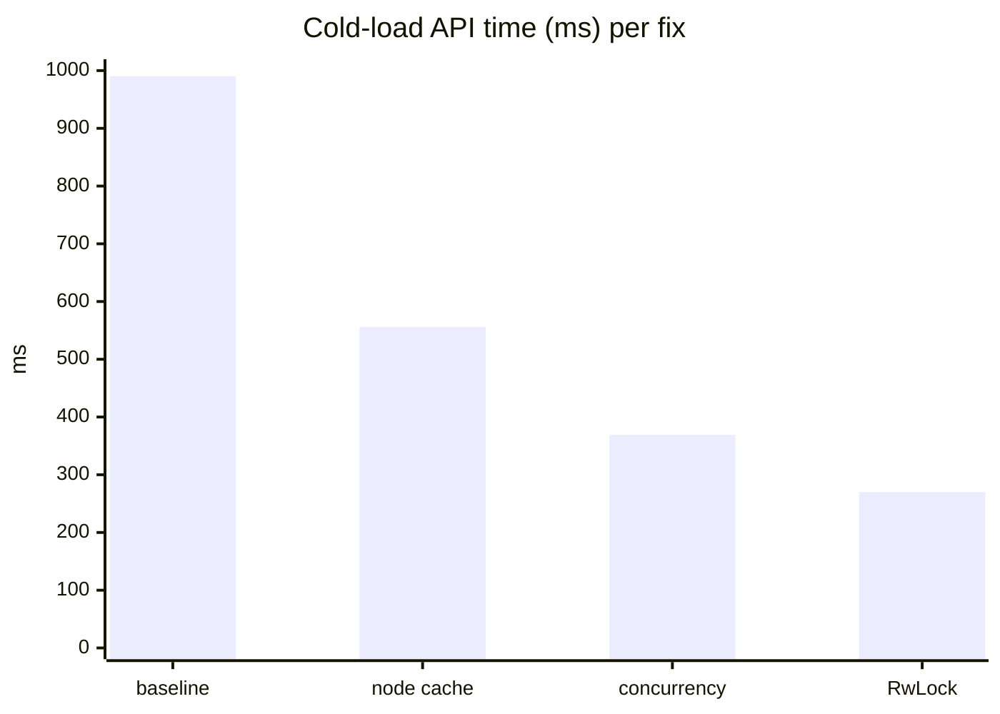

# June 16th

## The optimization that made things slower

I expected [yesterday's](2026-06-15.md) batched-edit and threshold-distribution work to make the app feel snappy. It felt slower. That is the opposite of what the tree-level benchmarks said, so something downstream was eating the win.

My first guess was block size. The new threshold distribution produces shallower, wider trees, so I assumed the wider index nodes meant bigger blocks and slower loads. That guess was wrong too, but it took profiling to find out where the time actually went. The browser's Performance recorder cannot see the service-worker thread, so I instrumented the worker directly and teed the numbers onto a `BroadcastChannel('tonk-timing')`, the same trick from [June 11](2026-06-11.md), and read them from the page.

Three distinct problems fell out, none of them the one I assumed.

### The node cache was rebuilt empty on every query

This was the big one, and it is embarrassing. A full-process trace showed ~19,600 IndexedDB transactions on a cold load, one per block read, against a tree with 28 nodes total. So every block was being read from disk roughly 590 times. Counting reads by store confirmed it: 16,535 reads of `archive/index`, and a per-block counter showed the cache hit rate was exactly 0%.

The cause was one line. `Branch::select` built its read tree with `Index::from_hash`, which allocates a fresh empty node cache every call. A concept query fans out to a dozen-plus internal selects, each minting a new empty cache and re-reading the same root and leaf from IndexedDB. The cache existed and worked; it just never lived longer than a single select.

The fix is to give the branch one shared cache and seed every read tree from it (`from_hash_with_cache`). Content addressing makes this trivially safe: a hash always maps to the same bytes, so a cache shared across revisions is never stale. Block reads on a cold load went from 168 to 4, hit rate 0% to ~98%. This shipped as dialog-db #358, tagged `tonk-2026-06-16`.

### sync/status held a write lock across a network fetch

With the cache fixed, queries were still stalling ~260 ms. They were not doing work; they were waiting. `sync_status` took an `AppState` *write* lock and held it across a ~250 ms round-trip to the upstream, even though it only reads. Every concurrent query queued behind it. Downgrading to a read lock let them run alongside it.

### Every request was serialized behind one router mutex

The service worker routed every request through `router.lock().await.call().await`, an `Arc<Mutex<Router>>` held for the whole request. Axum routers are cheap to clone, so cloning out of the lock and dispatching on the clone lets requests run concurrently instead of single-file.

### The reactor's caches were Mutexes

The repo, profile-repo, and branch handle caches were `parking_lot::Mutex`, so concurrent requests serialized on a cache *read*, the fast-path lookup every acquire does. `RwLock` lets those reads run in parallel; only the rare first-touch insert takes a write lock.

> [!note]
>
> We do not strictly need the write lock at all. Branch updates already go through compare-and-swap on the root, so concurrent writers are safe to attempt optimistically: if the root has moved out from under us, that is not a hard failure. Two trees over the same branch can be merged. The only thing holding me back from leaning into optimistic writes now is consistency. To merge safely I want to capture what a transaction *read* and check it against what was *written* concurrently. No overlap means the trees merge cleanly; an overlap means we replay the transaction against the newer tree. Until we track that read set, serializing writes is the cheap way to keep the guarantee. Once we do, the write lock can go.

## Numbers

Cold-load API time, measured after each fix lands:

| stage | total API | slowest query |
|---|---:|---:|
| baseline | ~990 ms | 490 ms |
| + node cache | 556 ms | 260 ms |
| + sync/router concurrency | 369 ms | 17 ms |
| + reactor RwLock | **270 ms** | **7 ms** |

3.7x faster overall, the slowest query 70x faster. Everything except `sync/status` is now under 8 ms; the remaining ~236 ms is one real upstream network fetch that no longer blocks anything.

## Read

The funniest side effect: the [loading skeletons](https://webawesome.com/docs/components/skeleton/) stopped appearing. The data now arrives before the ghost placeholder gets a chance to paint. We built a loading state for a load that no longer happens.

## Loading from network

The wider, shallower tree is doing exactly what it was meant to. Fewer levels means fewer round-trips to fetch a path, so loading from the remote got faster too, not just local reads.

> [!warning]
>
> The cost shows up on the other side. Wider nodes mean an update duplicates a bigger block, so disk usage grows faster per write than it did with the taller tree. The [June 11](2026-06-11.md) storage screenshots looked lean on the seed; steady-state churn will not. This pushes garbage collection up the list. We were going to need it eventually; wider blocks mean sooner.

The lesson is the same one [yesterday](2026-06-15.md) ended on, learned again from the other direction: a faster engine does not mean a faster app. Yesterday the tree got fast and I attributed the speed to the algorithm when it was the allocation. Today the tree was fast and the app was slow, and the gap was entirely in the layers above it: a cache thrown away per call, and three locks turning concurrent work sequential. Measure the thing the user waits on, not the thing you optimized.
