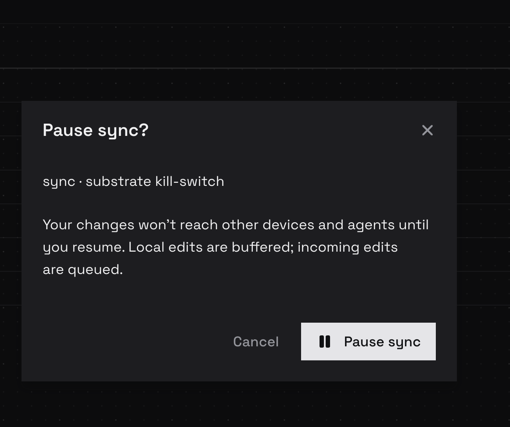

# June 22

## Less locking

[June 16](../2026-06-16.md) ended on a note: we do not strictly need the `AppState` write lock at all, because branch updates already go through compare-and-swap on the root, so concurrent writers are safe to attempt optimistically. The only thing holding me back was consistency, wanting to catch a racing write rather than silently lose it. Today is the day that note got cashed in, because the sync chip forced it. A chip that reflects real sync state and a pause button that actually pauses cannot work if every status read and every pause click queues behind a 250ms upstream fetch holding a global write lock. The chip was the feature; the lock model was the work.

The shape of the fix is to move serialization off the global lock and onto the thing that actually needs serializing, which is a single branch's commits. Concretely:

The worker's sync, transact, pull, and push routes drop the `TonkState` *write* lock to a *read* lock. None of them need exclusive access to the whole state; they operate on one branch. So a status check, a transaction, and an in-flight sync now interleave instead of going single-file.

Commits serialize on a per-branch async `Mutex` that lives inside the reactor's `Commit::perform`, not in the route. Putting it in the reactor matters: every commit path, the transact route and the direct handler commits alike, funnels through `Commit::perform`, so none of them can sidestep the lock by accident. Sync deliberately does not take this lock. A racing commit-versus-sync is not prevented, it is detected: the CAS catches it and we recover by refreshing the branch and retrying, rather than serializing to avoid the race in the first place. This is exactly the optimistic-write posture June 16 was circling, just scoped to one branch.

Sync uses dialog's new two-phase pull. The network-bound half, fetch and rebase, runs lock-free as `prepare`. Only the instant cell advance, `commit`, takes the transactor lock. So the slow part of a pull never blocks a commit, and the fast part holds the lock for microseconds. This shipped on the dialog side as #362 (tagged `tonk-2026-06-22`): pull and commit made fail-safe against racing writes via CAS checkpoints, and pull split into `prepare` and `commit`.

The pause preference itself is a boolean `enabled` on the replica entity, cardinality-one so a toggle supersedes rather than accumulates. The live status is a separate multi-variant overlay the chip subscribes to. Keeping the durable preference and the transient observation in two concepts means each resolves on its own: the preference is always present, the status can lag, and a single two-field concept would only resolve once both existed.

s

## The roster, and which branch it lives on

We have a members roster now, the "shared with" list in the share dialog: a row per member with a sigil avatar, a name over the DID tail, and a role badge.


The one decision that matters here is which branch the membership facts live on.  We are designing LLM edit sessions as short lived branches, meaning that agents will be invited to branches where's other space members may not be. Point is membership is by branch which is why a roster had to move from meta target branch.

The membership stamp carries two pieces: a `MemberRole` (founder vs member, first-wins so a founder who reclaims their own invite does not get demoted to member) and a `MemberName` (the display name). So the row can show a name instead of a raw DID, with the role as a badge.

## The sigil that would not paint, part one

To put a face on each roster row I reached for `<tonk-sigil>`, the deterministic identity glyph we derive from a DID. It rendered blank in the sealed `/space` iframe. The console had the tell: a CORS error fetching `/sigils.svg`.

The sigil masks `currentColor` through a sprite sheet via CSS `mask-image: url(/sigils.svg#…)`. The sealed view runs in an opaque-origin iframe, so any same-origin fetch, including a CSS mask URL, is cross-origin from the guest's null origin and gets blocked. The guest cannot reach our own assets.

The fix has a nice shape. The guest already gets its whole runtime injected by the host across the bridge (the host is same-origin and trusted; the guest fetches nothing). The sprite is the same class of problem as the fonts we already inline. So the guest fetches the sprite over the host, mints a same-origin `blob:` URL for it inside the iframe, and installs that as the sigil's default sprite href. No CORS, because a blob URL minted in-guest shares the guest's origin.

> [!caution]
>
> That worked in Chrome and Firefox but not Safari.

## The sigil that would not paint, part two

Same blank sigil, same raw `mask-image:url(/sigils.svg#…)` in the DOM, meaning Safari had fallen back to the build-time default sprite and never installed the blob.

> [!warning]
>
> ```
> portal fetch: failed to transfer response body: DataCloneError: The object can not be cloned.
> ```

There it is. Our streaming fetch bridge transfers the response body's `ReadableStream` over `postMessage`. Safari before 27 cannot transfer a stream; it throws `DataCloneError`. Every other current browser can, which is why only Safari broke.

### Streaming everywhere, with a fallback

The cheap fix would have been to stop streaming and buffer the body to an `ArrayBuffer`, which transfers everywhere. But it does not work for streams like our subscriptions for example. So I build streaming proxy, and it is the foundation for the bigger idea of having the guest hit the worker's HTTP API directly instead of the bespoke query/subscribe envelope bridge. s

So we keep the stream transfer where it works, fall back where it does not. Detect support by probing a throwaway `MessageChannel` once and caching the result. On the fast path, transfer `response.body` as before. On the fallback, open a `MessageChannel`, hand the guest one end, and drain the body into it with credit-based backpressure. The guest grants credit when its `ReadableStream` wants more, the host reads exactly that many chunks and posts them, then closes. The guest reassembles a real `Response`, so its overridden `window.fetch` stays faithful: `.text()`, `.blob()`, `.body`, all of it.

> [!note]
>
> The general `window.fetch` override is the quiet headline here. The guest can now fetch any same-origin asset and it transparently routes to the host. That is most of what `tonk-host` and the query/subscribe/transact envelope bridge do, and it suggests the guest could eventually just talk to the worker's HTTP API over this proxy. Deferred, but the streaming fetch is the piece that makes it possible, because subscribe is a stream.

