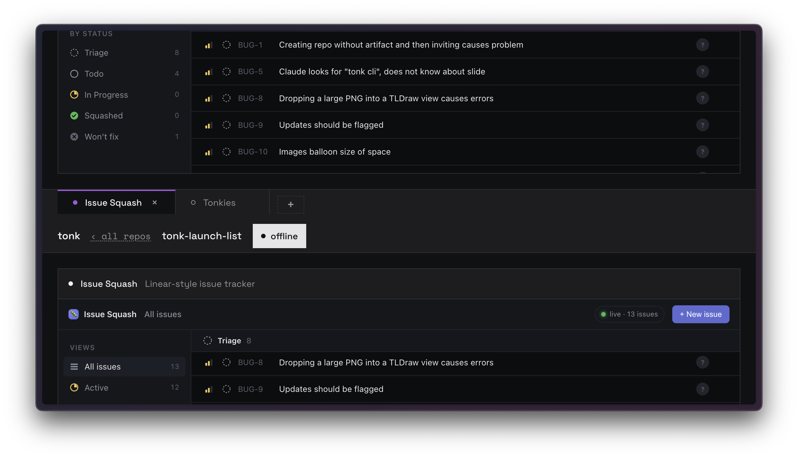
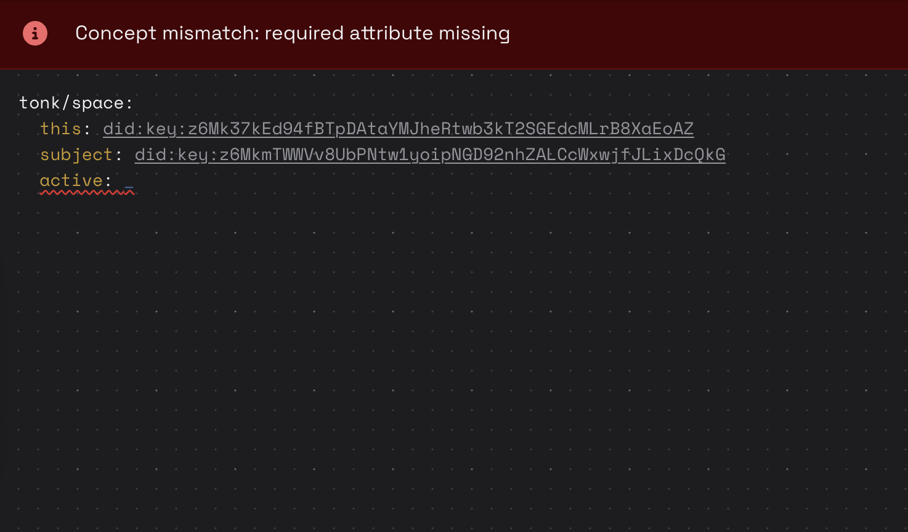

## June 26

## Conceptual routing

After completely sealing iframe content it became clear that whole tonk-ui shell is effectively redundant and mostly a dead weight. That is because guest now overrides native `fetch` with custom one that asks host in the outer frame to do it which it does and relays message back. I had realization that `fetch` to service worker is the only thing `<tonk-host>`  needs, se we could pretty much strip everything else from the out frame host, well except we use [leptos routing](https://book.leptos.dev/router/index.html) in order to know what to load, which is only thing. Unfortunately it also means if we want to support other paths we'd need to make changes to rust code, compile and deploy. Alternatively we do routing just like we do everything else in the system: through concepts! So here I present you `route` concept

```yaml
command!: &route
  this: tonk:route
  description: |
  	Command defines a route that binds path pattern to a concept that will be realized from the matche path
  with:
    path:
      description: The axum/matchit path pattern.
      the: xyz.tonk.route/path
      cardinality: one
      as: text
    concept:
      description: The concept to display when this path matches.
      the: xyz.tonk.route/concept
      cardinality: one
      as: entity

# retract existing route for the same path
rule!:
  retract!: router/route
  when:
    - assert: route
      where:
        path: ?path
    - assert: router/route
      where:
        this: ?this
        path: ?path

# assert new route
rule!:
  assert!: router/route
  when:
    - assert: route
      where:
        this: ?this
        path: ?path
        model: ?model
```

> [!note]
>
> Note an interesting pattern to enforce that only one route exists for a given path. While it can not protect other replicas from defining conflicting routes it still useful

Now that routes are stored in database service worker can construct a routing table when it loads a branch first time & subscribe to routes so that when new routes are defined they will be picked up. Current implementation uses [axum router](https://docs.rs/axum/latest/axum/struct.Router.html) under the hood, which does not allow conflicting routes, which is perfect! So what we do is sort all routes by hash and define routing table, if axum returns an error due to conflict we  ==quarantine==  rejected  route which would make it discoverable, so if conflicting routes get replicated we are able to mitigate.

Putting things together this is how it looks like

```yaml
route!:
  path: /space/{subject}
  model: route/space
  
concept!: &route/space
  with:
    path: route/path
    subject:
      the: xyz.tonk.space/subject
      as: entity

view!:
  model: route/space
  display: |
    <body>
      <tonk-host>
        <tonk-repository name={subject}>
          <tonk-branch name=main>
            <tonk-display model=tonk/space />
          </tonk-branch>
        </tonk-repository>
      </tonk-host>
    </body>
```

And now system knows what to render when you navigate to specific URL.

> [!note]
>
> I also like the symmetry here route defines how to parse path and map it to a concept and view defines how to map concept into markup.

### Showing single replica

My primary motivation was not making a router to replace leptos or to make routing table dynamic, although those factors played some role. Mostly I wanted to fix this quirk that I love and hate.



What happens above is that we render binder as a directory so it renders one for each replica. Replica is basically an entity derived from operator & repository public keys allowing us to uniquely identify each replica of the repository. Replica is used by binder to store active tab, that way when I switch a tab it does not change active tab for you.

> [!caution]
>
> I used directory view for binders because a falsely assumed that only local replica will be queryable after all it's a synthetic fact which is injected into a session by dialog, but never stored. However, if you associate some attribute with the replica entity that will be stored and replicated and that is why we see UI for each participant.

To fix that we should be rendering binder for the local replica only, but it's bit more complicate because replica identifier needs to be communicated somehow.

> [!note]
>
> Would have being no-brainer with deductive rules, but sadly those still need to get threaded through the system to become available for our consumption

### Sites

Basically we need some context carried around after thinking about it I have defined concept of a `site`

```yaml 
concept!: &site
  this: tonk:site
  description: |
  	A tab's location and the route concept it renders.
  with:
    path:
      description: Currently active path on this site.
      the: xyz.tonk.site/path
      cardinality: one
      as: text
    anchor:
      description: Currently active anchor (URL hash) on this site.
      the: xyz.tonk.site/anchor
      cardinality: one
      as: text
    replica:
      description: Currently active replica on this site.
      the: xyz.tonk.site/replica
      cardinality: one
      as: entity
    route:
      description: Matched route of this site.
      the: xyz.tonk.site/route
      cardinality: one
      as: entity
    concept:
      description: |
      	Matched route's concept (the model the shell mounts).
      the: xyz.tonk.site/concept
      cardinality: one
      as: entity
```

This concept is asserted into an overlay by the router for each [`clientId`](https://developer.mozilla.org/en-US/docs/Web/API/FetchEvent/clientId) which is then host passes to guest which then can be used to render it using `<tonk-display entity=site:foo model=site />` which in turn has view that renders `concept` of the route on the `replica`.

When guest asks to `navigate!` to a different path command handler in the SW updates site, which causes host to update guest and guest updates display accordingly.

## Helpful errors

As I was building things out I ran into several cases where concept did not matched because some attribute was missing. I got tired of explaining to claude that misses attribute means query does not match yet entity may exist. Furthermore when that happens I also have to go digging to see which attribute is missing.

I ended up extending `<tonk-display>` so that I have to stop digging on mismatches, so now if you have `<tonk-display entity={my-entity} model=tonk-space />` you'll get a more informative screen witch partially matched concept and missing attributes marked



> [!note]
>
> You know what would be even better if you could go and type value for the missing field right in there and once you do it comes to live and loads. 

## Fab Chrome

Was inspired to prototype some chome interface & here is the result

<video>
  <source src="https://pub-5627f9dd8db047268a0809a396390152.r2.dev/fab-chrome.mov" />
</video>

