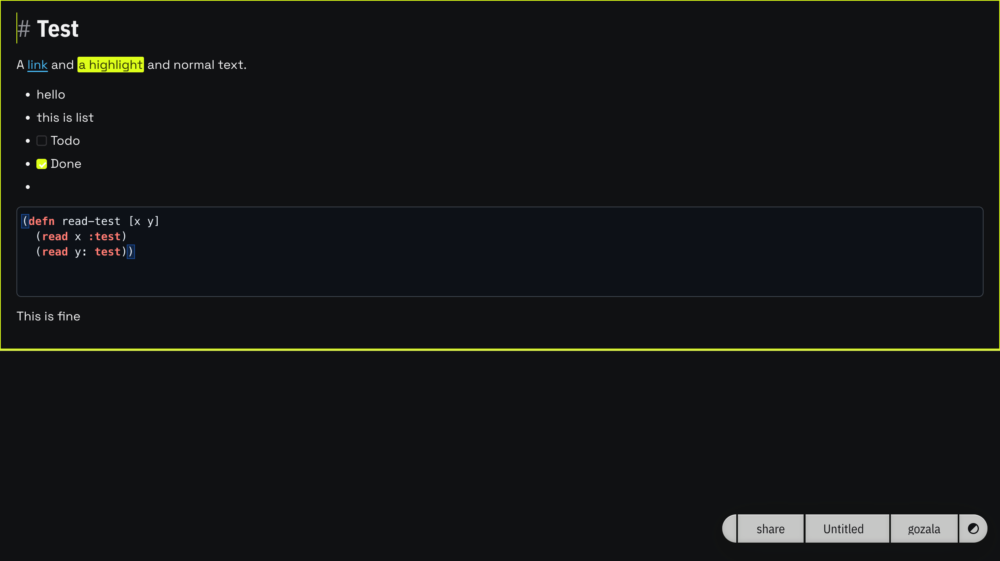

# The markdown editor became its own markdown

Got `<tonk-prose>` working properly. It resurrects [allusion](https://github.com/gozala/allusion), the Typora-style editor I built for Beaker browser: markdown markers live in the document as literal text carrying a `markup` mark, hidden at rest and revealed near the caret, so a block reads as rich text until you edit it and then shows its raw syntax.

## How it works

A textblock's `textContent` *is* its markdown source, so instead of one input rule per syntax there's a reparse loop: watch the block you're editing, and after a short debounce reparse its text and swap it when the structure changed. Typing `**bold**` becomes strong with the `**` kept as marker text; deleting a `*` degrades it back. The same holds for block prefixes: `# `, `> `, `- `, `1. `, `[ ] ` all materialize as literal markers, so a list or quote reads as its markdown while the caret is in it, native bullet/checkbox stepping aside.

Structure follows the prefixes. The reparse reparses the whole enclosing wrapper from its lines, so dropping a `- `/`> ` lifts that line out (splitting the wrapper) and typing one joins it. Enter in a quote continues it, a second Enter exits, Shift+Enter always continues.

> [!note]
> Reveal is symmetric now: a marker adjacent to the caret on either side shows its span, so `text |**bold**` reveals the `**` on approach. Because the marker is then real visible text, the browser's own caret movement and typing land at the boundary with nothing hidden to skip, which retired a pile of custom keymap and CSS.

Added `==highlight==`, and the theme inherits the page's WebAwesome tokens (`--wa-color-*`, fonts, radius) so links and highlights look like the app.

## On-demand code languages

Code blocks are embedded `<tonk-code>` editors. They only shipped `yaml`, so now there's a chunk per CodeMirror language (~140), each a direct import of its grammar. `loadLanguage` fetches the chunk graph over the SW-proxied `window.fetch` and mints the blobs itself, so a ```python or ```lisp block loads its highlighter on first use with no bridge protocol.



[#619](https://github.com/tonk-labs/tonk/pull/619). Also bumped dialog to `tonk-2026-07-17` for a `Value` untagged-deserialization fix that was mangling the editor's content envelope.
