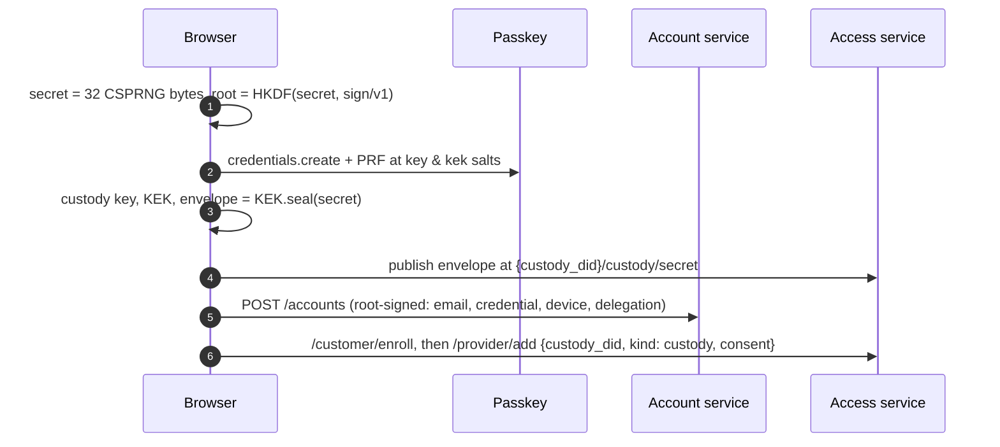
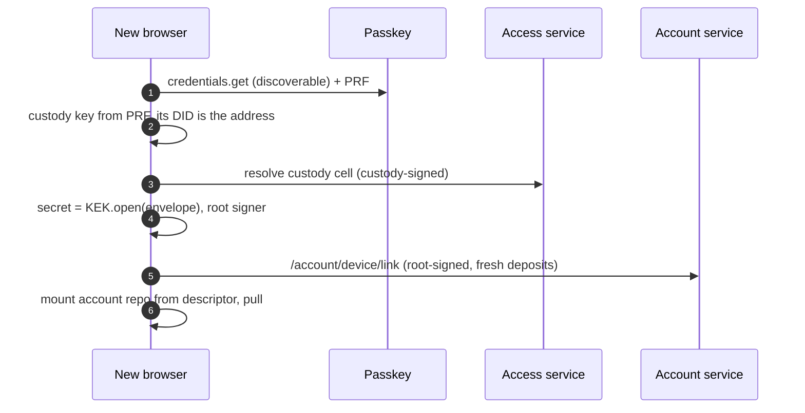
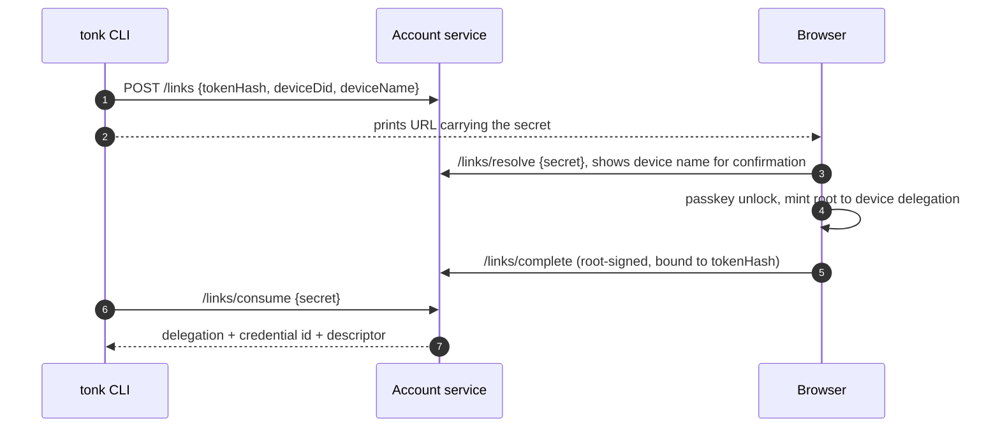
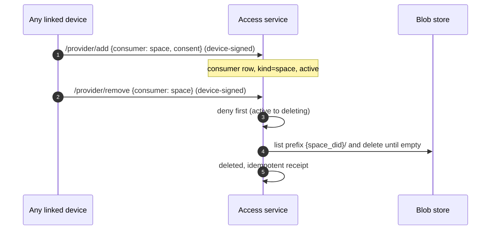
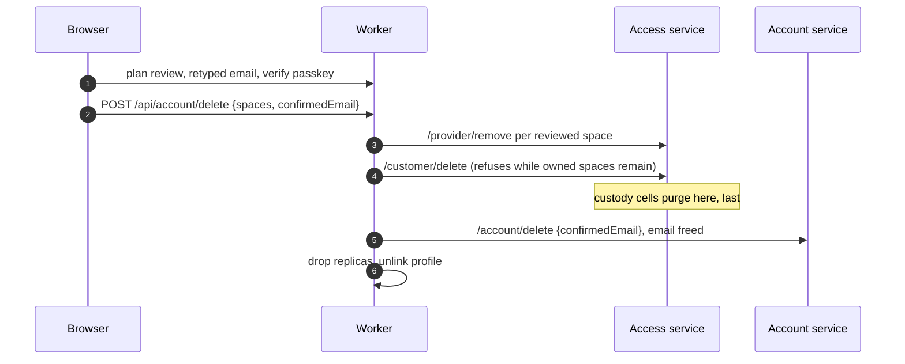

# August 20

## A parking record was the whole 522

`tonk.network` had been answering 522 while `tonk.spot` and `tonk.host` were fine, so I assumed the DNS records differed somehow. They did not. The zone was still parked: one apex `A` record pointing at `192.64.119.219`, Namecheap's parking IP, proxied. Cloudflare dutifully proxied to a host that never answers, which is the 522. `www` still CNAMEs to `parkingpage.namecheap.com`, which is the tell I walked past twice, it was serving a parking page rather than our app.

The same record was also blocking the fix. [#730](https://github.com/tonk-labs/tonk/pull/730) moved the production route to `tonk.network` but was never deployed, and deploying it failed with `100117`: the hostname already has externally managed DNS records, delete them first. `custom_domain = true` wants to own the record and will not take one that already exists. So the parking record caused the outage and prevented the repair. Deleted it, deployed, `tonk.network` serves in 0.18s.

> [!caution]
> Wrangler removed the `hub.tonk.xyz` record when it moved the custom domain. Old links NXDOMAIN now rather than redirecting. Worth deciding whether that hostname deserves a grace-period redirect.

The RP ID moved with it, so the DID document is `did:web:tonk.network` and passkeys bound to `hub.tonk.xyz` are stranded. Known and accepted going in, but the code says it plainly: widening later is possible via Related Origin Requests, narrowing never is.

## Staging follows

[#733](https://github.com/tonk-labs/tonk/pull/733) puts staging on `staging.tonk.network` and `accounts-staging.tonk.network`, so both deployments stop straddling two registrable domains. Mostly wrangler routes, but `tonk-analytics` compares `location.hostname` literally to pick the PostHog environment, so without touching it every staging event would have been tagged `dev`.

`apex_rp_id` matches the apex exactly, so staging stays off-apex and keeps its own credentials even as a subdomain. The test asserting that was pinned to the retired hostname; it now asserts it about the one that ships.

> [!caution]
> The account service WAF rate limit is scoped to zone `tonk.xyz` and matches on `http.host`, so moving staging to `tonk.network` puts it in a different zone and the rule silently stops applying. It is the only per-IP limit on unauthenticated `/codes`, `/accounts/preflight`, and `/links`, and staging shares production's Resend key. Needs recreating on the new zone by hand, nothing in CI will notice.

Neither wrangler config carries `account_id`, so a local deploy stops on account selection until `CLOUDFLARE_ACCOUNT_ID` is set.

## The account is a database, not a service

Landed the account envelope campaign on [#726](https://github.com/tonk-labs/tonk/pull/726). The spot-backup escrow and its service-side artifact store are gone: the account space itself, plain facts on profile main synced like any other branch, is the directory now. Space names, membership, the deletion inventory, all of it reads out of the synced account DB, and a second device gets it by being a second device rather than by asking a service to replay artifacts. What remains server-side is genuinely service-shaped: custody cells, provisioning, revocations, email ceremonies.

## Deletion is deprovisioning

Jack's [#731](https://github.com/tonk-labs/tonk/pull/731) gated deletion on minting an exact `/space/delete` grant, which is the thing UCAN says you never need: if you hold the capability you can exercise it, there is no separate permission to have permission. Reframing it dissolved the problem. Deletion is not a power over the space, it is the account ending its hosting relationship, so the command is `/provider/remove`, the exact reverse of `/provider/add`, invoked on the customer's own subject through the account's root to device chain. Invite chains structurally cannot reach it because they root in the space's subject, and any linked device can delete, which is the policy stated honestly instead of smuggled in as a grant ceremony.

The account-level finalizations (`/customer/delete`, then `/account/delete`) are device-signed the same way. The passkey shrank to what it actually was: a user-verification assertion pinned to the account's credential, nothing derived, nothing signed with the root key.

```
active -> deleting -> deleted
deny first, purge second, receipts idempotent
```

> [!caution]
> Custody namespaces are provisioned as consumers like spaces, so the first deletion attempt deprovisioned its own sealed-key cell and bricked every retry behind an unlock that could no longer happen. They carry `kind=custody` now: invisible to review, refused by space deletion, purged only inside customer finalization, last.

The 500s that hid all this were their own campaign: an internally tagged error enum that panicked serializing newtype variants, and a purger listing `{bucket}//` because path-style resolve already prepends `{bucket}/`. Once errors carried the upstream's actual words the purge bug read itself off the URL. Purger now has a test against a real local S3, and a browser e2e drives the whole deletion stack so nobody has to QA it by deleting their own account.

## Why this campaign kept hitting Blob not found

The account restructure is what turned yesterday's push bug from latent into constant. Once the account space became the home of delegations and every device syncs it, every login is the exact trigger sequence: quiet pull adopts the upstream head by root reference (zero blocks fetched), the site stamp commits novelty near the root, and the push diff then walks base against current through a local-only store and dies on interior nodes that were never fetched. Same shape at worker boot, where the session-open candidate scan reads the access branch.

The invariant that silently changed: "every block reachable from a local head is locally held" was true when pulls hydrated eagerly, and the local-only walks (push diff, candidate scan) were written against it. By-reference adoption broke it on purpose, for pull cost, and nothing revisited the walks that assumed it. So a perfectly healthy store threw `Blob not found in storage`, a different hash each run depending on where the walk descended, and it read exactly like corruption.

The fix ([dialog-db#454](https://github.com/dialog-db/dialog-db/pull/454) with #456 folded in, pinned as `tonk-2026-08-19`) made absence a settled answer instead of an error: the differential got a per-side `MissingBlocks` policy where an absent node contributes its routed ops and never descends. Base side is lenient unconditionally, because the base is the target's own last-synced tree, so anything missing there is something the target already holds. Head side needs proof: attribution, an existence probe, or fetch-forward. And #456's reference-ordered uploads (referents strictly before referrers) are what make a probe hit a proof for the whole subtree beneath it, since an aborted push can no longer leave a store that holds a parent without its children.

## The transaction that settled before anyone listened

The other wedge from the same testing rounds looked nothing like a bug in our code: refresh spins forever, the worker sits mid-commit holding its locks, no error anywhere. The cause is in `idb`, the crate under rexie. IndexedDB is an eager event source: a transaction starts settling the moment the event loop turns, whether or not anyone is listening. `idb` wraps that with a lazily armed future: `TransactionFuture` installs its `complete`/`error`/`abort` listeners only when `done()` is first polled. Our adapters awaited the requests first, and every request await yields, so the transaction could dispatch `complete` before any terminal handler existed. The later `done()` then waits for an event that already fired and strands forever, and inside a commit that wedges every lock the commit holds.

An eager source behind a lazy listener is a race by construction, not a small bug: the API contract silently requires every caller to poll `done()` before their first request await. The fix (dialog `7f198620`) is a `settle` module whose `arm()` consumes the transaction and polls the done future once, synchronously, before the first request, so the handlers exist before anything can settle. Pinned with a test that aborts mid-transaction on the error path.

> [!note]
> Longer term rexie should just go: the surface dialog actually uses is small, and owning the transaction wiring directly removes the layer where this class of race lives.

## The flows, drawn out

Writing them down because the shape is easy to lose: the account is a locally generated 32-byte secret, never stored in plaintext. Keys derive from it through domain-separated HKDF (`tonk/sign/v1` now, `tonk/enc/v1` reserved for E2EE, which is why we wrap the secret and not the signing key). A passkey is not the account, it is one [Authenticated Encryption with Associated Data (AEAD)](https://developers.google.com/tink/aead)  ==wrapping== of the secret, published as a sealed envelope in a memory cell at `{custody_did}/custody/secret`. The **custody keypair** derives from the [PRF](https://www.passkeyprf.com/) output at one salt and its DID names the cell, so deriving the key is the lookup. [The Key Encryption Key (KEK)](https://zerotohero.dev/inbox/dek-kek/) derives from the second salt and opens the envelope. Any enrolled passkey recovers the whole account; losing one loses one wrapping.

### Creation

The dialog memory cell publishes before the account registers: an account whose only unlock lives in page memory must never exist, so a refused publish fails the whole ceremony.



After that the account space is profile main's upstream, and the directory (names, mounts, membership) is plain facts in the synced DB. No service-side artifact store, a second device learns everything by pulling.

### Unlock on a new device

One assertion, one presigned GET, one unwrap. No lookup by email, no server ever sees key material.



### CLI linking

The CLI cannot present a passkey, so it borrows a browser that can. One-time bearer secret, device identity parked under its hash.



The completion signs over the token hash, so a stolen completion cannot be replayed against a different pending link, and the secret never touches the root signature.

### Hosting, both directions

Provisioning and deletion are mirror images on the customer's own subject, which is the whole UCAN point: no special deletion grant, possession of the account's chain is the policy.



### Account deletion

Passkey is a user-verification gesture only (allowCredentials pinned, nothing derived, nothing signed). Everything destructive is device-signed.



## Activation was recorded and never read

[#735](https://github.com/tonk-labs/tonk/pull/735) is the enforcement half of `Access metering.md` §3.1-3.2. #726 records activation, surfaces it on the dashboard, and polls it, but nothing read it on the hot path: `provisioning::screen` was written and never called. Every space was served identically whether or not anyone confirmed an email, so any self-minted keypair stored bytes under its own namespace, unbilled.

It is wired into both presign paths now, and `/provider/add` checks the same status itself. That reverses §3.3, which let a `Registered` customer add consumers on the grounds that servability is derived state and such a consumer derives to denied anyway. One rule reads better than an accepted write whose effect is silently withheld: an unactivated customer gets nothing, and the refusal says which nothing (`awaits email activation` versus `is suspended` versus `is not provisioned`). Enroll and activate stay ungated or nothing could ever activate, and the pending banner grew a resend button since the link expires and `enroll` was already idempotent.

Enforcing it broke account creation, which is the ordering `provisioning.rs` had flagged in a comment: the ceremony publishes the custody cell before the account registers, so the gate refuses the publish and creation fails. The cell cannot move earlier (nothing is provisioned yet) and the publish cannot be pre-signed (`/memory/publish` carries a five-minute expiration, which does not outlive a wait for an email click). So the ceremony hands back the sealed envelope instead and the client parks it, along with any provisioning that lands during the wait, as pending work on a credential site.

The two kinds drain in different places. Provisioning is device-signed, so the worker replays it off the customer status probe that notices activation. The custody publish needs the PRF-derived custody key, which only exists inside a fresh assertion, so the account panel replays that one. Entries replay in recorded order and a drain stops at the first failure, so a publish never overtakes the provisioning that makes it servable.

> [!caution]
> Deferring the publish broke every root-signed ceremony, and the browser tests caught it: CLI approval, link completion and revocation all unlock by resolving the custody cell, so a browser that activated without returning to the dashboard failed with `no account custody is published for this passkey`. Each of those paths drains before unlocking now. Anything added later that unlocks the root has to do the same.

## Hydrating never published

Chasing a browser test that failed 3 of 5 runs on the branch and 0 of 5 on staging turned up something older than the gate. Only the `marker_matches` arm of the account sweep pushes profile main. The hydrate arm marks trusted, seeds, converges, returns `Ready`, and publishes nothing, so a freshly hydrated account needs a *second* sweep before anything reaches the account remote, and sweeps only happen on browser traffic.

The gate is what made it reachable. The account repository's subject is the account root DID, which is also the customer DID, and signup hydrates before it enrolls, so the account space gets screened before its own customer row exists. Hydration is refused, deferred, and swallowed into a log that still reports a clean sweep, and the push slips one sweep further out. The bug underneath is not mine and is user-facing: a device nobody pokes twice never publishes, so its spaces stay invisible to the account's other devices. The hydrate arm pushes what it just made durable now.

> [!note]
> `ensure_account_state_swept` returning `Ok(())` on the unhydrated path is what kept this quiet. The status says `Unhydrated` but the sweep result says success, so every caller reads it as fine.

## Three harness bugs fell out

The browser harness exported `SSL_CERT_FILE` process-wide while each `TestServers` run mints its own Caddy CA under a port-keyed directory. With two harnesses alive the second overwrites the first and its CLI children cannot reach their own origin, which surfaces as a TLS transport error to `tonk.network`. The `unsafe` set_var carried a comment claiming it was safe under parallel tests. The root rides on `TestEnvironment` now and each child gets it directly.

The other two are the same shape: the chromedriver readiness loop and the wait for Caddy to mint its root both fell through silently on timeout and let the run continue as if they had succeeded. Every later request then fails against a dead port or an untrusted origin and reads like an unrelated test failure. Both error with what actually went wrong now.

> [!caution]
> The pinned chromedriver is 149 against Chrome 151, so the browser suite will not start locally without fetching a matching driver by hand. Nix pins the driver, not the browser.

One more, mine, and only CI could see it: the register-then-link path clicked create and immediately navigated off to the activation link. The email is sent when `enroll` returns, but `enroll` is partway through the ceremony, so the navigation abandons whatever had not persisted and the approval never reaches success. Fast machines win that race. Waiting for the handoff panel first fixes it, and local passes were never evidence either way.
