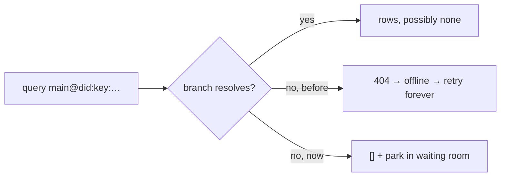
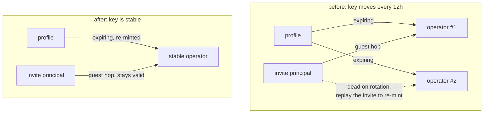
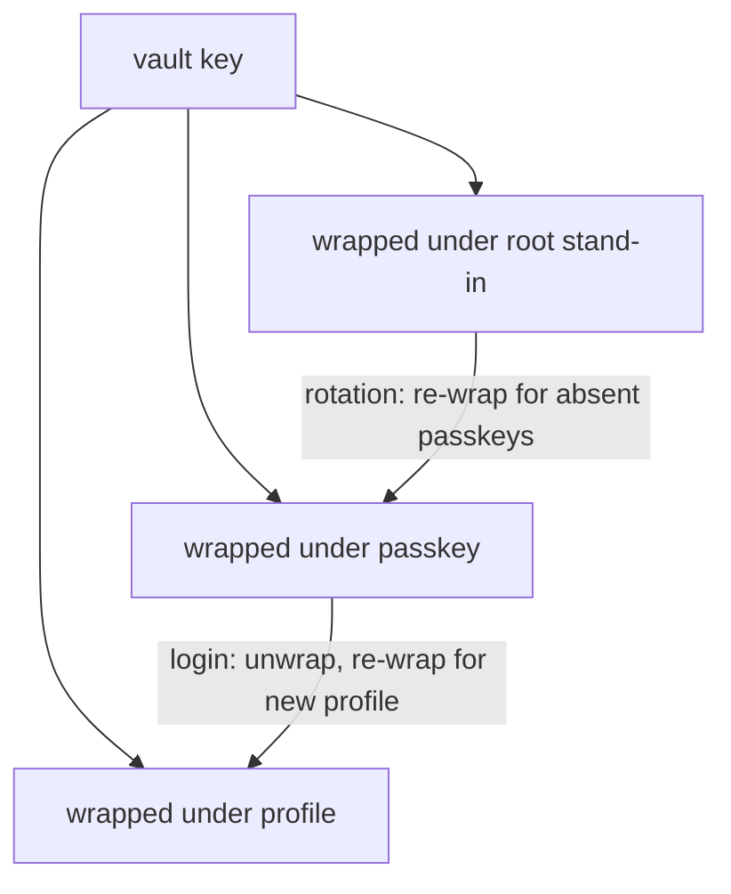

# Pasting a join link

Invites are minted against the deployment that issued them, so a staging link could only ever be redeemed on staging. That is annoying when I want the UI on localhost and the blocks still coming from the real remote. But a long invite already carries everything a join needs: the delegation chain, the sync remote, the revocation relay. The origin it was minted on is just a doorway.

So `/join` without an invite now offers a paste box instead of doing nothing, and redeems whatever I paste against whatever deployment I am looking at. Short links still have to be expanded on the origin that minted them (a local shortcut service has never seen the hash), so `<tonk-invite-link>` resolves those first and rewrites the expanded query onto the local `/join`. The seed rides the fragment, so it never leaves the browser either way. [#741](https://github.com/tonk-labs/tonk/pull/741).

The form binds `onmount`, not `onsubmit`, which took me a while to arrive at. A concept's `the:` is one slot doing two jobs: it is the DOM read path *and* the stored attribute. `Join` declares `dom.event.detail/href`, and a submit event has no `detail` to satisfy that. I first wrote a second command shaped around the form, reading `dom.event.current-target.elements.url/value`, and it silently did nothing at all: the transient stored its URL under that attribute while `JoinHandler` was triggering on `dom.event.detail/href`, so nothing was subscribed. Pressing the button wrote a fact into the void.

> [!caution]
> One `the:` means you cannot say "read it from here, file it under there". If a command needs to be reachable from a different event shape, the *event* has to change shape, not the command.

The fix is that the element cancels the submit, resolves the pasted text, and re-fires it as a bubbling `mount` carrying `detail.href`, which is exactly what `<tonk-page>` builds from a real location. Same command, same handler, whether the invite came from the address bar or the box.

## The overlay is shared

Before any of that worked, `/join` was rendering the form for a frame and then losing it. `run_join` called a blanket `clear_overlay()`, and that overlay is shared: the tab's `tonk:site` facts (path, route, concept) live there too, and every view on the page resolves through them. So every `/join` mount deleted the page's own routing state, the site display lost its entity, and it fell back to its pending spinner forever.

The site re-stamp already had this right, `retain_overlay_entities` with a comment about replacing its own facts rather than merging. The join just never learned the same lesson. Scoped to the join's own status entity now, with a test, because the failure is completely silent: nothing errors, the page just stops.

## Blaming ourselves for their refusal

Then the real invite kept failing with "Tonk could not join this spot", which tells you nothing. Turned out `AuthorizeError::PolicyViolation` fell into the `_` arm of `classify_pull` and came out as `claim-failed`, a kind that means *something on this device broke*. It was the remote declining, for a reason it stated plainly: `subject is provisioned by an active customer (the subject is not provisioned)`.

It has its own `refused` kind now, mapped to `403 JOIN_REFUSED`, saying the host declined and the owner needs to look at the spot's plan. Not retryable, because retrying the same request gets the same answer.

> [!note]
> Every recipient-facing surface shows fixed copy so an upstream body cannot leak, which is right, but it also meant a failed join was undiagnosable: one sentence standing in for a dozen causes, and the detail going nowhere. It gets logged at `JoinFailure::new` now, which is one line covering every constructor.

I only found any of this because the SW glue keeps a bounded log ring and serves it from `/api/health`. Worth remembering, the service worker console is otherwise unreachable through the devtools MCP.

Also dropped the "From an invite link" card from the new-spot wizard. That wizard is about creating a spot; joining someone else's arrives as a link and does not belong next to the template and agent choices.

## A 404 is not a failure

Landing on a spot I do not have showed a blank page and a stream of 404s. The 404 part was the tell. `RepositoryNotFound` and `BranchNotFound` were mapped to `TonkWorkerError::NotFound`, and on the page every non-OK status became `ErrorKind::Network`, which is `offline`, which retries forever. So a repo that is simply not here read as "your network is down" and hammered the worker about it.

The retry was the loud symptom, but the classification was the actual bug. Absence is not a transport failure. A branch that exists and matches nothing answers with the empty set; a branch that is not here should answer the same way. It is the same answer to the same question.

So `/query` answers `[]` and registers the subscriber in a waiting room on the reactor, keyed `(repo, branch)`. The entry holds the sender that is already wired to the page's open stream, which is what makes the hand-off invisible: when `acquire` finally materialises that branch, it adopts every waiting subscriber onto the real `BranchState` and schedules one poll. Frames just start arriving.

Nothing polls and nothing retries. The branch coming into existence *is* the event, which also means a missing repo and a missing branch behave identically, because both resolve through the same `acquire`.

> [!caution]
> I first "fixed" the flood by retiring the subscription on a 404. That is worse than the bug: it does not just fail to heal, it destroys the thing that would have heard the answer. Join a spot in another tab and the first tab stays dead forever, because there is nothing left listening. I had been told this exact objection an hour earlier and implemented the opposite anyway.

The same reasoning covers `/transact`. A `tonk:load` site stamp is a transient, it lands in the session overlay and writes nothing durable, yet it was rejected because the branch did not exist. There is no write to reject, and the page needing the stamp is precisely the one sitting on a spot it just asked to join. An all-transient transact tolerates an absent branch now; durable claims still do not, because writing to a repo you do not hold is a real error.

## Rotating a key that did not need to rotate

Guests keep the invite URL they arrived on, secret fragment and all, in the credential store. I could not find a justification for holding a bearer secret on disk, so I went looking for who put it there.

It falls out of [#646](https://github.com/tonk-labs/tonk/pull/646), which set out to give revocation something to withhold: `root → device` is unexpiring, so before that, withdrawing it was only ever a registry lookup. A bounded `device → session` delegation means a registry outage costs one session lifetime instead of unbounded access. That part is right.

But the change bundled two things. It replaced `.allow(Subject::any())` with an explicit expiring delegation, the part that does the work, and it swapped the fixed `b"worker"` derivation context for `rand::random()`, so every renewal derived a *new operator key*. Only the first was needed. Nothing wants the audience to move: revocation names delegation CIDs, not audiences.

A guest chain is addressed to the operator, so a moving operator invalidated it every twelve hours, and the only way to mint a replacement was to replay the invite. That is the entire reason the secret is retained. It also let a guest nearing expiry force a rotation that was not otherwise due, and it is why dialog needed `Storage` to be cloneable, to build a replacement operator while the old one still served.

Constant context again, so derivation is deterministic and the operator DID is stable for the life of the profile. Renewal re-mints the delegation, not the key. The guest replay loop and `any_guest_renewable` are gone, and the compiler immediately called five more functions dead, which is a fair measure of how much apparatus was holding up one unnecessary choice.

> [!note]
> Expiry and key rotation are independent. A delegation can lapse and be re-minted to the same key. #646 needed the first and took both.

## Guest is not a privacy feature

I assumed the accountless guest path was protecting anonymity. It is not. The handoff says it plainly: "We want invitees to view spaces without needing an account." That is friction, not privacy, and the mechanism could not deliver privacy anyway, since the operator is derived from the profile and the `profile → operator` delegation sits in the same store.

What a guest actually is: no account, so the chain terminates at an ephemeral invite principal instead of an account root, and no roster row. The one behavioural consequence is that a guest cannot mint an invite, because a mint is cut from durable membership and an anonymous root has nothing to revoke.

Which makes `/membership` strange. It returns `{"status":"guest"|"durable"}`, and the whole computation is whether a file exists in the local credential store. It never looks at the roster, never checks for an account, never verifies a chain. `durable` is not a finding, it is the absence of a guest blob. Membership is already a fact on the content branch, `Membership { subject, member }`, and it syncs. Asking whether my member DID is in the roster is a query, and a query is subscribable, so it heals through the waiting room like everything else.

## Vault key

Related thread above work inspired: One vault key shared across devices, stored only as wrappings: under each profile, under each passkey, and under something standing in for the account root. Secrets become encrypted rows in the account DB instead of device-local blobs that a cleared browser profile destroys.

The root wrapping is the part that is not optional. Rotation from one device can only re-wrap for keys that device can derive, and it cannot derive another passkey's symmetric key, so without a root-held copy any passkey that was not present gets locked out by a rotation it had no part in.

> [!caution]
> The account root is an ephemeral genesis keypair, destroyed after signing its two delegations. Its DID names the account but nobody holds the key, so a wrapping literally under the root cannot be opened. It has to sit under the recovery anchor, which is a real keypair and already mandatory at genesis for the same reason. That makes vault recovery email-gated. Retaining the actual root key would avoid the service dependency and give back a durable stealable secret, which is the property the ephemeral root exists to prevent.

Rotation and revocation are one operation, not two. Dropping a device's wrapping stops it receiving future secrets, but it already knows the current key, so real removal means re-keying and re-encrypting. Revoking a device should offer rotation and say what each choice actually buys.
