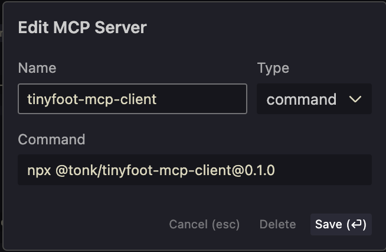

```
   ・。゜☆。・゜。・。゜☆。・゜★・。゜☆。・゜。・。゜☆。・゜☆。・゜

     ____  ____  _  _  Oooo. ____  _____  _____  ____
    (_  _)(_  _)( \( ) ( Y )( ___)(  _  )(  _  )(_  _)
⚡     )(   _)(_  )  (   ) /  )__)  )(_)(  )(_)(   )(     ⚡
     (__) (____)(_)\_) (_/  (__)  (_____)(_____) (__)

   ・。゜☆。・゜。・。゜☆。・゜★・。゜☆。・゜。・。゜☆。・゜☆。・゜
```

**Tinyfoot** is an AI-driven developer framework for building highly personal software.

In tandem with **Tinyfoot**, Tonk is building a **maximally interoperable network** designed to address the fragmentation of information caused by the explosion of grassroots, AI-built applications.

## Project Status: [Alpha]

Tinyfoot is in Alpha. This is a brand spanking new project being built fully in the open, from scratch. Beware, here be dragons! Please [reach out to the team](https://linktr.ee/tonklabs) or you may create a post in the [Q&A Discussion](https://github.com/tonk-labs/tinyfoot/discussions/categories/q-a) if you have any questions or need support.

## Features

- **MCP-based assistive tooling**: Provides helpful context for programming with language models.
- **Local-First Architecture**: Built on Automerge for conflict-free data synchronization.
- **Quick Start**: Create new projects instantly with `create-tinyfoot-app`.
- **Offline Support**: IndexedDB-based storage with automatic sync.
- **Privacy Focused**: Keeps user data local by default.
- **React + TypeScript**: Modern development stack with full type safety.
- **Tailwind CSS**: Utility-first styling out of the box.

---

## Setup

### Install ollama

Tinyfoot expects ollama to be installed with deepseek-r1:8b. This isn't a must have requirement, but the tooling may throw some errors along the way and the MCP server will not be able to provide as much context.

Please go to [https://ollama.com/](https://ollama.com/) to download and install.

Once ollama is installed, open a terminal and enter

```bash
ollama pull deepseek-r1:8b
```

### Install command line utilities.

Run in a terminal

```bash
npm i -g @tonk/tinyfoot-cli @tonk/tinyfoot-mcp-server @tonk/create-tinyfoot-app
```

### Install tinyfoot client into your code editor

#### Cursor

> To add an MCP server to Cursor, go to Cursor Settings > Features > MCP and click on the + Add New MCP Server button. This will open a modal with a form to fill out.



Use the command `npx @tonk/tinyfoot-mcp-client@0.1.2`

## Usage

### 1. Create your tinyfoot app starter

To create a tinyfoot app run the command a terminal:

```bash
npx create-tinyfoot-app my-first-app
```

This will generate tinyfoot application boilerplate for you.

### 2. Start the dev tools and open in your favorite AI-friendly code editor

Tinyfoot is not opinionated about which AI tooling you use.

In the root of the tinyfoot project run `npm run dev`

### 3. Ask the agent to create a new tinyfoot task doing X

For example:

```
Please create a new tinyfoot task for a landing page with a psychedelic welcome animation.
```

This will trigger the MCP client to provide relevant context and the LLM will assist you in creating a task JSON. The task JSON is like a bill of work. It helps you to understand with more clarity what the LLM thinks it should actually be doing. You can ask the LLM to continue to update the task JSON until you think it's correct.

Then just ask the LLM to implement the task.

### 4. Repeat step 3 until you have an app.

### Debugging

React applications often display the error message on the page and you can just copy and paste that in to the chat. You can also use the developer tools to find more information. However, there is a helpful tool that plugs your developer tools directly into your editor. We recommend it for convenience:

[Browser Tools MCP](https://github.com/AgentDeskAI/browser-tools-mcp)

In addition to providing access to the logs, some other great features are that you can click on elements to provide context and submit screenshots of the page as well.

### Building (unstable)

When you are happy with your mini-app and ready to use it, you should serve it up and save it to your device as a PWA. This should allow the app to continue working even when you're offline or away from the network.
[Guide to saving PWAs for iOS](https://help.shore.com/en/how-do-i-save-the-pwa-on-my-smartphone)

Just run the command

```bash
npm run serve
```

You can ask the LLM to change the name of the app (which is default to Tinyfoot) in the `public/manifest.json`

NOTE: still some issues with this step, we're working on stabilizing it.

---

## Contributions

Because the project is so young, we cannot approve external contributions.

We welcome:

- feedback
- small contributions

_A small contribution is something like a bug-fix or a PR with a diff <50 lines._

#### Become a regular contributor

We are open to regular contributors who will collaborate with us on improving the codebase. If that's you then please [reach out to the team](https://linktr.ee/tonklabs).

#### How to submit feedback

There will be an issue template you can use. If you do not use the issue template, we will delete your issue.

---

## License

Simplicity and freedom.

MIT © Tonk
