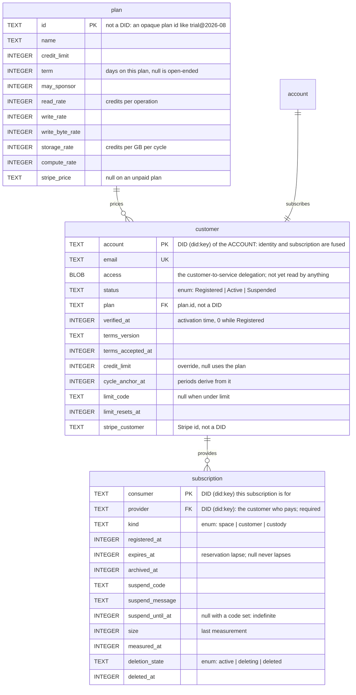
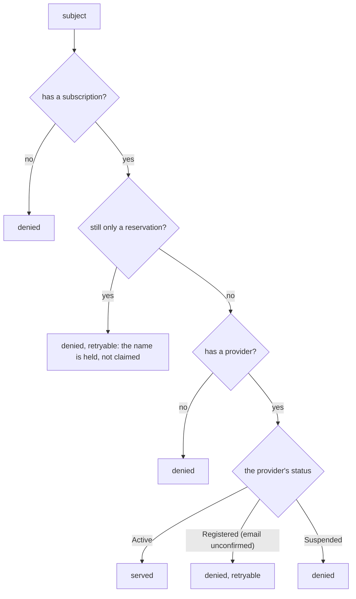
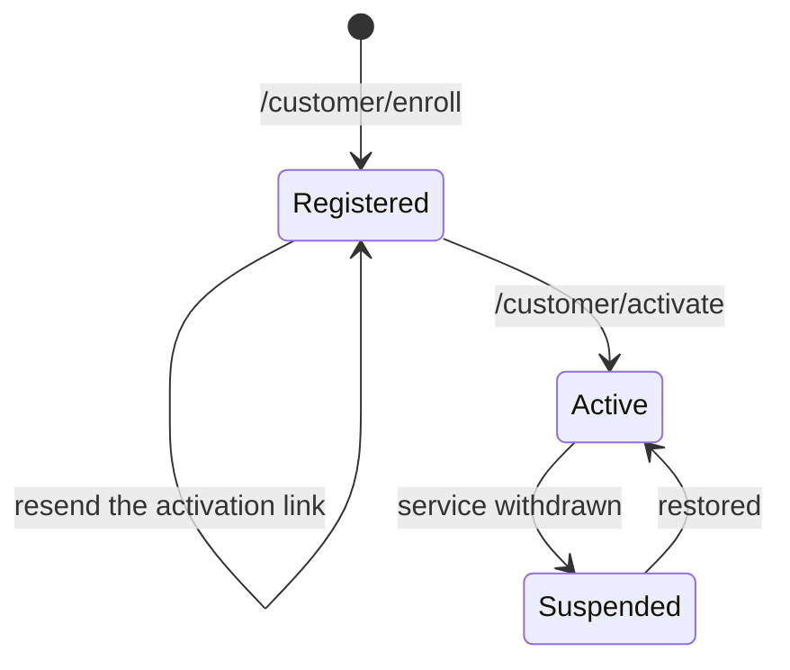

# Access service control schema

The D1 database (`CONTROL` binding) behind `rust/tonk-access-service`.
It answers one question on the hot path — may this subject be served —
and holds the billing state that decides it.

Migrations live in `rust/tonk-access-service/migrations/`. The tables
here are the state after all of them; the SQL in each file is the
history, this is the shape.

## Tables

`account` is drawn above but is **not a table**. `customer.did` is the
account DID, so identity and subscription share a primary key. That
fusion is deliberate for now and has a consequence worth knowing: an
account has exactly one subscription, forever, with no history of a
lapsed one. Splitting them is the change to make when an account needs
a second subscription or a cancelled one has to be kept.

## What decides service

`provisioning::screen` runs before every presign and asks only about the
**subject**, never the command.

Every subject has a subscription, and every subscription is served on
the strength of its provider's status:

An account is not a special case here: enrollment writes it a
self-provided subscription row (`consumer = provider`), so "the
provider's status" is its own. `screen` does look the subject up as a
customer first, but only to save a hop — the subscription path reaches
the same verdict one join later.

This is **one query** (`SELECT_SERVABILITY`): a `LEFT JOIN` from the
asked-for DID to `customer`, to `subscription`, and on to the
provider's `customer`. Read in three separate steps it could see a customer that
activates between the first and the last, and it would cost three round
trips on a path that runs before every presign.

It still reaches D1 directly, every time. `plan/Access metering.md` §11
specifies a read through an isolate cache, then KV, and D1 only on a
miss — but the consumer-state KV namespace does not exist yet, and
`REVOCATIONS_KV` is the only one bound. The value KV is meant to serve
is derived from sponsorships, usage, and plan rates (§11.1), so that
tier belongs with the increment that brings those tables. The join does
not have to wait for it.

Because the gate is subject-level, it cannot serve a read while refusing
a write. Anything needing that distinction has to come from the
delegation chain, not from a status column.

## Registration lifecycle

`Registered` means enrolled with the activation link unopened. Nothing
is served in that state — not the customer's own account space, not any
consumer it provides. Consumers may be *added* while `Registered`
(`plan/Access metering.md` §3.3); only serving waits.

## Roles

Three relationships that a single word would blur:

| Role | Column | Meaning | Cardinality |
|---|---|---|---|
| Provider | `subscription.provider` | who pays for it | exactly one, required |
| Sponsor | *(not yet built)* | pledges credits to a subscription it does not provide | zero or more |

There is no separate owner. Nothing transfers a space to a different
payer, so the customer paying for one is the account whose data it is,
and a second column would hold the same value on every write. Deletion
authority and inventory both read `provider`.

`provider` is required. A subscription names who pays for it, so a row
with nobody paying is not one — deleting a customer takes its
subscriptions with it rather than blanking them. Nothing therefore marks
a purged space DID as spent, and provisioning it again succeeds: only
the holder of that space's key can present the DID at all.

## Not yet built

`plan/Access metering.md` specifies `sponsorship`, `usage`, `ledger`,
and `run`. They arrive with the increments that read them.

A `space` table (`subject` PK, `account`) arrives the day owner and
provider are allowed to differ — when someone may pay for a space they
do not own, or a space may have several providers. Ownership then has
nowhere to live on a subscription row: several subscriptions per space
would each carry a copy with nothing keeping them in step. Its key is
`subject` alone rather than `(subject, account)`, since one space has
one owner and a composite key would quietly permit co-ownership.

Note that `ledger` names two different things: the planned D1 table
(authoritative accounting) and `customer.ledger` (the space this service
replicates that accounting into, which the account may read but not
write). D1 stays authoritative.

`customer.ledger` is nullable, and the receipt's field is
`Option<Ledger>` to match. A deployment that replicates nothing has no
ledger space to name, and a receipt synthesized locally — the worker's
answer for an already-active customer — names neither a provider nor a
ledger, because it learned about neither. Absent means "not stated
here", never "none exists".

## Kinds of subscription

- `space` — an ordinary tonk space. The default.
- `customer` — the account's own space, written at enrollment.
- `custody` — a passkey's custody principal. One per passkey, so an
  account has as many as it has authenticators. Reservations here
  **must** expire: the DID is PRF-derived and therefore stable, so a
  lapsed reservation is re-derived by the same passkey on a new device,
  which is the recovery case. Only the passkey holder can produce that
  DID, so nothing can squat it.
