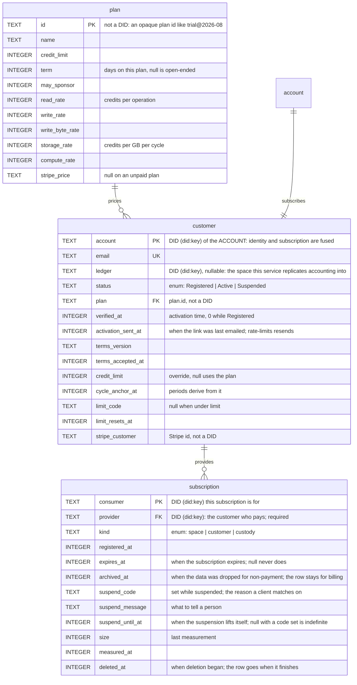
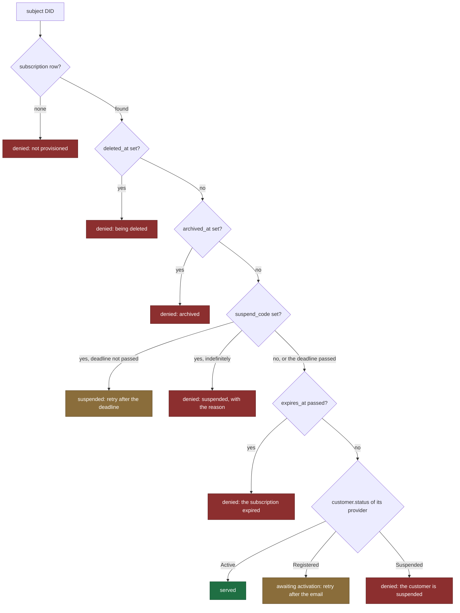
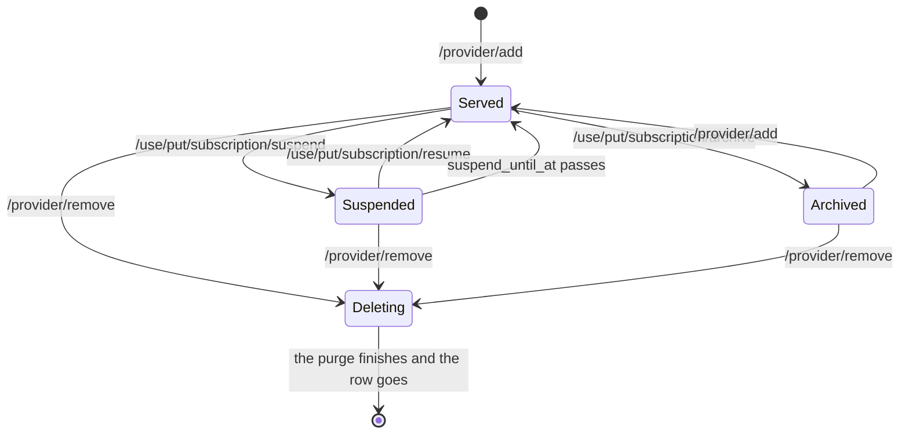
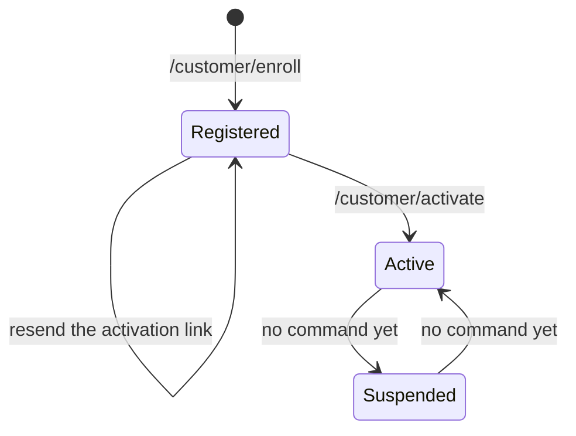

# Access service control schema

The D1 database (`CONTROL` binding) behind `rust/tonk-access-service`.
It answers one question on the hot path — may this subject be served —
and holds the billing state that decides it.

Migrations live in `rust/tonk-access-service/migrations/`. The tables
here are the state after all of them; the SQL in each file is the
history, this is the shape.

## Tables

`account` is drawn above but is **not a table**. `customer.did` is the
account DID, so identity and subscription share a primary key. That
fusion is deliberate for now and has a consequence worth knowing: an
account has exactly one subscription, forever, with no history of a
lapsed one. Splitting them is the change to make when an account needs
a second subscription or a cancelled one has to be kept.

## What decides service

`provisioning::screen` runs before every presign and asks only about the
**subject**, never the command.

Every subject has a subscription, and every subscription is served on
the strength of its provider's status. Green is served, amber is a
refusal the client should retry (`Recourse::Retry`), red is one it
should not (`Recourse::None`):

An account is not a special case here: enrollment writes it a
self-provided subscription row (`consumer = provider`), so "the
provider's status" is its own. `screen` does look the subject up as a
customer first, but only to save a hop — the subscription path reaches
the same verdict one join later.

This is **one query** (`SELECT_SERVABILITY`): a `LEFT JOIN` from the
asked-for DID to `customer`, to `subscription`, and on to the
provider's `customer`. Read in three separate steps it could see a customer that
activates between the first and the last, and it would cost three round
trips on a path that runs before every presign.

On the worker the query runs behind the cache tier `plan/Access
metering.md` §11 specifies: an isolate cache, then `SERVABILITY_KV`,
and D1 only on a miss, with the derived verdict written back under an
absolute `not_after` (generous for a permit, short for a denial). The
registration commands write the fresh verdict through after their D1
commit, and deprovisioning deletes the key. The funding axes (§11.1 —
sponsorships, usage, plan rates) still await the increment that brings
those tables; the cached value is today's verdict, no more.

Because the gate is subject-level, it cannot serve a read while refusing
a write. Anything needing that distinction has to come from the
delegation chain, not from a status column.

## Changing a subscription

Nothing edits these rows directly. Every column the gate reads is
written by a command, and each command is a UCAN invocation arriving at
the same `/ucan/` endpoint as everything else.

The three operator commands take the service's own DID as subject: they
are its decisions about a customer, not anything the customer
authorizes, so only a key the service delegated to can invoke one. A
customer invoking `suspend` on a space they own is refused.

| Command | Writes | Data | Row | Comes back |
|---|---|---|---|---|
| `/use/put/subscription/suspend` | `suspend_code`, `suspend_message`, `suspend_until_at` | kept | kept | on resume, or when the deadline passes |
| `/use/put/subscription/resume` | clears all three | kept | kept | — |
| `/use/put/subscription/archive` | `archived_at` | dropped | kept, for billing | on re-provisioning |
| `/provider/add` | the row itself | — | created | — |
| `/provider/remove` | `deleted_at`, then removes the row | dropped | removed | no |
| `/customer/delete` | the same, for every space at once | dropped | removed | no |

Deletion is the customer's own request rather than an operator's, which
is why it lives under `/provider` and `/customer` rather than in the
`/use/put/subscription` namespace. `/customer/deletion/plan` reads the
scope without changing anything: it is what the confirmation screen
shows before you agree. `expires_at` has no command yet: renewal is the
increment that will write it.

Served here means the subscription itself raises no objection. Whether a
request is actually answered still depends on the provider's
`customer.status`, which the gate reads last.

## Registration lifecycle

Suspending a whole customer withdraws service from everything they
provide, where `/use/put/subscription/suspend` withdraws it from one
space. Nothing writes it: there is no handler, so the state is reachable
only by editing the column. Its command belongs beside the subscription
ones when it arrives.

`Registered` means enrolled with the activation link unopened. Nothing
is served in that state — not the customer's own account space, not any
consumer it provides. Consumers may be *added* while `Registered`
(`plan/Access metering.md` §3.3); only serving waits.

## Roles

Three relationships that a single word would blur:

| Role | Column | Meaning | Cardinality |
|---|---|---|---|
| Provider | `subscription.provider` | who pays for it | exactly one, required |
| Sponsor | *(not yet built)* | pledges credits to a subscription it does not provide | zero or more |

There is no separate owner. Nothing transfers a space to a different
payer, so the customer paying for one is the account whose data it is,
and a second column would hold the same value on every write. Deletion
authority and inventory both read `provider`.

`provider` is required. A subscription names who pays for it, so a row
with nobody paying is not one — deleting a customer takes its
subscriptions with it rather than blanking them. Nothing therefore marks
a purged space DID as spent, and provisioning it again succeeds: only
the holder of that space's key can present the DID at all.

## Not yet built

`plan/Access metering.md` specifies `sponsorship`, `usage`, `ledger`,
and `run`. They arrive with the increments that read them.

A `space` table (`subject` PK, `account`) arrives the day owner and
provider are allowed to differ — when someone may pay for a space they
do not own, or a space may have several providers. Ownership then has
nowhere to live on a subscription row: several subscriptions per space
would each carry a copy with nothing keeping them in step. Its key is
`subject` alone rather than `(subject, account)`, since one space has
one owner and a composite key would quietly permit co-ownership.

Note that `ledger` names two different things: the planned D1 table
(authoritative accounting) and `customer.ledger` (the space this service
replicates that accounting into, which the account may read but not
write). D1 stays authoritative.

`customer.ledger` is nullable, and the receipt's field is
`Option<Ledger>` to match. A deployment that replicates nothing has no
ledger space to name, and a receipt synthesized locally — the worker's
answer for an already-active customer — names neither a provider nor a
ledger, because it learned about neither. Absent means "not stated
here", never "none exists".

## Kinds of subscription

- `space` — an ordinary tonk space. The default.
- `customer` — the account's own space, written at enrollment.
- `custody` — a passkey's custody principal. One per passkey, so an
  account has as many as it has authenticators. Reservations here
  **must** expire: the DID is PRF-derived and therefore stable, so a
  lapsed reservation is re-derived by the same passkey on a new device,
  which is the recovery case. Only the passkey holder can produce that
  DID, so nothing can squat it.
