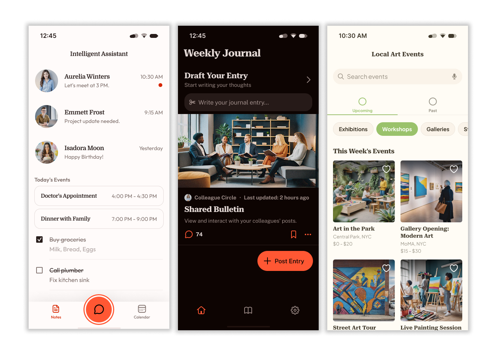
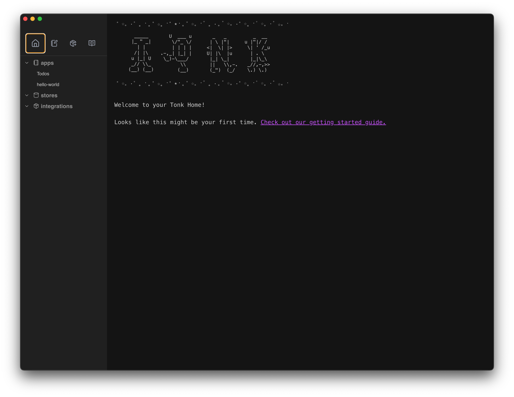

# Build your own little internet with Tonk

Tonk is a toolchain for independent developers to build and share software that integrates with both their individual and communal data.

In 2025, progress in AI makes it faster to build application logic & UIs, but it's still hard to do helpful things *with your data* - especially without sacrificing control, independence and flexibility to a third party platform like Google, Vercel or AWS.

The **Tonk toolchain** uses frontier cryptography & distributed systems to help you: 

- Integrate with your data
- Manage state
- Share applications
- Permission users

In a way that (i) is friendly to copilot-led development and (ii) preserves the independence and privacy of your software. 

  

**under construction*

## Example usecases

Suppose you want to:

- Aggregate your notes, calendar and chats across the Apple, Google & Meta ecosystems to build an intelligent personal assistant;
- Passively draft weekly journal entries and post them to a cosy, invite-only bulletin board for you and your colleagues;
- Build a service that searches the web for local art events and aggregates them into a weekly digest for your friends;

That is to say, suppose you want to build helpful software for you and the people around you, that plugs into your data, your friends' data and public data. AI makes part of this very easy, but you still have to build custom solutions to:

- Integrate with data
- Manage state
- Share applications
- Permission users

Tonk abstracts those parts of the stack away.

## How it works

The entry route into Tonk is the **Tonk Hub**. The Tonk Hub is an Electron app that helps you manage your:

1. **Stores.** These are the services that store your data in an application-friendly way.
2. **Apps.** These have access to your data stores.

## Get started

You can use Tonk to build apps, integrations or both. Get started with the [quickstart guide](./quickstart.md).

## Project status

The team behind Tonk is a small, early-stage startup based in London. We are dedicated to building a new and better internet that transfers power away from internet platforms and towards the people and enterprises that use them. Our bet is that the Tonk toolchain & the interoperable ecosystem of Tonk apps will bootstrap that new internet.

The Tonk toolchain is in alpha. This is a brand new project built fully in the open, from scratch. Please ask questions in our community or visit our website for more information.

As an early stage project we are very open to feedback and keen to help builders - so please reach out to the team and we will endeavour to support your usecase.

## Links

- [Github](https://github.com/tonk-labs/tonk)
- [Tonk website](https://tonk.xyz)
- [Telegram community](https://t.me/+9W-4wDR9RcM2NWZk)