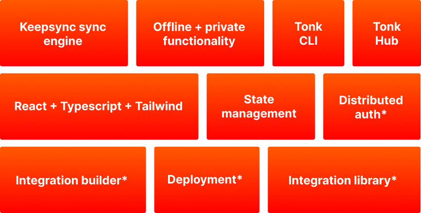
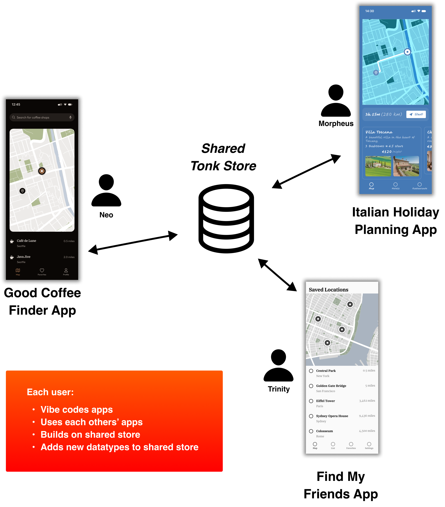
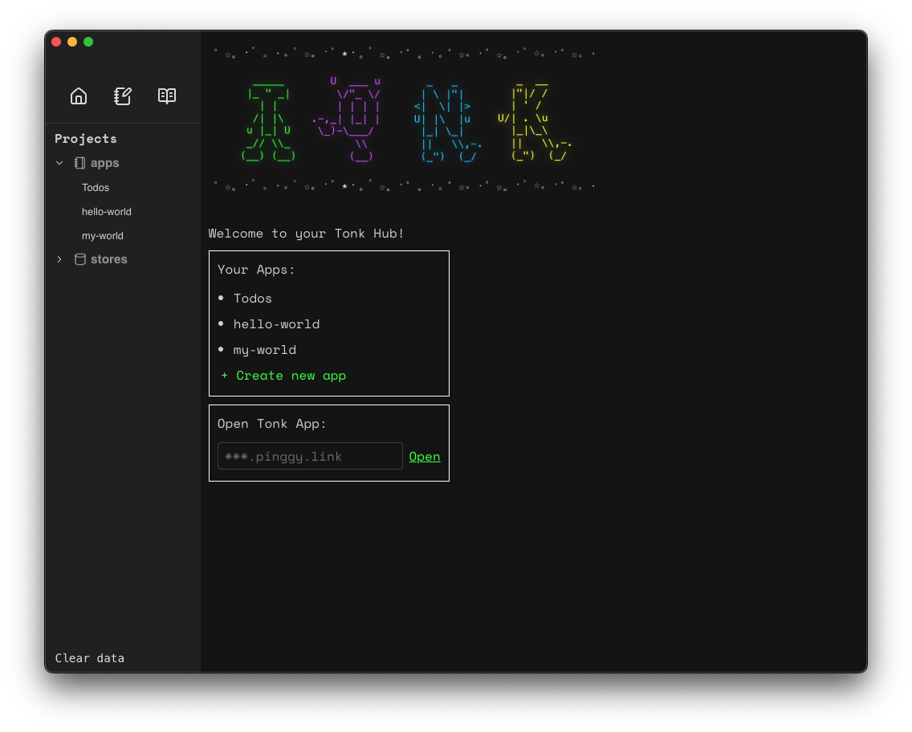

# Build your own little internet with Tonk

Tonk is a copilot-friendly toolchain that gives independent developers freedom to build powerful shared software.

AI makes it easy for anyone to build bespoke tools for small groups - households, communities, teams and friends. But making these tools multiplayer is still hard. Server-database setups are clunky, expensive and devolve into platforms that lock you in and degrade over time.

Tonk is a toolchain for shared, just-in-time applications - copilot-friendly, local-first and multiplayer. You can use the Tonk tooolchain to:

- Build applications within a copilot-friendly framework
- Manage complex state interoperable across people and apps
- Publish and share your apps
- Pull in outside data\*

 

  

<em>*under construction</em>

Because we replace a traditional server-database architecture with a local-first approach, Tonk apps are:

- Quick to build
- Easy and cheap to manage
- Private by default
- Work offline
- Guaranteed to stay independent from platforms

## Example usecases

Learning Tonk requires a mindset shift because as developers we're used to thinking in terms of singular applications that are tightly coupled to databases.

Tonk doesn't just help you build apps or store data. Tonk can be best described as helping you build **your own little internet: a way to store shared highly mutable state across many apps and many users, and build ephemeral services, apps and tools on top of that shared state.**

  

Each app can read and write to the shared state with barely any development overhead - no need to worry about migrations, caching, auth or permissions.

Here are some examples of what Tonk can help with:

### 🗺️ Maps

An evolving dataset for your friends to add locations, routes, reviews, planned trips - and surface whatever you like in custom maps apps.

_Hackathon idea:_ A social mapping app where friends can collaboratively pin spots, share routes, and plan trips—with the option to remix the shared dataset into custom experiences like foodie maps, hiking guides, or road trip planners.

### 🎯 Productivity

A fluctuating set of todos for your colleagues to track progress on ephemeral projects without forcing everyone to use the same productivity app.

_Hackathon idea:_ A multiplayer to-do list for temporary teams - where shared project tasks live in a public space and AI nudges contributors to focus on what matters before the project dissolves.

### 💰 Banking

Aggregated financial information for your household to track your finances and make intelligent investments.

_Hackathon idea:_ A household finance dashboard that syncs every member’s bank accounts, applies AI to optimize spending, and auto-generates investment proposals based on shared goals.

### ❤️ Health

A dataset for your family to make health data available to bespoke meditation, exercise or sleep apps.

_Hackathon idea:_ A health data layer for families — syncing sleep, steps, and stress scores across devices and enabling personalized wellness bots that work across meditation, exercise, and diet apps.

### 💬 Social

An ad-free, private chatboard for your friends, but where everyone customises their experience with pluggable components such as games, calendars and notifications.

_Hackathon idea:_ A modular group chat app where every conversation is a programmable space - friends can add shared games, calendars, polls, or moodboards, and the feed adapts to how your group vibes, not how the algorithm dictates.

### 🤖 Assistants

An AI that can assist you with full context from your chat apps, calendars, todo boards and social feeds.

_Hackathon idea:_ A privacy-first AI assistant that reads your calendar, chat threads, and todos from your shared spaces — then recommends actions, summarizes life, and shares updates with your friends.

## How it works

Building with Tonk feels like magic because it's copilot-friendly, local-first and multiplayer.

Apps generated with the **Tonk CLI** come pre-bundled with React, Typescript, Tailwind and aggressively prompt your copilot to ensure smooth vibe-coding.

The **Tonk Store** manages state with an optimised sync engine. The **Tonk Hub** is a desktop app for managing the whole stack:

## Get started

The best place to get started is our [quickstart guide](./quickstart.md).

## Project status

The team behind Tonk is a small, early-stage startup based in London. We are dedicated to building a new and better internet that transfers power away from internet platforms and towards the people and enterprises that use them. Our bet is that the Tonk toolchain & the interoperable ecosystem of Tonk apps will bootstrap that new internet.

The _Tonk toolchain_ is in alpha. This is a brand new project built fully in the open, from scratch. Please ask questions in our community or visit our website for more information.

As an early stage project we are very open to feedback and keen to help builders - so please reach out to the team and we will endeavour to support your usecase.

## Links

- [Github](https://github.com/tonk-labs/tonk)
- [Tonk website](https://tonk.xyz)
- [Telegram community](https://t.me/+9W-4wDR9RcM2NWZk)
