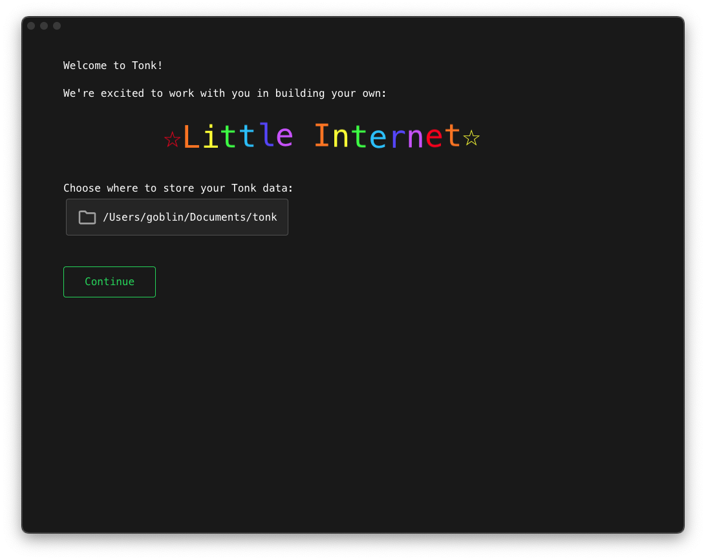
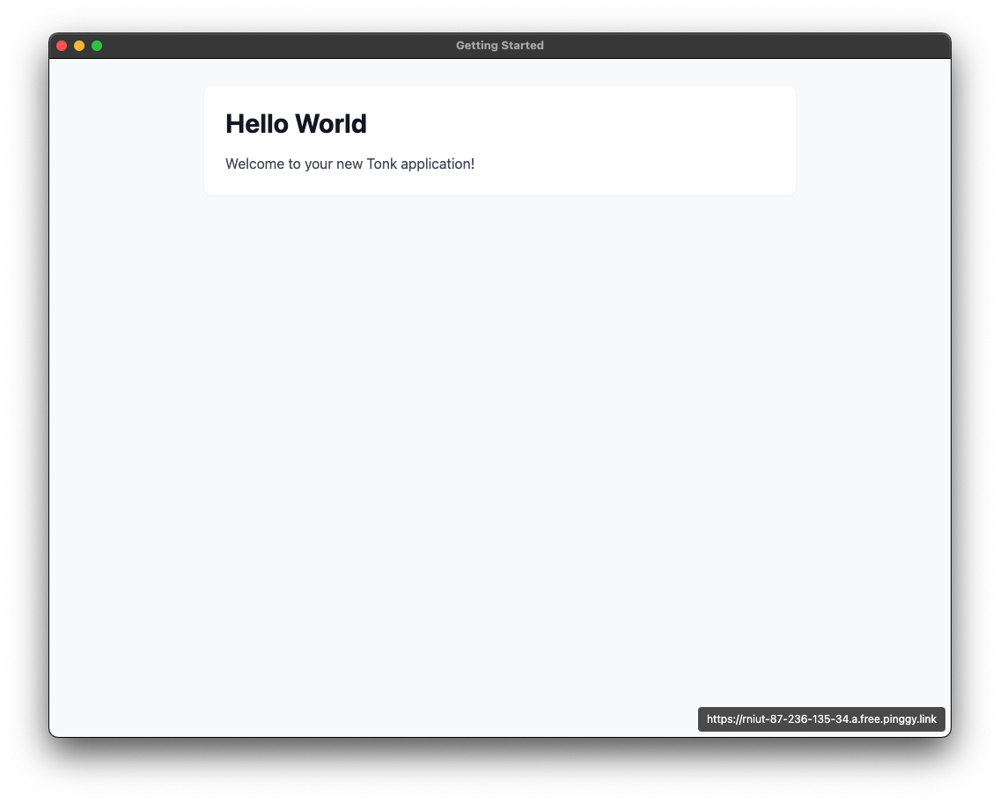

# Quickstart guide

> If you haven't yet, start with the [**introduction**](./introduction.md) before reading this quickstart guide.

Tonk apps plug into Tonk stores, which store data in a local-first way. This makes Tonk apps especially collaborative and interoperable. It also means that they are private, performant, have offline support and reduce dependency on third parties. Tonk apps sidestep traditional database headaches such as caching, migrations and auth.

## I want to build a Tonk app

First, you'll need to install Tonk on your machine:

```
$ wget https://raw.githubusercontent.com/tonk-labs/tonk/refs/heads/main/scripts/install.sh && chmod +x ./install.sh && ./install.sh
```

If everything was successful you should see the message:

```
===============================
🎉 Congratulations! Tonk has been successfully installed! 🎉
You can get started by running: tonk hello
===============================
```

When you run `tonk hello` the Tonk Hub will open a welcome screen.

The Tonk Hub is an Electron app that helps you manage your Tonk apps and stores.

### Choose your Tonk home



> Note: Choose a location where you like to store your projects. You should make sure that your preferred code editor has read/write access to this location.

### Home Sidebar


There are two sections in the sidebar

#### Apps

The apps section is where you develop and run your applications. For now, all Tonk applications are React web apps. We've placed lots of instructions around the Tonk app templates for LLMs which should make it much easier to vibe code.

#### Stores

Stores are what make Tonk apps special. They are containers of shareable data that easily plug into any of your apps. Stores are synchronized using the Automerge CRDT library. They are just automerge files which are read in by the Hub and served to your applications during runtime. Anyone who uses your application in the Hub will participate in "replicating" the store. It's like one big collaborative, evolving database.

### Launch the hello world

Select the hello-world applications



### Voila!

Just like that you are running your first app with Tonk.

To understand how apps work in Tonk and why they are special, [follow the tutorial](https://tonk-labs.github.io/tonk/tutorials/my-world.html)
