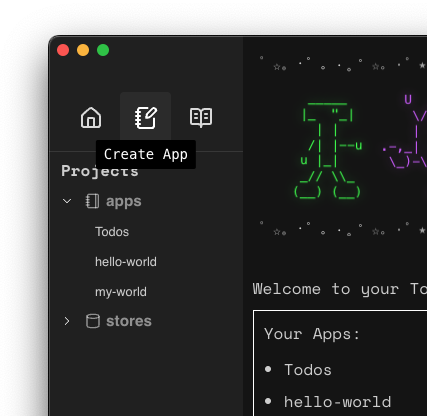
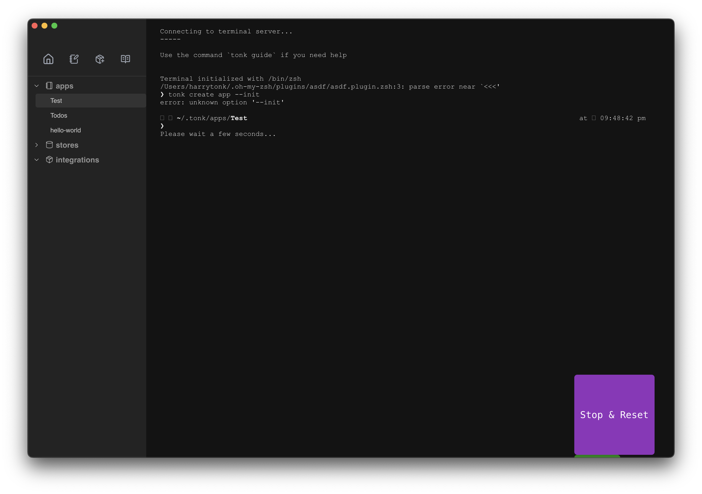

# Quickstart guide

> If you haven't yet, start with the [**introduction**](./introduction.md) before reading this quickstart guide.

Tonk apps plug into Tonk stores, which store data in a local-first way. This makes Tonk apps especially collaborative and interoperable. It also means that they are private, performant, have offline support and reduce dependency on third parties. Tonk apps sidestep traditional database headaches such as caching, migrations and auth.

## I want to build a Tonk app

First, install the Tonk CLI in your terminal:

```
$ npm i -g @tonk/cli
```

Then start the Tonk Hub:

```
$ tonk hello
```

The Tonk Hub is an Electron app that helps you manage your Tonk apps and stores.

You should now see your Tonk Hub:


Here you can see your:

- Apps (there's an example app "myWorld" ready and waiting)
- Stores (this should be empty)

The best way to get started is to launch an existing app, so let's open myWorld.

### Launch an existing app

Select myWorld and click "launch app".

You should now see the myWorld app:

> image

The myWorld app is a collaborative maps app. You can add markers to the map, and share the map with your friends to compare saved locations, such as potential lunch spots near your office, or tourist attractions in a new city.

### Modify the store

When you started myWorld for the first time, a new Store was created for you. You can see it in the Tonk Hub:

> image

A Store is like a JSON file. Under the hood, it represents an Automerge document, which is a special file used by sync engines to store data in a local-first way.

Currently, you cannot directly modify a Store from the Hub. Instead you can modify the data via the app.

Try adding a marker to the map from the app UI - you should see it appear in the Store.

### Modify the app

You can modify the app by editing the files in the app directory. Try editing the app's code - you should see the changes reflected in the app UI.

The Tonk toolchain is designed for people incorporating AI heavily into their workflow. As such, Tonk apps come ready with an _llms.txt_ file which provides context to copilots such as Claude, Cursor or Windsurf.

Try launching the app in a copilot and making changes to the interface or application logic - you should see the changes reflected in the app UI.

We've included a terminal in the Hub for your convenience.

> image of terminal

**Note on copilots:** We find Tonk works best with Claude Code as it's more aggressive when pulling in context. You may install and setup Claude Code [here](https://docs.anthropic.com/en/docs/agents-and-tools/claude-code/overview).

We've found that Cursor & Windsurf require more human intervention than Claude Code. Take special care to ensure the editor is correctly pulling in the corresponding llms.txt files when using these tools.

### Create your own app

Once you're familiar with the flow of a Tonk app, you should create your own. Run the following in the Tonk Hub or your own terminal:

```
$ tonk create app
```

This will start a simple CLI flow where you'll be asked a few basic questions about your app. Your answers are used to give your copilot context for streamlined development.

Alternatively, use the "create app" button in the Tonk Hub.



Once complete, you will have a new Tonk app template. The filepath will be displayed in the Hub terminal:



Now's the time to use your preferred copilot to build the app. The app already includes some basic functionality, but most importantly includes an _llms.txt_ file to provide your copilot with context. The most important context is instructions for how the copilot should manage state: by using Tonk stores to plug into your existing data in a local-first way.

> ⚠️ Just because your copilot has context on _llms.txt_ doesn't mean it will always use the context - it may need some guidance.

Try using your copilot to build a simple todo app that works with your data in a Tonk store.

By unbundling your applications from your data, we hope this demonstrates the ease with which Tonk apps can re-use your existing information.

### Publish your app

_Coming soon_

### Share your app

_Coming soon_

## Next steps

Try building your own application and share it in the Tonk community chat. If it's promising we'd love to support your project any way we can.
