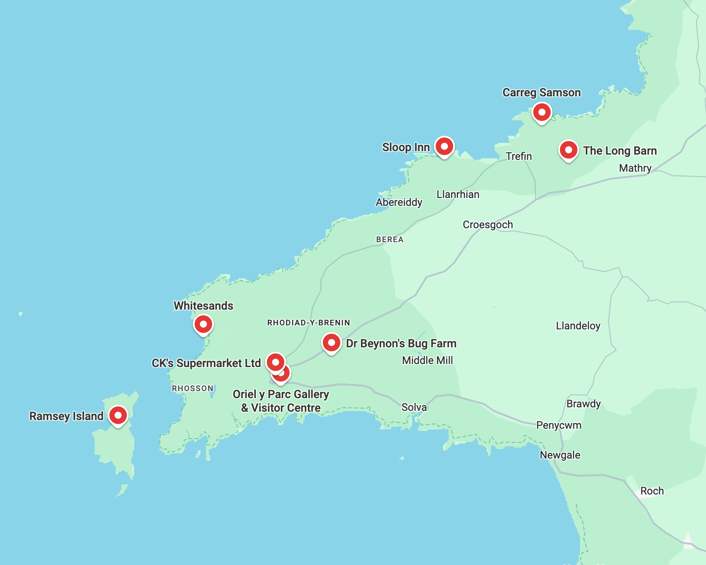

# Quickstart guide

> If you haven't yet, start with the [**introduction**](./introduction.md) before reading this quickstart guide.

There are two ways to use the Tonk toolchain:

1. To build Tonk apps
2. To build Tonk integrations

Tonk apps plug into Tonk stores, which store data in a local-first way. This makes Tonk apps especially collaborative and interoperable. It also means that they are private, performant, have offline support and reduce dependency on third parties. Tonk apps sidestep traditional database headaches such as caching, migrations and auth.


Tonk integrations are the channels connecting external data to Tonk stores; they can be configured to periodically fetch data from the outside world such as Google Takeout, the Yahoo Finance API, the Ethereum blockchain and more.
## I want to build a Tonk app

First, install the Tonk CLI in your terminal:

```
$ npm i -g @tonk/cli
```
Then start the Tonk Hub:

```
$ tonk hello
```
The Tonk Hub is an Electron app that helps you manage your Tonk apps, integrations, and stores. Starting the Hub will simultaneously start your integration services if you have any.

You should now see your Tonk Hub:


Here you can see your:
- Apps (there's an example app "myWorld" ready and waiting)
- Stores (this should be empty)
- Integrations (this should be empty)

The best way to get started is to launch an existing app, so let's open myWorld.

### Launch an existing app

Select myWorld and click "launch app".

You should now see the myWorld app:

> image

The myWorld app is a collaborative maps app. You can add markers to the map, and share the map with your friends to compare saved locations, such as potential lunch spots near your office, or tourist attractions in a new city.

### Modify the store

When you started myWorld for the first time, a new Store was created for you. You can see it in the Tonk Hub:

> image

A Store is like a JSON file. Under the hood, it represents an Automerge document, which is a special file used by sync engines to store data in a local-first way.

Currently, you cannot directly modify a Store from the Hub. Instead you can modify the data via the app or via integrations (more on which below).

Try adding a marker to the map from the app UI - you should see it appear in the Store.

### Modify the app

You can modify the app by editing the files in the app directory. Try editing the app's code - you should see the changes reflected in the app UI.

The Tonk toolchain is designed for people incorporating AI heavily into their workflow. As such, Tonk apps come ready with an *llms.txt* file which provides context to copilots such as Claude, Cursor or Windsurf.

Try launching the app in a copilot and making changes to the interface or application logic - you should see the changes reflected in the app UI.

We've included a terminal in the Hub for your convenience. 

> image of terminal

**Note on copilots:** We find Tonk works best with Claude Code as it's more aggressive when pulling in context. You may install and setup Claude Code [here](https://docs.anthropic.com/en/docs/agents-and-tools/claude-code/overview).

We've found that Cursor & Windsurf require more human intervention than Claude Code. Take special care to ensure the editor is correctly pulling in the corresponding llms.txt files when using these tools.

### Configure your Google integration

So far in this quickstart guide, we've launched the Tonk Hub, modified one of your stores and edited an existing app. It's now time to add integrations so that you can start to build services on top of your own data.

There are two ways to integrate data into your Tonk Hub: 

1. Configure an existing integration
2. Build your own

Right now, the Tonk integrations library has an existing Google integration (we are building more). Let's start by configuring the integration that already exists.

> Google maps already has a feature for saving locations. If you haven't already, we recommend saving a few locations in Google Maps so you can see how Tonk integrates with them.



*⬆️ Some saved locations from a trip to Wales*

google oAuth flow
get clientID from google
paste in terminal
confirm
start sync

You should now see your locations in the Store. From now on, whenever you run `$ tonk hello` to start the Hub, this integration will periodically run to fetch your data from Google.

> **Coming soon:** we are working on a relay service that periodically runs integrations for you.

Once your integration is up and running, you'll need to connect your Tonk app to the new Store. We recommend using a copilot to one-shot this integration:

```
Please connect to the Tonk google store data prompt prompt prompt
```


You should now 

### Create your own app

Once you're familiar with the flow of a Tonk app, you should create your own.

Run the following in the Tonk Hub or your own terminal:

```
$ tonk create app
```

Alterantively, use the "create app" button in the Tonk Hub.

> image

This will start a simple CLI flow where you'll be asked a few basic questions about your app. Your answers are used to give your copilot context for streamlined development.

Once complete, you will have a new Tonk app template.

> image

This will have an llms.txt file to provide your copilot of choice with context. The most important context is to use Tonk stores to plug into your existing data and manage state in a local-first way.

> ⚠️ Just because your copilot has context on llms.txt doesn't mean it will always use it. You may need to guide it.

Try building a todo app that integrates with your saved locations from the above myWorld app. You could create a todo app that lists locations you haven't visited yet for you to tick off.

Hopefully this demonstrates the ease with which Tonk apps can use and re-use your existing data in a streamlined way. 

### Publish your app

*Coming soon*

### Share your app

*Coming soon*

### Integrate into others' data

*Coming soon*

## I want to build a Tonk integration


