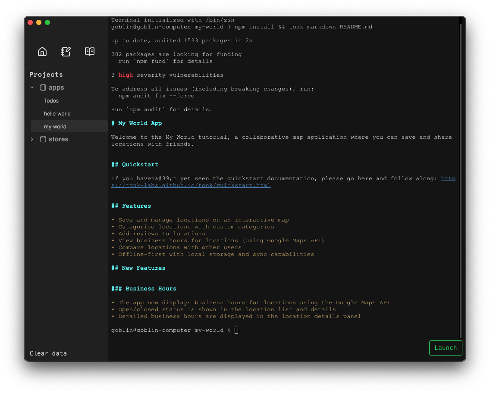
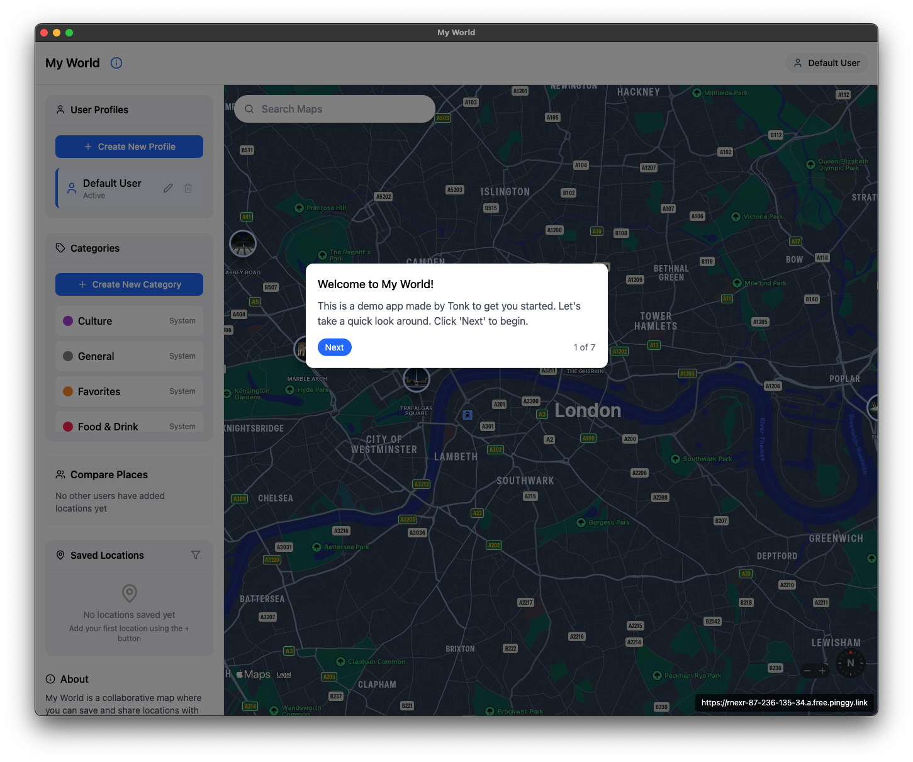

# My World Tutorial

Welcome to the My World tutorial! My world is a collaborative map application where you can save and share locations with friends.

### Launch my-world in Dev Mode

Select the my-world application, you should see the terminal and readme.



Run the command:

```
tonk dev
```

This will launch the app in dev mode.

### My World Introduction

Follow the pop-ups to learn about the features. You can refer back to this document for extra tips as you follow along.



### More about Stores

A Store is like a JSON file that magically knows how to merge into other JSON files like it. Under the hood, it represents an Automerge document, which is a special file used by sync engines to store CRDT objects in a local-first way. Local-first just means it's always available locally first.

Currently, you cannot directly modify a Store from the Hub. Instead you can only modify the data via the app.

> ⚠️ Warning: there is a known issue where sync states get stuck whe the application loads. If you notice something isn't syncing, try again by refreshing the page.

### Modify the app

You can modify the app by editing the files in the app directory. A simple way to edit the application is to launch your editor from the Tonk terminal for that application.

If you are using Cursor or Vscode, just click on the app and run the command in the terminal

```
code .
```

If you are using Claude Code, then run command

```
claude
```

if you are using Windsurf on Mac, then run the command

```
/Applications/Windsurf.app/Contents/MacOS/Electron .
```

and so on.

### Vibe Coding

You can simply ask your co-pilot to make the necessary changes you'd like to see.

> ❗ pro-tip: Vibe Coding is best done in small incremental steps. Tell the LLM the simplest, most concise possible feature you'd like to add and work with it until you think everything is functional. Once it's working, make a commit into git. Then keep going on to the next feature.

As you make changes to the app's code - you should see the changes reflected in the app UI.

The Tonk toolchain is designed for people incorporating AI heavily into their workflow. As such, Tonk apps have prompts throughout the project structure as (_llms.txt_, CLAUDE.md, .cursorrules, .windsurfrules). These are files which provide context to copilots such as Claude, Cursor or Windsurf.

Try launching the app in a copilot and making changes to the interface or application logic - you should see the changes reflected in the app UI.

**Note on copilots:** We find Tonk works best with Claude Code as it's more aggressive when pulling in context. You may install and setup Claude Code [here](https://docs.anthropic.com/en/docs/agents-and-tools/claude-code/overview).

We've found that Cursor & Windsurf require more human intervention than Claude Code. Take special care to ensure the editor is correctly pulling in the corresponding llms.txt files when using these tools.

### Magic Words

`I want the data to synchronize with keepsync` — tell the LLM to add a store that will synchronize

`I don't want X data to synchronize, don't use keepsync` — the LLM will just store data local to the device

`Add a keepsync store that will use data with id "my-document-id"` — this will help your app connect to an existing store. You should paste in some example data of what's already inside the store so the LLM knows the structure.

### Create your own app

Once you're familiar with the flow of a Tonk app, you should create your own. Run the following in the Tonk Hub or your own terminal:

This will start a simple CLI flow where you'll be asked a few basic questions about your app. Your answers are used to give your copilot context for streamlined development.

Alternatively, use the "create" button in the Tonk Hub.


> ⚠️ Just because your copilot has context on _llms.txt_ doesn't mean it will always use the context - it may need some guidance.

### Publish your app

_Coming soon_

### Share your app

_Coming soon_

## Next steps

Try building your own application and share it in the Tonk community chat. If it's promising we'd love to support your project any way we can.
