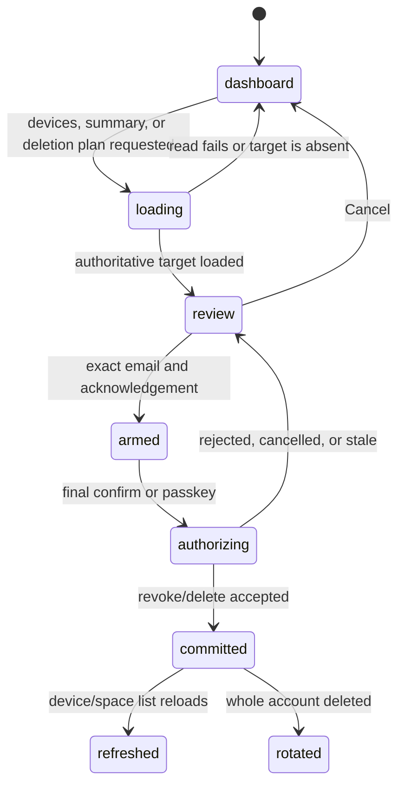

# Account authority and deletion

## Summary

Settings lets a person inspect account devices and passkeys, add a passkey,
revoke a device, delete one owned hosted space, or delete the whole account.
These are authority-changing or destructive actions, so the review target,
authorization, durable result, unrelated-data boundary, and retry behavior must
all be explicit.

A CLI can list or request device revocation and can open browser deletion
review, but passkey ceremonies and full destructive confirmation live in the
browser. Revocation stops future authority; logout merely disconnects local
provider services. Hosted-space deletion, local `space rm`, and whole-account
deletion are separate scopes.

## The simple case

The person opens settings and sees account facts and a device list. To revoke a
device, they choose its row, review whether it is the current device, confirm,
and approve the required passkey ceremony. The device disappears from shared
account facts and later provider access from that device is rejected.

To delete one owned hosted space, the person arrives through an exact
`delete-space=SUBJECT` review, sees the selected owned space and the count of
joined spaces that will remain, types the verified email, checks the
consequences box, and confirms. The account and all other spaces remain.

To delete the account, the review lists every owned hosted space and states that
joined spaces remain. The person types the exact verified email, checks the
consequences box, confirms again, and approves the account passkey. The provider
deletes the account-owned scope, releases the email, and the browser moves away
from the deleted profile.

## The interaction, event by event

### Resolve

Device rows come from account-repository facts and current-device identity is
resolved separately. A `?revoke=DID` deep link chooses a row but grants no
authority; settings still loads the list and requires confirmation. If the DID
is no longer connected, the page says so and consumes the query to avoid
reopening a stale confirmation on reload.

Deletion begins by loading a server/worker plan. Whole-account review includes
all owned hosted spaces and a joined-space count. Exact-space review must match
one owned subject. A stale, joined, missing, or already-deleted subject cannot
expand or redirect the requested scope.

The confirmation is armed only when the trimmed email exactly equals the
verified account email and the consequences checkbox is checked. Account
deletion also requires a root-matching passkey assertion. Selected-space
deletion is authorized by the account/worker for that exact owned subject and
does not ask for an extra passkey in the current implementation.

### Exit early

Loading failure, missing target, wrong email, unchecked acknowledgement, or
Cancel commits nothing. Closing the confirmation returns to settings. A revoke
deep link on an unlinked browser explains that the account must be linked first.

Revoking an already-removed device or deleting an already-removed scope should
settle as a stable idempotent result or a specific stale-target message, never
switch to a broader target. CLI deletion commands only construct/open review
URLs; failure to open a browser leaves the printed URL and changes nothing.

### Cross a boundary

Device revocation crosses the authority boundary when the account signs and
publishes the revocation. Several access services and account-repository facts
may need to converge. Removing a row before publication is complete would
misrepresent authority.

Hosted-space deletion crosses a remote destructive boundary for exactly one
repository subject. Whole-account deletion crosses the boundary after the
passkey proves the current root and the final request carries the reviewed plan.
Its result may contain multiple per-space outcomes; success cannot be inferred
from the first deletion alone.

Adding a passkey crosses a WebAuthn and repository-fact boundary. A new
credential is not useful until its root/custody relationship and shared fact are
durable. Failure after credential creation needs the same orphan/recovery
analysis as account creation.

### Remain in flight

The selected target and plan are fixed for the confirmation. Input changes only
arm or disarm the final button. While a passkey or delete request is active,
other authority/destructive actions are disabled and duplicate submits are
ignored.

Another device may rename/delete a space, revoke the current device, suspend or
delete the account, or change the device list while the dialog is open. The
server must reject stale authority or plan generations. The page then refreshes
rather than applying the old success shape to new state.

Remote destructive work can partially complete or commit before a response is
lost. Retry must use stable operation identity or re-plan from current state.
The page must not direct a blind repeat that could target something with the
same display name and a different subject.

### Settle

Revocation settles when the shared authority state rejects that device, not
merely when the row vanishes locally. Revoking the current browser disables
authority actions and leaves local data boundaries explicit. Other profiles and
devices refresh through account sync.

Exact-space deletion settles with that subject absent from hosted/account
directory state while the account, other owned spaces, joined spaces, and local
replicas outside the service remain as documented.

Whole-account deletion settles with the account and its owned hosted scopes
gone, the email available for a new account, joined spaces not remotely erased,
and the selected browser profile rotated away. Other devices may retain local
replicas but their next account/provider operation must fail as deleted or
revoked rather than silently recreate the account.

## Modifiers

| Modifier | Set at the start | Changed while in flight |
| --- | --- | --- |
| Surface and input | Browser performs review/passkey; CLI may list/revoke or open an exact review URL. Keyboard and pointer must arm/cancel identically. | Surface cannot change the fixed subject/root. A CLI that exits does not cancel a browser review already opened. |
| Local account state | Ready authority may act; unhydrated, revoked, deleted, or provider-free state blocks or refreshes. | Revocation/deletion of the current profile immediately disables later actions. |
| Customer state | Active normally serves destructive work; pending/suspended/unreachable may block remote deletion while local facts remain. | A status change requires a fresh plan/authorization. |
| Space relationship | Owned subjects are deletable; joined subjects are retained; local-only deletion belongs to `space rm`. | Relationship changes invalidate the plan rather than widening scope. |
| Connectivity and actor | Online remote service is required; a second actor can change target or authority. | Lost responses and partial multi-service work require status/re-plan, not blind replay. |
| Output mode | Browser gives visual plan/result; CLI list/status/revoke needs human and JSON/exit contracts. | Broken output cannot roll back a committed revocation/deletion. |

## Cancel and interrupt

| Event | Before crossing a boundary | After crossing a boundary |
| --- | --- | --- |
| Explicit abort: Cancel, Back, declined confirmation, or Ctrl-C. | Close review and change nothing; clear/consume deep-link intent where documented. | Passkey cancellation before signed request changes nothing. After request dispatch, show unknown/partial state and reconcile before retry. |
| Competing user action: navigate, switch profile or space, or run another command. | Keep review target scoped; navigation discards unsubmitted form. | Block conflicting local actions. Switching profile must not apply the old account's result to the new one. |
| Alternate completion: callback, blur/Enter submit, or another actor completes the target. | Revalidate the plan and target. | Duplicate revoke/delete is idempotent or reports already complete; Enter/click cannot send two destructive requests. |
| Service failure: offline, timeout, non-2xx, malformed response, expired session, or passkey rejection. | Retain review safely and show the exact failed prerequisite. | Preserve per-target results, distinguish rejected from unknown commit, and provide refresh/re-plan recovery. |
| Surface termination: reload, tab close, browser crash, terminal close, SIGTERM, or process crash. | No request means no change. Reload must not auto-submit a deep link. | On return, fetch fresh device/plan/account state and show what completed; do not trust the old dialog. |
| Concurrent target change: another tab/process/device edits, deletes, revokes, suspends, or replaces the target. | Stale target disables confirmation. | Reject stale generation/authority and refresh. Never substitute a same-named subject. |
| Input or context change: autofill, authenticator change, TTY-to-pipe, stdin close, directory or environment change. | Arming uses submitted exact values and current account root. | Authenticator mismatch rejects. CLI context changes cannot alter the subject encoded into an opened review URL. |
| Local durability failure: state locked, read-only, full, missing, malformed, or partly written. | Block when current root/profile/plan cannot be trusted. | A remote success still stands; record or recover it without reconstructing deleted local authority. |

## Interactions with other systems

**Identity and account authority.** Device DID selects a row; root/passkey
authorizes account action. A query parameter selects but never authorizes.
Revocation and deletion must use exact DIDs/subjects, not display labels.

**Local durability.** Confirmation state is ephemeral, but account/profile
rotation after whole deletion must be durable. Local replicas and unrelated
profiles are not implicitly erased by remote deletion.

**Remote service and sync.** Device and space facts converge through the
account repository and access services. Partial publication and response loss
must be observable and retryable.

**Concurrency and multi-device.** Every plan can become stale. The service is
authoritative for generation and ownership; the page refreshes after conflicts.

**Output, errors, and recovery.** The result must enumerate the scope that
completed and anything that did not. “Deletion failed” without current state is
insufficient after a potentially committed request.

Before dispatch, a cancelled deletion passkey explicitly says that nothing was
deleted and invites a safe retry. After dispatch, a missing or failed response
does not make that claim: settings says it could not confirm the result and
requires a reload or fresh plan before retrying. Device revocation follows the
same uncertainty rule. Exact diagnostics stay in the console rather than
surfacing HTTP, invocation, delegation, credential, or DID details in the
confirmation.

**Accessibility, TTY, and machine output.** Confirmations need initial focus,
focus trapping, Escape/Cancel, labels, error announcement, and disabled-state
semantics. CLI device JSON and exit codes must not depend on TTY rendering.

**Privacy and telemetry.** Verified email is used for arming but must not enter
telemetry. Passkey, deletion authorization, device grants, and owned-space plans
are sensitive. Destructive actions emit only their closed action, stage, result,
and failure classification. A response lost after dispatch is
`unknown_commit`; no target ID, inventory count, plan, response body, or raw
diagnostic accompanies it. Access Worker failure logs likewise contain no
subject or profile identity.

## Edge cases

- Revoke link names the current device, the only device, or a device removed
  between list and confirm.
- Revocation publishes to one service and fails at another.
- Current device is revoked while a delete passkey prompt is open.
- Whole-account plan has zero owned spaces or a mix of owned and joined spaces.
- Exact-space plan names a joined, deleted, or renamed space.
- Two spaces share a display name but have different subjects.
- Email differs only in case or surrounding whitespace; the documented exact
  comparison after trimming must be settled as a product rule.
- Delete commits remotely, the response is lost, and the user reloads.
- One owned space purge fails after the account record is removed.
- Another browser profile remains valid and must not be rotated or deleted.
- An old device comes online after account deletion with local replicas.
- New passkey credential is created but its shared fact/publish fails.

## Open questions and verification

- Run whole-browser exact-space deletion; existing coverage is much stronger
  for whole-account deletion than for its narrower sibling.
- Define server idempotency keys and partial-result shape for destructive retry.
- Verify self-revocation landing and local-space behavior in a real browser.
- Verify joined-space and unrelated-profile boundaries after account deletion
  from both the deleting browser and a second device.
- Decide whether selected-space deletion should require a fresh passkey or
  whether exact worker/account authority is the intended confirmation boundary.

Source audit pinned to Tonk commit `a3f8670b1`.
