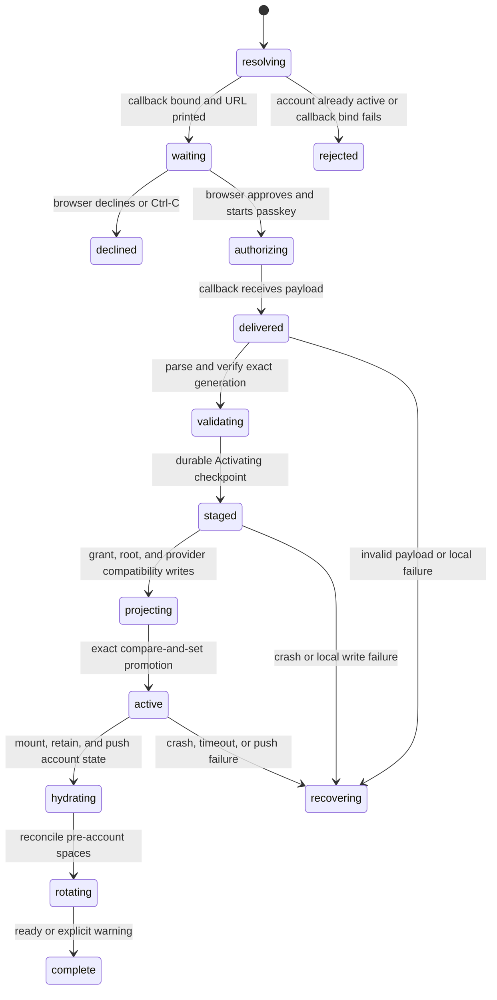

# The browser/CLI account handoff

## Current CLI access workflows

The browser exposes two separate actions. **Invite someone** mints an ordinary
person invite that opens in a browser and creates a member. **Connect a tool**
mints an isolated scoped link for `tonk join TOOL_LINK`. The CLI validates the
resolved link automatically; `--agent` is not part of the command. A new
ordinary link is rejected before replica, credential, binding, account, or
membership writes. Tool links retain their private invitation DID and publish
the grant-specific setup receipt.

CLI account management, ownership adoption, account migration and `tonk link`
are removed. Local creation/transplant remain local; existing replicas and
credentials are preserved. `tonk --space NAME join` resumes a scoped import or
an already-persisted legacy ordinary journal; a new ordinary URL cannot enter
that compatibility path. Account-approval links remain outside this command.

The current journey is `ACCT-C14` / `HANDOFF-21`. Browser-initiated terminal
linking is deferred. Account-command descriptions below are historical evidence,
not supported CLI entry points. Earlier browser results do not verify the narrowed
implementation; see the [verification record](../verification/accounts.md).

## Summary

The handoff authorizes a native CLI profile through an account passkey in a
browser. It begins with `tonk account login`, which binds a loopback callback
and prints an approval URL, and continues at `/settings/link` in a browser. The
browser registers the CLI as a device, mints account-to-device authority, and
returns the result through a loopback bridge. The CLI validates and persists
the result before hydrating the account.

The handoff can begin from an already-linked browser or a fresh browser that
must create or log into an account first. Approval, decline, browser closure,
CLI interruption, callback failure, grant validation failure, local write
failure, and post-grant restart are distinct outcomes.

## The simple case

The person runs `tonk account login`. The CLI prints a URL containing its device
DID, loopback callback, and device name and asks the OS to open it unless
`--no-open` was used.

An already-linked browser opens an approval panel identifying the requesting
device. The person approves and completes a passkey assertion. The page
registers the device, then navigates to the callback with the delegation,
account repository descriptor, credential ID, attachment ID, and service URL
in the URL fragment. The local bridge removes the fragment from browser history
and submits those fields to the CLI listener by same-origin POST.

The cross-scheme navigation from the HTTPS account page to the HTTP loopback
listener is deliberately a bodyless GET. Safari may discard a cross-scheme
form POST while warning about the insecure navigation; the bridge postpones
the POST until the browser is already on the loopback origin. The CLI accepts
only its exact `http://127.0.0.1:<port>/` callback shape.

The CLI validates the grant, persists the account authority and provider,
activates its local session, hydrates the account repository, retains both
directions of authority in the account, and pushes. It then reconciles spaces
created or claimed before the passkey account existed. It reports success or a
bounded warning if first sync or an individual rotation is still pending.

## The interaction, event by event

### Resolve

An ordinary CLI login rejects when both the canonical account session and its
outer account-registry projection are already active. An `Active` session left
before that outer projection settled is reconciled without opening a new
browser. Otherwise the CLI chooses a default account page or `--via URL`,
resolves the device name, binds a fresh loopback listener, and prints the full
approval URL. `--no-open` changes only whether it asks the OS to open the URL.

The browser requires a valid `audience`, `callback`, and `name` on
`/settings/link`. Missing parameters show an incomplete-link error. If the
browser profile has no registered account, it keeps the callback request in the
URL while the person creates or logs into one, then returns to approval.

### Exit early

Callback bind failure, invalid page URL, or an already-active account exits
without opening a browser or changing account state. A missing browser callback
query cannot authorize anything.

Browser Cancel posts a denial to the waiting callback rather than merely
navigating away. The CLI exits with a declined error. Ctrl-C exits with code 4
and “account login cancelled.” The existing process test expects a later login
to bind a fresh callback rather than resume the first wait.

### Cross a boundary

Binding the callback is externally visible but not an account-authority write.
The browser crosses the authority boundary when passkey approval registers the
CLI device and mints its grant. The callback payload may therefore represent a
remote commit even if the CLI disappears before receiving it.

The CLI crosses its local durability boundary after validating the payload. It
first stages the immutable callback generation as `Activating`, then projects
the inbound grant, local-root record, and provider record under the retained
transition lock. Exact compare-and-set promotion makes it `Active` before the
CLI mounts/hydrates the account, retains inbound and profile-union authority,
and pushes.

> Technical note: modern handoff constructs `Activating` only after callback
> validation because the loopback address itself cannot survive a process
> restart. A fresh process resumes exact `Activating` or `Active` state without
> opening a browser. `Waiting` is legacy state that reports an actionable error
> and can be cleared by logout.

### Remain in flight

While waiting, only the loopback callback and Ctrl-C are selected. The browser
can be opened, reloaded, closed, or used to complete an account ceremony.
Nothing in the current CLI wait records a resumable handoff token.

During browser approval, authority registration, WebAuthn, cross-scheme
callback navigation, bridge execution, and the same-origin callback POST are
separate failure boundaries. During CLI activation, payload parsing, delegation
validation, durable staging, credential writes, provider attachment, exact
promotion, account hydration, authority retention, and push are separate
boundaries. Onboarding-account rotation and the legacy-space walk are further
post-approval stages. Focused tests cover the fragment bridge, pending restart,
projection replay, post-promotion recovery, and repeatable space rotation; a
real Safari pass and a full process restart at every write are still open.

### Settle

Success requires a canonical active session tied to the exact returned
attachment, a usable local root/provider record, and an account status of ready
or unhydrated with an explicit warning. A fresh `tonk account status` after the
process exits must report the same identity.

Pre-account created spaces settle with the same repository subject and data,
but with space custody and account authority moved to the passkey account.
Joined membership stays usable through the onboarding/account union. If an
invite seed needs rotation, the CLI names that browser-only action on stderr
and retains the onboarding account; login itself remains active and a later
reconciliation can retry the unfinished subject.

The current account page supplies a same-origin settings redirect, so the
browser normally returns there and reports the command-line device result. If
an older or custom authorization page omits that redirect, or supplies a
malformed or cross-origin target, the loopback callback settles on a
self-contained Tonk confirmation instead. It shows the command-line access
outcome and a keyboard-operable close action; the copy remains complete when a
browser refuses to close a tab it did not open. The compact layout, 44 px action,
and light/dark color schemes preserve the account ceremony presentation without
loading remote assets.

Decline or pre-approval Ctrl-C settles signed out. A post-approval failure must
not casually claim signed out: the remote device may exist and some local
credentials may already be durable. Recovery must inspect both sides and either
finish the same generation or detach/revoke it before starting another.

## Modifiers

| Modifier | Set at the start | Changed while in flight |
| --- | --- | --- |
| Surface and input | CLI TTY may open a browser; `--no-open`/pipe prints the URL. Browser pointer and keyboard must approve/decline equivalently. | Closing one surface does not cancel work already committed on the other. |
| Local account state | `S0` may begin with no onboarding account or with pre-account spaces; `S3` rejects. Partial credential/session state requires reconciliation. | The first local write changes restart behavior; successful rotation may retire the onboarding account only after no dependent invite remains. |
| Customer state | Browser account may be waiting or active; account authority can approve while first service sync is pending. | Activation can complete during the wait; refresh before provider-dependent work. |
| Space relationship | No selected space is required. Local-created, onboarding-claimed, and legacy spaces may exist before login. | Rotation preserves subjects/data; a native invite-seed boundary is reported instead of silently dropping authority. |
| Connectivity and actor | Loopback, browser page, provider, and repository sync can fail independently. | A second browser/device can revoke or delete the account during authorization. |
| Output mode | Human CLI prints URL/status; future machine mode must separate the URL/result from diagnostics. | Broken stdout must not repeat or invalidate remote registration. |

## Cancel and interrupt

| Event | Before crossing a boundary | After crossing a boundary |
| --- | --- | --- |
| Explicit abort: Cancel, Back, declined confirmation, or Ctrl-C. | Browser decline reaches the CLI; Ctrl-C exits signed out. Back/close without decline leaves the CLI waiting until cancel/timeout. | If device registration or local writes occurred, abort must reconcile or report the partial attachment; current coverage does not prove this. |
| Competing user action: navigate, switch profile or space, or run another command. | Browser navigation retains or loses callback query visibly; another CLI account transition must serialize/reject. | Keep the original audience/account fixed. Profile switch cannot post another account's grant to the old request. |
| Alternate completion: callback, blur/Enter submit, or another actor completes the target. | Accept only one callback result from the expected origin/shape. | Duplicate callback or approval is idempotent or rejected as already completed; never install two attachments. |
| Service failure: offline, timeout, non-2xx, malformed response, expired session, or passkey rejection. | Keep CLI waiting only when retry in the same browser is safe; otherwise send a denial/error. | Distinguish remote registration failure, lost callback, invalid grant, local persistence failure, and hydration warning. |
| Surface termination: reload, tab close, browser crash, terminal close, SIGTERM, or process crash. | A new CLI run currently starts fresh; the old browser callback becomes dead. | Remote registration and partial local writes require restart reconciliation; no current process test covers them. |
| Concurrent target change: another tab/process/device edits, deletes, revokes, suspends, or replaces the target. | Re-read browser profile/account before minting. | Grant generation validation and later sync must reject revoked/deleted authority and leave local state explicit. |
| Input or context change: autofill, authenticator change, TTY-to-pipe, stdin close, directory or environment change. | Device name and callback audience are fixed from the original invocation. | Authenticator change may reject; CWD/space changes cannot redirect account state to another profile store. |
| Local durability failure: state locked, read-only, full, missing, malformed, or partly written. | Fail before opening approval if required account store/lock cannot initialize. | Do not acknowledge success until essential writes survive restart; retain enough generation data to resume or clean up. |

## Interactions with other systems

**Identity and account authority.** The callback is transport, not trust. The
CLI verifies grant structure, audience, subject scope, proof, and signature.
The provider-supplied attachment generation must remain bound to that grant.

**Local durability.** Callback wait is not currently durable. Post-callback
writes are sequential and need explicit crash recovery. Cross-process account
locks should prevent login/logout/revoke races from committing stale state.

**Remote service and sync.** Browser registration can commit before callback
delivery. Hydration and push occur after local activation and may time out
without invalidating the account grant.

**Concurrency and multi-device.** The authorizing browser and CLI are distinct
devices. A second browser can revoke the CLI during the flow; a stale completion
must not restore it.

**Output, errors, and recovery.** Errors need stage names and a next action.
“Cancelled” is valid only before remote registration. After that, status and
device lists are the recovery tools.
The browser never echoes a callback-supplied message. If the terminal does not
receive the account link, the browser directs the person back to the terminal
to start login again while retaining the exact diagnostic in the console.

**Accessibility, TTY, and machine output.** The approval panel must name the
device, expose keyboard approve/decline, and maintain focus. CLI signals, exit
codes, stdout URL, and stderr diagnostics need stable contracts.
The loopback fallback exposes its outcome as status content under a named
command-line access region and keeps its close action at least 44 px high.

**Privacy and telemetry.** Callback URLs, delegation bytes, descriptors,
credential IDs, attachment IDs, and passkey results are sensitive and must not
be captured by telemetry or generic logs. The grant fragment must be removed
from loopback browser history before the bridge creates or submits form fields.

## Edge cases

- The browser is unlinked when the CLI arrives and must create/login without
  losing the original callback query.
- The CLI dies after the browser registers it but before the callback POST.
- The browser posts after the CLI listener has closed.
- The browser warns before leaving HTTPS for loopback HTTP; continuing must
  preserve the bodyless GET and allow the local bridge to deliver once.
- The bridge loads without a delivery fragment or with JavaScript disabled; it
  must not consume the waiting callback or invent an authorization outcome.
- A callback form omits its redirect or supplies a malformed/cross-origin
  target; the browser shows the local fallback and never follows the unsafe
  target, while the terminal receives the same authorization outcome.
- Callback payload JSON is readable but hex, descriptor, audience, proof, or
  signature is invalid.
- Account service URL from the page differs from the CLI default; the page's
  deployment wins.
- Attachment ID is absent or blank; the CLI rejects the callback before any
  local authority write because it cannot safely guess a service generation.
- Hydration times out after local login succeeds; status must be unhydrated,
  not signed out.
- Authority retention succeeds but push fails; later sync must finish without
  minting another device grant.
- Created-space rotation succeeds but another subject fails; login reports the
  exact subject and retry converges without a second ownership transition.
- An onboarding account still holds an invite seed; native login reports that
  rotation belongs in the browser and does not retire the onboarding account.
- Two `tonk account login` processes start together.
- Logout begins after callback delivery but before session activation.

## Open questions and verification

- Define a replay or acknowledgement protocol for the browser registration
  that can commit before callback delivery; post-callback `Activating` and
  `Active` recovery are now implemented.
- Define timeout behavior. Current callback receive has Ctrl-C but no explicit
  user-visible deadline in this path.
- Verify the fragment bridge and exact loopback-origin constraints in Safari,
  Chrome, and Firefox, including the HTTPS-to-HTTP warning path and reload.
- Add fault points after every post-approval write and assert restart state.
- The fallback confirmation presentation was checked in isolated Chrome at
  Tonk commit `d85cb4234`; the broader handoff audit remains pinned below.

Source audit pinned to Tonk commit `a3f8670b1`.
Onboarding-account addendum pinned to Tonk commit `b564e83b1`.

## Agent handoff

**Historical, retired by Plan 002.** The account-approval agent command described
in this section has been removed; use the current scoped flow below.

A fresh empty space says “Build this space with an agent”. It explains that the
person should copy the prompt, give it to their preferred agent, and describe
what to build. Machine instructions are hidden in the copy button value.

The CLI invocation `tonk join --agent INVITE` reuses the active CLI account
when it matches the invitation, or runs browser approval when unlinked.
A different active account requires explicit `--switch-account DID` consent
and browser approval. It then joins and pulls the invite's exact space and
pushes a receipt. “Agent connection
confirmed” appears through the space subscription, including in the workspace
shell after the agent changes the home view. The receipt confirms a completed
round trip; it does not indicate that the agent is still online.

Ordinary `tonk join INVITE --name NAME` joins as the current identity without
agent approval or confirmation. The explicit `--agent` flag selects the full
agent flow; the link does not implicitly select it. `connect` remains hidden
from help as a compatibility command for older prompts.

Product boundaries: an existing matching CLI account is printed and reused. There is
no OTP exchange, expiring presence, or automatic account switch. The invite is
still a reusable space capability. An explicitly requested occupied local name
is refused instead of overwritten. Without
`--name`, agent setup reads the pulled space’s RepositoryName, makes a CLI-safe local
alias, and adds a numeric suffix only when needed to avoid a local collision.
If the first pull cannot supply the name, a stable DID-derived fallback keeps
the joined site registered and resumable. Join or sync failures retain local
data and must not be reported as a confirmed connection. Reusing the original
invite finds its exact content-derived invitation record locally and resumes it
instead of creating a second registration. A fresh invite to the same space is
allowed to carry fresh authority rather than being mistaken for the old claim.
If the old replica's authority is no longer usable, a different explicit
`--name` deliberately reclaims the reusable invite into a fresh local replica.

The CLI validates the complete invite before asking for browser approval. The
invite never chooses the account page before its authority has been verified:
the built-in production account page is the default. `--via` is an explicit,
trusted local or staging override and accepts only HTTP(S) URLs.

Automated evidence: `rust/tonk-cli/tests/handoff.rs` exercises receipt visibility
and isolation between spaces. Browser approval through the new command, clipboard
contents, subscription arrival, and the post-home-change badge require a manual
end-to-end run; these are not yet verified.

### Interrupted agent connection

The first manual prototype attempt joined and pulled successfully, then the agent
runner killed `connect` after 45 seconds. `status` subsequently said `synced`,
but the `agent-connection` query returned no rows: no receipt had been committed.
The agent path now skips the ordinary join's account-directory refresh, keeping
that unrelated account push out of the acknowledgement path. Ordinary `join`
continues to update the account directory.

After an interruption, run `tonk --space NAME join --agent` against the already
joined space. It repeats the account check, requesting consent and approval if
needed, then pulls and publishes the receipt without another invite or new local
space. Only “Agent connection confirmed” is a success signal;
`status: synced` alone is insufficient. The hidden prompt teaches this distinction.

The copied prompt no longer assumes `agent-space`. Commands can use the working
folder binding made by `connect`; outside it, use the local name printed by the
command. The local alias does not overwrite the shared display name. Existing
local aliases are retained; subsequent shared renames do not rekey local bindings.

## Scoped tool connection

`ACCT-C14` describes the `connection-invites` build. Stable wire identifiers
retain their `agent` names, but the product action is **connect a tool**.

A browser account with authority to a hosted space opens the app-owned share
menu and chooses **connect a tool**. The surface names the exact space, explains
that access is associated with the issuing account, and offers a direct link
plus a secondary agent prompt. Both copy the same reusable scoped invitation;
neither copy action silently mints a second key. The CLI imports its separate
identity without account login or browser approval. An unrelated or malformed
legacy CLI account remains byte-for-byte outside identity selection.

New tool links resolve to a passive `/agent/` page with CLI connection and
recovery instructions readable without JavaScript. The agent passes the original
complete URL, including its secret fragment, to `join`; fetching the page does
not connect or redeem anything. Root and legacy join HTML advertise the guide
through metadata without adding text to the human loading screen. Successful
joins print commands for status, space agent instructions, schemas, and the
tutorial.

The attached **connect agent** panel offers **copy link** and **copy prompt**.
Completing its account gate resumes invitation generation in place, including
a previously reported account refusal. Returning from the contained ceremony
must preserve the guest until it receives completion rather than navigating
away first. The panel browser tests cover exact link copying and one mint after
completion; the contained-return regression covers the deferred callback.
Static routing and CLI import tests pass, but the full packaged signup-to-link
journey and a fresh agent given only a link remain unverified for this change.

Production links use the built-in deployment. A copied prompt from staging or
a local preview includes `join --via ORIGIN`; this explicitly selects the
deployment whose `/ucan/` route must match the signed grant. It is not a browser
approval page, and the invitation never chooses the route by itself.

The requested lifetime is 90 days. The browser refuses missing account,
activation, sync, feature, ownership, or upstream authority instead of widening
access. Opening the action explicitly creates a fresh grant group. Copies made
inside that open surface share one identity and revocation boundary. Switching
space or profile replaces the surface before another copy. The browser retains
public grant records, not a recoverable invitation secret after restart.

The CLI retains the invitation credentials and a separate local replica. Only
after pulling and pushing its grant-specific setup receipt does it report
“Agent connection confirmed”. Later `tonk --space NAME join` resumes from
those retained credentials. A receipt records completed setup, not exclusive
ownership of the invite or live tool presence; several holders may use it.

Settings lists the space, recipient, scope, expiry, setup confirmation and
revocation acknowledgements. Tab moves between settings controls without
dismissing the panel; Tab still dismisses the account menu itself. Revoking an
invite withdraws its six grants for
all holders and descendants. Partial delivery stays visible and retryable.
Acknowledgement does not promise immediate global enforcement. Downloaded data
and offline edits remain; revoked or expired remote access requires new
authorization and never falls back to a CLI account.

Executed for Plan 005 in the uncommitted worktree based at `d4003e8d6`. Fresh
native CLI, FAB, worker, and Wasm checks cover the narrowed source. The
feature-enabled E2E archive served the preview artifact and passed both named
tool-connection journeys; the existing whole-browser person invitation and
membership journey also passed. The broader Storybook item remains Drafted:
390px layout, keyboard focus, reduced motion, profile switching while open,
Safari, deployed compatibility, old-binary behavior, and global revocation
propagation remain unverified. See `HANDOFF-21`.
