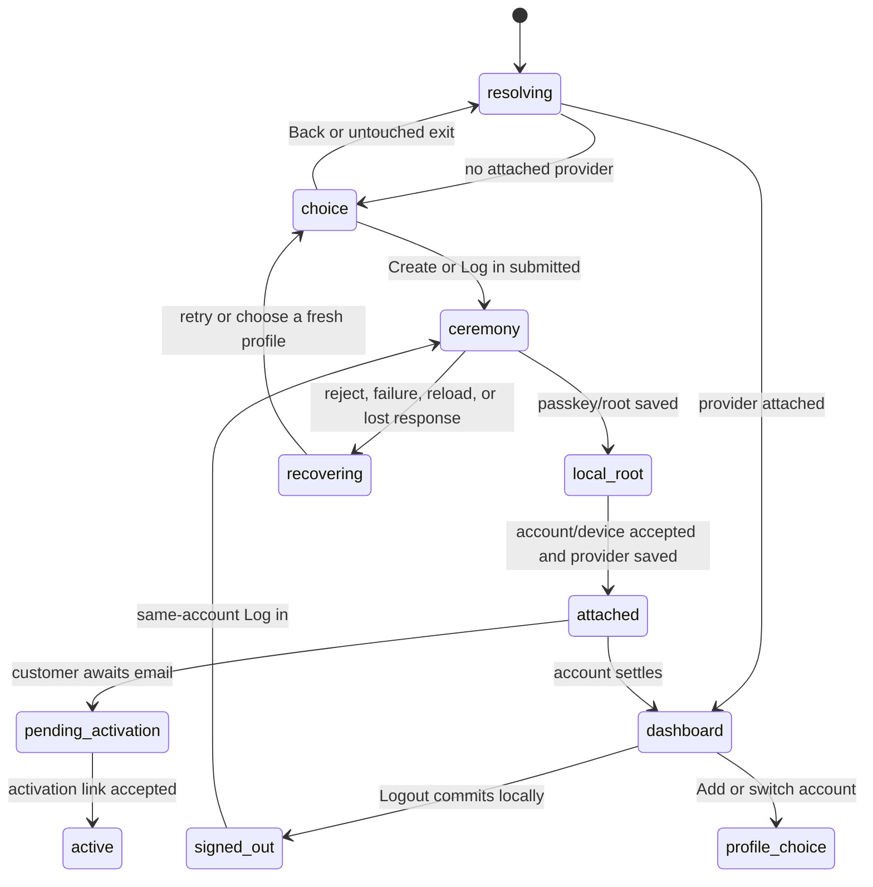

# The account lifecycle

## Summary

The account lifecycle lets a person create passkey-controlled account
authority, activate provider service, link returning browser or CLI profiles,
switch among browser profiles, and log out without losing local work. It begins
at `/settings` in a browser or `tonk account ...` in a terminal. Local root,
provider attachment, account-repository hydration, customer activation, and
space ownership are separate states throughout.

The lifecycle remains available while provider service is offline wherever the
operation is local: status, local space reads and writes, and local logout must
not wait for a remote. Creating, activating, linking a new device, syncing, and
revoking authority require the relevant browser or service boundary.

## The simple case

A person opens `/settings` in a fresh browser, chooses Create, enters an email,
and approves a passkey ceremony. Tonk creates a local root, creates and attaches
the remote account, records the first device, enrolls the account as a customer,
and shows the account dashboard. Provider work that cannot occur before email
confirmation is queued.

The person opens the emailed `/activate?ucan=...` link and accepts it. The
customer becomes active. When settings next loads, queued custody and hosting
work can complete and account-owned spaces synchronize.

On another browser, the person chooses Log in and approves the synced passkey.
The new profile is linked as a device and hydrates the same account repository.
In a terminal, `tonk account login` opens a browser approval flow for the CLI
profile. Each device sees the same account directory after sync.

Logging out removes provider services from that profile but preserves its DID,
root, account repository, and all local spaces. A later same-account login
reattaches the profile rather than creating a duplicate device row. A different
account requires a different browser profile or an explicit CLI logout first.

## The interaction, event by event

### Resolve

The browser canonicalizes `/account` and `/account/*` to `/settings` and
`/settings/*`, retaining the query. `/settings/link` is reserved for a waiting
CLI callback and is described separately. `/settings?add=1` forces the account
choice even when the current browser profile is registered; profile rotation
waits until Create or Log in is actually submitted.

For ordinary settings, the page first checks the deployment service and local
account status. A registered profile lands on the dashboard regardless of
whether its account repository is unconfigured, unhydrated, or ready. A
provider-free profile lands on Create/Log in choice. An unhydrated account shows
a retry warning and must not allow a name change that assumes current facts.

The CLI resolves account state from its local profile store. Bare `tonk
account` and `tonk account status` are read-only. They must report missing root,
provider-free root, unconfigured, unhydrated, or ready without requiring the
provider to answer.

### Exit early

Leaving the initial choice without submitting creates no passkey, account, or
new browser profile. Back returns from Create or Log in to the choice and clears
the visible error. Opening Add account and immediately leaving does not rotate
the profile.

Invalid form constraints should be rejected before network or WebAuthn work.
CLI usage errors, help, an already-active CLI login attempt, and confirmation
declines exit before opening or changing account authority. Repeating logout
while already signed out is an idempotent local success.

Current duplicate-email behavior is a surprising exception. The fresh account
path creates a passkey before the authoritative account insertion reports that
the email already exists. The form remains available for another address, but
the failed attempt has left one credential in the authenticator. The existing
browser E2E test asserts that result.

### Cross a boundary

Create crosses its first non-free boundary when the browser starts the account
passkey ceremony. On success it can rotate an Add-account profile, derive root
authority, and persist the root before the remote account insertion settles.
The remote request then creates the account/device generation, after which the
browser persists the provider link, enrolls the customer, and queues or
publishes custody.

Login crosses its boundary at the passkey assertion and remote device link. A
same-root re-login may reuse the locally retained root grant when the server
still has an active row for this device. Cross-account reuse of a profile is
refused; a fresh profile is the escape hatch.

Activation crosses its boundary when the person accepts the signed invocation
carried by the email link. The link itself authorizes activation, so it works on
a device that is not logged in. Reporting the activation receipt to the local
worker is best effort after the service has accepted it.

Logout crosses only a local durability boundary first. It clears the active
provider session and compatibility provider record under the account-state
lock, then makes a best-effort signed detach request. Provider failure does not
undo local logout. It is not revocation: local identity and authorization
material remain so the same account can be reattached.

### Remain in flight

The browser shows one busy message and disables account actions while the
current ceremony or request is active. A passkey prompt can remain outside the
page. Remote account creation, local attachment, enrollment, custody
provisioning, hydration, and sync are separate stages; an earlier stage can have
committed when a later one fails.

Activation shows “Activating…” until the `/ucan/` request returns. A successful
activation receipt may still fail to record locally; the next status probe is
expected to recover that observation.

CLI login waits on a loopback callback and Ctrl-C concurrently. After browser
approval, it validates the returned grant before writing it, then writes the
grant, root, provider, active session, hydrates the account, retains authority,
and pushes. Hydration has a deadline and may settle as unhydrated with a warning.
Those post-approval stages are not currently crash-tested.

### Settle

Create and login settle only when the page can show an account dashboard backed
by a persisted local provider attachment. Customer state can still be waiting
for activation. A later reload must reproduce the same local account identity
without another passkey or device.

Activation settles with a done panel when the service accepted the invocation.
Expired and malformed links remain on the activation page with a specific
message and no local-account requirement.

Logout settles when local state is signed out. It prints a warning when the
provider could not be notified, while returning success because the requested
local transition is complete. Local spaces remain selected and writable.

Profile switching settles through a reload into the chosen profile. Account
and space lists must be disjoint even when two accounts use the same display
names. A deleted selected profile must rotate away so the deleted authority is
not silently reconstructed.

## Modifiers

| Modifier | Set at the start | Changed while in flight |
| --- | --- | --- |
| Surface and input | Browser uses route/form/WebAuthn; CLI uses subcommands, exit codes, and possibly browser handoff. | The surface cannot safely change. A browser/CLI handoff is an explicit two-surface journey, not a modifier toggle. |
| Local account state | `I0` creates or logs in; `I1` may create from an existing root or require a fresh profile for another root; `I2`/`I3` recover; `I4` shows dashboard. | A committed root/provider write changes the recovery path; retry must inspect durable state rather than repeat blindly. |
| Customer state | `C0` enrolls, `C1` waits/resends, `C2` serves, `C3` withholds service, `CX` preserves local behavior. | Activation or suspension can arrive from another device/service; the page must refresh facts and gate remote work. |
| Space relationship | Local-only spaces stay local through account creation until ownership/service work explicitly attaches them; owned and joined spaces retain their boundaries. | A concurrent space link/delete must not be inferred from account success; refresh the account directory. |
| Connectivity and actor | Online enables account mutation; offline still permits local status/logout/work. A second actor may change device/account/customer facts. | Timeouts and concurrent changes produce a reconciled state, not an unconditional replay. |
| Output mode | Browser exposes busy/error panels; CLI human and JSON status expose equivalent states. | Output mode is fixed per invocation; a broken pipe must not change whether the state commits. |

## Cancel and interrupt

| Event | Before crossing a boundary | After crossing a boundary |
| --- | --- | --- |
| Explicit abort: Cancel, Back, declined confirmation, or Ctrl-C. | Leave account and profile state unchanged; a waiting CLI exits with cancellation. | Passkey cancel commits nothing beyond any earlier durable stage; later cancellation must report partial/recoverable state and never mint authority twice. |
| Competing user action: navigate, switch profile or space, or run another command. | Choice navigation is reversible; a second CLI transition is serialized or rejected. | Disable in-panel conflicts. Top-level navigation/reload currently destroys the page task, so retry must rediscover any root/account already committed. |
| Alternate completion: callback, blur/Enter submit, or another actor completes the target. | Ignore callbacks not matching the current audience/target. | Treat duplicate completion as idempotent; Enter plus blur, two tabs, or a repeated activation link must not create a second logical account/device. |
| Service failure: offline, timeout, non-2xx, malformed response, expired session, or passkey rejection. | Show a specific actionable error and retain input where safe. | Preserve the last durable local state; distinguish rejected-before-commit from response-lost-after-commit and direct the user to status/login recovery. |
| Surface termination: reload, tab close, browser crash, terminal close, SIGTERM, or process crash. | No durable state should appear. | On restart, inspect root/provider/session/customer state and resume or reconcile. Current post-passkey browser and post-callback CLI checkpoints are not comprehensively tested. |
| Concurrent target change: another tab/process/device edits, deletes, revokes, suspends, or replaces the target. | Revalidate before authority mutation. | Reject stale generations/plans, refresh the authoritative state, and disable actions for revoked/deleted authority without touching unrelated profiles. |
| Input or context change: autofill, authenticator change, TTY-to-pipe, stdin close, directory or environment change. | Validate the actual submitted value and resolved profile; do not depend on focus alone. | Keep the originally selected profile/account target fixed. Output channel failure must not roll back or repeat an already committed account mutation. |
| Local durability failure: state locked, read-only, full, missing, malformed, or partly written. | Fail before WebAuthn/remote work whenever the write requirement is knowable. | Never report full success until essential local attachment is durable. Provide login/recovery when remote commit succeeded but local persistence failed. |

## Interactions with other systems

**Identity and account authority.** A device DID, root DID, account provider,
and attachment generation are all checked separately. A grant returned by a
browser is validated for audience, open subject, proof, and signature before
installation. Logout is not revocation.

**Local durability.** Root and provider attachment live locally and must
survive reload/restart. Browser profile rotation occurs only when a ceremony is
submitted. Native account transitions use a cross-process lock and versioned
session state, but the declared pending states are not currently written by the
login flow.

**Remote service and sync.** Customer activation controls hosting availability;
account-repository readiness controls local shared facts. Either can lag the
other. Hydration and custody work must be idempotent after reconnect.

**Concurrency and multi-device.** The account repository is shared, but the
current profile and its local provider attachment are not. Same-account relogin
must not duplicate a device; cross-account reuse must not borrow authority.

**Output, errors, and recovery.** Errors must name which stage failed and which
state remains. “Try again” is unsafe when the remote may have committed;
status/reconcile must precede mutation replay.

**Accessibility, TTY, and machine output.** Browser busy state must be
announced, focus must remain trapped only in active confirmations, and keyboard
submit/cancel must match pointer behavior. CLI JSON state and exit codes must be
stable and diagnostics must stay on stderr.

**Privacy and telemetry.** Account email, passkey material, callbacks, UCANs,
and argument values must not enter telemetry. Approval links contain authority
context and should not be logged beyond what the user explicitly sees.

## Edge cases

- Duplicate email currently creates an orphaned passkey before the conflict is
  reported; an older completed plan describes the opposite invariant.
- A provider-free root is a valid accountless identity, not a broken account.
- An add-account attempt rotates at first submitted ceremony, so cancel/retry
  occurs in the new profile even if the account never attached.
- A same-account active server row may remain after local logout. Relogin should
  reuse the same attachment safely; it must never enable a different account.
- Account creation can commit remotely and lose the response. Login must recover
  the account without creating another one.
- Local attachment can fail after remote creation. The user needs explicit
  “account exists; log in to recover” guidance.
- An account can be ready while customer activation is pending, suspended, or
  unreachable.
- A legacy account may have no passkey metadata and must say it cannot reliably
  reconstruct it.
- A suspended or revoked account must not become a signed-out wall that hides
  local spaces or the ability to switch profiles.
- Two accounts can contain spaces with identical display names; identity is by
  repository subject and profile, not label.
- CLI output can be lost after the mutation commits. Rerunning must be safe.

## Open questions and verification

- Decide whether duplicate-email passkey creation is intentional current
  product behavior or a regression from the completed preflight contract.
- Define the exact user contract for browser reload after the root is saved but
  before remote account creation or local attachment settles.
- Finish native recovery around the implemented post-callback `Activating` and
  `Active` states: browser registration before delivery and concurrent outer
  registry settlement still need generation-bound protocols. Legacy `Waiting`
  is deliberately non-resumable and logout-cleanable.
- Verify suspended-customer and service-unreachable behavior in a real browser.
- Verify all post-approval CLI crash points and provider-offline logout with a
  fresh process.

Source audit pinned to Tonk commit `a3f8670b1`.
