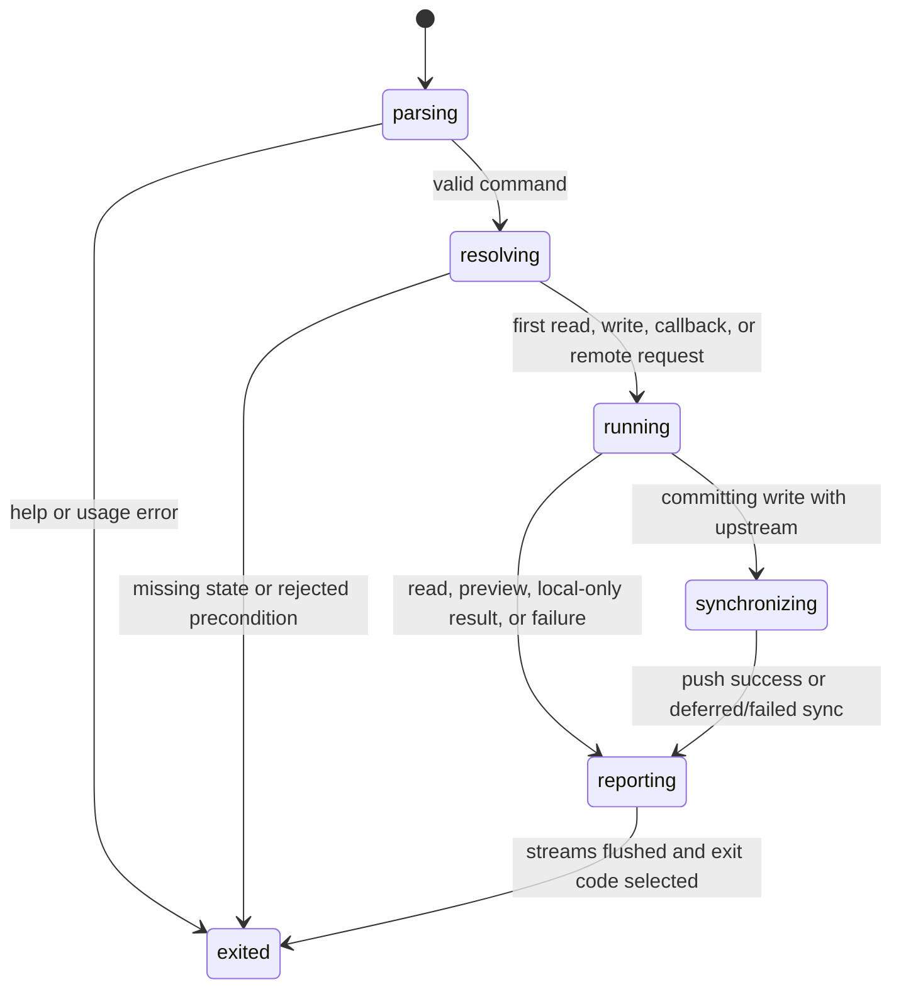

# The CLI command surface

## Summary

`tonk` exposes setup, account, collaboration, authoring, data, rendering,
transfer, migration, telemetry, and update journeys through one command tree.
The shared CLI contract includes parser behavior, space selection, local-first
operation, automatic sync, TTY versus pipe behavior, human/JSON/notation
output, stdout/stderr separation, exit codes, signals, and restart state.

This document maps every current command and subcommand to a journey ID. The
feature documents own the product behavior; this document owns the CLI-wide
invocation and output rules that must be tested consistently.

## The simple case

The person runs a command in a directory bound to a space. Tonk parses the
command, resolves the selected space, reads any required local account or remote
state, validates input, performs the operation, optionally synchronizes, writes
the requested output to stdout, and exits zero. Diagnostics and warnings go to
stderr.

Read commands do not commit. Write commands support their documented preview or
sync modifiers. When a remote is unavailable, local-first commands either
complete locally with an explicit deferred-sync result or fail before a
remote-required mutation. A rerun inspects current state and is safe.

## Complete command inventory

### Root, help, inspection, and selection

| Entry | Journey IDs | Variants that require coverage |
| --- | --- | --- |
| `tonk`, `tonk help`, `help --all`, `help --guides`, `help NAME` | `CLI-01` | TTY/pipe, known/unknown command and guide, hidden commands, width/color, broken pipe. |
| `show [NAME [ENTITY]]` | `DATA-08` | Schema/concept/view/bookmark/URI, human/JSON/notation, missing/ambiguous target. |
| `status` | `SYNC-01` | Human/JSON, every upstream relation, unreachable/revoked/corrupt state. |
| global `--space NAME` | `SPACE-02` | Precedence over environment and binding, missing name, no persistent mutation. |
| global `--verbose` | `CLI-02` | Full error chain on stderr without changing exit class or machine output. |

### Authoring and data

| Entry | Journey IDs | Variants that require coverage |
| --- | --- | --- |
| `concept`, `concept --json`, `concept add` | `DATA-01` | Empty/list, typed fields/cardinality, optional description, notation, write modifiers. |
| `view`, `view --json`, `view add` | `DATA-02` | Detail/directory/label/title, inline/file template, explicit/default anchor and derived entity, entity-like anchor rejection, home, notation, write modifiers. |
| `assert [CONCEPT] [ENTITY] ...` | `DATA-03`, `DATA-04` | Dynamic help, create/update/no-op, schema flags, notation/dry-run/no-sync/quiet. |
| `query CONCEPT` | `DATA-05` | Empty/many, human/JSON, invalid/missing concept, broken pipe. |
| `retract CONCEPT ENTITY [--field]` | `DATA-06` | Whole/field/many field, notation/dry-run/no-sync/quiet, already retracted. |
| `eval` | `DATA-07` | `-c`, file, explicit `-`, implicit piped stdin, query/write/mixed, JSON/quiet/home/dry-run/no-sync. |
| `render ROUTE [--out PATH]` | `DATA-09` | Directory/detail/explicit view, every matching view once in entity order, frame-wide portal mode, default fallback only for an empty renderable match, stdout/file, missing route/view, output failure. |

### Collaboration and sync

| Entry | Journey IDs | Variants that require coverage |
| --- | --- | --- |
| `invite` | `COLLAB-01`, `COLLAB-02` | Default/base URL, remote/no-remote, recipient root, shorten/no-shorten/env, zero/one/many remotes. |
| `join URL --name NAME` | `COLLAB-03`, `COLLAB-05` | Open/restricted, remote/no remote, malformed/expired/revoked/already claimed, name/site collision. |
| `push` | `SYNC-02` | `R0`–`R6`, timeout/lost response/concurrent push, account/invite authority. |
| `pull` | `SYNC-03` | `R0`–`R6`, divergence, concurrent local/remote change, restart before ref update. |
| `remote`, `remote --json` | `CLI-03` | Empty/many, stable JSON, malformed registry. |
| `remote add NAME URL [--revocation-url] [--subject]` | `CLI-03` | Invalid/conflicting values, existing upstream preserved, partial meta write. |
| `remote set-upstream REMOTE` | `CLI-03`, `SYNC-01` | Missing/valid remote, existing upstream replacement, branch/registry write failure. |

### Space setup and lifecycle

| Entry | Journey IDs | Variants that require coverage |
| --- | --- | --- |
| `space`, `space --json` | `SPACE-01` | Empty/registered/data-only/missing data/account-listed, human/JSON. |
| `space new NAME [--site PATH]` | `SPACE-03`, `SPACE-04`, `SPACE-05` | Signed out/in, canonical/custom/adopt, collisions, customer/provider states, crash stages. |
| `space use NAME` | `SPACE-02`, `SPACE-06` | Current/nested directory, missing name, write failure, symlink/platform path. |
| `space home CONCEPT...` | `SPACE-09`, `DATA-02` | Blank/existing, ordered models, notation/dry-run/no-sync/quiet, invalid model. |
| `space agents`, `space agents get [--json]` | `SPACE-09` | Missing/present claim, Markdown/JSON, revision metadata. |
| `space agents set [PATH|-]` | `SPACE-09` | Default/file/stdin, empty/invalid encoding/large input, write modifiers. |
| `space link SPACE` | `SPACE-10` | Signed out, local-only/already owned/joined/foreign, activation/offline/crash/retry. |
| `space rm NAME [--keep-data] [--yes]` | `SPACE-07`, `SPACE-08` | TTY/non-TTY, confirm/decline, owned/listed/local-only, missing/partial data. |
| `space unbind [PATH]` | `SPACE-06` | Current/absolute/vanished/exact/subdirectory/no binding. |

### Identity and account

| Entry | Journey IDs | Variants that require coverage |
| --- | --- | --- |
| `identity [--reset]` | `CLI-04` | Missing/existing profile; reset with account/spaces; durability and recovery guidance. |
| `account`, `account --json`, `account status [--json]` | `ACCT-C01` | Every local account/session state, offline, malformed/versioned state, human/JSON. |
| `account sync` | `ACCT-C09` | Unconfigured/unhydrated/ready, offline/timeout/revoked/diverged. |
| `account login [--name] [--no-open] [--via]` | `ACCT-C02`–`ACCT-C07` | Default/direct page, TTY/pipe, browser states, approve/decline/cancel, no/pre-account onboarding state, created/claimed/legacy spaces, per-subject rotation warning, every crash stage. |
| `account logout` | `ACCT-C08` | Active/pending/signed out, provider online/offline, lock/concurrency/crash. |
| `account delete [--no-open]` | `ACCT-C12`, `AUTH-05` | Browser open failure, safe review URL, stale/deleted account, no direct mutation. |
| `account space`, `account space --json` | `SPACE-11` | Empty/owned/joined/duplicates/offline/stale, human/JSON. |
| `account space pull NAME_OR_SUBJECT [--name]` | `SPACE-12` | Unique/ambiguous/missing, subject, local collisions, offline/revoked/crash. |
| `account space delete SUBJECT [--no-open]` | `ACCT-C12`, `AUTH-04` | Exact subject URL, owned/joined/stale, browser open failure. |
| `account devices [--json]` | `ACCT-C10` | Self/other/empty/duplicate/revoked, online/offline fallback, provider cross-check. |
| `account revoke DID` | `ACCT-C11`, `AUTH-01`, `AUTH-02` | Self/other/unknown/already revoked, partial publish, retry, process output. |

### Blob, transfer, migration, telemetry, and update

| Entry | Journey IDs | Variants that require coverage |
| --- | --- | --- |
| `blob`, `blob --json` | `DATA-10` | Empty/many, human/JSON, corrupt/missing metadata. |
| `blob add FILE [--type]` | `DATA-10`, `SYNC-04` | Inferred/explicit type, dry-run/no-sync/quiet, changed/large/unreadable file, disk full. |
| `blob cat BLOB_URI` | `DATA-10` | Valid/missing/malformed/corrupt blob, binary stdout/broken pipe. |
| `export [--out] [--branch]` | `DATA-11` | Empty/many, stdout/file, escaping, branch missing, atomic output. |
| `import PATH [--branch]` | `DATA-11`, `SYNC-04` | Empty/malformed/partial CSV, duplicates, write modifiers, retry after row failure. |
| `migrate carry [--from] [--move]` | `CLI-05` | Search/explicit path, copy/move/cross-filesystem, destination/permissions/crash. |
| `migrate account` | `CLI-06`, `COLLAB-05` | Empty/partial/already done/corrupt, many spaces, offline/push failure/crash. |
| `telemetry [status|on|off]` | `CLI-07` | Default/env/DNT/persisted precedence, malformed/read-only state, concurrent write. |
| `update [--disable-check|--enable-check]` | `CLI-08` | Install method, current/new version, network/signature/download/swap/rollback/platform. |

Every command is now assigned to at least one journey ID.

## The invocation, event by event

### Resolve

Clap resolves the static command tree, while `assert` deliberately delegates
trailing schema-derived flags and help to a dynamic parser. Global `--space`
and `--verbose` apply across commands. Commands that need a space then apply
the documented selection precedence. Account commands resolve the canonical
local account-session store rather than an arbitrary selected space.

Input source is resolved once: inline string, named file, explicit stdin `-`,
implicit piped stdin, or TTY. Output mode is also resolved once: human, JSON,
notation, quiet envelope, stdout, or a named output file.

### Exit early

Help and version exit without opening profiles, creating locks, running update
checks that affect the result, or mutating telemetry. Usage errors do not create
sites or profiles. Dry-run validates and plans but commits no branch and touches
no remote. Identical safe-to-rerun writes report a no-op.

Errors before mutation select a stable non-zero exit class and write no data to
stdout unless the command's machine contract defines an error envelope. Full
error chains appear only with `--verbose` and stay on stderr.

### Cross a boundary

The first boundary depends on the command: filesystem/store write, branch
transaction, callback listener, passkey/authority operation, remote fetch/push,
output-file replacement, binary swap, or destructive confirmation. Validation
that can be done without side effects precedes it.

Write verbs share dry-run/no-sync/quiet behavior. A committing write with an
upstream normally pulls before committing and pushes afterward. The local
transaction and post-push are separate observable outcomes.

### Remain in flight

Long operations may be interrupted, lose stdout, encounter a remote timeout,
or conflict with another process. Target profile, account generation, space
subject, site, branch, and input are fixed from resolution. Locks serialize
shared local state; ref/generation checks detect stale remote or account work.

Progress belongs on stderr and only when useful for the current output channel.
JSON/notation/stdout data must not be contaminated by warnings or update
notices. Remote timeouts must be bounded and leave a state that status can
explain.

Account login has a post-activation reconciliation stage. It rotates
pre-account created-space custody, walks legacy local spaces, and reports each
unfinished subject on stderr. A native invite-seed rotation is an explicit
browser boundary, not permission to discard the onboarding account.

### Settle

The command selects its exit code from the product result, not from whether a
cosmetic message printed. It flushes requested data to stdout or atomically
publishes the output file, writes diagnostics to stderr, and leaves a durable
state that a fresh process can inspect.

For a local commit followed by push failure, settle is not a generic failure:
the local branch is ahead and the output names `tonk push` or later automatic
sync as recovery. For response-lost-after-remote-commit, settle is unknown until
status/reconciliation, and a rerun must be idempotent.

Account login may settle with an active account and a rotation warning. A
rerun must preserve repository subjects and data, avoid repeating completed
custody moves, and retry only work whose authority is still unresolved.

## Modifiers

| Modifier | Set at the start | Changed while in flight |
| --- | --- | --- |
| Surface and input | TTY enables prompts/progress; pipe/file/stdin modes have non-interactive contracts. | TTY loss or closed stdin/stdout is an I/O result, not permission to retarget or replay. |
| Local account state | Accountless/local commands proceed where supported; account-required commands reject; active/unhydrated state shapes remote work. | Concurrent login/logout must serialize and stale account generations abort. |
| Customer state | Active permits service; Registered/Suspended/CX keeps documented local behavior and blocks/defer remote service. | Re-check at remote boundary; never erase local work on status change. |
| Space relationship | Selected local-only/owned/joined/missing state admits different commands. | Fixed repository subject prevents label or ownership drift. |
| Connectivity and actor | `--no-sync`, offline, reachable, revoked, and concurrent actor change remote stages. | A failure/change is reconciled against current head/generation before retry. |
| Output mode | Human/JSON/notation/quiet/stdout/file and verbose are fixed. | A broken channel affects reporting, not commit truth; file publish should be atomic. |

## Cancel and interrupt

| Event | Before crossing a boundary | After crossing a boundary |
| --- | --- | --- |
| Explicit abort: Cancel, Back, declined confirmation, or Ctrl-C. | Exit with no state change and the documented cancellation code/message. | Stop at a safe boundary, state what committed, and leave an idempotent retry or resume checkpoint. |
| Competing user action: navigate, switch profile or space, or run another command. | Independent read may proceed; conflicting transition locks or rejects. | Original target stays fixed. Concurrency yields conflict/stale state, not silent last-writer target substitution. |
| Alternate completion: callback, blur/Enter submit, or another actor completes the target. | Accept only the expected invocation/generation. | Treat repeated completion as no-op/already done or reconcile; never double-commit. |
| Service failure: offline, timeout, non-2xx, malformed response, expired session, or passkey rejection. | Fail remote-required work before local mutation where possible. | Separate local commit, remote commit uncertainty, and deferred sync in output and recovery. |
| Surface termination: reload, tab close, browser crash, terminal close, SIGTERM, or process crash. | No durable state for preflight-only work. | Fresh process inspects locks/checkpoints/files/refs and resumes, rolls back, or explains partial state. |
| Concurrent target change: another tab/process/device edits, deletes, revokes, suspends, or replaces the target. | Validate exact identity/head/generation. | Reject stale work and preserve unrelated/local data. |
| Input or context change: autofill, authenticator change, TTY-to-pipe, stdin close, directory or environment change. | Resolve once; empty/broken input fails before mutation. | Do not re-resolve CWD/env/input mid-command. Report I/O failure without replaying committed work. |
| Local durability failure: state locked, read-only, full, missing, malformed, or partly written. | Fail before remote effects if the requirement is knowable. | Use atomic files/transactions and explicit recovery; never print success for an unpersisted essential state. |

## Interactions with other systems

**Identity and account authority.** CLI account state is canonical and
cross-process locked. Selected space authority remains distinct. Destructive
and remote commands validate exact DIDs/subjects/generations.

**Local durability.** Registry, profile, account session, branch, blob, output,
telemetry, update, and migration files each need atomic/restart tests. Temporary
fixtures must isolate all state environment variables.

Space-registry reads remain lock-free and observe either the previous or the
next complete `spaces.json`. Every registry mutation retains an exclusive
`spaces.lock` across its read/validate/change/publish transaction, including
account selection, join registration, creation, binding, unbinding, and
removal. Publication uses a unique same-directory temporary file, syncs its
contents, atomically replaces the registry, and syncs the state directory. A
lock/open failure happens before the command mutates space state; a publish
failure never exposes partial JSON, while the command's documented recovery
rules still govern any site work that completed before publication.

**Remote service and sync.** Status is read-only. Auto-sync wraps writes, while
manual push/pull remains explicit. Remote errors never justify destructive
local ref replacement.

**Concurrency and multi-device.** Process tests need real second processes for
locks/signals and independent repository actors for sync. Async tasks in one
runtime do not prove OS file-lock behavior.

**Output, errors, and recovery.** Define one exit-code taxonomy and stable
machine schema. Every partial success names the durable state and next command.

**Accessibility, TTY, and machine output.** Prompts need explicit non-TTY
behavior. ANSI/color, progress, and update notices cannot corrupt JSON,
notation, CSV, HTML, blob bytes, or callback URLs.

**Privacy and telemetry.** Only static command/subcommand descriptors may be
reported. Never include arguments, paths, names, URLs, DIDs, data, or errors
that may embed secrets.

## Edge cases

- No subcommand means the documented default for list/status/help, not an
  accidental parser error.
- Parent `--json` and subcommand `--json` exist in different command families;
  meaningless combinations are rejected.
- `assert CONCEPT --help` reaches dynamic schema help rather than static help.
- Piped stdin with no path differs from an interactive TTY with no input.
- Broken stdout occurs after a mutation committed.
- `--dry-run` implies no remote even if an upstream exists.
- `TONK_NO_SYNC` and `--no-sync` agree; explicit flags and environment
  precedence are stable.
- Output path exists, is a directory, is read-only, fills mid-write, or is on a
  different filesystem.
- Signal arrives during callback wait, local transaction, remote request,
  output publish, update swap, or migration fallback copy.
- Background update or telemetry work cannot change the requested command's
  output/exit semantics.
- Twenty-two direct `#[tokio::test]` attributes in CLI source/tests need an
  explicit native-only rationale or conversion to the repository's
  cross-target `#[dialog_common::test]` harness so discovery is not accidental.

## Open questions and verification

- Inventory and document the exact exit-code taxonomy from current dispatch;
  only the account-login cancellation code is directly pinned in this audit.
- Discover and execute all CLI test binaries under the same command CI uses,
  then compare the 308 static attributes with the discovered list.
- Add a generated command-help snapshot or parser enumeration so a new command
  cannot enter without a journey mapping and baseline error/output tests.
- Decide which commands guarantee atomic output files versus partial files.
- Run signal and broken-pipe fault tests around every mutating command family.

Source audit pinned to Tonk commit `a3f8670b1`.
Onboarding-account addendum pinned to Tonk commit `b564e83b1`.
