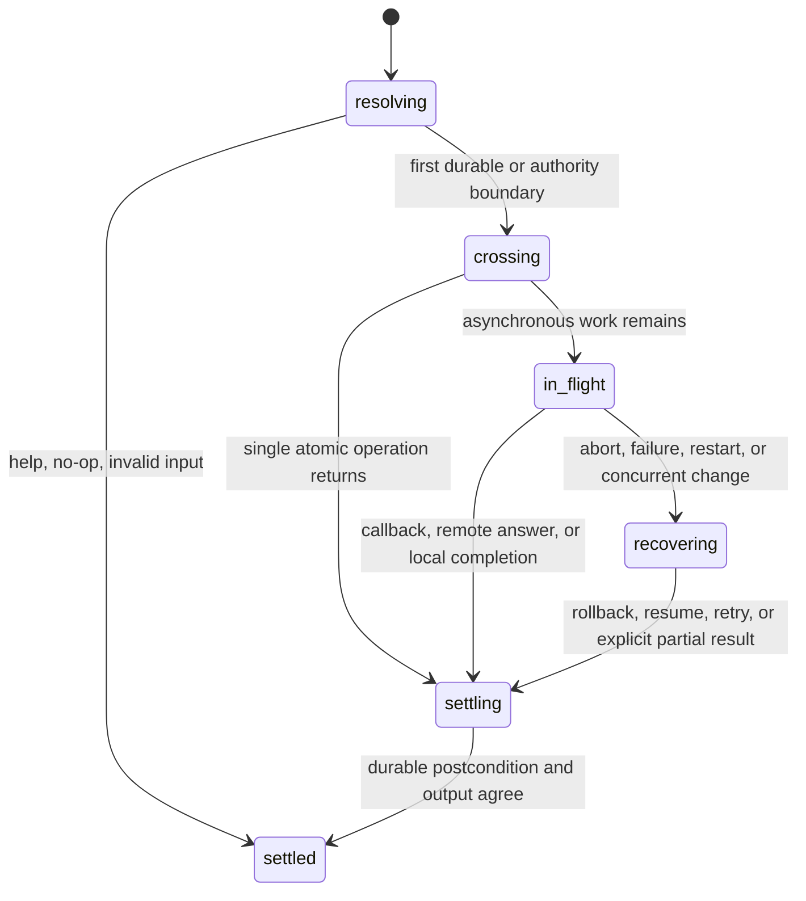

# State model

## Summary

Tonk's user-visible state is a product of independent axes. Most hot-path bugs
come from collapsing two axes into one boolean such as “signed in” or “synced.”
Tests should name each relevant coordinate before invoking a journey and assert
each coordinate that may change afterward.

## Account axes

### Local identity and attachment

| Code | State | User-visible meaning |
| --- | --- | --- |
| `I0` | Root missing | A profile/device exists, but no passkey-controlled root is stored. |
| `I1` | Root present, unregistered | Local root authority exists without a provider attachment. Local work remains possible. |
| `I2` | Registered, account unconfigured | A provider is attached, but the account repository descriptor is not established. |
| `I3` | Registered, account unhydrated | The descriptor exists, but the local account repository is not current or mountable yet. |
| `I4` | Registered, account ready | The provider attachment and local account repository are usable. |
| `IX` | Local state unreadable | The state file/store is missing unexpectedly, malformed, unsupported, locked, or inaccessible. |

The browser worker exposes `RootMissing`, `Unregistered`, and `Registered` with
`Unconfigured`, `Unhydrated`, or `Ready`. The CLI exposes the equivalent local
account status. Tests must not require the provider to be reachable merely to
report these local facts.

### Customer service

| Code | State | User-visible meaning |
| --- | --- | --- |
| `C0` | Not enrolled | No customer record is available. |
| `C1` | Registered | Email confirmation is pending; hosting and sync service are not yet available. |
| `C2` | Active | Provider service may host and synchronize account-owned spaces. |
| `C3` | Suspended | Local state remains, but provider service is withdrawn. |
| `CX` | Unknown/unreachable | The browser cannot obtain a live customer answer. |

`I4/C1` is ordinary: the account repository may be ready while activation is
pending. `I4/CX` must still render repository-backed passkey facts while marking
the verified email unavailable.

### Native account session

| Code | State | Intended meaning | Current reachability |
| --- | --- | --- | --- |
| `S0` | Signed out | No active provider attachment or pending browser handoff. | Used. |
| `S1` | Pending/waiting | A browser handoff can be resumed before approval. | Type exists; current login path does not write it. |
| `S2` | Pending/activating | Grant material is durable and activation can be replayed. | Type exists; current login path does not write it. |
| `S3` | Active | Exactly one account attachment may authorize remote account operations. | Used. |
| `SX` | Invalid | Malformed, unsupported-version, or conflicting state. | Error path exists; focused transition tests do not. |

> Technical note: `AccountSessionState` declares `pending_login`, but the
> current callback login initializes an empty session and jumps to active after
> writing the grant, root, and provider record. The `Waiting` and `Activating`
> variants have no construction site in `rust/tonk-cli`. This is a coverage and
> recovery gap, not evidence that resume works.

### Browser profile set

| Code | State | User-visible meaning |
| --- | --- | --- |
| `B0` | One provider-free profile | Create or login choices are available. |
| `B1` | One registered profile | Settings opens its dashboard. |
| `B2` | Several profiles | The user can add and switch accounts; space lists must stay disjoint. |
| `B3` | Selected profile revoked/deleted | Authority actions stop; switching or creating a fresh profile remains possible. |
| `BX` | Profile switch incomplete | The page reloaded or storage failed between profile selection and settled account state. |

## Space axes

### Relationship and durability

| Code | State | User-visible meaning |
| --- | --- | --- |
| `P0` | No selected space | Commands needing a space fail with actionable selection guidance. |
| `P1` | Local-only | Registered locally, readable and writable without an account. |
| `P2` | Account-owned, service pending | Ownership is retained, but customer activation or provider work has not made it servable. |
| `P3` | Account-owned, hosted | Listed by the account and backed by a provider. |
| `P4` | Joined | Shared into this profile; not owned by the current account. |
| `P5` | Registration only | Data is missing or moved while a registry entry remains. |
| `P6` | Data only | `--keep-data` removed registration; the site can be adopted again. |
| `PX` | Deleted or revoked | Local replica may remain, but the named local/remote authority is gone. |

### Selection

Selection precedence is:

1. global `--space NAME`;
2. `TONK_SPACE`;
3. the nearest ancestor directory binding;
4. no selection.

Nested bindings override parents. Explicit selection must not silently rewrite
the persistent binding. Tests should cover missing names and stale bindings at
each level.

### Sync relationship

| Code | State | User-visible meaning |
| --- | --- | --- |
| `R0` | No upstream | All local operations work; push/pull explain the missing upstream. |
| `R1` | Synced | Local and upstream heads agree. |
| `R2` | Ahead | Local commits are not upstream yet. |
| `R3` | Behind | Upstream commits are not local yet. |
| `R4` | Diverged | Both sides changed; an automatic destructive resolution is forbidden. |
| `R5` | Unreachable | Local reads/writes follow their documented offline behavior and report deferred sync. |
| `R6` | Unauthorized/revoked | Remote work stops with a stable authority error; local data remains explicit. |

## Interaction state

An interaction is unsafe when output says “failed” or “cancelled” but durable
state crossed farther than the user can see, or when output says “done” before
the state can survive restart.

## Required pairwise coverage

Every account hot path must cover at least these pairs:

- `I0/I1/I4` × fresh/returning browser;
- `I1/I4` × same-root/different-root passkey;
- `I4` × `C1/C2/C3/CX`;
- `S0/S3/SX` × provider online/offline;
- `B1/B2/B3` × create/login/switch/logout/delete;
- `P1/P2/P3/P4` × signed out/signed in/deleted account;
- `R0/R1/R2/R3/R4/R5/R6` × read/write/status/push/pull.

The following triples are load-bearing and require explicit tests:

- accountless invite claim × later account login × second-device recovery;
- same-account browser relogin × existing active server row × one local device;
- CLI browser approval × response lost after grant × process restart;
- account deletion × owned and joined spaces × another profile/account;
- invite revocation × retained local replica × later remote operation;
- customer activation × queued custody/hosting × local space writes.

## Open questions and verification

- Decide whether the unused `S1` and `S2` states are a required recovery
  contract or dead design that should be removed. Current documentation in the
  session module says crash-recoverable; current process tests expect a fresh
  callback after interruption.
- The running product has not been observed in `C3`, `IX`, `SX`, `P5`, or `R4`
  during this audit.
- Pairwise coverage is a minimum. Faults found in a triple promote that triple
  to a permanent regression scenario.

Source audit pinned to Tonk commit `a3f8670b1`.
