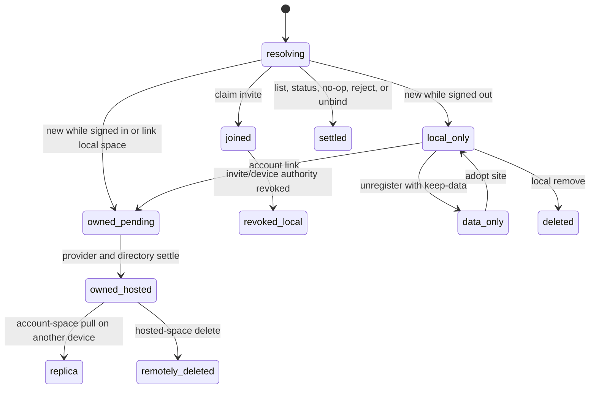

# Space lifecycle and collaboration

## Summary

A space starts as a local repository registration, an account-owned hosted
repository, or a joined shared repository. A person can select, create, adopt,
bind, write, link, synchronize, invite, join, revoke, unbind, unregister, or
delete it. Each action changes a different combination of local site data,
registry state, directory binding, account ownership, remote hosting, upstream
tracking, and shared authority.

The central rule is local-first: local-only and retained local replicas remain
usable without account service. Linking adds account ownership and hosting; it
does not replace the repository or silently move a space between accounts.
Unbinding changes selection only. Local removal and hosted deletion are
different destructive actions.

## The simple case

Signed out, the person runs `tonk space new garden`. Tonk creates a canonical
site, registers it under `garden`, binds the current directory, and places its
custody in a lazily created local onboarding account. The person defines
concepts, writes data, and renders views entirely locally.

After `tonk account login`, Tonk rotates the same repository and data into the
passkey account's authority and custody. Hosting remains explicit:
`tonk space link garden` lists it in the account directory, configures its
upstream, and synchronizes it. On another device, `tonk account space pull
garden` creates the local replica and registration.

The owner runs `tonk invite`, sends the URL, and a recipient runs `tonk join
'URL#fragment' --name shared-garden`. The recipient receives a joined space and
can synchronize within the delegated authority. If the owner revokes the
invite, later remote operations are rejected while any already-local replica is
handled according to the documented local authority boundary.

### Share-menu presentation decision

The browser calls the transferable artifact a **share link**. When its FABB
panel opens, the share stack matches the share rung rather than inheriting the
width of another action. A long member roster scrolls inside the space
available above or below the bar, stays within the viewport margin, and keeps
compact rows usable instead of extending the page beyond the visible area.

This is a source-derived presentation decision for `COLLAB-01`, `WEB-04`, and
`WEB-05`, pinned to `a3f8657d3`. No FABB screenshot was recaptured, so the
existing images retain their older visual provenance.

### FABB naming and blank-space prompt decision

The in-place FABB rename remains an edit while ordinary whitespace is typed;
Enter or leaving the field commits the complete trimmed name. A blank space's
agent prompt has one textual contract: the text on screen and the value copied
by its button include the same task, commands, and final build guidance.

This source-and-browser-tested interaction decision refines `SPACE-03`,
`SPACE-04`, and `DATA-02` on 2026-09-02. No screenshot was recaptured because
the resting FABB and prompt geometry are unchanged.

### Space-switcher and absent-space presentation decision

The FABB space switcher reads the convergent account space directory, not the
device-specific replica index. It lists each non-active directory entry once,
uses the directory's mirrored name so an unreplicated space is still legible,
and keeps the existing seven-row limit with `more` as the path to the complete
Hub directory.

Opening a space that is neither local nor accessible leaves the FABB available
as the route to those other spaces and replaces the old generic centered alert
with the same stone/ink edge wall used by the join ceremony. The state carries
the Tonk wordmark, a plainly worded explanation, and a 40px desktop/44px compact
join action; light/dark palette, keyboard focus, reduced motion, and tactile
press behavior follow the surrounding Rust UI contract.

This is a source-derived presentation decision for `SPACE-11`, `UI-04`,
`WEB-04`, and `WEB-05`. The focused query, DOM-frame, and profile-library tests
cover the authored contract; running-product browser evidence remains distinct.

## The interaction, event by event

### Resolve

Every space-scoped CLI invocation resolves selection using `--space`, then
`TONK_SPACE`, then the nearest ancestor binding. Commands that name a space
explicitly resolve that registered name. Account directory pull accepts a
unique name or exact repository subject; ambiguous names require the subject.

`space new` validates the slug, detects registry/site collisions, chooses a
canonical or explicit `--site` path, and distinguishes creating a new site from
adopting an existing one. Signed-out state selects local-only creation under a
local onboarding account. A valid active account selects passkey-account
ownership, but customer/provider readiness still controls whether hosting
settles immediately.

`space link` resolves one registered space and the active account for that
space's exact profile. The profile must report the same registered account root
as the local account record. A space already owned by that root is a resumable
link; joined, foreign-owned, missing, signed-out, or mismatched-account targets
are rejected before ownership mutation. Before the first ownership transition,
recorded invitations for the exact repository and durable non-owner members
also block linking. Once same-account ownership and authority agree, later
shares do not prevent an interrupted link from resuming, but an upstream for a
different content service still does.

Invite creation resolves the selected repository, its upstream and named
remotes, invite kind, link origin, remote embedding, and shortening policy.
Join resolves the URL fragment, authority audience, remote, requested local
name, and collisions before registration.

### Exit early

List, status, help, dry-run, and notation-preview paths do not mutate the space.
`space rm` confirmation decline, Hub removal cancellation, `space unbind` with
no exact binding, identical data writes, already-configured idempotent
migrations, and rejected ownership changes finish without unrelated writes. In
the Hub, Escape closes the confirmation and restores focus to the remove action
for the same row.

Invalid names, missing selection, stale bindings, ambiguous account-space
names, invalid invite URLs/DIDs, wrong recipients, absent upstreams, and
diverged branches report actionable errors. No command should create an empty
site merely to discover that its precondition failed.

### Cross a boundary

Local creation crosses its boundary when site data, registration, or binding is
first written. Those writes need an order and recovery rule so a crash produces
an adoptable site or removable stale entry, not an invisible orphan.

Signed-in creation and `space link` cross several boundaries: retain account
authority/ownership, record the account directory entry, request hosting,
configure remote/upstream, and synchronize. Remote acceptance can precede a
lost response. Retry must recognize the same repository subject and never
create a second logical space or transfer foreign ownership.

> **Technical note:** If the profile that created a local repository is no
> longer available, link recovery may derive the account-root delegation only
> from that repository's retained Ed25519 signer. Tonk validates and persists
> the recovered prefix before using it for provisioning; a repository without
> its signer remains un-linkable through this recovery path.

Invite minting crosses an authority boundary when the delegation is minted and
may cross remote boundaries when it pushes the repository or shortens the URL.
Joining crosses a boundary when the recipient redelegates/retains the claim and
registers the repository locally. Revocation crosses when the immutable
revocation is published, not when a local UI row disappears.

Local `space rm` crosses a filesystem boundary; `--keep-data` deliberately
crosses only registry/binding boundaries. The Hub crosses the same local
removal boundary only when the confirmation action for that row is submitted.
Hosted-space deletion crosses an account-service boundary for an exact
repository subject and is described with account deletion review.

### Remain in flight

Writes with an upstream normally auto-pull before the transaction and auto-push
after it. `--no-sync` or `TONK_NO_SYNC` omits those remote stages. `--dry-run`
omits both commit and sync. A local commit can therefore succeed while its
post-push fails; output must say local work is ahead and retryable.

Provider activation, hosting, account-directory publication, and first sync can
settle at different times. Customer Registered or Suspended state must not
erase the local space. A queued hosted transition resumes after activation.

Concurrent local commands can change the same registry, binding, branch, or
site. Remote peers can move upstream while push/pull is running. Operations use
locks and compare the target repository/head rather than display name alone.

### Settle

Local creation settles with one site, one registration, and the intended
binding. Account-owned creation or link settles only when ownership is durable
and any deferred hosting/sync state is explicit. A same-account retry continues
the idempotent provisioning, custody, sync, and account-directory work even if
an invite was minted after ownership committed. Another device must be able to
discover the exact repository subject through the account directory.

Join settles with authority addressed to the local onboarding account and a
local registration that names the original repository. A later account login
unites that onboarding authority with the passkey account without changing the
subject. Created-space custody rotates to the passkey account; invite-seed
rotation remains browser-only and must be reported explicitly.

Status settles with one of no-upstream, synced, ahead, behind, or diverged plus
the current local hash. An unreachable or revoked remote is an error/variant,
not permission to rewrite refs.

Unbind settles with data and registration unchanged. `rm --keep-data` settles
with an adoptable, unregistered site. Destructive local removal settles only
after data and registry/binding state agree, or reports an explicit partial
state that recovery can inspect. A successful Hub confirmation removes the
exact subject from the profile listing and then removes its row from the Hub.

## Modifiers

| Modifier | Set at the start | Changed while in flight |
| --- | --- | --- |
| Surface and input | CLI performs lifecycle/data operations; browser routes expose account/space state and interaction. TTY affects confirmations and progress. | A browser view cannot redirect a running CLI's fixed repository subject. A pipe closing changes output only. |
| Local account state | Signed out creates local-only under an onboarding account; active account can own/link; provider-free/unhydrated states restrict remote stages. | Login reconciles pre-account work after the command; concurrent login/logout cannot retarget an in-flight subject. |
| Customer state | Active hosts; Registered queues; Suspended/unreachable keeps local work but blocks service. | Activation may resume queued work; suspension causes remote failure without deleting local state. |
| Space relationship | Local-only, owned, joined, data-only, and deleted targets admit different verbs. | A relationship change invalidates the operation rather than widening authority. |
| Connectivity and actor | Offline supports documented local operations; sync/invite shortening/hosting need services. | Concurrent head, ownership, registry, or revocation changes are detected and reconciled. |
| Output mode | Human, JSON, notation, quiet, file, stdout, and dry-run have explicit commit/output contracts. | Broken output does not decide commit; a command must not replay a mutation merely because stdout failed. |

## Cancel and interrupt

| Event | Before crossing a boundary | After crossing a boundary |
| --- | --- | --- |
| Explicit abort: Cancel, Back, declined confirmation, or Ctrl-C. | Confirmation decline/Ctrl-C leaves site, registry, binding, branch, and remote unchanged. | Stop at an atomic boundary, report partial local/remote state, and make retry inspect the repository subject and head. |
| Competing user action: navigate, switch profile or space, or run another command. | A second operation is serialized, rejected, or targets its independently resolved state. | The original account, space subject, site, and branch stay fixed; concurrent mutation produces conflict/retry, not target drift. |
| Alternate completion: callback, blur/Enter submit, or another actor completes the target. | Re-read idempotent state before creating/linking/joining. | Duplicate link/join/push/delete recognizes the same subject/generation and cannot create a second registration or owner. |
| Service failure: offline, timeout, non-2xx, malformed response, expired session, or passkey rejection. | Local-only work proceeds where promised; remote-required work fails before remote-dependent mutation. | Preserve committed local work and remote uncertainty separately; status/reconcile precedes retry. |
| Surface termination: reload, tab close, browser crash, terminal close, SIGTERM, or process crash. | No state should be created for rejected/preflight paths. | Restart finds site/registry/account/remote checkpoints and completes, adopts, rolls back, or explains them. |
| Concurrent target change: another tab/process/device edits, deletes, revokes, suspends, or replaces the target. | Validate subject, ownership, account generation, and branch head. | Abort stale writes, show divergence/revocation/deletion, and preserve unrelated/local replicas. |
| Input or context change: autofill, authenticator change, TTY-to-pipe, stdin close, directory or environment change. | Resolve selection and input mode once. Broken/empty stdin is rejected before mutation. | CWD/env changes cannot retarget; input/output errors after commit report the committed state. |
| Local durability failure: state locked, read-only, full, missing, malformed, or partly written. | Fail before remote work when possible. | Leave an explicit adoptable/recoverable checkpoint; never report a hosted/linked/deleted result that local state cannot represent. |

## Interactions with other systems

**Identity and account authority.** Repository subject is stable identity;
registration names are local labels. Ownership and invite authority are UCAN
relationships. Link is the only local-only-to-account ownership transition and
cannot transfer a foreign space.

**Local durability.** Site data, registry, bindings, branch refs, and account
directory facts have separate stores. Crash tests must inspect them all.

**Remote service and sync.** Remote registration, upstream selection, hosting,
account directory, and branch synchronization are related but distinct.
Automatic sync wraps committing writes and leaves explicit ahead/diverged state
on failure.

**Concurrency and multi-device.** Another process can mutate local registry or
branch; another device can mutate account facts/upstream or revoke authority.
Tests need two independent stores, not merely two handles to one actor.

**Output, errors, and recovery.** Every write reports whether the local commit
occurred, whether remote sync occurred, and what command safely retries. JSON
must preserve those distinctions.

**Accessibility, TTY, and machine output.** Destructive prompts only appear on
TTY and have a non-interactive explicit flag. stdout is data; warnings and
progress are stderr. Browser space failures need visible, keyboard-accessible
recovery rather than an empty home.

**Privacy and telemetry.** Invite fragments and delegation material are
sensitive. Telemetry may record static command names, never space names, paths,
URLs, DIDs, data, or argument values.

## Edge cases

- No selected space and a stale binding whose registered space was removed.
- Parent and nested bindings disagree; explicit flag/environment overrides both.
- Custom `--site` points to an existing site, a non-site directory, a symlink,
  read-only location, or a site already registered under another name.
- Signed-in new space while customer activation is pending: ownership can be
  durable before hosting is available.
- `space link` retries after ownership committed but provider response was lost.
- The creating profile is gone, but the local repository retains its signer.
- An invite is minted after ownership commits but before account publication
  settles; retry must preserve the invite and finish publication.
- Same local label maps to a different repository subject in an account.
- Account directory has duplicate display names; pull by name is ambiguous.
- Pull fetches data but crashes before registry/binding creation.
- Auto-pull succeeds, local write commits, auto-push fails.
- Upstream moves between status and push or between fetch and ref update.
- Invite has zero, one, or several candidate remotes; `--no-remote` and
  `--no-shorten` change independent parts of the URL workflow.
- Invite is claimed twice, by the wrong root, after revocation, or while the
  origin/shortcut service is unavailable.
- Recipient is accountless at claim, later links an account, then recovers the
  space on another device.
- Account login rotates created-space custody but finds an invite seed that the
  native CLI cannot reissue; it reports the browser-only boundary and preserves
  the onboarding authority for retry.
- Revoked recipient retains local bytes and attempts local write, push, pull,
  or a new invite.
- `space rm` is interrupted between data removal and registry/binding cleanup.
- `--keep-data` site is later adopted under the same or a different valid name.

## Open questions and verification

- Define the precise local-write contract for a revoked joined space with an
  existing replica: readonly, writable-but-never-syncing, or explicit blocked.
- Add crash checkpoints to signed-in creation, link, account-space pull, join,
  local remove, and auto-sync.
- Verify `R2`/`R3`/`R4` status and recovery with two real repository actors.
- Verify browser home/navigation after CLI-authored view/home changes; headless
  `tonk render` alone does not prove route behavior.
- Run accountless claim → account link → second-device pull as one restart-aware
  journey, not only lower-layer authority assertions.

Source audit pinned to Tonk commit `a3f8670b1`.
Onboarding-account addendum pinned to Tonk commit `b564e83b1`.
