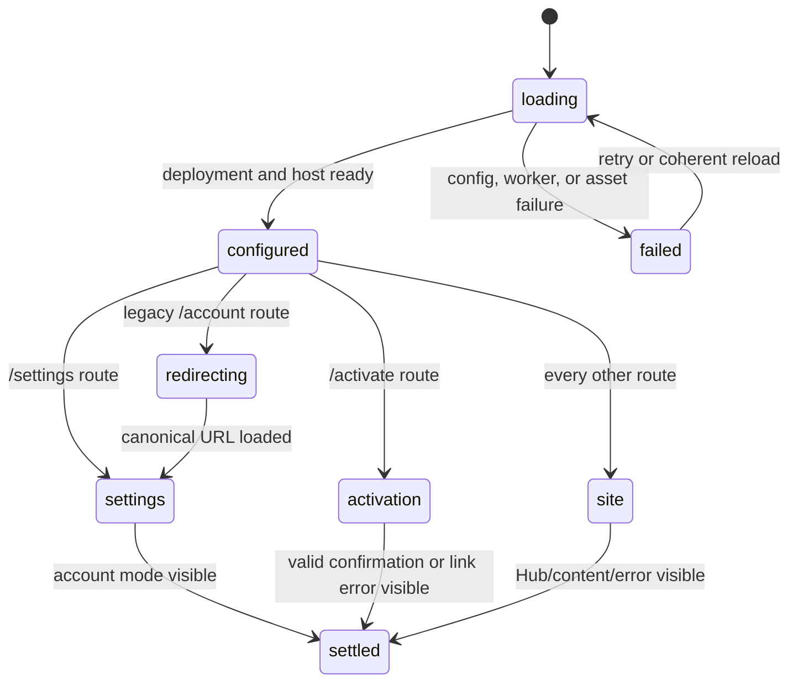

# Browser routing and runtime

## Summary

The browser shell boots the host/service-worker environment and mounts exactly
one top-level surface based on the URL. `/settings*` mounts account settings,
legacy `/account*` redirects there, `/activate*` mounts the emailed customer
activation page, and every other route mounts `<tonk-site>`, whose profile route
table brings up Hub, space chrome, and sealed guest content. A named space's
`/inspector` route also exposes read-only branch diagnostics above the notebook.

This boundary is small but load-bearing. A route can render correctly in a
headless renderer while still failing to become the browser home. Account and
activation routes bypass sealed guests, while local content must remain
reachable in provider-free and offline states.

## The simple case

The browser loads a deployed Tonk page. Runtime configuration and the host IO
surface become ready, custom elements register, and the top document inspects
the path.

At `/settings`, it mounts `<tonk-account>`, which resolves the current browser
profile and account lifecycle. At `/activate?ucan=...`, it mounts
`<tonk-activate>` without requiring a logged-in profile. At `/`, a space route,
or another content path, it mounts one `<tonk-site>` and the current profile's
route table selects Hub or content.

The Hub is itself sealed guest content. Its neutral **account** cell relays an
ordinary navigation to trusted top-level `/settings`; it does not read the
profile roster or expose switch/add controls inside the guest. Account creation
therefore starts only after the person reaches Settings and invokes its trusted
control.

At a named space's `/inspector` route, the inspector starts with one compact,
full-width diagnostics summary above the notebook. It identifies the current
branch, revision, and whether the branch is local-only or has an upstream. The
profile inspector keeps its notebook-only surface because it has no named-space
repository boundary to diagnose.

Navigation and reload reproduce the same canonical route. A service-worker
update cannot strand the user between old HTML and new Wasm/assets; an offline
return either uses a coherent cached build or shows a recoverable boot error.

### Loading presentation decision

The boot shell is destination-neutral: before routing settles it shows the
shared pulse instead of previewing Hub branding or a progress bar. Download
progress remains available through the live status region, while a detected or
watchdog-terminal failure makes the status visible with reload guidance.
Reduced-motion mode keeps a static pulse.

The same pulse occupies transient space-content loading, missing-entity, and
missing-model slots. Those states must heal in place when the route stamp or
repository arrives rather than flashing a developer-facing concept error.

This is a source-derived presentation decision for `UI-01`, `UI-02`, `UI-04`,
`WEB-01`, `WEB-03`, and `WEB-06`, pinned to `a3f8657d3`. No browser image was
recaptured for this decision; the existing artifacts remain evidence only for
the visual commit recorded in `screens.json`.

### Inspector branch diagnostics decision

Branch diagnostics are disclosure-on-demand rather than a permanent dashboard.
The collapsed row spans the top of the named-space inspector and keeps the
notebook as the dominant surface. Expanding it shows the exact space, route,
branch, revision, upstream, remote, repository, profile, and operator values.
Long identifiers wrap without forcing horizontal page overflow; compact and
zoomed layouts retain the same values and actions.

Local metadata loads without contacting the upstream. **Refresh** rereads that
local metadata. **Probe remote** appears only for a configured upstream and is
the explicit network action; its result augments rather than replaces the last
local facts. Each copyable row owns its feedback: the pressed **copy** button
changes to **copied**, while a clipboard failure changes that same button into a
retry affordance. Refresh and probe errors stay inside the panel and do not
replace or block the inspector notebook.

The panel is read-only. It never changes branch, pulls, pushes, repairs, or
configures a remote, and it does not expose diagnostics on the profile
inspector. This is a source-derived contract for `UI-04`, pinned to implementation
commit `efe638c41`. Desktop and compact local-only layouts were exercised at
that commit; a live configured-upstream probe was not available.

## The interaction, event by event

### Resolve

The shell reads pathname and query. `/account` becomes `/settings` and
`/account/SUFFIX` becomes `/settings/SUFFIX`; the original query is retained.
`/settings` and its descendants mount only `<tonk-account>`. `/activate` and its
descendants mount only `<tonk-activate>`. All other paths mount only
`<tonk-site>`.

Account routes interpret `add`, `revoke`, `delete-space`, `next`, `link`,
`audience`, `callback`, and `name` as described in the account documents. The
activation route reads one base64url `ucan`. Content routes are interpreted by
the profile's route table inside `tonk-site`, not by a second top-document
framework.

The `/inspector` content route distinguishes a named-space repository from the
profile repository. Only the former resolves branch metadata and mounts the
diagnostics disclosure.

### Exit early

A legacy route redirects before mounting an account element at the old URL.
Missing callback parameters and missing/damaged activation invocation show
their own error surfaces without attempting authority or network work.

Unknown content routes must settle into a visible not-found/default experience,
not leave the boot shell indefinitely. A missing account provider is not a
reason to block all local content; provider-free profiles can use Hub/local
spaces.

### Cross a boundary

The runtime boundary is crossed when the service worker/host is ready enough
for same-origin API calls and a top-level custom element is mounted. Account
and activation mutations cross their own boundaries later.

For content, `<tonk-site>` crosses into a sealed guest for the resolved route.
The host IO surface and route table must agree on current profile/space. A
service-worker update or hot swap crosses an asset-version boundary and must
not mix incompatible shell, Wasm, and guest bundles.

`UI-03` uses immediate load-time alignment: every online load asks the current
registration to update before mounting the UI. When a replacement activates,
the update-aware document explicitly asks that successor to claim it, then
performs one guarded reload so the mounted shell and active worker come from the
same generation. Activation alone never claims an already-open older document;
that page keeps its compatible controller until navigation. A failed update
check keeps an existing active worker usable offline, and neither path clears
IndexedDB or CacheStorage. Activation deliberately retains every generation's
shell and worker-Wasm caches because an older client or retained worker may
still need its sole offline copy; no automatic generation purge runs. Each
generation is complete and sealed at install. An `installing` candidate alone
does not retire the incumbent: sync and language-server streams stay live until
the candidate reaches `installed`, and a candidate that becomes `redundant`
leaves the incumbent fully operational. The final Cloudflare browser tree is
stamped after the guide and Storybook are overlaid. Its full-digest manifest
covers the shell, UI, lazy, sealed-guest, and static-site resource graph;
install uses `no-store` fetches and verifies that manifest, every listed asset,
and worker Wasm before opening any incoming cache. It then populates unique nonce-named
staging caches and records a durable `building` / `publishing` / `adopted`
marker. After a crash, the same build may remove only the exact unadopted names
proved by that marker; stable names without adoption provenance fail closed,
and an adopted final generation is verified without mutation. Cached
navigations and static assets are returned without network revalidation,
overwrite, deletion, or backfill, including while a successor is waiting. The outgoing document
crosses generations only through its explicit successor claim and guarded
reload; its old controller never accepts the live stable-name shell. A
shell/lazy eviction miss returns an actionable `503` online and offline. An
evicted worker Wasm may be fetched only
when its bytes still match the retained worker's stamp, and those recovery bytes
are not written back. Only exact stamped top-level paths use the immutable
cache. `/.well-known/tonk`, other live edge routes, and registered nested-client
requests continue through Rust/network. Static-site `*/index.html` files also
have exact trailing-slash aliases; `/guide` and `/storybook` receive a `307` to
those aliases so their relative assets resolve correctly, while other content
routes retain root-SPA fallback. The real-browser regressions in
`rust/tonk-ui/src/service_worker_upgrade.rs` cover the online replacement and
offline-return cases; full checklist execution still requires a compatible
ChromeDriver. The real-source Node contract in
`rust/tonk-ui/tests/service-worker-claim.test.mjs` separately pins the rollout
boundary: activation does not claim an older page, an explicit cold-start claim
does take control, and an update-aware page claims its activated successor
before exactly one guarded reload.

Every automatic alignment, update, watchdog-recovery, development hot-swap
reload, and global service-worker claim waits while account setup is critical.
The root attribute `data-tonk-account-setup-critical` and exact-`true`
`window.tonkAccountSetupMayReload()` predicate guard the current page. An
origin-global IndexedDB hold in `tonk-update-safety-v1` independently survives
tabs and reloads while an Arm may lack a durable Stage. Absence is the only safe
value; malformed/unreadable storage or a missing Web Locks API fails closed.
Both page and worker re-read under the same exclusive Web Lock, and claim plus
reload initiation happens before the page releases it, so another tab cannot
publish an Arm hold between the final check and handoff. The non-bubbling
`tonk:account-setup-critical-change` event and same-named BroadcastChannel
message are advisory wakeups that trigger a fresh authoritative check. The
Armed/pre-Stage document therefore remains on its compatible worker until Stage
or an authenticated Inspect has proved recovery durable.

The load-time alignment also has a write barrier for the overlap window. The
artifact build derives one lowercase build id from the outer service-worker
policy, worker glue/Wasm, and canonical browser resource graph. It writes that
identity into `index.html`, the service worker, `asset-manifest.json`, and
`version.json`. A small document script publishes the HTML
value before the Rust/Wasm loader can mount. The live `version.json` request is
only update discovery: its result cannot replace the immutable provenance of
the already-loaded document. The publisher prepares and validates every output
before replacement, excludes overlapping stampers, and restores the complete
prior set after a catchable publication failure. POSIX cannot atomically rename
all four files or recover from process kill/power loss by itself, so deployment
must still stage and promote the complete directory rather than publish these
files independently.

The manifest deliberately excludes mutable deployment controls such as
`version.json` and `kill-switch.json`, as well as its own generated metadata.
In production, authored `no-store`, `reload`, and `no-cache` flags cannot turn a
same-origin static request into a live-network escape from the sealed resource
graph; the exception exists only for the unstamped development worker.

Every top-document `/api` request carries that page build through the same
request context used by the host, including account, profile,
site-registration, and background-sync mutations. Current sealed guests inherit
the immutable build in their ready context. Their trusted portal relay removes
any guest-supplied build value, browser-normalizes the target, and stamps the
host value only on `/api` and `/api/...`; durable blob upload and language-server
POSTs therefore have the same barrier, while provider and deployment-control
requests cannot receive the worker-only header from the relay. The same
normalized-path, method-aware allowlist denies account/profile roster controls,
repository lifecycle, inspection, global site/sync, and undeclared routes by
default before stamping or fetching.

The language server is not worker-global. Authored portal code may keep using
`/api/language-server`, but the trusted portal resolves that alias from its
single `with` reach to an exact named/profile repository + branch endpoint,
replaces any guest-supplied client header, and denies ambiguous or cross-reach
targets before fetch. Repository/profile and branch identities share one strict
canonical segment codec across that endpoint and `tonk-buffer` URIs; for
example, `feat/artifact` is always `feat%2Fartifact`, and alias spellings fail
closed. At the worker boundary, every accepted JSON-RPC message
shape and nested URI/workspace field must remain beneath that route scope;
unknown or ambiguous messages fail closed. Server state and SSE diagnostics are
partitioned by both trusted scope and client, and outbound notifications are
filtered before delivery, so two editors cannot observe or modify each other's
documents even when they share one service-worker process.

Nested portals extend one bounded canonical client chain with a fresh
host-minted random segment at every authorized relay. An authored header cannot
replace the authorized ancestor; malformed, duplicate, non-canonical, or
over-depth spellings cannot replace an ancestor or select a sibling by alias.
The sealed runtime captures the trusted relay before authored markup executes
and passes that function directly into Wasm. Nested portal requests use the
retained capability rather than authored `window.fetch`, so authored siblings
cannot observe and replay a legitimate child's trusted principal. The worker
validates the complete chain and keys same-scope nested siblings separately.
The checked-in `tonk-code` production bundle is source-fingerprinted across its
package/build inputs, TypeScript sources, and `tsconfig.json`; its executable
artifact regression proves an `update-pending` response holds reconnection
until `controllerchange` rather than pinning the outgoing worker again.

A worker from another valid build keeps ordinary GET/HEAD requests, exact
query/subscription POSTs, and an evaluate POST with one canonical
`transact=false` parameter available, but refuses every other POST and every
PUT/PATCH/DELETE with a typed `409 stale-build`. Both host and direct UI
transports inspect the exact response header before any caller consumes the
typed body, then dispatch the static shell's existing update-ready prompt.
Nested sealed guests relay that exact signal through each host layer to the
trusted top document; response status and body remain available to the caller.
Reload is the next action and no local data is cleared. `GET
/api/migrate/repo-vs-profile` is an explicit write exception because it commits
a backfill. Some other GET handlers perform worker-owned, idempotent
reconciliation such as a lazy mount or view binding; they remain
overlap-compatible because they do not interpret stale page input. Future
GET/HEAD routes whose page input authorizes a mutation must be declared in the
same contract. Unknown non-read routes default to writes rather than relying on
route suffixes.

An actually missing build header remains compatible for a genuinely
pre-protocol or development page. That is an explicit rollout exception, not a
proof that builds match: an old page can still mutate through a newer worker by
omitting the header, and a direct browser navigation to the committing migration
cannot carry a custom header. The header is compatibility provenance, not
authentication or a security boundary. Current generated documents and their
sealed guests do stamp it. A present empty, malformed, non-text, or duplicate
header on a write instead fails closed with typed `400 invalid-build-header`;
it cannot masquerade as missing and does not raise an update prompt. Mismatched
or malformed metadata never tears down reads or live subscriptions, so a stale
page remains responsive enough to show the update and preserve local
continuity. The exact route-effect inventory and header parser are covered at
the worker boundary; artifact, request-construction, portal-relay, and response
tests cover the individual transports. The real-browser two-generation matrix,
including nested sealed guests and the deliberate pre-protocol exception, in
`UI-03` remains an open verification item.

An explicit readiness rejection is a terminal boot result, not an unobserved
stall. Before returning without an application root, the UI asks the static
shell to show “Tonk couldn’t start. Check your connection, then reload. Your
local data is safe.” The first terminal result wins, clears the watchdog's
per-tab retry counter, and disables later automatic recovery. It does not
reload, delete CacheStorage, or unregister workers. Silent boots that stop
making progress without an error receive at most one plain automatic reload;
a second silent stall terminalizes with the same safe-state guidance and leaves
every cache and registration intact. The explicit deployment-withdrawal kill
switch is separate but equally non-destructive: it compares only with the
immutable build embedded in the page, stops the matching worker's data plane,
and offers update/reload recovery. It never uses mutable `version.json` to name
the running generation, deletes a cache, or unregisters a worker. A repeated
worker failure page likewise offers retry and registration update/reload only;
it has no reset-storage path.

### Remain in flight

Boot progress, configuration fetch, service-worker control, Wasm/custom-element
registration, profile readiness, and guest load can complete at different
times. The page needs one visible progress/error owner and a bounded recovery
path. Console errors alone are insufficient.

Navigation during boot must resolve the final URL without mounting multiple
top-level elements or leaking document listeners. Back/forward and history
replacement for canonical account routes must preserve safe query intent.

An inspector metadata refresh or remote probe may still be in flight when the
user edits the notebook or navigates away. The panel disables duplicate actions
while busy, preserves its disclosure state across rerenders, and must ignore
work whose element is no longer current.

Account/profile switching can reload the page. When it does, the new profile's
route state must win; stale asynchronous work from the previous element must
not render into the new profile.

### Settle

Settle means exactly one correct top-level surface is visible and interactive,
busy state has ended or has a bounded ongoing meaning, and reload produces the
same route/state. The browser console and network log should have no uncaught
error for the verified path.

Settings settles in a named account mode. Activation settles in confirmation,
done, or a specific link/service error. Content settles in Hub, a configured
space home, an explicit route, or a visible route/authority error. A named-space
inspector settles with an interactive notebook even when diagnostics cannot be
loaded; successful diagnostics remain collapsed until the user opens them.

## Modifiers

| Modifier | Set at the start | Changed while in flight |
| --- | --- | --- |
| Surface and input | Browser pointer/keyboard/touch drives routes and elements; direct URL and history navigation must agree. | Navigation re-resolves the final URL; stale element tasks cannot commit UI into the new route. |
| Local account state | Root missing/provider-free/registered chooses account mode and content authority without globally blocking local use. | Profile/account switch must reload or atomically replace all profile-scoped state. |
| Customer state | Active enables service; Registered/Suspended/CX changes banners/remote work, not local shell availability. | Status refresh updates service actions without remounting unrelated content. |
| Space relationship | Blank/configured local home, owned/joined/revoked space, and missing route produce distinct content outcomes. | Route target identity stays fixed or navigation explicitly changes it. |
| Connectivity and actor | First load/return/offline/stale cache and concurrent service-worker update shape boot. | Reconnect/update uses one coherent build and refreshes authority safely. |
| Output mode | Visual layout, accessibility tree, console, network, and URL are observable outputs. | Viewport/input changes reflow the current surface; they do not change account/space identity. |

## Cancel and interrupt

| Event | Before crossing a boundary | After crossing a boundary |
| --- | --- | --- |
| Explicit abort: Cancel, Back, declined confirmation, or Ctrl-C. | Back/history returns to the previous coherent route; form Cancel follows feature rules. | Cancel affects only the active feature. It cannot unmount or corrupt the shell/service worker. |
| Competing user action: navigate, switch profile or space, or run another command. | Final navigation target wins before mount. | Disconnect old element/listeners, cancel or ignore stale work, and mount exactly one new surface. |
| Alternate completion: callback, blur/Enter submit, or another actor completes the target. | Route-specific completion is accepted only by its mounted feature. | History/result updates do not create a duplicate top-level element or repeat mutation on reload. |
| Service failure: offline, timeout, non-2xx, malformed response, expired session, or passkey rejection. | Boot/config failure shows a bounded retry; local cached content remains available when coherent. | Feature error remains visible and recoverable; the shell does not collapse into an empty page. |
| Surface termination: reload, tab close, browser crash, terminal close, SIGTERM, or process crash. | No feature mutation before its own boundary. | Reload reconstructs from durable state and current URL; service-worker version remains coherent. |
| Concurrent target change: another tab/process/device edits, deletes, revokes, suspends, or replaces the target. | Resolve current profile/account/space facts before action. | Refresh or show stale/revoked/deleted state; do not keep interactive authority from the old target. |
| Input or context change: autofill, authenticator change, TTY-to-pipe, stdin close, directory or environment change. | Browser viewport/input/autofill affects presentation and validation only. | Responsive layout and focus remain usable; identity/route does not change implicitly. |
| Local durability failure: state locked, read-only, full, missing, malformed, or partly written. | Show a profile/storage-specific recovery instead of indefinite boot. | Preserve remote/local result truth and avoid caching a partially upgraded build or profile state. |

## Interactions with other systems

**Identity and account authority.** Top-level routing does not itself authorize.
Mounted account/content elements revalidate profile and authority. Activation is
link-authorized and intentionally profile-independent.

**Local durability.** Profile selection, root/provider state, route/home facts,
and service-worker caches survive reload independently. Recovery must say which
store is damaged.

**Remote service and sync.** Same-origin worker APIs back settings/content;
deployment origins and service DIDs must match the built environment. Offline
local content and provider-dependent actions diverge intentionally.

**Concurrency and multi-device.** Other tabs share browser storage/service
worker but may have stale DOM. Profile switch, revoke, delete, and SW update
need cross-tab refresh/invalidation tests.

**Output, errors, and recovery.** Visible page state, URL, accessibility tree,
console, and network form one result. A render-only or source-only assertion
does not prove the route is interactive.

**Accessibility, TTY, and machine output.** Skip links/focus, landmarks,
announced progress/errors, keyboard navigation, touch targets, zoom, and compact
viewport are required. Account confirmations own focus only while open.

**Privacy and telemetry.** Query parameters may contain DIDs, callback URLs,
activation UCANs, and delete/revoke targets. Analytics must redact them and
avoid recording credential/passkey inputs.

## Edge cases

- `/account` and nested legacy routes with query and hash; back/forward after
  canonicalization.
- `/settings/link` without one of audience/callback/name, or with duplicated and
  malformed encoded values.
- `next` is absolute/external, host-relative, encoded twice, or missing.
- Activation query is missing, empty, padded, invalid base64url, expired,
  already used, or returns non-JSON error.
- Service worker is installed but does not yet control the first page.
- New service worker activates while old Wasm or guest assets are loading.
- An old page sends a matching, mismatched, missing, malformed, or duplicate
  build header while reading, subscribing, dry-running, migrating, or writing.
- Offline first visit versus offline returning visit with a coherent cache.
- Deployment config names the wrong account/access origin or service DID.
- Custom element connects twice or disconnects while an async task is pending.
- Profile switch reloads from an account confirmation or space route.
- Blank home after installing a view versus explicit home selection.
- Revoked/deleted space route while a retained local replica exists.
- Named-space inspector with no upstream, a configured but unavailable remote,
  a remote response that differs from local metadata, or clipboard denial.
- Profile inspector must not infer or display named-space branch metadata.
- Compact 390 px viewport, zoom, reduced motion, keyboard only, and screen
  reader during busy/error transitions.

## Open questions and verification

- There is no focused activation-page test; add component and real-browser
  coverage before treating `/activate` as stable.
- Verify every top-document route family in real Chrome, including back/forward
  and exactly one mounted element.
- Run explicit readiness rejection and silent-stall recovery in a real browser;
  the source-level watchdog regressions prove the former terminalizes
  immediately and a second silent stall cannot delete any cache or unregister
  any worker.
- Verify actual interactive home routing after CLI `view add --home` and `space
  home`; headless `tonk render` is not sufficient.
- Verify the inspector against a configured upstream in a real browser,
  including probe failure, navigation during a probe, keyboard disclosure, and
  clipboard denial.
- Run signed-out/provider-free, customer suspended, service offline, revoked,
  and deleted states through the real Hub/content shell.

Source audit pinned to Tonk commit `a3f8670b1`.
