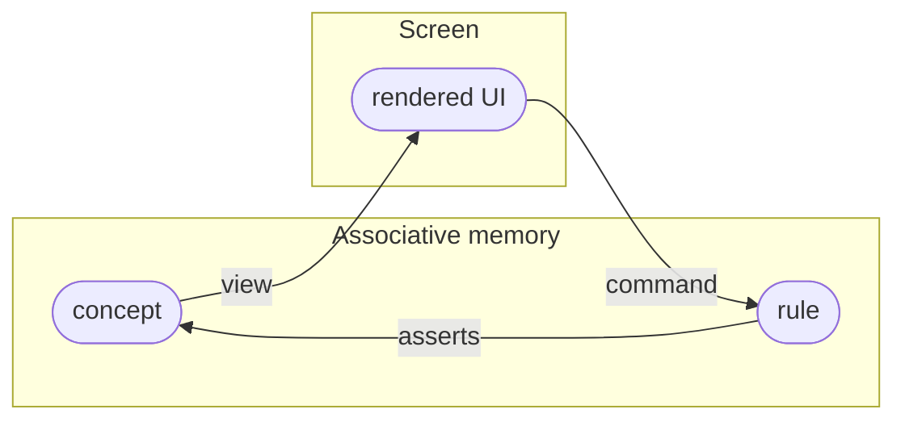

# The model

The counter had four kinds of declaration: a concept, a view, a command, and a rule. One idea ties them together, and it is the whole model.

Underneath everything is the **associative memory**: a store of **facts**. A fact is a relation, one entity having one attribute with one value. The counter's `count` is a fact. Nothing else is stored; facts are all there is.

Everything you declare is a mapping over those facts.

## Concepts map a semantic model to facts

A **concept** is a bidirectional mapping between a semantic model and the associative memory. It names a set of relations that let an entity be realized as that concept.

- Asserting a concept writes its relations as facts into durable storage.
- Querying a concept searches durable storage for entities whose facts satisfy those relations, and realizes them as values.

So a concept is not a container the data lives in. It is a lens: read it and matching facts are gathered into a value; write it and a value decomposes back into facts. The same entity can be realized by any concept whose relations it happens to have.

A **view** is the rendering side: it maps a concept to markup, so realized facts become UI.

## Commands map interaction to transient facts

A **command** is the same kind of mapping, with two differences: its source is the DOM, and its facts are transient.

It maps a DOM event to a concept, and that concept to facts in transient storage. The facts exist only for the commit that asserts them. Nothing about a click is kept; the command is read, acted on, and swept away.

## Rules define behavior

A **rule** defines behavior as a deduction: a conclusion that holds whenever its premises hold. You do not call a rule. You state the circumstances, and when facts make the premises true, the conclusion is asserted as new facts.

The counter's rule says: whenever there is an `increment` for a counter, and that counter has a count, and that count plus one is some number, then the counter's count is that number. Asserting the command satisfies the premises, so the new count follows on its own.

## The loop

Put together, the four pieces form a loop between your data and the screen.

A view renders a concept to the screen. An interaction becomes a command, transient facts a rule reacts to. The rule asserts durable facts, which flow back out through the view. Because the facts sync between peers, the same loop runs on every collaborator's screen with no extra work.

That is the model. The [reference](./reference.md) is the syntax you write it in.
