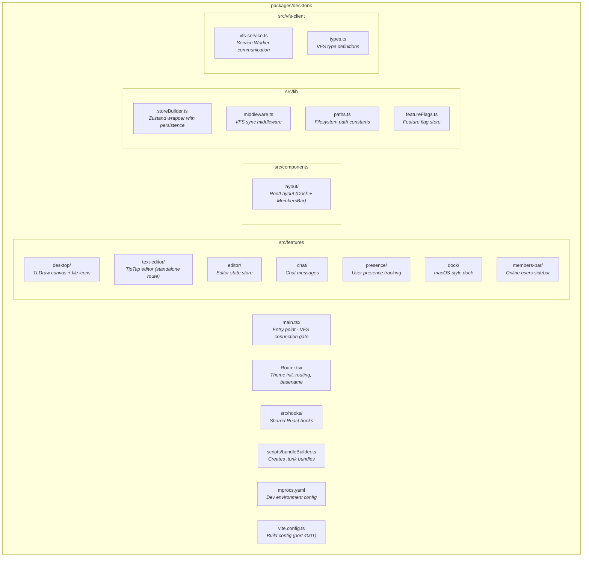
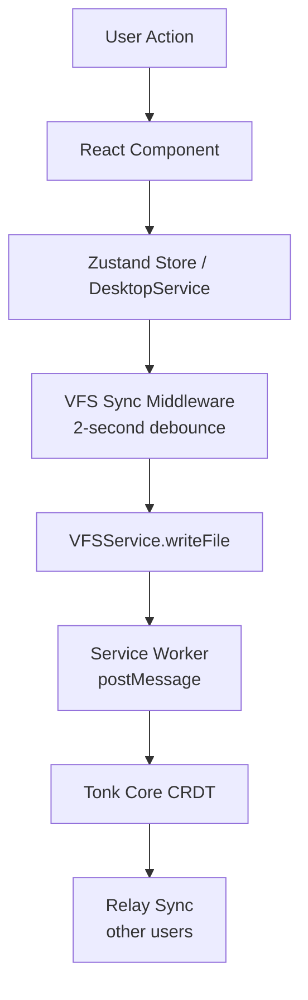

# Desktonk Architecture

## Overview

Desktonk manages files on an infinite canvas. Three technologies power it:

- **TLDraw** - Renders draggable file icons on canvas
- **TipTap** - Edits rich text and markdown
- **Zustand** - Synchronizes state with VFS

The app runs inside the Tonk launcher and routes all file operations through a Service Worker-based Virtual File System (VFS).

## Package Structure

## Core Architectural Decisions

### 1. VFS Service Worker Architecture

A singleton VFSService sends all file operations to a Service Worker via `postMessage`. This enables offline-first behavior and CRDT-based synchronization.

**Key points:**
- App blocks rendering until VFS connects (see `main.tsx`)
- VFSService reconnects automatically and re-establishes watchers
- Requests timeout after 30 seconds

**Location:** `src/vfs-client/vfs-service.ts`

### 2. Three-Tier State Persistence

Each Zustand store chooses one persistence strategy:

| Strategy | Use Case | Example |
|----------|----------|---------|
| **VFS Sync** | Collaborative state shared across users | `presenceStore` |
| **localStorage** | Local UI preferences | `membersBarStore` |
| **None** | Session-only state | `editorStore` |

`StoreBuilder` handles all three with a consistent API.

**Location:** `src/lib/storeBuilder.ts`, `src/lib/middleware.ts`

### 3. Filesystem Hierarchy Standard (FHS)

All VFS paths follow a consistent hierarchy:

| Purpose | Path |
|---------|------|
| User files | `/desktonk/{filename}` |
| Position data | `/var/lib/desktonk/layout/{fileId}.json` |
| Thumbnails | `/var/lib/desktonk/thumbnails/{fileId}.png` |
| Canvas state | `/.state/desktop` |
| Presence | `/var/lib/desktonk/presence/users.json` |
| Chat | `/var/lib/desktonk/chat/messages.json` |

**Location:** `src/lib/paths.ts`

### 4. DesktopService Singleton Pattern

DesktopService manages file metadata and icon positions. It uses a custom singleton with publish/subscribe—**not** Zustand.

**Why a singleton?**
- Requires complex watcher lifecycle management
- Coordinates VFS operations with debouncing
- Depends on strict initialization order

**Key features:**
- Watches files, layouts, and positions for real-time updates
- Debounces position saves (500ms) and file changes (100ms)
- Integrates with React via `useDesktop` hook

**Location:** `src/features/desktop/services/DesktopService.ts`

### 5. Custom TLDraw Shape

File icons use a custom `FileIconUtil` shape:

- Shape ID format: `shape:file-icon:{fileId}`
- FileId = filename without extension (dotfiles keep the dot)
- Double-click opens the appropriate editor
- `useThumbnail` hook loads thumbnails asynchronously

**Location:** `src/features/desktop/shapes/FileIconUtil.tsx`

### 6. Theme Synchronization

Theme initializes before React renders to prevent flash:

1. IIFE in `Router.tsx` reads localStorage or system preference
2. Launcher sends theme changes via `postMessage`
3. Components listen for `theme-changed` custom event
4. TLDraw sets theme in `onMount` callback, not useEffect

**Location:** `src/Router.tsx:12-35`

## Data Flow

## Build System

- **Vite** with `rolldown-vite` override for faster builds
- **mprocs** runs launcher + desktonk + relay in parallel for dev
- **Strict port 4001** for dev server
- `bun run bundle` creates `.tonk` files for deployment
