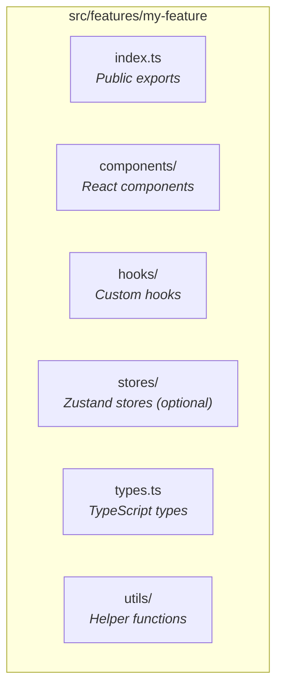

# Getting Started

## Prerequisites

This monorepo uses **Bun**.

```bash
# From monorepo root
bun install
```

## Development

```bash
# From packages/desktonk
bun run dev
```

mprocs starts three processes:
- Launcher (parent window)
- Desktonk (this app)
- Relay (sync server)

**Run all three.** Vite alone fails because the app needs the launcher and relay.

## Testing with Sample Files

In the browser console:

```javascript
createSampleFiles()
```

This creates `Welcome.txt`, `README.md`, and `notes.json`.

## Building

```bash
bun run build    # Vite build to dist/
bun run bundle   # Build + create app.tonk
```

## Adding a New Feature

### 1. Create Feature Directory



### 2. Choose State Management Strategy

`StoreBuilder` creates Zustand stores with your chosen persistence:

```typescript
import { StoreBuilder } from '@lib/storeBuilder';
import { FHS } from '@lib/paths';

// VFS sync - collaborative state
const vfsSyncedStore = StoreBuilder(initialState, undefined, {
  path: FHS.getServicePath('my-feature', 'state.json'),
  partialize: (state) => ({ syncedField: state.syncedField }),
});

// localStorage - local preferences
const localStore = StoreBuilder(initialState, {
  name: 'my-feature',
  version: 1,
  storage: localStorage,
});

// No persistence - session only
const sessionStore = StoreBuilder(initialState);
```

### 3. Create Store with Actions

```typescript
interface MyState {
  data: string;
  localOnly: boolean;
}

const initialState: MyState = { data: '', localOnly: false };

export const myStore = StoreBuilder(initialState, undefined, {
  path: FHS.getServicePath('my-feature', 'state.json'),
  partialize: (state) => ({ data: state.data }), // Only sync 'data'
});

const createMyActions = () => ({
  setData: (value: string) => {
    myStore.set((state) => {
      state.data = value;  // Immer-style mutation
    });
  },
});

export const useMyFeature = myStore.createFactory(createMyActions());
```

## Adding a Custom TLDraw Shape

See `FileIconUtil.tsx` for project patterns and [tldraw docs](https://tldraw.dev/docs/shapes) for the API.

## Working with VFS

### Reading Files

```typescript
import { getVFSService } from '@/vfs-client';

const vfs = getVFSService();
await vfs.connect();

const file = await vfs.readFile('/desktonk/myfile.txt');

// Text files store data in content or bytes—check both
const text = file.content?.text ?? vfs.readBytesAsString(file.bytes);
```

### Writing Files

```typescript
// Text content
await vfs.writeFile('/desktonk/myfile.txt', {
  content: { text: 'Hello', desktopMeta: { ... } },
});

// Binary content
await vfs.writeFile('/desktonk/image.png', {
  bytes: base64String,
  content: { desktopMeta: { ... } },
});
```

### Watching for Changes

```typescript
const unwatch = await vfs.watch('/desktonk/', (event) => {
  console.log('File changed:', event.path);
});

unwatch(); // Stop watching
```

## Common Tasks

### Access Feature Flags

```typescript
import { useFeatureFlags } from '@lib/featureFlags';

function MyComponent() {
  const { plainTextMode, togglePlainTextMode } = useFeatureFlags();
  // ...
}
```

### Invalidate Thumbnail Cache

```typescript
import { invalidateThumbnailCache } from '../hooks/useThumbnail';

// After regenerating a thumbnail
invalidateThumbnailCache('/var/lib/desktonk/thumbnails/myfile.png');
```
