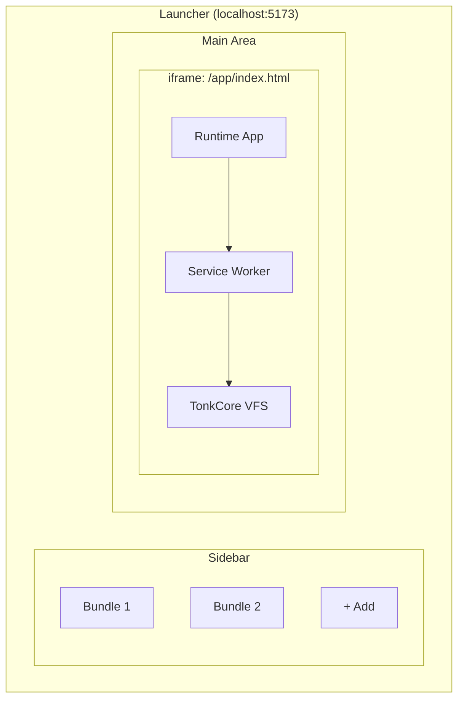

# Tonk Launcher

The Tonk Launcher manages and runs Tonk bundles: CRDT-based collaborative applications that sync in real-time.

## Quick Start

```bash
# Install dependencies
bun install

# Start development server
bun run dev
```

Open http://localhost:5173 in Chrome or Safari. Firefox lacks support.

## Architecture Overview

The launcher uses a **two-app architecture**:



1. **Launcher App** (`src/App.tsx`) — Manages the bundle library: import, delete, launch
2. **Runtime App** (`src/runtime/`) — Runs inside an iframe, hosts the service worker and TonkCore

### Why This Design?

- **Service worker scope isolation**: The SW at `/app/` intercepts only runtime requests
- **Clean restart**: Navigating to `/` exits the running bundle
- **Security**: The iframe boundary limits bundle access to launcher state
- **Independent updates**: Update the launcher without disrupting running bundles

## Build Commands

- `bun run dev` — Start dev server with SW watching
- `bun run build` — Build launcher for production
- `bun run build:runtime` — Build runtime + service worker
- `bun run lint` — Run Biome linter + ast-grep rules
- `bun test` — Run Vitest tests

## Documentation

- [Architecture](./architecture.md) — Complete technical reference
- [Gotchas](./gotchas.md) — **Read first** to avoid common pitfalls

## Browser Support

- **Chrome** — Full support
- **Safari** — Full support
- **Firefox** — Not supported (ES modules in service workers)
