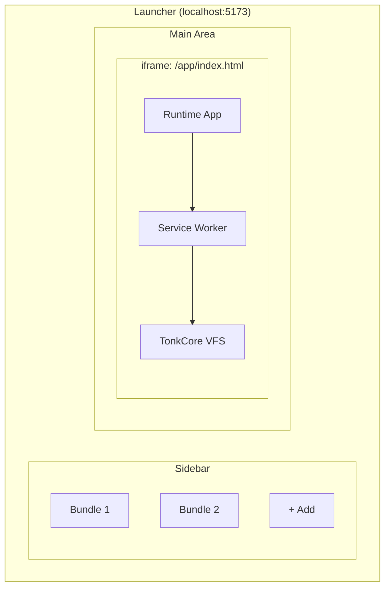
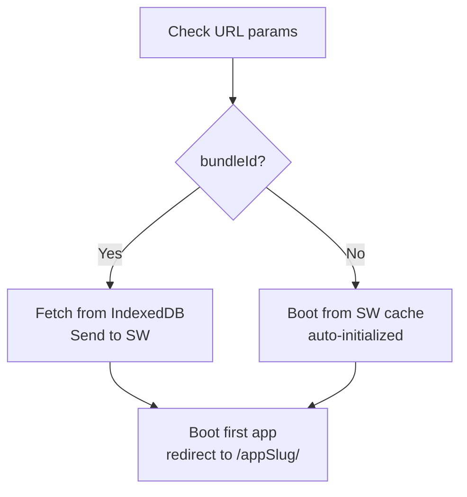
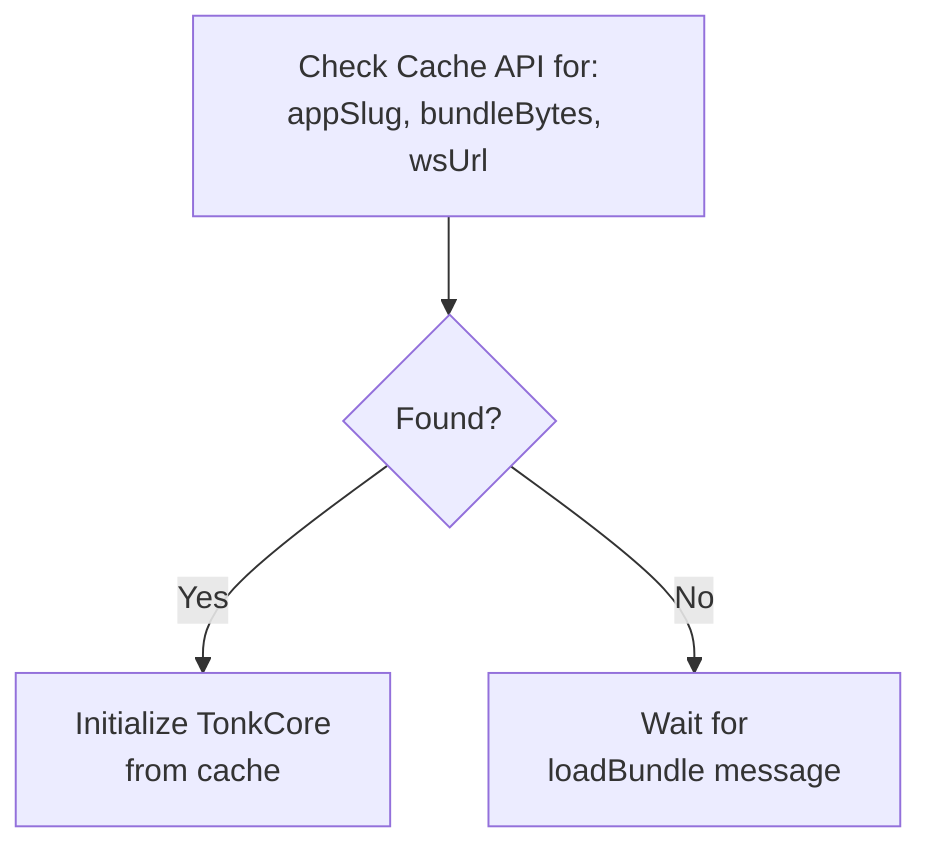
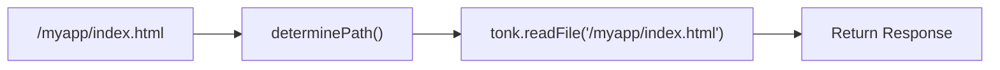
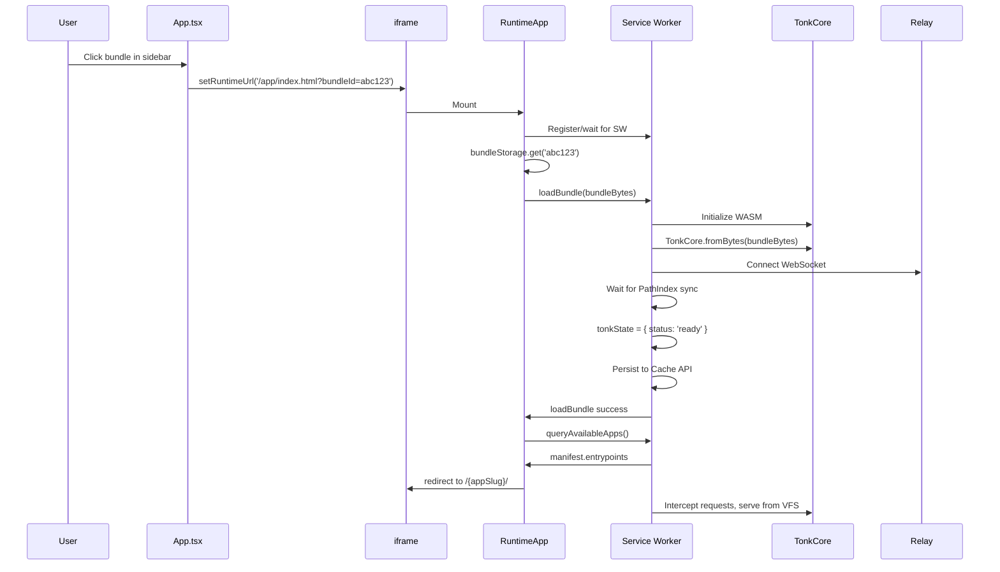

# Launcher Architecture

How the Tonk Launcher loads bundles, manages service workers, and runs apps.

## Overview

The launcher has two parts:

1. **Launcher App** (`src/main.tsx` → `src/App.tsx`) — Main UI with sidebar for managing bundles
2. **Runtime App** (`src/runtime/main.tsx` → `src/runtime/RuntimeApp.tsx`) — Runs inside an iframe, manages the service worker, hosts Tonk apps



## Key Components

### 1. Bundle Storage (IndexedDB)

**File:** `src/launcher/services/bundleStorage.ts`

Bundles reside in IndexedDB under the database `tonk-launcher`. The launcher and runtime share this storage (same origin).

```typescript
// Save a bundle
await bundleStorage.save(id, { name, bytes, size });

// Retrieve a bundle
const bundle = await bundleStorage.get(id);

// List all bundles (metadata only)
const bundles = await bundleStorage.list();
```

### 2. Launcher App

**File:** `src/App.tsx`

The launcher displays bundles and handles:

- Importing bundles via file upload
- Launching bundles by setting the iframe URL

When launching a bundle:

```typescript
// Pass bundleId as query param — RuntimeApp fetches bytes from IndexedDB
setRuntimeUrl(`/app/index.html?bundleId=${encodeURIComponent(id)}`);
```

### 3. Runtime App

**File:** `src/runtime/RuntimeApp.tsx`

The runtime runs inside `/app/index.html` and:

1. Registers the service worker
2. Reads `bundleId` from URL params
3. Fetches bundle bytes from IndexedDB
4. Sends bytes to service worker via `loadBundle` message
5. Boots the first app in the bundle



### 4. Service Worker

**Directory:** `src/launcher/sw/`

The service worker forms the system's core. It:

- Manages TonkCore (the VFS/CRDT engine)
- Intercepts fetch requests and serves files from the VFS
- Handles bundle loading and initialization
- Persists state to Cache API for survival across restarts

#### Service Worker State

```typescript
type TonkState =
  | { status: 'uninitialized' }
  | { status: 'loading'; promise: Promise<...> }
  | { status: 'ready'; tonk: TonkCore; manifest: Manifest }
  | { status: 'failed'; error: Error };
```

#### Message Types

| Message         | Direction | Purpose                             |
| --------------- | --------- | ----------------------------------- |
| `loadBundle`    | Page → SW | Load bundle bytes into TonkCore     |
| `setAppSlug`    | Page → SW | Set current app slug for path resolution |
| `getManifest`   | Page → SW | Get manifest with entrypoints       |
| `listDirectory` | Page → SW | List files in VFS directory         |
| `readFile`      | Page → SW | Read file from VFS                  |
| `writeFile`     | Page → SW | Write file to VFS                   |
| `ready`         | SW → Page | Service worker ready                |

#### Auto-Initialization from Cache

On startup, `autoInitializeFromCache()` restores state:



#### Fetch Interception

When `appSlug` is set, the SW intercepts same-origin requests:



## Build Artifacts

The runtime app and service worker are pre-built in `public/app/`:

```
public/app/
├── index.html                 # Runtime HTML entry
├── main.js                    # Runtime app bundle
├── main.css                   # Runtime styles
├── service-worker-bundled.js  # Service worker bundle
└── *.otf                      # Fonts
```

## Build Commands

### Full Build

```bash
bun run build:host
```

Runs `scripts/build-runtime.ts`:

1. Builds service worker → `dist-sw/`
2. Builds runtime app → `dist-runtime/`
3. Copies both to `public/app/`
4. Cleans up temp directories

### Development Builds

**Service Worker only:**

```bash
TONK_SERVE_LOCAL=false vite build -c vite.sw.config.ts
cp dist-sw/service-worker-bundled.js public/app/
```

**Runtime App only:**

```bash
TONK_SERVE_LOCAL=true vite build -c vite.runtime.config.ts
cp -r dist-runtime/* public/app/
```

### Watch Mode (Dev)

```bash
bun run dev
```

Starts:

- Vite dev server for launcher on port 5173
- SW watch/rebuild in background (`watch:sw`)

**Note:** The runtime app (`public/app/main.js`) is not watched. Rebuild manually after changes to `src/runtime/`.

## Configuration Flags

### TONK_SERVE_LOCAL

Controls whether the service worker proxies requests to a local dev server.

| Value   | Behavior                                            |
| ------- | --------------------------------------------------- |
| `true`  | SW proxies requests to `http://localhost:4001` (HMR) |
| `false` | SW serves files from VFS bundle                     |

**When to use:**

- `TONK_SERVE_LOCAL=true`: Developing an app with hot reload (requires separate app dev server)
- `TONK_SERVE_LOCAL=false`: Loading pre-built bundles from IndexedDB (launcher scenario)

### TONK_SERVER_URL

The relay server URL for WebSocket sync.

| Environment | Default                  |
| ----------- | ------------------------ |
| Development | `http://localhost:8081`  |
| Production  | `https://relay.tonk.xyz` |

## Data Flow: Loading a Bundle



## Troubleshooting

### "Tonk not initialized" errors

The service worker has not finished loading the bundle. Causes:

- Bundle loading in progress (race condition)
- Auto-initialization from cache failed
- `loadBundle` message failed

**Fix:** The SW waits for initialization before handling fetch requests (15s timeout).

### CORS errors with localhost:4001

The SW was built with `TONK_SERVE_LOCAL=true` but no app dev server is running.

**Fix:** Rebuild SW with `TONK_SERVE_LOCAL=false`:

```bash
TONK_SERVE_LOCAL=false vite build -c vite.sw.config.ts
cp dist-sw/service-worker-bundled.js public/app/
```

### RuntimeApp changes not taking effect

The `public/app/main.js` is pre-built and not watched in dev mode.

**Fix:** Rebuild the runtime:

```bash
vite build -c vite.runtime.config.ts
cp -r dist-runtime/* public/app/
```

### Service worker not updating

Browsers cache service workers aggressively.

**Fix:**

1. DevTools → Application → Service Workers → "Unregister"
2. Hard refresh (Cmd+Shift+R / Ctrl+Shift+R)

### Bundle loads but app does not render

Check that:

1. `appSlug` is set correctly in SW
2. Files exist in VFS at `/{appSlug}/index.html`
3. The hosted app has no JavaScript errors

## File Reference

| File                                     | Purpose                  |
| ---------------------------------------- | ------------------------ |
| `src/App.tsx`                            | Launcher UI              |
| `src/main.tsx`                           | Launcher entry           |
| `src/runtime/RuntimeApp.tsx`             | Runtime/iframe app       |
| `src/runtime/main.tsx`                   | Runtime entry            |
| `src/launcher/sw/index.ts`               | Service worker entry     |
| `src/launcher/sw/state.ts`               | Bundle state machine     |
| `src/launcher/sw/tonk-lifecycle.ts`      | TonkCore lifecycle mgmt  |
| `src/launcher/sw/fetch-handler.ts`       | Request interception     |
| `src/launcher/services/bundleStorage.ts` | IndexedDB bundle storage |
| `src/launcher/services/bundleManager.ts` | Bundle import/management |
| `src/runtime/hooks/useServiceWorker.ts`  | SW communication hook    |
| `vite.config.ts`                         | Launcher vite config     |
| `vite.sw.config.ts`                      | Service worker config    |
| `vite.runtime.config.ts`                 | Runtime app config       |
| `scripts/build-runtime.ts`               | Full build script        |
| `scripts/watch-sw-copy.ts`               | SW watch/copy script     |
