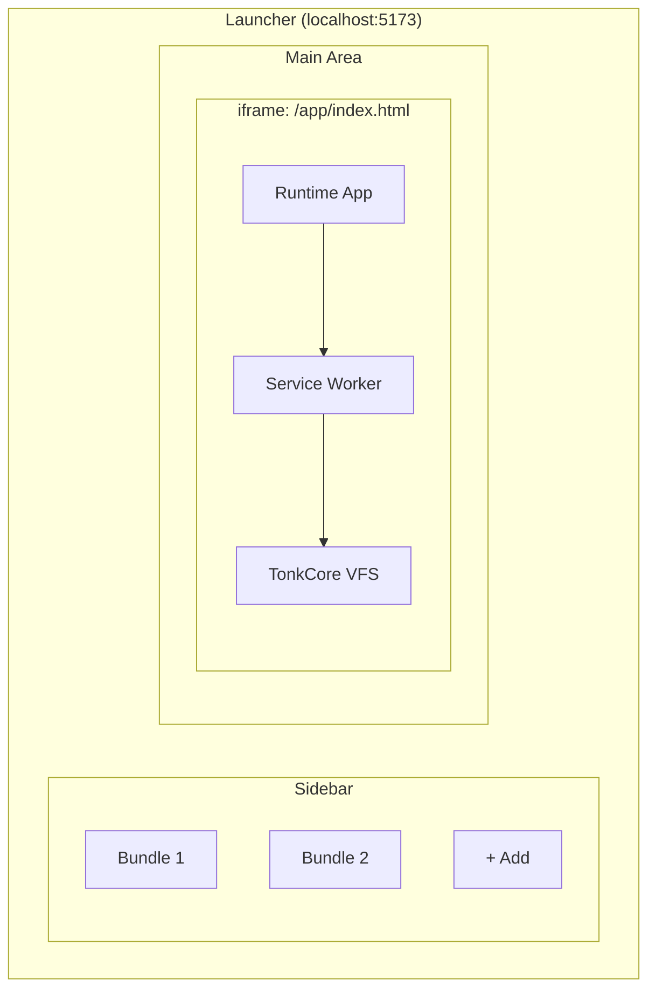
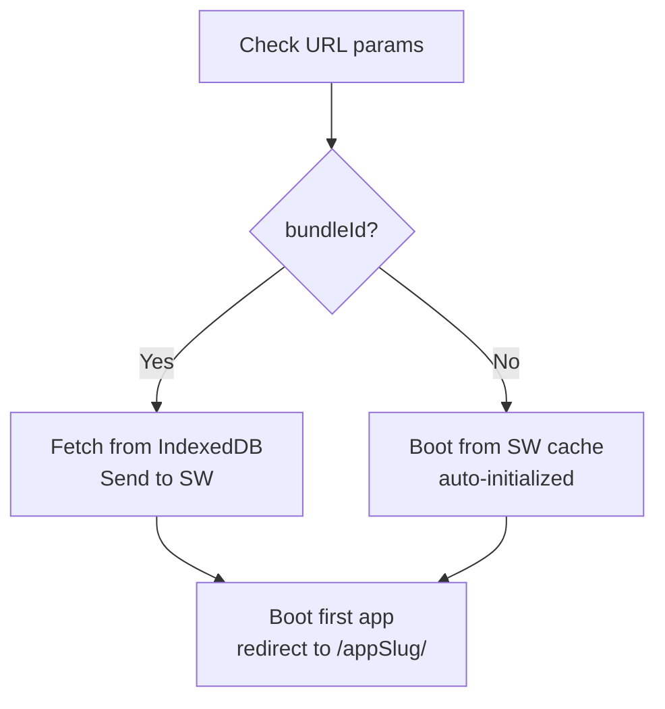
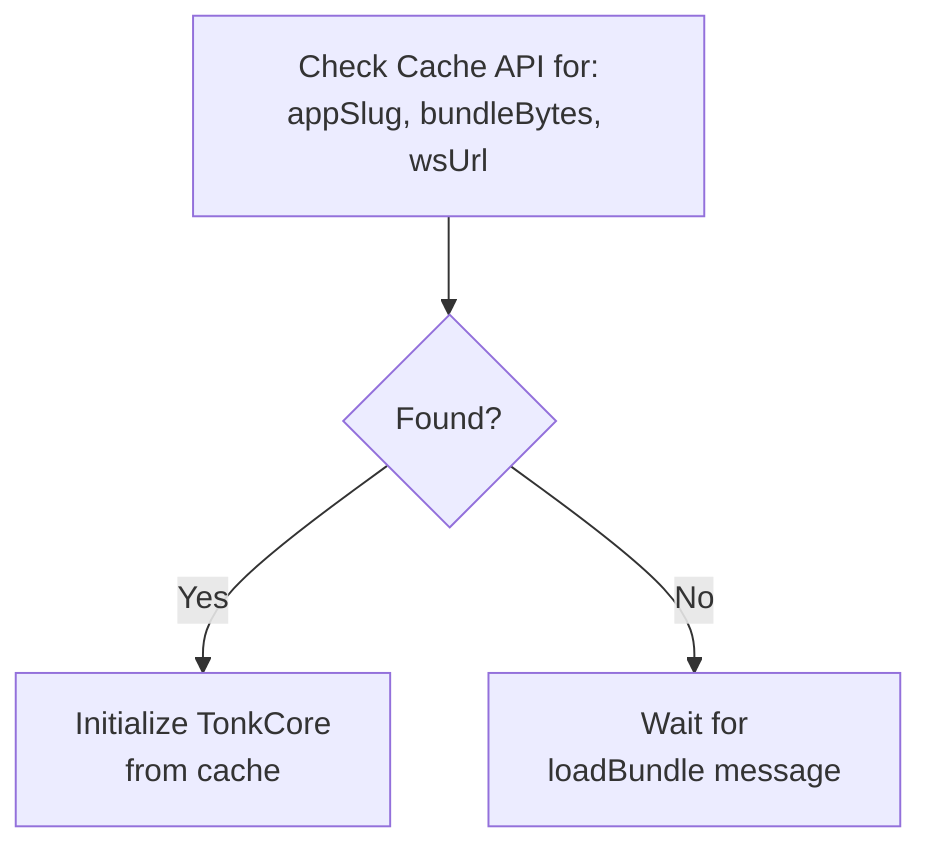
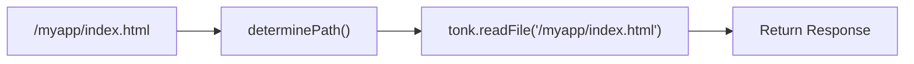

# Launcher Architecture

This document explains how the Tonk Launcher works, including bundle loading, service worker management, and the development workflow.

## Overview

The launcher has two parts:

1. **Launcher App** (`src/main.tsx` → `src/App.tsx`) — The main UI with sidebar for managing bundles
2. **Runtime App** (`src/runtime/main.tsx` → `src/runtime/RuntimeApp.tsx`) — Runs inside an iframe, manages the service worker, and hosts Tonk apps



## Package Structure

```
packages/launcher/
├── src/
│   ├── main.tsx              # Launcher entry - defensive SW cleanup
│   ├── App.tsx               # Launcher UI - bundle list, import, iframe
│   ├── index.css             # Global styles (Tailwind v4)
│   │
│   ├── launcher/             # Launcher-specific code (NOT shared with runtime)
│   │   ├── services/         # Business logic
│   │   │   ├── bundleStorage.ts   # IndexedDB bundle CRUD
│   │   │   ├── bundleManager.ts   # Import/export logic
│   │   │   └── __tests__/         # Vitest + fake-indexeddb
│   │   ├── sw/               # Service worker (separate build target)
│   │   │   ├── index.ts           # SW entry, event listeners
│   │   │   ├── state.ts           # BundleState machine (idle/loading/active/error)
│   │   │   ├── types.ts           # State types, MAX_RECONNECT_ATTEMPTS
│   │   │   ├── tonk-lifecycle.ts  # Bundle loading, cache restoration
│   │   │   ├── fetch-handler.ts   # Request interception, VFS serving
│   │   │   ├── cache.ts           # Cache API persistence
│   │   │   ├── connection.ts      # WebSocket health, reconnection
│   │   │   ├── wasm-init.ts       # WASM singleton initialization
│   │   │   ├── vfs-types.ts       # VFS type definitions
│   │   │   ├── message-handlers/  # Modular message routing
│   │   │   │   ├── index.ts       # Router + allowedWhenUninitialized
│   │   │   │   ├── init-ops.ts    # init, ping, loadBundle, getManifest
│   │   │   │   ├── file-ops.ts    # read/write/delete/rename/exists/patch
│   │   │   │   ├── directory-ops.ts
│   │   │   │   ├── bundle-ops.ts  # toBytes, forkToBytes
│   │   │   │   └── watch-ops.ts   # file/directory watchers
│   │   │   └── utils/
│   │   │       ├── logging.ts     # SW_LOG_LEVEL support
│   │   │       ├── path.ts        # determinePath()
│   │   │       └── response.ts    # postResponse()
│   │   └── types.ts          # Shared types (Bundle, VFSWorkerMessage)
│   │
│   ├── runtime/              # Runtime app (iframe, separate build)
│   │   ├── main.tsx               # Runtime entry (no StrictMode)
│   │   ├── RuntimeApp.tsx         # SW registration, bundle loading
│   │   ├── index.html             # Runtime HTML shell
│   │   ├── context/               # TonkContext for apps
│   │   ├── hooks/
│   │   │   └── useServiceWorker.ts # SW communication (120s timeout)
│   │   └── components/screens/    # Loading, Error screens
│   │
│   ├── components/           # Shared UI (folder-per-component)
│   │   ├── sidebar/
│   │   ├── account/
│   │   ├── sidebarButton/
│   │   └── ui/               # Generic primitives
│   │
│   ├── hooks/                # Shared hooks (useTheme)
│   └── lib/                  # Utilities (cn for classnames)
│
├── public/
│   └── app/                  # Pre-built runtime artifacts
│       ├── index.html             # Runtime HTML entry
│       ├── main.js                # Runtime bundle
│       ├── main.css               # Runtime styles
│       ├── service-worker-bundled.js
│       └── tonk_core_bg.wasm
│
├── scripts/
│   ├── build-runtime.ts      # Orchestrates SW + runtime build
│   ├── setup-wasm.ts         # Copies WASM from @tonk/core
│   └── watch-sw-copy.ts      # Dev mode SW file watcher
│
├── .ast-grep/rules/          # Architectural lint rules
│   ├── sw-no-react.yml            # No React in service worker
│   ├── no-cross-feature-imports.yml
│   ├── hook-naming.yml
│   └── prefer-cn-utility.yml
│
├── vite.config.ts            # Launcher build
├── vite.sw.config.ts         # Service worker build
└── vite.runtime.config.ts    # Runtime build
```

## Key Components

### 1. Bundle Storage (IndexedDB)

**File:** `src/launcher/services/bundleStorage.ts`

Bundles reside in IndexedDB under the database `tonk-launcher`. The launcher and runtime share this storage (same origin).

```typescript
// Save a bundle
await bundleStorage.save(id, { name, bytes, size });

// Retrieve a bundle
const bundle = await bundleStorage.get(id);

// List all bundles (metadata only)
const bundles = await bundleStorage.list();
```

### 2. Launcher App

**File:** `src/App.tsx`

The launcher displays available bundles and handles:

- Importing new bundles via file upload
- Launching bundles by setting the iframe URL

When launching a bundle:

```typescript
// Pass bundleId as query param - RuntimeApp fetches bytes from IndexedDB
setRuntimeUrl(`/app/index.html?bundleId=${encodeURIComponent(id)}`);
```

### 3. Runtime App

**File:** `src/runtime/RuntimeApp.tsx`

The runtime runs inside `/app/index.html` and:

1. Registers the service worker
2. Reads `bundleId` from URL params
3. Fetches bundle bytes from IndexedDB
4. Sends bytes to service worker via `loadBundle` message
5. Boots the first app in the bundle



### 4. Service Worker

**Directory:** `src/launcher/sw/`

The service worker forms the system's core. It:

- Manages TonkCore (the VFS/CRDT engine)
- Intercepts fetch requests and serves files from the VFS
- Handles bundle loading and initialization
- Persists state to Cache API for survival across restarts

#### Service Worker State

The service worker uses a state machine defined in `src/launcher/sw/types.ts`:

```typescript
type BundleState =
  | { status: 'idle' }
  | { status: 'loading'; bundleId: string; promise: Promise<void> }
  | {
      status: 'active';
      bundleId: string;
      tonk: TonkCore;
      manifest: Manifest;
      appSlug: string;
      wsUrl: string;
      healthCheckInterval: number | null;
      watchers: Map<string, { stop: () => void }>;
      connectionHealthy: boolean;
      reconnectAttempts: number;
    }
  | { status: 'error'; error: Error; previousBundleId?: string };

// Constants
const MAX_RECONNECT_ATTEMPTS = 10;
const HEALTH_CHECK_INTERVAL = 5000; // ms
```

#### Message Types

The service worker supports these messages (defined in `src/launcher/types.ts`):

**Initialization and Control (Page to SW):**

- `init` — Initialize with manifest and WebSocket URL
- `loadBundle` — Load bundle bytes into TonkCore
- `initializeFromUrl` — Initialize from manifest/WASM URLs
- `initializeFromBytes` — Initialize from raw bundle bytes
- `setAppSlug` — Set the current app slug for path resolution
- `getManifest` — Get manifest with entrypoints
- `getServerUrl` — Get configured server URL
- `ping` — Health check ping
- `handshake` — Initial handshake

**File Operations (Page to SW):**

- `readFile` — Read file from VFS
- `writeFile` — Write file to VFS
- `deleteFile` — Delete file from VFS
- `rename` — Rename/move file in VFS
- `exists` — Check if file exists in VFS
- `patchFile` — Patch JSON file at specific path
- `updateFile` — Update file content
- `listDirectory` — List files in VFS directory

**Watch Operations (Page to SW):**

- `watchFile` — Subscribe to file changes
- `unwatchFile` — Unsubscribe from file changes
- `watchDirectory` — Subscribe to directory changes
- `unwatchDirectory` — Unsubscribe from directory changes

**Bundle Operations (Page to SW):**

- `toBytes` — Export current bundle state as bytes
- `forkToBytes` — Fork and export bundle state as bytes

**Service Worker to Page Events:**

- `ready` — Service worker is ready
- `fileChanged` — Watched file was modified
- `directoryChanged` — Watched directory was modified
- `disconnected` — WebSocket connection lost
- `reconnecting` — Attempting to reconnect
- `reconnected` — Successfully reconnected
- `reconnectionFailed` — All reconnection attempts failed
- `watchersReestablished` — Watchers restored after reconnect
- `needsReinit` — Service worker needs reinitialization

#### Auto-Initialization from Cache

On startup, `autoInitializeFromCache()` attempts to restore state:



#### Fetch Interception

When `appSlug` is set, the SW intercepts same-origin requests:



## Build Artifacts

The runtime app and service worker are pre-built and placed in `public/app/`:

```
public/app/
├── index.html              # Runtime HTML entry
├── main.js                 # Runtime app bundle
├── main.css                # Runtime styles
├── service-worker-bundled.js  # Service worker bundle
└── *.otf                   # Fonts
```

## Build Commands

### Full Build

```bash
bun run build:runtime
```

This runs `scripts/build-runtime.ts`, which:

1. Builds service worker to `dist-sw/`
2. Builds runtime app to `dist-runtime/`
3. Copies both to `public/app/`
4. Cleans up temp directories

### Development Builds

**Service Worker only:**

```bash
TONK_SERVE_LOCAL=false vite build -c vite.sw.config.ts
cp dist-sw/service-worker-bundled.js public/app/
```

**Runtime App only:**

```bash
TONK_SERVE_LOCAL=true vite build -c vite.runtime.config.ts
cp -r dist-runtime/* public/app/
```

### Watch Mode (Dev)

```bash
bun run dev
```

This starts:

- Vite dev server for launcher on port 5173
- SW watch/rebuild in background (`watch:sw`)

**Note:** The runtime app (`public/app/main.js`) is not watched. Rebuild manually after changes to `src/runtime/`.

## Configuration Flags

### TONK_SERVE_LOCAL

Controls whether the service worker proxies requests to a local dev server.

- `true` — SW proxies requests to `http://localhost:4001` for HMR
- `false` — SW serves files from VFS bundle

**When to use each:**

- `TONK_SERVE_LOCAL=true`: Developing an app with hot reload (requires separate app dev server)
- `TONK_SERVE_LOCAL=false`: Loading pre-built bundles from IndexedDB (launcher scenario)

### TONK_SERVER_URL

The relay server URL for WebSocket sync.

- **Development:** `http://localhost:8081`
- **Production:** `https://relay.tonk.xyz`

## Data Flow: Loading a Bundle


## Troubleshooting

### Firefox Not Supported

Firefox does not yet support ES modules in Service Workers. The launcher displays an error message in Firefox.

**Fix:** Use Chrome or Safari.

### "Tonk not initialized" Errors

The service worker has not finished loading the bundle. Causes:

- Bundle loading in progress (race condition)
- Auto-initialization from cache failed
- `loadBundle` message failed

**Fix:** The SW now waits for initialization before handling fetch requests (15s timeout).

### CORS Errors with localhost:4001

The SW was built with `TONK_SERVE_LOCAL=true` but no app dev server is running.

**Fix:** Rebuild SW with `TONK_SERVE_LOCAL=false`:

```bash
TONK_SERVE_LOCAL=false vite build -c vite.sw.config.ts
cp dist-sw/service-worker-bundled.js public/app/
```

### RuntimeApp Changes Not Taking Effect

The `public/app/main.js` is pre-built and not watched in dev mode.

**Fix:** Rebuild the runtime:

```bash
vite build -c vite.runtime.config.ts
cp -r dist-runtime/* public/app/
```

### Service Worker Not Updating

Browsers cache service workers aggressively.

**Fix:**

1. DevTools → Application → Service Workers → "Unregister"
2. Hard refresh (Cmd+Shift+R / Ctrl+Shift+R)

### Bundle Loads but App Does Not Render

Check that:

1. `appSlug` is set correctly in SW
2. Files exist in VFS at `/{appSlug}/index.html`
3. The hosted app has no JavaScript errors
