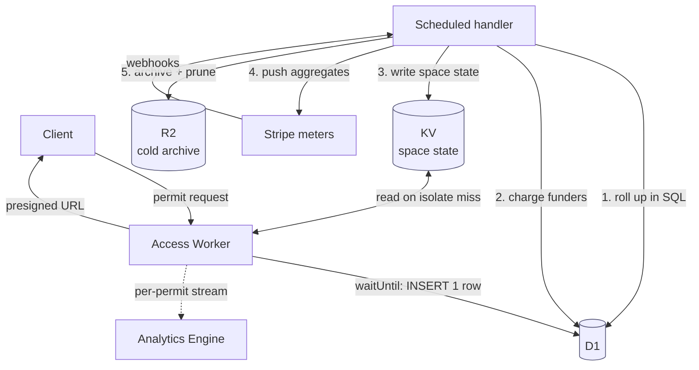
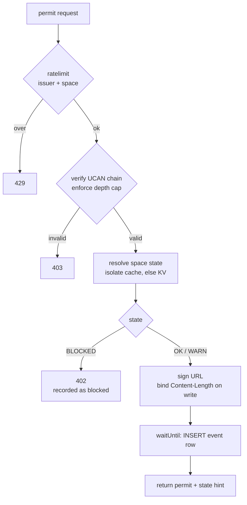

# Access Service: Metering, Rate Limiting, and Quota Enforcement

Status: draft for implementation
Scope: changes to the existing Cloudflare Worker access service, plus new supporting components

## 1. System today

A stateless Worker receives a permit request naming an R2 path `/space/<did:key>/<block>`, verifies a UCAN delegation chain against the DID in that path, and returns a presigned URL for a single GET or PUT.

Authorization is per block: one permit, one R2 operation. Presigning stays; proxying block traffic through the Worker is out of scope.

## 2. What is measurable

Properties of the current system. Inputs to the design, not decisions taken here.

| Property | Consequence |
|---|---|
| Presigned GETs bypass the Worker and R2 publishes no read access log | Reads can be counted at authorization and nowhere else |
| Tree references carry no block sizes | Read metering is by operation count. R2 charges by count too, so this tracks cost |
| Declared size is bound into the URL as a signed `Content-Length` | Write bytes are exact and enforced by R2 |
| Blocks are namespaced per space, duplicated across spaces | No shared-block attribution problem |
| Block reads are content addressed and client cached | Permits stay short lived; replay is bounded and low value |
| The branch revision pointer is mutable and polled | Its permit must be long lived, so one authorization covers unbounded reads. Open decision 8 |
| Delegation chains root at the space DID, which is self certifying | A valid chain proves authority over a space, not that the space was provisioned by this service. Provisioning is separate state, section 9 |

## 3. Billing units

| Unit | Source | Accuracy |
|---|---|---|
| Read operations | Read permits issued, per space | Exact modulo replay and unused permits |
| Write operations | Write permits issued, per space | Exact modulo unused permits |
| Write bytes | Signed `Content-Length` | Exact modulo unused permits |
| Storage GB-month | R2 bucket metrics, or write bytes minus deletions | Open decision 5 |
| Compute units | See 3.1 and open decision 7 | Exact as a count; conversion to cost is calibrated |

Read bytes are excluded: unmeasurable, and R2 egress is free, so there is no cost to recover.

Metering is **authorization-based, not delivery-based**. A permit is billed when issued whether or not the client uses it, because issuing it already consumed a Worker invocation. State this in customer-facing pricing terms.

### 3.1 Compute

Compute is billed in **compute units**, a count rather than a duration. The unit
must be deterministic, so that a disputed invoice line is reproducible, and
readable without leaving the request.

The runtime does not expose wall-clock CPU: as a Spectre mitigation `performance.now()`
and `Date.now()` advance only after I/O, so timing a pure-CPU section returns zero
in production while working under `wrangler dev`. Compute units therefore come from
instrumentation or from out-of-band reporting rather than from a timer. Which
mechanism, and whether compute is worth billing at all, is open decision 7.

Whatever the source, two properties hold. The conversion from compute units to
credits is a fitted approximation, versioned as `COST_SCHEDULE_VERSION` and
recorded per ledger entry so historical charges survive a refit. And compute is
largely collinear with permit count, the independent component being chain depth,
so its credit ratio stays low or customers pay twice for the same work.

## 4. Identity and funding

Three identities, easily conflated:

- **Space**, a `did:key`. Where data lives, and the R2 path namespace.
- **Remote**, service issued. The client-side actor a space is registered against.
- **Account**, the billing entity. Holds credits and a Stripe customer.

Provisioning binds a space to an account and is recorded in `space`. It is revocable, so it is state rather than something a delegation can attest: a chain proves present authority over a space, while provisioning is a fact about standing with this service that can change after any chain is issued.

Funding is **m:n**: an account funds many spaces, a space has many funders. So usage cannot be attributed to an account at authorization time, because attribution requires evaluating a policy over the funder list. Metering is therefore space-keyed, which is also the only identity the permit names, and attribution to accounts is a derived stage in the rollup.

### 4.1 Funding policy

Usage in a window is split across funders by **rotation**: operations are allocated round robin in `rank` order, so N funders each carry roughly 1/N. This divides integer operation counts rather than money, so no fractional charge reaches an invoice. The remainder is assigned starting from an offset derived from the window index, so it falls to a different funder each window.

A funder at or below zero is skipped and its share redistributed across the rest. A funder exhausting partway through has its remainder passed to the next in rank order.

A space is funded while **any** funder has credit.

Policy is swappable without migration: `ledger` records an explicit `payer` per entry, and `funding` is a list even at length one. Evaluation happens in the scheduled handler, so reading every funder balance costs nothing.

## 5. Architecture

The hot path writes one row per permit. A scheduled handler aggregates, charges, updates state, reports to Stripe, and archives. Stripe reporting needs a periodic job regardless, so the rollup adds a query to an existing component.



D1 takes the writes, R2 takes the archive, SQL does the aggregation. Appendix A has the reasoning.

## 6. Hot path



The gas counter is reset before step one and read at step F. Rate limiting and state resolution are the only additions that can reject a request, and neither performs IO on a warm isolate.

**Rate limiting** uses the Workers `ratelimit` binding on two namespaces, `issuer` and `space`. It is per-location and eventually consistent, so the effective global limit is roughly the configured limit times the number of locations a client reaches. Adequate for abuse control, not used for accounting. The binding counts calls unweighted, which is valid only while authorization stays per block; batch permits would invalidate it.

## 7. Schema

```sql
-- Append only. Swept to R2 and pruned once a window closes.
-- Keep free of secondary indexes: see appendix A.
CREATE TABLE event (
  id        INTEGER PRIMARY KEY,   -- rowid alias: no extra index, no extra write
  ts        INTEGER NOT NULL,
  window_id TEXT    NOT NULL,
  space     TEXT    NOT NULL,
  issuer    TEXT    NOT NULL,
  op        TEXT    NOT NULL,      -- read | write | blocked
  bytes     INTEGER NOT NULL DEFAULT 0,
  compute   INTEGER NOT NULL DEFAULT 0
);

CREATE TABLE usage_window (
  window_id   TEXT NOT NULL,
  space       TEXT NOT NULL,
  read_ops    INTEGER NOT NULL DEFAULT 0,
  write_ops   INTEGER NOT NULL DEFAULT 0,
  write_bytes INTEGER NOT NULL DEFAULT 0,
  blocked_ops INTEGER NOT NULL DEFAULT 0,
  compute     INTEGER NOT NULL DEFAULT 0,
  charged_at  INTEGER,
  PRIMARY KEY (window_id, space)
);

-- Provisioning record. Absence means the space was never provisioned here.
CREATE TABLE space (
  did          TEXT PRIMARY KEY,
  remote       TEXT NOT NULL,
  provisioned  INTEGER NOT NULL,          -- timestamp
  status       TEXT NOT NULL DEFAULT 'ACTIVE'  -- ACTIVE | SUSPENDED | RETIRED
);

CREATE TABLE account (
  id               TEXT PRIMARY KEY,
  balance          INTEGER NOT NULL DEFAULT 0,
  state            TEXT    NOT NULL DEFAULT 'OK',   -- OK | WARN | BLOCKED
  stripe_customer  TEXT,
  stripe_watermark TEXT
);

-- rank fixes the rotation order of section 4.1
CREATE TABLE funding (
  space   TEXT    NOT NULL,
  account TEXT    NOT NULL,
  rank    INTEGER NOT NULL,
  PRIMARY KEY (space, account)
);

CREATE TABLE ledger (
  id                    INTEGER PRIMARY KEY,
  ts                    INTEGER NOT NULL,
  window_id             TEXT    NOT NULL,
  space                 TEXT    NOT NULL,
  payer                 TEXT    NOT NULL,
  credits               INTEGER NOT NULL,
  credit_table_version  TEXT    NOT NULL,
  cost_schedule_version TEXT
);

CREATE TABLE cursor (name TEXT PRIMARY KEY, value INTEGER NOT NULL);
```

Windows are **fixed, not rolling**. `window_id` derives from `WINDOW_LENGTH` and the current time, so rotation happens by key with no bookkeeping.

The hot path inserts one row inside `ctx.waitUntil`, durable on return. Blocked requests are recorded with `op = 'blocked'`, since a client retrying against a blocked space still costs invocations.

## 8. Scheduled handler

**1. Roll up.**

```sql
INSERT INTO usage_window (window_id, space, read_ops, write_ops, write_bytes, blocked_ops, compute)
SELECT window_id, space,
       SUM(op = 'read'), SUM(op = 'write'), SUM(bytes),
       SUM(op = 'blocked'), SUM(compute)
  FROM event
 WHERE id > :cursor
 GROUP BY window_id, space
ON CONFLICT (window_id, space) DO UPDATE SET
  read_ops    = read_ops    + excluded.read_ops,
  write_ops   = write_ops   + excluded.write_ops,
  write_bytes = write_bytes + excluded.write_bytes,
  blocked_ops = blocked_ops + excluded.blocked_ops,
  compute     = compute     + excluded.compute;
```

Advance `cursor` in the same `db.batch()`, which is the only atomicity D1 offers. A failed batch leaves the cursor unmoved and the next run reprocesses the range, which is safe because the merge is keyed and idempotent.

**2. Charge.** For each closed `usage_window` row with `charged_at IS NULL`: convert to credits (section 11), read the space's funder balances, drop the exhausted, allocate by rotation (4.1), write one `ledger` row per payer, decrement balances, set `charged_at`.

**3. Recompute state.** Update `account.state` against the thresholds. For changed accounts, resolve spaces and write the derived value to KV:

```sql
SELECT DISTINCT f.space FROM funding f WHERE f.account IN (:changed)
```

The value is `UNPROVISIONED` when `space.status` is not `ACTIVE` or no `space` row exists, otherwise `BLOCKED` only when every funder is blocked, otherwise `WARN` or `OK`. Provisioning dominates: an unfunded space and a retired one are distinguishable to the client and only the first is worth topping up.

Deprovisioning deletes the KV key rather than rewriting it, so the next request takes the miss path and re-derives from D1.

**4. Push Stripe.** Section 10.

**5. Archive and prune.** Write closed windows to R2 as `events/{window_id}/{seq}.ndjson`, then delete from `event` in batched `DELETE ... WHERE window_id = ?`. R2 becomes the long-term audit record; D1 holds the live window plus `WINDOW_RETENTION` prior ones, so the table is bounded by retention rather than cumulative traffic.

If one space exceeds D1's per-database write ceiling, move its writes to a Durable Object keyed by space DID; `idFromName` creates instances without pre-allocation or rehashing. Build this when a space approaches the ceiling, measured.

## 9. Enforcement

The hot path reads a single **space-keyed** value, never a numeric balance and never an account, so no account resolution occurs on the hot path.

| Value | Meaning | Response |
|---|---|---|
| `OK` | Provisioned, funded | Issue permit |
| `WARN` | Provisioned, approaching a limit | Issue permit, return the state so the UI can surface it |
| `BLOCKED` | Provisioned, every funder exhausted | 402 |
| `UNPROVISIONED` | Not provisioned with this service, or retired | 404 |

`UNPROVISIONED` is what a valid delegation chain cannot tell you. A chain roots at the space DID, which is self certifying, so it proves present authority over the space and nothing about whether this service ever agreed to serve it. Provisioning is also revocable, so no credential issued at provisioning time can express current standing. It is a lookup by construction.

### 9.1 Resolution order

1. Isolate-local cache, if present and unexpired.
2. KV.
3. On KV **miss**, read `space` and the funder balances from D1, derive the value, and write it back to KV. A miss is not an answer, only an absent cache entry, so it must not deny on its own: KV is eventually consistent and a freshly provisioned space would otherwise be rejected until propagation completes.
4. On KV **error**, default to `OK` and alert. A KV outage should not stop every customer's sync, and a short fail-open window is bounded and recoverable. Open decision 1.

The distinction between miss and error is `null` versus a thrown read, so it is available at the call site.

Negative results are cached too, with `NEGATIVE_CACHE_TTL`, so requests against spaces that do not exist cannot convert misses into unbounded D1 reads. The `space` namespace of the rate limiter bounds the same traffic ahead of the lookup.

### 9.2 Staleness

Worst-case overdraft is the isolate cache TTL times peak burn rate for one space, plus KV propagation. Compute the sum and document it rather than assuming it small. Set the TTL after observing burn rate in phase 0.

Provisioning changes propagate the same way. Deprovisioning is not immediate, and a retired space stays servable for up to the cache lifetime. Where that matters, delete the KV key on retirement rather than waiting for expiry.

## 10. Stripe

Stripe is the invoicing system of record, not an enforcement input. Enforcement reads KV, derived from `account.balance`.

Push aggregated rollups, one per account per window. The meter endpoint allows 1,000 calls per second per account and one concurrent call per customer per meter, so per-event reporting is not viable.

- **Identifier** `{accountId}:{windowId}:{meterName}`. Uniqueness is enforced within a **rolling 24 hours only**, so any retry or backfill older than a day double-bills and must be prevented at the source.
- **Timestamps** must be within the past 35 days and under 5 minutes ahead. Anything later needs a manual credit adjustment.
- **Values** are whole numbers on the v1 endpoint.
- **Dimensions** are capped near 100 unique combinations per customer per meter, and events past the cap are rejected. Do not send space as a dimension; an account funding many spaces would silently start failing. Keep per-space detail in `usage_window` and `ledger` and render invoice detail from there.

Inbound webhooks (payment failure or success, subscription change, credit grant) update `account.balance` and `state`, then write affected space states to KV via the query in section 8 step 3. Handle idempotently on Stripe event ID.

## 11. Credit conversion

Do not fix the formula before data exists.

Anchor on marginal cost. A read permit is one Worker request plus one R2 Class B operation; a write permit is one Worker request plus one Class A, materially more expensive. Storage is per GB-month. Compute converts through the fitted schedule.

1. Run phase 0 metering only.
2. Observe distributions per space and per account. Fit the compute conversion. Measure the compute-to-permit correlation explicitly.
3. Define one credit as a round multiple of marginal cost, sized so typical monthly usage reads sensibly on an invoice.
4. Set integer ratios between units from observed cost proportions.
5. Publish the ratios, not the cost basis.

Set `price-per-compute-unit` as the actual monthly Cloudflare bill divided by total units, refit monthly. This recovers cost without maintaining a per-instruction schedule, and it stays correct if the traffic mix shifts.

The table lives in versioned configuration, with the version on every ledger entry so historical charges survive a repricing.

## 12. Configuration

| Key | Governs |
|---|---|
| `ROLLUP_CRON` | Metering latency, charge latency, Stripe cadence |
| `STATE_CACHE_TTL_MS` | Overdraft exposure, and how long a retired space stays servable |
| `NEGATIVE_CACHE_TTL` | How long an `UNPROVISIONED` result is cached before D1 is consulted again |
| `RATELIMIT_REGISTER` | Limit on the provisioning endpoint |
| `WINDOW_LENGTH` | Display granularity and Stripe push cadence |
| `WINDOW_RETENTION` | Closed windows held in D1 before archival |
| `RATELIMIT_ISSUER` / `RATELIMIT_SPACE` | Limit and period per namespace |
| `PERMIT_TTL_BLOCK_READ` / `_WRITE` / `_REVISION` | Replay window. Revision permits are longer lived, open decision 8 |
| `CHAIN_DEPTH_MAX` | CPU exposure per request |
| `WARN_THRESHOLD` / `BLOCK_THRESHOLD` | Credit fraction at which state transitions |
| `CREDIT_TABLE_VERSION` | Active conversion ratios |
| `COST_SCHEDULE_VERSION` | Active compute unit conversion |

## 13. Rollout

| Phase | Contents |
|---|---|
| 0. Meter | Full pipeline, no enforcement, no Stripe. Generous rate limits to establish a floor. Goal is distributions |
| 1. Calibrate | Fix credit ratios from phase 0. Build the usage display |
| 2. Warn | Enable `WARN` and Stripe reporting. Pipeline errors surface as wrong numbers, not outages |
| 3. Enforce | Enable `BLOCKED`. Tighten limits to observed plus headroom |

Do not compress 0 and 1. The formula is not derivable a priori, and guessing produces a repricing after launch.

## 14. Acceptance criteria

- A permit request on a warm isolate performs no blocking IO beyond chain verification.
- An event row is durable when the insert returns.
- A rollup failing partway leaves `cursor` unmoved, and rerunning produces identical `usage_window` totals.
- Archived R2 events reconcile exactly against the `usage_window` rows derived from them.
- `event` stays bounded by `WINDOW_RETENTION`.
- A Stripe push retried within the window does not double-bill.
- Three funders split a window into three roughly equal ledger entries, and the remainder falls to a different funder next window.
- A funder exhausting mid-window has its share reassigned, and the space stays unblocked while any funder has credit.
- Blocking propagates within `STATE_CACHE_TTL_MS` plus KV propagation, documented and tested.
- A permit request naming a space with no `space` row is denied, and a valid delegation chain does not change that.
- A space provisioned moments earlier is served on first request, before KV has propagated.
- A KV read error is served as `OK`; a KV miss is not, and falls through to D1.
- Repeated requests against nonexistent spaces do not produce a D1 read per request.
- Ledger entries recompute from `usage_window` plus a credit table version to the recorded values.
- Replaying an identical request yields an identical compute count, and no count leaks across requests sharing an isolate.

## 15. Open decisions

1. **Fail open or closed** on state resolution failure. Section 9 fails open on KV error and closed on a D1 miss. The open half is the one to revisit.
2. **Per-funder spend caps.** If yes, `funding` needs a per-edge limit and rotation treats a capped funder as exhausted for the window.
3. **Rotation or delegation-based attribution.** Section 4.1 specifies rotation over a server-side funder list. The alternative is a funding delegation rooted at the funder's account DID, presented alongside the access chain, so the permit names its own payer: attribution needs no policy, and enforcement could be account-keyed. It costs propagation (a new funder means redistributing delegations to every actor), revocation (a lookup, or short-lived refreshed delegations), and lets the actor rather than the space choose who pays. The axis is whether the payer is chosen by the actor or the space. A hybrid is possible: the list is the default, an optional delegation overrides. Turns on whether m:n is near-term or speculative; if speculative, rotation over a list of length one forecloses nothing.
4. **Funder visibility.** Can a co-funder see usage detail for a shared space? A privacy question when funders are different organisations.
5. **Storage metering source.** R2 bucket metrics per prefix, or write bytes minus deletions. The former is exact but may not exist at prefix granularity.
6. **Deletion and reclamation.** No path for credits returning when blocks are deleted. Needed if storage is billed.
7. **How compute units are obtained, if at all.** Two candidate mechanisms. **Gas instrumentation**: a `wasm-instrument`-style pass injects a per-basic-block counter as an exported global, read on the hot path into the same event row as the operation counts. Deterministic and free to read, but it sees only code inside the module, so confirm Ed25519 verification is Rust in the module rather than WebCrypto, that the tool parses the built artifact, that the counter survives `wasm-opt` and `wasm-bindgen`, and that overhead is acceptable. **Out-of-band reporting**: ingest `CPUTimeMs` from the `workers_trace_events` Logpush dataset, which needs no code change but is lossy (appendix A) and arrives after the window may have closed, so it suits calibration better than billing. Either way, decision 9 may make this moot: if verification stops dominating CPU, do not bill compute separately, since permit count already tracks it and internal margin can come from GraphQL aggregates.
8. **Branch revision poll metering.** The pointer permit is long lived, so one authorization covers unbounded reads. Options: extrapolate from TTL and an assumed poll interval (cheapest, unvalidatable); client self-report at renewal (a self-report that lowers a bill needs signing or accepted understatement); or serve the pointer from the Worker (exact by construction, one invocation per poll, and the Worker can cache the value for a second or two so N clients collapse to roughly one R2 read). Measure the poll-to-permit ratio in phase 0 first.
9. **Verification memoization.** A delegation chain is immutable and content addressed, so its verification result is a pure function of the chain CID. Caching the decision by CID for the delegation's remaining lifetime would make repeat polls a cache lookup. If the hit rate is high, verification stops dominating CPU and decision 7 resolves to not billing compute. Measure in phase 0.

## Appendix A: Rationale

Recorded once so the body does not carry it.

**Why D1 for writes.** R2 has no append, and one object per permit costs $4.50 per million against D1's $1.00 per million rows. R2 only wins when many events share an object, which needs a durable buffer, which costs about what the write it defers costs. D1 bills per row regardless of grouping, so a per-permit insert is durable on return with no buffering layer, and the first 50 million rows a month are included.

**Why R2 for the archive.** It bills per object, so a cron sweep amortises a whole window into one large object. Storage at $0.015 per GB-month with no size cap makes indefinite retention cheap, and it keeps D1 clear of its 10 GB ceiling without a shard pool.

**Why no secondary index on `event`.** An index adds one written row per insert touching the indexed column, doubling the expensive dimension to save reads priced a thousand times lower. It would pay only if it saved over a thousand row reads per row written. Query `usage_window` for per-space detail instead.

**Why SQL aggregation.** Pulling raw rows into a Worker incurs the identical `rows_read` charge, then adds serialization, CPU, and a 128 MB memory ceiling.

**Why Logpush is not a billing transport.** It cannot backfill; logs generated while a job fails are permanently lost, and a 2024 incident lost 55% of logs over 3.5 hours. Correlated, unrecoverable loss discovered at invoice time is a different class of failure from small uncorrelated loss. Fine for calibration.

## Appendix B: Glossary

| Term | What it is |
|---|---|
| **D1** | Serverless SQLite. Bills per row read and written, not per query. 10 GB per database |
| **R2** | S3-compatible object storage. Objects immutable, no append. Bills per operation |
| **KV** | Eventually consistent key-value store, read optimised, globally replicated |
| **Durable Object** | Single-threaded addressable instance with its own storage, named via `idFromName`. Storage bills at D1 row rates |
| **Analytics Engine** | High-cardinality sampled time series. Dashboards, forensics, and calibration; not durable enough to bill from |
| **Logpush** | Best-effort log delivery. Carries `CPUTimeMs` via `workers_trace_events` |
| **`ratelimit` binding** | Per-location, eventually consistent limiter. No IO, no extra cost |
