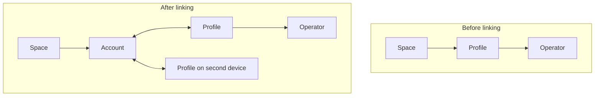

# Account and profile model

Status: draft. Captures the identity model for onboarding, account linking, and service registration. Companion to the access service metering spec, which depends on registration but not on how linking works.

## 1 Credentials

Three kinds of keypair participate, at descending durability.

### Account

An account serves same purpose as the **role** does in traditional access control list (ACL) - It is assigned set of permissions that members with those roles can excercise.

Our system uses an object capability model and we do not have central list. That means accounts are represented via [DID](https://www.w3.org/TR/did-core/) identifier and they are assigned permissions through [UCAN delegation](https://ucan.xyz/delegation/).

A deterministic Ed25519 keypair derived from a passkey. WebAuthn PRF extension is used to obtain a stable secret, signing a known phrase derives the keypair from the result.

> [!note]
>
> PRF is currently the only route to deterministic signatures from a passkey, so it is a hard dependency until we teach UCANs how to sign and verify with passkey directly [#450](https://github.com/ucan-wg/ucan/issues/450).

Passkeys are origin scoped by the browser, so the derivation phrase does not need to carry service-specific entropy to keep account DIDs distinct across origins. The phrase does admit multiple accounts per passkey if that is ever wanted, which is not planned.

The account is recoverable on any device that can present the passkey. It is the durable root of user identity.

**Profile.** A non-extractable keypair generated at onboarding and stored locally. It represents an authorization session on one device. It is not recoverable elsewhere, by construction, since the private key never leaves the device.

**Operator.** An ephemeral keypair created per application session. Operators represent a profile inside a specific application. They have no network access, so a compromised operator cannot exfiltrate the delegations it holds except by persisting them locally.

Accounts and profiles are also referred to as account credentials and profile credentials. This document uses the short forms.

## 2 Before linking

Onboarding creates a profile immediately. It is not linked to any account, and the user may not have one.

A space created in this state delegates to the profile, because the profile is the only durable key the client knows. The chain is space to profile to operator, and the operator drives the space.

The consequence is that these spaces are device local. There is no key outside the device that holds authority over them, so access cannot be recovered elsewhere. This is a known limitation of the pre-linking state, not a design goal.

Sync is unavailable in this state, since sync requires a registered account.

## 3 Linking

Linking establishes an account and connects it to the current profile. It runs three operations.

**Mutual powerline delegation.** The account delegates to the profile and the profile delegates to the account. Both directions assert that the profile is the same entity as the account on this device. The account to profile direction is what gives a device its authority. The profile to account direction carries forward everything the profile already holds.

**Direct space delegation.** Every space that currently delegates to the profile issues a fresh delegation directly to the account. The powerline delegation already makes those spaces transitively reachable from the account, so this step is redundant on the happy path. It exists for the compromise path: if the profile is later revoked, the transitive route dies at the profile, and only the direct route survives.

This enumeration is only possible at link time, while the client still holds the full local set. That is why both paths are established rather than relying on the transitive one.

**Cleanup.** Once the direct delegations exist, the space to profile delegations are redundant and are deleted locally. Deleting at link time closes the window in which a profile compromise would still confer space authority.

Deletion rather than revocation is acceptable under current assumptions. Delegation chains travel with invocations, so the service does see them, but the service verifies and discards rather than storing. Operators are local and networkless. So the only durable copies are on the device, and removing them removes them. See open question 4.

## 4 After linking

New spaces delegate to the account only. The profile receives authority by delegation from the account, the same as any other holder.

This completes the transition. Profile as a space anchor is a pre-linking workaround, not a permanent structural role. After linking the account is the sole anchor and authority flows downward from it.

The compromise response follows from this. Revoke the account to profile delegation, issue a replacement to a new profile, and nothing about the spaces changes.

Additional devices repeat the linking step. Each generates its own profile and exchanges mutual powerline delegations with the account. An account may have many profiles.

## 5 Linked state signal

Whether a profile has a linked account is read from the remote on the main
branch. If a remote exists whose subject is an account DID, the profile is
linked. If not, it is not.

No separate flag is stored. The remote is the state, and it is the same value
sync needs anyway.

## 6 Registration

Linking is local. Registration is the service side and is a distinct step: an
account may exist and be linked without being registered.

To register, the account delegates to the service the capability to write into a
branch of the account. The service verifies the delegation and marks the account
registered. From that point an upstream replica exists and push and pull are
available.

The metering spec treats the resulting record as the service-rooted grant. A
delegation chain rooted at a space DID proves present authority over the data
but says nothing about whether the service agreed to serve it. Registration
state is that agreement, held as a looked-up row rather than a credential, so it
can be revoked.

## 7 Open questions

1. **Which branch does the service write to.** The registration delegation grants
   write access to a branch of the account. Whether that is the main branch or a
   dedicated one for billing and metering state is unresolved. A dedicated
   branch narrows the grant, which argues for it.

2. **Delegation lifetime.** Whether the registration delegation is open ended or
   carries a TTL requiring renewal. A TTL gives the service a natural expiry to
   act on when a subscription ends, at the cost of a refresh path. This
   interacts with the metering spec's decision to hold provisioning as state
   rather than a credential.

3. **Recovery of pre-link spaces on a second device.** Spaces created before
   linking are reachable from the account after linking, so a second device
   linked to the same account reaches them. Worth confirming this holds for a
   device linked after the first device is lost, where no profile to profile
   path exists.

4. **Revocation.** Deletion is currently sufficient because the service does not
   store delegations. Making revocation meaningful would require the service to
   maintain and check a revocation list, which is a larger protocol change than
   issuing revocation records. Deferred deliberately.

5. **PRF availability.** Deterministic derivation depends on the WebAuthn PRF
   extension. Behaviour when a platform authenticator does not support it is
   unspecified, and there is no fallback path to a deterministic account key.
