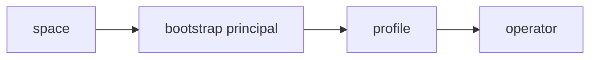
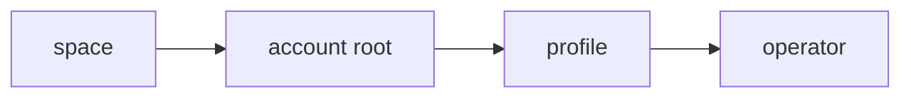

# Bootstrap key: a durable root before there is an account

A device has no account root until the user makes one, and everything awkward
about guests follows from that single gap. A guest chain terminates at an
ephemeral invite principal because there is nothing durable to terminate at, so
the invite URL has to be retained as the only way back to that authority.

Give the device a durable root from first boot and the gap closes. There is no
guest mode, no retained bearer secret, and no promotion flow, because every join
looks the same before and after an account exists.

## Shape

A **bootstrap key**: a symmetric secret minted on first boot, before any
account. Space secrets are stored encrypted under it, so delegations can be
recreated later.

> [!note]
> A symmetric key cannot be a UCAN principal. The signing identity is an
> asymmetric keypair derived from it (HKDF then Ed25519), the same derivation
> shape the passkey PRF path already uses. "Delegate to the bootstrap key" always
> means the derived principal.

Every space created or joined delegates to the bootstrap principal, which
delegates to the profile (device) key, which delegates to the operator.

When an account is created, each space's stored secret is decrypted and used to
mint a delegation direct to the account root. The bootstrap-rooted chains are
dropped, the encrypted secrets are deleted, and the bootstrap key is destroyed.

## Why symmetric rather than non-extractable Ed25519

The alternative is a non-extractable Ed25519 key: delegate everything to it,
re-delegate from it to the account at signup.

The two are close to equivalent on security. A non-extractable key cannot be
copied, but an attacker with the device can still sign a delegation to their own
key with a long expiry, which is durable unauthorized authority after they lose
access. The genuine difference is blast radius after exfiltration: a copied
symmetric key is immediately fatal off-device, while the non-extractable key
requires continued access to the device. In a browser, where both live in the
same storage, that gap is narrower than it sounds but is not zero.

What decides it is the chain, in two ways.

**Chain length.** Re-delegating from a non-extractable bootstrap key leaves
`space -> bootstrap -> account -> device -> operator` permanently, on every space
predating the account. Chain verification runs on every presign, which is why
dialog PR #413 exists at all (memoizing proven chains, after cold joins were
taking a minute). Recreating from stored secrets gives
`space -> account -> device -> operator`: the same shape a space created after
the account has, so there is exactly one chain shape in the system and nothing
downstream has to care when a space was created.

**Re-rooting more than once.** With a non-extractable key, destroying it after
minting `bootstrap -> account` means any space joined later cannot be re-rooted,
so the key would have to stay mintable forever. It is never really destroyed.
Stored secrets can be re-rooted at any time, repeatedly, with no signing key kept
hot.

## Relationship to the vault

The bootstrap key is the [[vault-key]]'s first wrapping, not separate machinery.
Before an account exists the vault has exactly one wrapping (the bootstrap key);
account creation adds the account and passkey wrappings. Encrypting space
secrets under the vault rather than under a bare bootstrap key means the
onboarding case is not a special path at all.

## What this retires

- **Guest vs durable membership.** Every join delegates identically. The
  distinction only ever existed because a guest had no root.
- **The retained invite URL** (`tonk-guest-invite-v1:*`) and the credential-store
  blob holding it, along with `save_guest` / `clear_guest` / `guest_leases`.
- **Promotion.** Creating an account re-roots every space at once, so there is
  nothing to promote per space, and it works after an invite has expired or been
  revoked.
- **`/membership`.** Membership is a roster row on the content branch, which is a
  fact and therefore subscribable. `member_did()`'s profile fallback becomes the
  bootstrap principal.

## Open questions

- **No backup before an account.** The bootstrap key is device-local by
  construction, so clearing the browser profile loses every space that predates
  the account. That may be the honest answer, but it should be stated to the
  user, and it argues for prompting account creation earlier.
- **Interrupted migration.** Re-rooting N spaces is not atomic. Each space is
  independent, so the operation is resumable if the encrypted secret is deleted
  only after its account-rooted delegation is durably saved. Order matters the
  same way it does in the existing rotate path.
- **Does the space secret need to persist at all after re-rooting?** Once a space
  is account-rooted, the account can mint whatever it needs. Keeping the secret
  buys re-rooting to a *different* account later, which may not be a case worth
  supporting.
