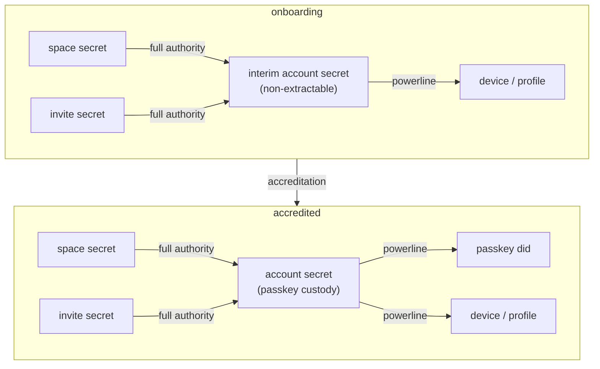
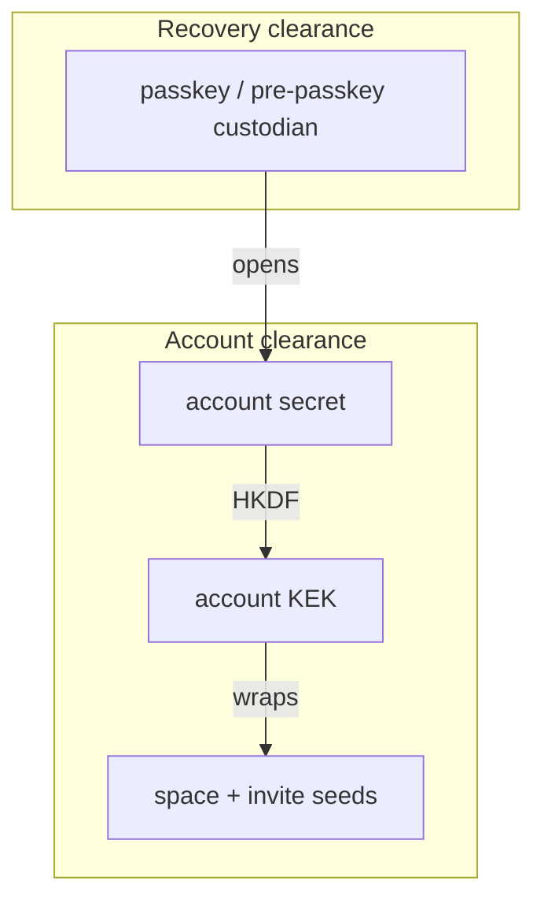

# Onboarding and accreditation

A device's life has two states. During **onboarding** it has no account, and
everything it creates is custodied under an *interim account*. At
**accreditation** the user makes a real account and every custodied thing moves
across.

The onboarding account is a **real account**, not a placeholder: same secret
shape, same custody envelope, same delegations. Only the custody method differs
— a non-extractable WebCrypto key during onboarding, a passkey once accredited.

Accreditation is therefore **account key rotation**, not a bespoke migration.
That matters twice over: it is an operation we need anyway (a compromised
passkey, a lost device), and building it here means accreditation is its first
caller rather than a one-off path that will rot.

> [!caution]
> The account secret must actually rotate. Re-wrapping the *same* secret under a
> passkey would leave the pre-passkey custodian holding the account forever, so a
> compromise before accreditation would extend to everything the account acquires
> afterwards. Rotating bounds the blast radius to what existed before: the worst
> case is an attacker controlling pre-passkey spaces, not the account itself.

## Clearance

Every stored secret sits at one of two levels, and a key at one level wraps only
secrets at that level. The levels are ordered by blast radius, so what a
compromise costs is exactly the subtree beneath the key that leaked.

| Level | Key comes from | Wraps | Compromise costs |
|---|---|---|---|
| **Recovery** | passkey PRF, recovery phrase, or the pre-passkey custodian | the account secret | everything |
| **Account** | `HKDF(account secret)`: the account KEK, and the X25519 encryption key seeds are sealed to | space seeds, invite seeds | spaces and invites, not the account |

> [!note]
> There is no device-scoped third level. Session state and the local root grant
> look like candidates, but a session record holds a KDF *context* whose other
> half is the profile seed, and a local root is a delegation, which is a proof
> rather than a key. Nothing is recoverable-by-this-profile-alone today.

The levels are types (`Kek<Recovery>`, `Kek<Account>`), so wrapping the account
secret with an account-level key is a compile error. The level is also
a byte in the envelope header, bound in as AEAD associated data, which catches
a mis-tiered blob arriving over the wire where no type travelled with it, and
makes re-tagging one fail as tampering.

> [!caution]
> The account KEK derives from the account secret, so rotating that secret
> rotates the KEK. Every seed wrapped under it must be re-wrapped during
> accreditation. That re-wrap is not overhead, it is step 5: it is what lets a
> space be re-issued under the new account instead of leaving the old one in the
> chain forever.

## Onboarding

1. Generate an **interim account secret**, same shape as an account secret but
   in non-extractable form.
2. Delegate through the powerline from interim to the account key.
3. For every new space, generate a secret to derive its keys from. Seal it to
   the interim account's encryption key and store it as a `CustodiedSeed` fact
   in the account DB, keyed by the derived `did:key`.
4. Delegate full authority from every space to the interim account.
5. For every open invite joined, seal the invitation secret the same way, as
   a `CustodiedSeed` with `kind = tonk:invite`: the membership hangs off
   that principal, so re-issuing it at rotation is the joiner's job.
6. Delegate full authority from the invite key to the interim account key.

## Accreditation (= account rotation)

1. Generate a **new** account secret.
2. Create a passkey to derive the KEK and Ed25519 keys from.
3. Custody the new secret via the passkey, stored in the passkey's DID space as
   today.
4. Delegate through the powerline from the new account to the passkey DID.
5. Re-issue every space and invite under the new account: because their secrets
   are custodied, this mints `space -> account2` directly rather than appending
   `account1 -> account2`. Open every seed sealed to the old encryption key,
   re-seal to the new one, retract the old rows.
6. Revoke the old account's delegation to the profile.
7. Create a delegation from the new account to the profile.
8. Delete every space and invite key from credentials, and the old account key.

> [!note]
> Step 5 is why the secrets are custodied at all. Without them, rotation could
> only append `account1 -> account2`, leaving the compromised account in every
> chain forever — which defeats the purpose of rotating. Re-issuance is the
> whole point, and it is only possible if the origin secret survives.

## Why custody rather than delegation-only

Keeping the secrets means a space can be *re-issued* rather than only extended.
That is what lets accreditation produce `space -> account -> device` instead of
appending the account below an interim hop that stays forever.

It also leaves the larger question open. Because every space and invite is
custodied end to end, we can decide later whether to keep storing secrets — to
enable account key rotation — or to drop them and let chains grow a hop when a
re-root is needed. Dropping that ability is a one-way door; retaining it is not.

> [!note]
> Space seeds are sealed bytes, not non-extractable handles. Non-extractable
> would be stronger against on-device code execution, but it is also
> non-replicable: only the device that generated a space could ever re-issue
> it, and a second device could never hold the origin authority. Sealing keeps
> the seeds replicable and re-issuable, which is what account rotation needs.
> The one non-extractable key we keep is the pre-passkey custodian, because it
> stands in for a passkey and must be as uncopyable as one.

> [!important]
> Seeds are sealed to the account's **X25519 public key** (2026-08-25), not
> wrapped under the account KEK. The KEK only exists inside a passkey ceremony,
> and a CLI device never has one, so a symmetric wrap would make space creation
> browser-only. Sealing to a public key lets any device holding the account DB
> seal, while opening still needs the ceremony. The key, the envelope, and the
> `CustodiedSeed` fact are specified in `authority-facts.md`.

## Not yet built

- **Destroying the onboarding custodian.** Demotion (overwriting the key record
  with its own public half) is the mechanism, since the credential API has no
  retract for keys. It belongs with step 8 and lands when accreditation does.
- **Seed custody.** `AccountSecret::account_kek` exists; the X25519 encryption
  key, the `Sealed` envelope, `AccountEncryptionKey`, `CustodiedSeed`, and the
  seal-on-create writers are step 3 of `authority-facts.md` and not yet landed.
  Until then a space's secret lives only on the device that created it.

## Ordering

Step 8 deletes only after step 5 has durably saved the account-rooted
delegations. A key removed before its replacement lands would strand the space
with no origin authority and no account hop. Each space is independent, so an
interrupted accreditation is resumable: what has not been migrated still has its
interim custody intact.

Step 6 before step 7 is deliberate — the interim delegation is revoked before
the account's own is created, so there is no window where both are live.

## Open

- **Re-wrapping every seed is the cost of rotation.** The account KEK derives
  from the account secret, so accreditation must unwrap and re-wrap every space
  and invite seed. Each is independent, so this is resumable, but it is
  proportional to how much a device accumulated before accreditation.
- **The onboarding window is unbounded.** A space created and left un-accredited
  keeps a live signing key on that device. Shorter than "forever", longer than
  the ephemeral keys it replaces.
