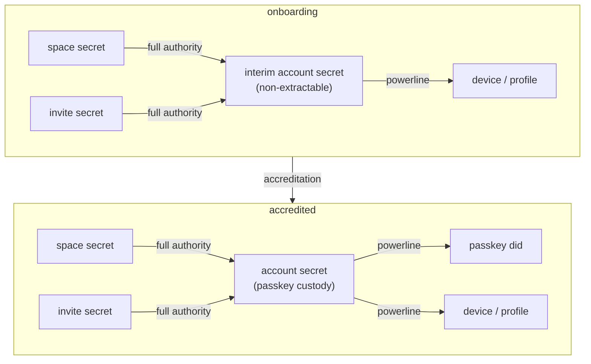

# Onboarding and accreditation

A device's life has two states. During **onboarding** it has no account, and
everything it creates is custodied under an *interim account*. At
**accreditation** the user makes a real account and every custodied thing moves
across.

The onboarding account is a **real account**, not a placeholder: same secret
shape, same custody envelope, same delegations. Only the custody method differs
— a non-extractable WebCrypto key during onboarding, a passkey once accredited.

Accreditation is therefore **account key rotation**, not a bespoke migration.
That matters twice over: it is an operation we need anyway (a compromised
passkey, a lost device), and building it here means accreditation is its first
caller rather than a one-off path that will rot.

> [!caution]
> The account secret must actually rotate. Re-wrapping the *same* secret under a
> passkey would leave the pre-passkey custodian holding the account forever, so a
> compromise before accreditation would extend to everything the account acquires
> afterwards. Rotating bounds the blast radius to what existed before: the worst
> case is an attacker controlling pre-passkey spaces, not the account itself.

## Onboarding

1. Generate an **interim account secret**, same shape as an account secret but
   in non-extractable form.
2. Delegate through the powerline from interim to the account key.
3. For every new space, generate a secret to derive its keys from. Store it
   under interim account custody, encrypted, as a credential keyed by the
   derived `did:key`.
4. Delegate full authority from every space to the interim account.
5. For every invite, put the invitation secret under account custody the same
   way: encrypted, credential keyed by its derived `did:key`.
6. Delegate full authority from the invite key to the interim account key.

## Accreditation (= account rotation)

1. Generate a **new** account secret.
2. Create a passkey to derive the KEK and Ed25519 keys from.
3. Custody the new secret via the passkey, stored in the passkey's DID space as
   today.
4. Delegate through the powerline from the new account to the passkey DID.
5. Re-issue every space and invite under the new account: because their secrets
   are custodied, this mints `space -> account2` directly rather than appending
   `account1 -> account2`. Move custody from credentials into the account DB.
6. Revoke the old account's delegation to the profile.
7. Create a delegation from the new account to the profile.
8. Delete every space and invite key from credentials, and the old account key.

> [!note]
> Step 5 is why the secrets are custodied at all. Without them, rotation could
> only append `account1 -> account2`, leaving the compromised account in every
> chain forever — which defeats the purpose of rotating. Re-issuance is the
> whole point, and it is only possible if the origin secret survives.

## Why custody rather than delegation-only

Keeping the secrets means a space can be *re-issued* rather than only extended.
That is what lets accreditation produce `space -> account -> device` instead of
appending the account below an interim hop that stays forever.

It also leaves the larger question open. Because every space and invite is
custodied end to end, we can decide later whether to keep storing secrets — to
enable account key rotation — or to drop them and let chains grow a hop when a
re-root is needed. Dropping that ability is a one-way door; retaining it is not.

> [!note]
> Space secrets are held as non-extractable WebCrypto keys, which IndexedDB
> stores as live `CryptoKey` handles (`KeyExport::NonExtractable`). No key bytes
> exist on disk, so compromising the interim account secret does not yield space
> authority — an attacker needs code execution on the device, and still cannot
> exfiltrate anything reusable elsewhere.

## Ordering

Step 8 deletes only after step 5 has durably saved the account-rooted
delegations. A key removed before its replacement lands would strand the space
with no origin authority and no account hop. Each space is independent, so an
interrupted accreditation is resumable: what has not been migrated still has its
interim custody intact.

Step 6 before step 7 is deliberate — the interim delegation is revoked before
the account's own is created, so there is no window where both are live.

## Open

- **Non-extractable means non-replicable.** Only the device that created a space
  can re-issue it. A second device is delegated to by the account rather than
  re-issuing, so account rotation has a per-device step.
- **The onboarding window is unbounded.** A space created and left un-accredited
  keeps a live signing key on that device. Shorter than "forever", longer than
  the ephemeral keys it replaces.
