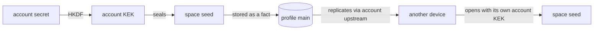

# The profile DB

Where a device keeps what it knows, and which of it is secret.

## The rule

**Credentials hold private key material. Everything else is a fact.**

A key that must never exist as bytes has exactly one possible home: a
`.key()` credential, the only store that can hold a non-extractable
`CryptoKeyPair` handle. Everything else — pointers, lists, config, and
*sealed secrets* — is data, and data belongs in the fact DB, where it is
queryable, subscribable, and converges on re-assert instead of being a
read-modify-write blob.

> [!note]
> Ciphertext is data. This is the step that is easy to get backwards: a sealed
> seed is not a secret needing a secret store, it is a blob whose safety comes
> from the seal. Putting it in the fact DB is what lets it replicate, and
> replicating is the whole point.

The profile's own signing key is the one exception, and it is already handled:
`Profile::open` generates, stores, and loads it. Nothing else needs to bootstrap.

## What goes where

### Credentials

| Address | Why |
|---|---|
| `tonk-onboarding-custodian-v1` | Non-extractable keypair. No other store can express that. |

That is the whole list. Plus the profile signing key, which `Profile::open`
owns and which no caller touches.

### Facts on profile main — sealed

| Fact | Sealed under | Clearance |
|---|---|---|
| `AccountEnvelope` | onboarding custodian | Recovery |
| `CustodiedSeed` (space, invite) | account KEK | Account |
| customer credential | account KEK | Account |
| pending-work credential | account KEK | Account |

### Facts on profile main — plain

Account provider reference (config). Plus what already lives there: `Replica`,
the space directory.

### Facts on the registry profile's main

| Fact | Why |
|---|---|
| `ActiveProfile` | A pointer. Read from the registry, which is itself an opened profile. |
| `ProfileRosterEntry` | One entity per profile, not a serialized `Vec`. |

> [!caution]
> The roster is currently a JSON `Vec<RosterEntry>` in one credential site,
> which makes every update a read-modify-write and gives concurrent worker
> writes a lost-update race. One entity per profile removes the race, since
> content-derived entities converge on re-assert.

### Not stored here

`Membership` lives on a *repository's* content branch, not the profile. Roster
facts belong on the branch that syncs between members; on a device-local branch
a roster would only ever show one device.

## Why sealed seeds must be facts

This is the load-bearing decision, and it inverts the intuition.



The credential store is device-local. A seed there is stranded: lose the device
and that space can never be re-issued, which means account rotation can only
re-issue spaces created on *this* device. Profile main replicates through the
account upstream, so a sealed seed reaches exactly the devices that can open the
account — the same set that should have it.

That is also why the seeds are wrapped bytes rather than non-extractable
handles. Non-extractable resists on-device code execution better, but it cannot
replicate. See `plan/onboarding-accreditation.md`.

### Shape

One entity per custodied seed, keyed by the DID it derives, so a lookup is
"find the seed for this space" without already knowing the seed:

```
CustodiedSeed   this = hash(subject)
                subject    → the space or invite DID
                envelope   → sealed bytes (clearance byte = account)
                generation → which account secret sealed it
```

`generation` makes rotation resumable: accreditation re-wraps every seed under
the new account KEK, and a seed still carrying the old generation is one that
has not been migrated. An interrupted accreditation restarts by looking rather
than by remembering.

> [!note]
> `generation` has no writer yet. The envelope carries the field, reserved at 0,
> and nothing increments it until rotation ships. It is in the shape now because
> adding it later would mean migrating every sealed seed.

## The overlay

Not a fourth store so much as a mode: facts asserted onto an open branch and
folded into every read, but **never committed**. They die with the worker.
`SpaceLocal`, `JoinStatus`, `JoinFailureFact`.

Callers stamp them at boot and whenever the thing they describe changes. A
secret must never be an overlay fact — not because the overlay leaks, but
because anything that vanishes on restart cannot be custody.

## Ordering

1. **`CustodiedSeed`.** Blocks accreditation; nothing blocks it.
2. **`AccountEnvelope` off credentials** onto profile main. Same tier, and the
   custodian that seals it already exists.
3. **Registry facts** — roster and active pointer. Independent of 1 and 2, and
   it fixes the roster's lost-update race.
4. **The remainder** — customer credential, pending work, provider reference.
   Nothing depends on these moving.

## Open

- **Is the local root read before its profile opens?** If so it is genuinely
  bootstrap and stays a credential; if not it is a delegation like any other.
  One grep, worth doing before step 4 rather than assuming.
- **Fact contents are not encrypted.** Clearance governs secret custody, not
  confidentiality: `Replica` and the space directory are plaintext triples that
  profile main replicates. Correct for a roster, and worth being explicit that
  clearance says nothing today about who can read your data. E2EE over branch
  contents is separate; `ENCRYPTION_CONTEXT` is reserved for it and has no
  derivation function on purpose.
