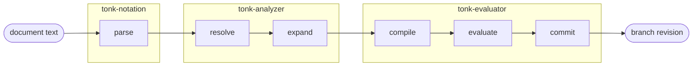
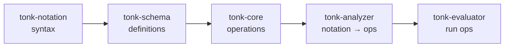

# Tonk Runtime

Status: spec. Describes the runtime that turns a tonk-notation
document into committed facts: the crates it spans and the
lifecycle a document passes through.

## Lifecycle

A document moves through six stages, owned by four crates:



The three `Syntax` entry points are nested prefixes — each runs
the prior under the hood:

| Entry point        | Runs stages                                    |
|--------------------|------------------------------------------------|
| `syntax.analyze()` | resolve, expand                                |
| `syntax.compile()` | resolve, expand, compile                       |
| `syntax.evaluate()`| resolve, expand, compile, evaluate, commit     |

- **parse** — document text → a `Syntax` tree. Pure syntax: no
  branch, no schema.
- **resolve** — bind every reference in the tree against a
  branch. A bare concept name becomes a resolved
  `ConceptDefinition`; a `?var` is recorded; descriptors are
  attached. Source shape is preserved.
- **expand** — lower notation sugar (domain predicates, `&anchor`,
  omitted `this:`) into kernel-shaped forms. After expand every
  write is a concept-shaped `Claim`.
- **compile** — turn the resolved, expanded tree into runnable
  operations: query plans for the read side, `Claim` batches for
  the write side.
- **evaluate** — run those operations against a transaction
  overlay: execute the queries, run the effects fixpoint
  (`induce`), integrate the claims. The overlay now reflects
  every read result and pending write.
- **commit** — seal the overlay into a durable branch revision.

The stages group into named umbrellas:

- **analyze** = `resolve` + `expand`.
- **compile** runs `analyze` first, then lowers to operations.
- **evaluate** runs `compile` first, then runs the operations and
  commits.

Each is a prefix of the next, so each is a usable entry point on
its own (see "Driving the lifecycle").

## Crates

Five crates, each with one charter. Dependencies form a line —
each crate depends only on those before it:



- **`tonk-notation`** — the syntax layer. Parses document text
  into a `Syntax` tree. Knows nothing of branches or schema.
- **`tonk-schema`** — the *definitions*: the concepts the runtime
  is seeded with — concept / attribute / rule definitions, the
  built-in registry, the meta-branch concepts (replica, branch,
  remote, tracking branch) — plus the resolution surface that
  reconstructs a definition from a branch. Everything here is a
  schema definition or resolves one.
- **`tonk-core`** — the *operations* against a branch: `Claim` (a
  typed write), `Query` (a read request), `Conclusion` (a read
  result), `TransactRequest` (a `Claim` batch). Not concepts —
  reads and writes *over* concepts. Sits below everything that
  issues an operation: the worker, the UI crates, the analyzer,
  the evaluator.
- **`tonk-analyzer`** — performs `resolve` + `expand`. Turns a
  `Syntax` tree into an `Analysis`.
- **`tonk-evaluator`** — performs `compile`, `evaluate`, `commit`.
  Lowers an `Analysis` to operations, runs them, seals the result.

A `Source` (dialog's query target — a `Branch` or a `Transaction`
overlay) flows in from the side: every crate from `tonk-schema`
rightward is generic over it. The UI crates (`tonk-display`,
`tonk-concept`) and the worker depend on `tonk-core` for
`Query` / `Conclusion` / `Claim`; they do not depend on the
analyzer or evaluator.

All trait bounds use `dialog_common::ConditionalSend` /
`ConditionalSync`, so the same source compiles native and
`wasm32`.

## Driving the lifecycle

The lifecycle is driven by three chain handles on `Syntax`,
matching the `induce` idiom — a method stages the work, `.perform`
runs it. Each is a prefix of the next:

```rust
syntax.analyze(source).perform(env)   // -> Analysis   resolve + expand
syntax.compile(source).perform(env)   // -> Compiled   analyze, then compile
syntax.evaluate(txn).perform(env)     // -> Evaluated  compile, run, commit
```

- **`analyze`** is pure-read: takes a `Source` (a `Branch` for the
  common case), runs `resolve` + `expand`, yields an `Analysis`.
- **`compile`** runs `analyze` under the hood, then lowers the
  tree to runnable operations — also pure-read, also a `Source`.
- **`evaluate`** runs `compile` under the hood, then *runs* the
  operations and commits. It writes, so the caller creates a
  `Transaction` and hands it in; `evaluate` resolves against that
  transaction's overlay, so a concept declared earlier in the
  same document resolves for a later statement.

```rust
// tonk-analyzer
pub trait SyntaxAnalyzeExt {
    fn analyze<S: Source>(&self, source: S) -> Analyze<'_, S>;
}
// .perform(env) -> Analysis

// tonk-evaluator
pub trait SyntaxCompileExt {
    fn compile<S: Source>(&self, source: S) -> Compile<'_, S>;
}
// .perform(env) -> Compiled        — runs analyze internally

pub trait SyntaxEvaluateExt {
    fn evaluate<'a>(&self, txn: Transaction<'a>) -> Evaluate<'_, 'a>;
}
// .perform(env) -> Evaluated       — runs compile internally
```

## Resolution

`resolve` reconstructs schema definitions from a branch. Schema
lookups query through **`dialog_query::Source`**, which both
`Branch` and the `Transaction` overlay provide. Each lookup is a
chain handle: a `resolve` method stages the work, `.perform(env)`
runs it.

A **reference** names a thing; resolving it yields the thing's
**definition**:

```
ConceptReference   --resolve.perform-->  ConceptDefinition
AttributeReference --resolve.perform-->  AttributeDefinition
```

### References

A `ConceptReference` names a concept — by entity, or by published
name. Constructed via `From`, so the caller never matches a
variant:

```rust
/// Names a concept: a direct entity, or a published name to look
/// up. The name/entity split is internal.
pub struct ConceptReference(/* private: Entity | name */);

impl From<Entity>         for ConceptReference {}
impl From<NamedReference> for ConceptReference {}

impl ConceptReference {
    pub fn resolve<S: Source>(self, source: &S) -> ResolveConcept<'_, S>;
}
pub struct ResolveConcept<'a, S> { source: &'a S, reference: ConceptReference }
impl<'a, S: Source> ResolveConcept<'a, S> {
    pub async fn perform<Env: QueryEnv + ConditionalSync>(self, env: &Env)
        -> Result<Option<ConceptDefinition>, IntrospectionError>;
}
```

`AttributeReference` is the same shape, yielding
`AttributeDefinition`. Per-kind types keep resolution
type-correct — an attribute entity can't be resolved as a concept.

```rust
let definition = ConceptReference::from(entity)
    .resolve(source).perform(env).await?;
// or, starting from a name:
let definition = ConceptReference::from(NamedReference("person".into()))
    .resolve(source).perform(env).await?;
```

`NamedReference` is the published-name newtype — `id:<n>` carries
a `dialog.name/referent` claim. It is the home for the
name→entity lookup, and a `From` source for the typed references.

```rust
/// A published name. Distinct from the `meta::Name` concept
/// schema type — this is the reference, not the stored claim.
pub struct NamedReference(pub String);
```

### Definitions

```rust
pub struct ConceptDefinition {
    pub entity: Entity,
    pub descriptor: ConceptDescriptor,
    pub transient: bool,
}
pub struct AttributeDefinition {
    pub entity: Entity,
    pub descriptor: AttributeDescriptor,
}
```

`ConceptDefinition` and `AttributeDefinition` are the resolved
result — a concept / attribute reconstructed from a branch:
entity + descriptor, a concept also carrying its transient flag.
One type per kind, in `tonk-schema`.

`resolve`'s `perform` reconstructs the descriptor from the
entity's EAV facts; a concept's `perform` resolves each field
attribute via
`AttributeReference::from(attr_entity).resolve(source).perform(env)`.

### Enumeration

`resolve` answers "this one"; `list` answers "all of them" — the
same chain shape, hung off the type it produces:

```rust
impl ConceptDefinition {
    /// Every concept on the branch, fully resolved.
    pub fn list<S: Source>(source: &S) -> ListConcepts<'_, S>;
    // .perform(env) -> Vec<ConceptDefinition>
}

impl NamedReference {
    /// Every published name and the entity it points at.
    pub fn list<S: Source>(source: &S) -> ListNames<'_, S>;
    // .perform(env) -> Vec<Name>
}
```

`NamedReference::list` does not yield definitions — a published
name can point at any entity (a concept, a concept instance, an
attribute). It yields `meta::Name`, the concept that models a
name → target binding (`{ this, entity }`).

Enumeration serves editor completion — offering every concept, or
every published name, for the symbol under the cursor.

### Resolving without a branch

The language server's parse-diagnostics path has no branch. It
resolves against `EmptyStore` — a fact-less `Source` — so every
`perform` returns `Ok(None)` / empty.

### The language-server boundary

`IntrospectionFactory::for_uri` is late-bound (URI → branch, per
request). It returns a bundle of boxed async closures — one per
lookup — each capturing the request's concrete `Source`:

```rust
type ConceptLookup =
    Arc<dyn Fn(&str) -> BoxFuture<Option<ConceptDefinition>> + Send + Sync>;
```

This is the one `dyn` boundary in the runtime; everything else
stays fully monomorphic.

The resolution surface — `ConceptReference` / `AttributeReference`,
`ConceptDefinition` / `AttributeDefinition`, `NamedReference`,
`IntrospectionError` — lives in `tonk-schema`, alongside the
`meta::Name` concept it enumerates.

## The `Analysis<T>` tree

`analyze`'s output is an `Analysis<T>` — each parsed syntax node
paired with its computed analysis through one generic:

```rust
pub trait Analyzable {
    /// The analysis payload computed for this syntax node.
    type Analysis;
}

/// A syntax node paired with its analysis. The source pairing is
/// structural — diagnostics and result projection read the
/// span / head name straight off `.source`.
pub struct Analysis<T: Analyzable> {
    pub source: T,
    pub analysis: T::Analysis,
}
```

The document is `Analysis<Syntax>`, an expression is
`Analysis<Expression>`, an assertion is `Analysis<Assertion>`. The
`Analyzable` impls land on `tonk_notation`'s concrete payload
types (`Query`, `Assertion`, `Rule`).

The tree:

- `Analysis<Syntax>` — `.analysis` holds `Vec<Analysis<Expression>>`.
- `Analysis<Expression>` — `.analysis` dispatches per variant.
- `Analysis<Assertion>` — `.analysis` is `AssertionAnalysis`.

`Analysis<T>` carries through `resolve` and `expand` both.
One-to-many lowering (an anchored assertion → two claims) is just
the associated type holding a `Vec`: the claims nest *under* the
one `Analysis<Assertion>`, so there is no back-pointer and no flat
claim list — the structure mirrors the document.

### resolve fills the tree

`resolve` walks the syntax tree, resolves every reference through
the `Source`, attaches descriptors, records `declarations` /
`variables`, and emits diagnostics with source spans. Output keeps
source shape — `concept!`, `rule!`, domain predicates, anchors all
still distinct — plus the resolution annotations.

```rust
impl Analyzable for Assertion {
    type Analysis = AssertionAnalysis;
}
struct AssertionAnalysis {
    predicate: Predicate,    // an assertion's predicate
    this: ThisIntent,        // consumed by expand
    anchor: Option<String>,  // consumed by expand
    fields: Vec<FieldAnalysis>,
    claims: Vec<Claim>,      // filled by expand
}
enum Predicate {
    Concept(PredicateDescriptor),  // Durable | Transient
    Domain(String),
}
```

### expand lowers the tree

`expand` lowers each assertion into kernel-shaped claims and fills
`AssertionAnalysis::claims`. Expansion touches only assertions; a
query's `Analysis<Query>` passes through unchanged.

Lowerings:

- **domain predicate → anonymous concept** — synthesize a
  `ConceptDescriptor` (one `<domain>/<field>` attribute per field,
  cardinality one). Always `PredicateDescriptor::Durable`.
- **`&anchor` → paired `Name` assert** — the assert, plus a second
  assert of the built-in `Name` concept publishing `id:<anchor>` →
  the subject entity. Both land in `AssertionAnalysis::claims`.
- **omitted `this:` → injected `id:<body-digest>`** — `ThisIntent`
  is consumed: `Uri` → that entity, `Variable` → a var term,
  `Derived` → `id:<digest>`.

`resolve` runs before `expand` — two passes. Each lowering is
terminal (emits only resolved entities, computed URIs, substituted
terms — no new symbolic references), so `expand`'s output never
needs re-resolution.

## `Claim` — the unit of a write

A **`Claim`** is the typed assert/retract of a concept
application — `Assert | Retract` over a `PredicateApplication`
(`PredicateDescriptor` + terms; `Durable | Transient`). It is the
single representation for a fact-write, shared by the
structured-transaction path and the notation path. Durability
rides on `PredicateDescriptor` — no side-set, no separate
transient tracking. Every claim reaching `compile` is
concept-shaped: domain predicates and `&anchor` are sugar that
`expand` lowers away first.

`Claim` lives in `tonk-core` (with `PredicateApplication` —
`PredicateDescriptor` + terms — and `TransactRequest`, a `Claim`
batch). It is an operation, not a concept; it carries a
`PredicateDescriptor`, so `tonk-core` depends on `tonk-schema`.

`Claim` is distinct from `dialog_query::Fact` — the raw
`(the, of, is)` EAV triple dialog deals in. `Claim` is the typed,
concept-shaped write; `Fact` is the untyped triple it ultimately
emits.

## compile and commit

`compile` turns the `Analysis<T>` tree into runnable operations:
the query side becomes query plans, the write side is the
`Claim`s already nested in the tree. `commit` applies them to the
transaction and commits the branch.

## Open items

- **`Transaction` as `Source`.** `evaluate` resolves against the
  transaction's overlay so a concept declared earlier in the same
  document resolves for a later statement. This requires the
  `Transaction` overlay to satisfy `Source`. If it cannot, schema
  resolution falls back to the underlying `&Branch` and an
  in-document `Scope` covers same-document declarations.
- **`concept!` / `rule!` expansion.** `expand` lowers only domain
  predicates, `&anchor`, and derived-`this:`. `concept!` and
  `rule!` are handled directly by the analyzer. A macro system
  (`2026-05-16` note) would lower these the same way.
- **`rule!:` premises.** If a `rule!:` premise may name a domain
  predicate, the domain→anonymous-concept lowering runs inside
  rule expansion as well.
- **Macro fixpoint.** A macro system needs `resolve → expand → …`
  to iterate — a macro can expand into a new symbol that itself
  needs resolution. The split into two passes makes that a loop
  around `resolve` and `expand`. The lowerings here are terminal,
  so a single pass suffices.
