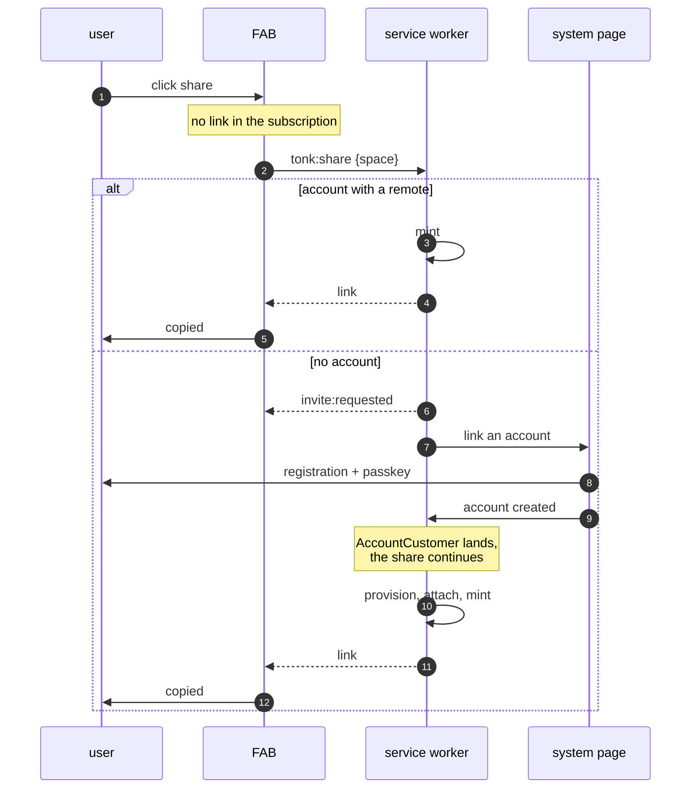

# Share as an intent

A redesign of the share click. Status: proposed.

The FAB stops interpreting failures. It subscribes to one row, and
clicking share asserts one command. Everything else — getting an
account, provisioning, attaching a remote — happens inside the handler
and is invisible to the caller.

## The contract

### What the FAB subscribes to

One concept, keyed on the space, with the url optional:

```yaml
tonk:invite:
  this: <space did>
  with:
    status: { the: xyz.tonk.invite/status, as: Entity }
  maybe:
    url:    { the: xyz.tonk.invite/url,    as: Text }   # present when granted
```

`status` is an **entity**, not a string — strings are poor
discriminators, and this follows `Replica::status`
(`tonk:blank` / `tonk:initialized`):

| `status` | Means | FAB shows |
|---|---|---|
| `invite:requested` | asked, in progress | `copying…` |
| `invite:granted` | `url` is present | `copied` |
| `invite:suspended` | the account's service was withdrawn | `failed` |
| `invite:unshareable` | the upstream is not a UCAN endpoint | `failed` |

There is no separate `reason`: a denial *is* a status. `denied` plus
`reason: suspended` would be two fields encoding one fact, and nothing
ever reads the first without immediately wanting the second. Worse, two
fields make illegal states representable — `granted` with a reason,
`denied` without one — and nothing would prevent either. One field
cannot contradict itself.

The FAB reads it as: `granted` → copy, `requested` → keep waiting,
**anything else** → failed. That default is what keeps a new terminal
status from needing a FAB change, and it is why the FAB never has to
enumerate the terminal set.

`status` is required, so the row resolves the moment the click is
acknowledged. `url` is `maybe:` (`Option<T>` in Rust), so one row covers
every situation with no sentinels.

What a terminal status *says* to the user is chosen by whatever displays
it, not shipped as prose from the worker: copy that lives in the worker
cannot be localised or varied by surface.

**Naming.** `Invitation` already exists and means the durable record of
a *minted* invite: keyed on the leaf delegation CID, on the repository's
meta branch, written by both minter and claimer, used for revocation.
`tonk:invite` here is keyed on the **space**, one per space rather than
one per mint, exists from the click onward, and is overlay-only. Same
noun, and they are close enough in meaning that the distinction has to
be kept explicit: `Invitation` is the credential, `tonk:invite` is
whether this space has one.

### The command


```yaml
tonk:share:
  this:  <fresh per click>
  space: Text
  time:  Float      # which click an answer belongs to
```

No `remote` (the handler resolves it), no `share` flag (the command is
the intent).

## How the view behaves

The FAB is a state machine over that one row. It reads `status`, and
nothing else decides what it shows.

```
                    ┌──────────────────────────────┐
   no row  ─────────▶  idle        "share"         │
                    └──────────────┬───────────────┘
                                   │ click
                                   ▼
                      assert tonk:share {space}
                                   │
                    ┌──────────────▼───────────────┐
   requested ───────▶  copying…    (spinner)       │
                    └──────────────┬───────────────┘
                                   │
              ┌────────────────────┼────────────────────┐
              ▼                    ▼                    ▼
        granted + url          anything else        (timeout)
              │                    │                    │
        ┌─────▼──────┐      ┌──────▼──────┐      ┌──────▼──────┐
        │  copied    │      │   failed    │      │   failed    │
        └─────┬──────┘      └──────┬──────┘      └──────┬──────┘
              └────────────────────┴────────────────────┘
                                   │ after a linger
                                   ▼
                                 idle
```

| Row | Label | The view also |
|---|---|---|
| no row | `share` | — |
| `invite:requested` | `copying…` | holds the pending clipboard write |
| `invite:granted` | `copied` | settles the write with `url` |
| anything else | `failed` | releases the write |

Three rules make this work:

**1. The click is not special.** It asserts the command and changes
nothing else. The label moves when the row moves, never because a
transact returned. A view that advanced on its own dispatch is what
produced "the share link is on its way" with no ceremony ever run.

**2. Unknown statuses are failures, not crashes.** `granted` and
`requested` are named; everything else falls through to `failed`. A new
terminal status needs no FAB change.

**3. Every path ends somewhere clickable.** A control left on `copying…`
refuses every later click, so the timeout backstop is not optional — it
is the only thing covering a worker that never answers.

### Clicking when a link already exists

If the row is already `invite:granted`, the click copies `url` and
resets. No command, no round trip. That is the common case after the
first share, and it is why the subscription is a subscription rather
than a one-shot read.

### What the view never does

- branch on *why* something failed
- ask whether an account exists
- know that registration happened
- retry — a second click is a second intent, and the handler is free to
  answer it from the row it already has

## How the handler behaves

Whatever is needed, in order, stopping when something is impossible:

1. Have a link already? Done.
2. No account → raise system UI, write `invite:requested`, return. Resume
   when `AccountCustomer` lands.
3. Account not activated → `invite:requested`, resume on activation.
4. No remote → provision, attach.
5. Mint → `invite:granted` with the `url`.
6. Genuinely impossible → the terminal status saying which
   (`invite:suspended`, `invite:unshareable`).

Steps 2 and 3 are the interesting ones: the handler does **not** await
the ceremony. A handler held open across a dialog the user may abandon
is held open forever. It writes `invite:requested`, asks, and returns; the mint
continues when the fact it was waiting for arrives.

## The flow



The FAB's view of both branches is identical: it asked, and a link
appeared. The second one took longer.

## The clipboard

The one thing this does not simplify. A clipboard write must start in
the user's gesture, so the click opens a pending `ClipboardItem` and
holds it. Across an account creation that is far too long — Chrome holds
about 45 seconds — and a write after the ceremony costs a permission
prompt because the gesture is spent.

So: hold the pending write for the fast path, and on `invite:requested`
let it go. When the link arrives later the FAB shows it with a copy
button instead of copying silently. One extra click on the slow path,
and the fast path keeps its silent copy.

## Why (what today does instead)

Today the FAB does not just ask to share. It asks, gets told *why not*,
interprets the reason, picks a repair, drives that repair, and re-asks.
That produces:

- five reason codes (`not-synced`, `needs-account`, `needs-activation`,
  `suspended`, `unshareable-remote`) the FAB must map to prompts
- a `Repair` / `RepairOutcome` table in `share.rs`
- a page-effect hop carrying `{reason, space}` to the system page
- a `share` mode flag so one command means two things
- a clipboard write held open across a dialog, a passkey ceremony, and a
  second command

All of it exists because the caller is trying to understand a failure
that is not its business. Getting an account is the provider's problem.

## What this deletes

- `RemoteRefusal`'s five-way refinement in `explain_refusal`
- `Repair` / `RepairOutcome` in `share.rs`
- `request_registration` and the `{reason, space}` page effect
- the `share` mode flag on `tonk:enable-sync`
- the FAB's second subscription

`tonk:enable-sync` remains for the settings path — turning on sync
without wanting a link — which is what it always should have been on its
own.

## Open

- **Addressing a frame instead of posting a message.** Asking one page
  to open registration is a side channel because a fact would fan out to
  every subscriber: two tabs on the same space would both raise a
  dialog. Sites already name individual frames, so writing the action
  against a site would give it the right scope — a fact, delivered to
  one frame. Punted for now; the postMessage is the compromise.


- **Resuming on a fact.** The worker must remember which space's share
  is waiting. The `invite:requested` row keyed on the space is
  probably already that record.
- **Abandoned ceremonies.** If the user closes the dialog, the space is
  left `invite:requested` forever. It likely needs clearing when the dialog is
  dismissed, or a timeout.
