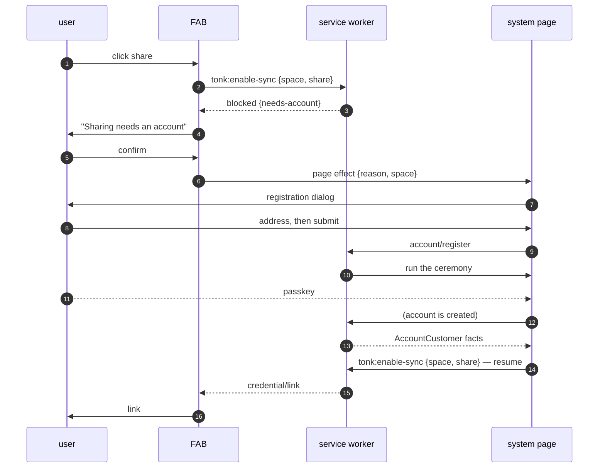

# Space linking

Clicking **share** on a space with no remote.

A space made before anyone registered is local-only. Sharing it means
someone else can open it, so it first needs a copy the service hosts.
Linking is how it gets one, and it may need an account first.

## The control

```html
<tonk-share space="{did}">
  <button type="submit">
    <span class="…--idle">share</span>
    <span class="…--copying">copying…</span>
    <span class="…--copied">copied</span>
    <span class="…--failed">failed</span>
  </button>
</tonk-share>
```

Four labels, one at a time. **The link is never rendered** — it goes to
the clipboard. The subscriptions drive which label shows, not what it
says.

## Subscriptions

Two, both on this space, opened on mount. They are the two answers to
one question: *can this space be shared?*

```yaml
# yes, here it is
of: { this: <space did> }
with:
  link: { the: xyz.tonk.credential/link, as: Text, cardinality: one }

# no, and here is why
of: { this: <space did> }
with:
  blocked: { the: xyz.tonk.share/blocked, as: Text,  cardinality: one }  # reason code
  detail:  { the: xyz.tonk.share/detail,  as: Text,  cardinality: one }  # sentence for the user
  time:    { the: xyz.tonk.share/time,    as: Float, cardinality: one }  # which click this answers
```

For an unshared local-only space **both return nothing**. The button
shows `idle`, and the FAB knows nothing: "never shared" and "cannot be
shared" are the same empty state.

## Clicking share

Asserts `tonk:enable-sync` on profile main. Checks nothing first — the
worker owns that judgement.

```yaml
tonk:enable-sync:
  this:   <fresh per click>
  time:   Float      # the click moment: which click an answer belongs to
  space:  Text       # the space DID
  remote: Text       # optional — absent means "wherever this account syncs"
  share:  Entity     # optional flag — `tonk:share` means mint a link after attaching
```

The button goes to `copying`, and a clipboard write opens **now**,
holding a pending promise across the round trip. Started later it would
have lost the user gesture and cost a permission prompt.

## The handler

`repository.rs::EnableSyncHandler`:

1. Resolve the remote — the claim's, else the account's recorded
   `provider-address`.
2. **Provision** the space as a consumer under the account's root.
3. **Attach** the upstream, preserving one already configured.
4. Record the mount so other devices adopt it.
5. Mint an invite, if `share` was set.

Provisioning precedes attaching because creation only provisions when
there is an active customer. An onboarding-era space has no consumer
row, and an upstream attached without one fails every presign with
`subject is provisioned by an active customer (the subject is not
provisioned)`.

If there is no provider to resolve, nothing is attached and the handler
writes the blocked row instead.

## When it is blocked

`explain_refusal` starts from the generic "no upstream" and refines it by
reading the account's registration, because the repair differs entirely:

| `blocked` | Means | Repair |
|---|---|---|
| `not-synced` | account has a provider | confirm, and it links |
| `needs-account` | nobody has registered | **create an account** (below) |
| `needs-activation` | enrolled, email unconfirmed | the user's inbox |
| `suspended` | service withdrawn | none |
| `unshareable-remote` | upstream is not a UCAN endpoint | none |

`not-synced` and `needs-account` are identical at the repository — no
upstream either way — and that refinement is the only thing that tells
them apart.

The FAB shows `failed` and opens a prompt carrying `detail`. Its confirm
button is disabled for a reason with no repair: greyed reads as an
answer, missing reads as broken.

## No account yet

Confirming `needs-account` cannot be answered in the FAB — creating an
account is a WebAuthn ceremony, which needs a top-level window. The FAB
abandons the clipboard write, closes its prompt, and hands
`{reason, space}` to the system page.

`space` is the whole point of the handoff: it is what lets the share
resume once an account exists.



The resume is the same command as the first click, with the same space.
Nothing about it is special-cased: the first attempt was blocked for
want of an account, and now there is one.

Registration itself — the address lookup, the ceremony, what the dialog
subscribes to — is `system-page-commands.md`.

## Notes

- **The invite link is a fact** (`xyz.tonk.credential/link`), keyed on
  the space. Nothing reads a response body.
- **Local-only is a real state**, not a failure: creation wires no
  remote when there is no active customer.
- **Retroactive after reconciliation.** A space made *before* activation stays
  local while the provider would refuse it. Once an account pull proves the
  account ready and the customer is served, the reconciliation sweep walks
  every local replica. A repository with no remote at all is provisioned and
  attached to the account provider; one carrying any remote is left untouched.
  The same sweep reapplies newer directory mount facts to replicas already on
  the device, so a remote/tracking record that arrived after the replica row
  repairs itself on a later pass.
- **Names catch up too.** A joined space can be listed before its content (and
  repository-authored name) has hydrated. Reconciliation mirrors that name
  into the account directory once it becomes locally readable, replacing the
  nameless Hub row without remounting or resetting the space.

## Rough edges

Named rather than defended:

- **`share` is a mode flag.** One command doing "attach" or "attach and
  mint" depending on a marker. Two commands would be more honest, the
  second doing the first's work then minting.
- **The resume assumes.** It is currently chained off the register
  dispatch rather than driven by `AccountCustomer` arriving — the bug
  that produced "the share link is on its way" with no ceremony ever
  run.
- **The clipboard write is held open** across a round trip that may end
  in a dialog, an account creation, and a second command. Every path out
  has to end somewhere clickable or the control jams on `copying`.
