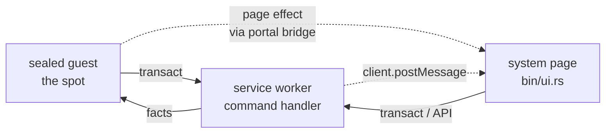
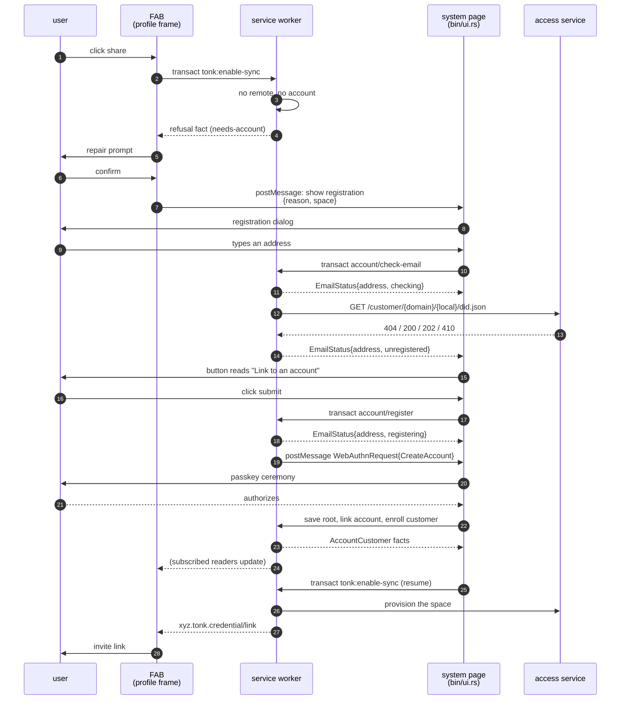
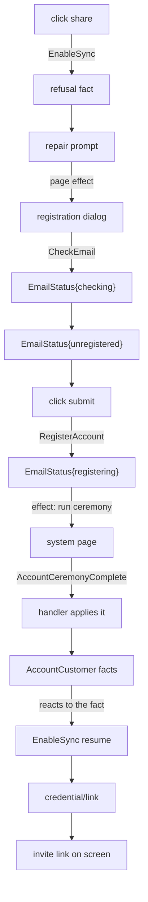

# System-page commands

How a page asks for something only the outermost page can do.

Some operations cannot be finished by the service worker. A WebAuthn
ceremony needs a `window` and a user gesture; the worker has neither.
The page that wants the operation is usually a sealed guest, which has a
window but not the top-level one WebAuthn requires. So there is a third
party: the **system page** — `bin/ui.rs`, the outermost document, the
only one holding `window.tonkIdentity`.

This document defines the protocol between the three, for the commands
in the share-to-register flow.

## The shape

Everything is a command asserted on **profile main**. Nothing is an HTTP
route, and nothing reads a response body: a command answers with facts
the asking page already subscribes to (see `.claude/skills/commands-not-routes`).

The one thing facts cannot carry is "do something in a document you are
not". That is the single postMessage hop, and it is deliberately narrow:
the worker asks the system page to run a ceremony, and the outcome comes
back as facts like everything else.



Note there are **two** page channels, not one, and they are unrelated
mechanisms:

| Hop | Channel | Payload |
|---|---|---|
| guest → system page | portal bridge page-effect (`page_effect::forward`) | `{reason, space}` |
| worker → system page | `client.postMessage` | `WebAuthnRequest{kind}` |

The first is how the FAB gets a dialog raised in a document it cannot
reach. The second is how the worker gets a ceremony run. Neither is a
fact, because neither is a statement about the world: they are requests
to act in another document.

**Where the form lives.** The registration form is in the **system
page**, not the profile frame. It is appended to the top document's
`<body>` by `register_dialog::open()`. That is load-bearing: conditional
mediation (`autocomplete="username webauthn"`) only offers a
discoverable passkey in the document running the ceremony. An earlier
design put it in the profile frame; the WebAuthn constraint moved it.

## Commands in this flow

### 1. `tonk:enable-sync` — share a spot

| | |
|---|---|
| **Entity** | fresh per invocation |
| **Attributes** | `time` (click moment), `marker` (shape discriminator) + raw `space`, `remote`, `share` facts |
| **Asserted on** | profile main |
| **Dispatched by** | `<tonk-share>` in the FAB (profile frame) |
| **Trigger** | user clicks **share** |
| **Handler** | `create_invite.rs` — attaches a remote, then mints an invite |
| **Answers with** | `xyz.tonk.credential/link` (the invite) or a refusal fact carrying a reason code |

The refusal is the interesting outcome: a spot with no remote cannot be
shared, and `explain_refusal` refines the generic `not-synced` into
`needs-account` / `needs-activation` / `suspended` by reading the
account's registration state. The FAB renders the refusal as a repair
prompt.

### 2. `account/check-email` — is this address taken?

| | |
|---|---|
| **Entity** | fresh per invocation |
| **Attributes** | `email` |
| **Asserted on** | profile main |
| **Dispatched by** | the registration dialog (system page) |
| **Trigger** | user types, debounced 400ms |
| **Handler** | `email_status.rs::CheckEmailHandler` |
| **Answers with** | `EmailStatus` on the profile **overlay**: `{address, state}` |

Overlay, not a branch: the form asks per keystroke and a durable row per
answer would replicate. The row carries `address` alongside `state` so a
late answer about an edited-away address is recognisable as stale.

States: `checking` (written *before* the lookup), then one of
`unregistered` / `active` / `pending` / `suspended` / `invalid` /
`unavailable` / `registering`.

### 3. `account/register` — make an account

| | |
|---|---|
| **Entity** | fresh per invocation |
| **Attributes** | `email` |
| **Asserted on** | profile main |
| **Dispatched by** | the registration dialog (system page) |
| **Trigger** | user clicks the submit button |
| **Handler** | `email_status.rs::RegisterAccountHandler` |
| **Answers with** | `EmailStatus` → `registering`, then `AccountCustomer` facts |

This is the command that needs the system page. The handler cannot
create an account itself, so it:

1. publishes `EmailStatus{address, registering}` so every reader sees a
   ceremony is up
2. posts `WebAuthnRequest{kind: CreateAccount}` to the originating client
3. returns — it does **not** await the ceremony

Nothing is awaited because a handler blocking on a dialog the user may
never finish is a handler held open indefinitely. The outcome arrives as
facts.

## The full flow



## The one postMessage hop

Two asks currently cross it, discriminated by `WebAuthnKind`:

| Kind | Asked by | Runs |
|---|---|---|
| `EncryptionKey` | `custody.rs` | unlock the account key from a passkey |
| `CreateAccount` | `email_status.rs` | the full signup ceremony |

`WebAuthnKind` is an enum precisely so the system page's listener must
`match` it. It was a bare `String` compared with `!=`, and
`CreateAccount` shipped with a sender and no receiver: the worker asked,
`custody_relay.rs` returned early, and the dialog reported success with
no ceremony ever run. An enum makes the next added kind a compile error
instead of silence.

## How the system page answers

Today: it calls the worker's API directly (`save_root`,
`save_account_link`, `enroll_customer`, `provision_custody`,
`queue_custody_publish`), and the worker writes the facts.

**This is the part worth revisiting.** By the rule everywhere else, the
system page should assert a command and let the handler do the work. The
API calls are a leftover from when the ceremony only ever ran from
`/account`, where a response body had somewhere to go.

The narrower protocol would be:

- the worker asks for a **ceremony**, not a whole signup
- the system page runs it and asserts `account/ceremony-complete` with
  the ceremony output
- the handler does the rest, and every reader learns from facts

That keeps the system page's job to exactly what needs a top-level
window, and puts the account-shaped logic in one handler instead of
split between a page and a panel. Not built; see "Open" below.

## What each reader is subscribed to

It does not get told. It is already subscribed. Every subscription below
is a live query over raw attribute URIs — not a concept name, so a
profile seeded from an older library cannot break the read.

### `<tonk-share>` — the invite link

`logic.rs::invite_link_query_body(space)`

```yaml
the: xyz.tonk.credential/link
of:  { this: <space did> }
is:  ?link          # Text, cardinality one
```

### `<tonk-share>` — the refusal

`logic.rs::share_blocked_query_body(space)`. All three land together, so
a partial row is not a refusal.

```yaml
of: { this: <space did> }
with:
  blocked: { the: xyz.tonk.share/blocked, as: Text,  cardinality: one }
  detail:  { the: xyz.tonk.share/detail,  as: Text,  cardinality: one }
  time:    { the: xyz.tonk.share/time,    as: Float, cardinality: one }
```

`blocked` is the reason code the FAB maps to a repair: `not-synced`,
`needs-account`, `needs-activation`, `suspended`. `time` is what makes
one refusal distinct from the next.

### Registration dialog — the address answer

`register_dialog::answer_query_body()`. One row, one fixed entity,
replaced per answer.

```yaml
of: { this: state:email-status }     # the overlay, never a branch
with:
  address: { the: xyz.tonk.email-status/address, as: Text, cardinality: one }
  state:   { the: xyz.tonk.email-status/state,   as: Text, cardinality: one }
```

`address` rides alongside `state` so a late answer about an
edited-away address is recognisable as stale.

### Account UI — registration state

`AccountCustomer`, keyed on the account subject.

```yaml
of: { this: <account did> }
with:
  status:   { the: xyz.tonk.account/customer-status,  as: Text, cardinality: one }
  email:    { the: xyz.tonk.account/customer-email,   as: Text, cardinality: one }
  provider: { the: xyz.tonk.account/provider-address, as: Text, cardinality: one }
```

`status` is `Registered` / `Active` / `Suspended`. `provider` is written
only at activation, from the service's own registration receipt — which
is what makes "has a provider" mean "finished registering" rather than
"someone guessed a URL".

`provider` is a **required** field here, so an account with no provider
yet does not resolve at all. That is deliberate: the absence is the
state, and a partial row would read as a finished registration.

Fields can be optional where that is wanted — `maybe:` in YAML,
`Option<T>` in Rust, stored with a sibling marker so required fields
keep their original encoding. `AccountCustomer` does not use it because
"registered but unserved" should not resolve.

That is why the flow needs no return path from the system page to the
sealed guest. Facts fan out to every reader on every tab.

## What the passkey is actually for

Worth being precise, because the naming hides it: **no passkey secret
ever leaves the authenticator, and the worker never holds one.**

The chain is:

```
passkey (in the authenticator, unextractable)
   │  PRF extension evaluated at a fixed salt
   ▼
KEK  (32 bytes, re-derived per ceremony, never stored)
   │  unseals
   ▼
account secret  (the root; sealed at rest in the custody cell)
   │  expand(secret, ENCRYPTION_CONTEXT)
   ▼
encryption key  (what the worker actually uses)
```

Each ceremony asks the authenticator to evaluate its PRF at two pinned
salts (`passkey.rs::custody_extensions`): `CUSTODY_KEY_CONTEXT` seeds the
custody keypair, `CUSTODY_KEK_CONTEXT` derives the KEK. Same passkey plus
same salt yields the same bytes every time, so nothing has to be stored —
it is re-derived on demand.

The worker cannot do any of this: `navigator.credentials` does not exist
in a service worker, and every ceremony needs a user gesture
(`passkey.rs:66` — "no window: passkey ceremonies are window-only").
That is the entire reason a page hop exists. It is not an accident of
layering; it is a browser capability boundary that no protocol change
removes.

> The RP ID is the root-key custody boundary. Any origin allowed to use
> these passkeys can silently derive a visiting user's root key from one
> discoverable-credential assertion, so it is pinned to one exact origin
> and every other host is a separate relying party.

### The ask should be a command, and a narrower one

Today the page performs a whole workflow and reports the end of it. Two
different intents are conflated under `WebAuthnKind::EncryptionKey`:

| Intent | What actually needs the window |
|---|---|
| "create an account" | the ceremony that mints a passkey and seals a new secret |
| "I need the encryption key" | one PRF evaluation to unseal the existing secret |

The second is much narrower than the message name suggests. The worker
does not need a *passkey*, or an account, or a page workflow — it needs
the **account secret unsealed**, because everything it uses
(`encryption_key()`) is derived from that secret, not from the passkey.

So the command should name the narrow thing:

```yaml
account/unseal:                  # "I need the account secret opened"
  this:  <fresh per invocation>
  # answered by the page running one assertion and asserting the result
```

and its answer is a second command carrying only what was unsealed —
not five API calls the page makes on the worker's behalf.

### Hand over transient PRF bytes, import handles in the worker

The system page receives the PRF outputs as bytes because that is the
WebAuthn API. It posts fresh fixed-length `Uint8Array`s, then clears its
copies immediately. The worker validates and clears its structured-clone
copies while importing non-extractable HKDF handles:

```
system page                                worker
───────────                                ──────
run the passkey ceremony
receive both PRF outputs
        │
        └──── postMessage(Uint8Array × 2) ─▶ validate 32 bytes each
        clear sender arrays                 import non-extractable handles
                                            clear receiver arrays
                                            derive, use, drop handles
```

The raw values are never converted to JSON, text, logs, storage,
analytics, or URLs. They stay as zeroizing Rust arrays and short-lived JS
typed arrays until import completes. The worker then holds only the
capability to derive and use the custody keys.

The earlier implementation posted `CryptoKey` handles directly. Desktop
`structuredClone` and worker tests passed, but iOS Safari silently
dropped the service-worker message before `onmessage` ran. The typed-array
handoff is the compatibility boundary. It does not expose a new page
secret: the PRF bytes already existed in the page realm as the WebAuthn
result, and the compatible path adds one transient worker clone.

The worker keeps nothing on disk that opens custody. It holds imported
handles for the operation (or the existing activation-gated parked login)
and drops them afterwards.

**This pattern already exists in the codebase.** `onboarding.rs`'s
custodian is a non-extractable `CryptoKeyPair` whose KEK is recomputed
from a fresh signature on every boot and written nowhere —
"a stand-in for a passkey rather than a password sitting next to the
thing it locks". The passkey path now imports its worker-owned handles
from the transient PRF transport bytes instead.

#### Verified: the crypto lines up, the code path does not

The envelope is **AES-256-GCM** with an 8-byte AAD header (`envelope.rs::
header`) and a 12-byte nonce — all WebCrypto primitives. So
`crypto.subtle.decrypt({name: "AES-GCM", iv: nonce, additionalData:
header}, kekHandle, ciphertext)` does exactly what `open_bytes` does
today. **No envelope format change is needed.**

The blocker is one line:

```rust
fn cipher(&self) -> Aes256Gcm {
    Aes256Gcm::new_from_slice(self.0.as_ref())   // wants the raw 32 bytes
}
```

`new_from_slice` takes `&[u8]`, and a non-extractable `CryptoKey` has no
bytes to hand it. So a handle cannot feed the existing Rust path at all:
the unseal has to be reimplemented against WebCrypto for the handle
case, alongside the `aes_gcm` one that native and the phrase path still
need. That is the actual cost — a second `open`, not a new format.

#### What the KEK is

A **32-byte symmetric AES-256 key**, not a keypair:

```rust
pub fn custody_kek(entry_output: &[u8; 32]) -> Kek<Recovery> {
    Kek(expand(entry_output, CUSTODY_KEK_CONTEXT), PhantomData)
}
// expand = HKDF-SHA256, salt None, 32-byte output
```

PRF output → HKDF-expand at a context string → 32 bytes → used directly
as the AES-256-GCM key. The asymmetric material (`signer()`,
`encryption_key()`) is derived from the account secret *after*
unsealing, which is a separate step further down.

That makes it importable and derivable in place after the handoff, so no
raw KEK is ever materialised:

```js
const prfKey = await crypto.subtle.importKey("raw", prf, "HKDF", false, ["deriveKey"]);
const kek = await crypto.subtle.deriveKey(
  { name: "HKDF", hash: "SHA-256", salt: new Uint8Array(32), info: CUSTODY_KEK_CONTEXT },
  prfKey,
  { name: "AES-GCM", length: 256 },
  false,            // non-extractable
  ["decrypt"],      // can open envelopes, can never seal one
);
```

`deriveKey` rather than `deriveBits` is the point: the KEK is born
non-extractable in the worker and no raw KEK copy is ever materialised.
`["decrypt"]` alone means a leaked handle cannot wrap anything new
under that KEK.

**On the salt.** Rust uses `Hkdf::new(None, ikm)`. RFC 5869 sets an
absent salt to `HashLen` zeros, and WebCrypto — which has no `None` —
normalises an empty salt to the same thing, so either spelling
reproduces the Rust key. Verified in a browser by
`webcrypto_kek::tests::it_matches_hkdf_with_no_salt`; worth a test
because a mismatch here has no symptom other than an envelope that will
not open.

**Verified end to end.** `tonk-identity/src/webcrypto_kek.rs` implements
the receiving half and its browser tests show an envelope sealed by the
`aes_gcm` path opening from a non-extractable handle, and a wrong handle
failing the tag check rather than decrypting to garbage.

**This decides which key to request: the KEK.** Its only job is one
AES-GCM decrypt, which WebCrypto performs natively from a handle. The
encryption key is consumed through `expand(secret, CONTEXT)` HKDF paths,
each of which would need the same treatment separately.

**And dropping it is already the norm.** `KekMethod::Local` re-derives
its KEK from a fresh custodian signature on every boot and stores
nothing. "Hold briefly, use, drop, re-ask" is the established shape here,
not a new burden the passkey path introduces.

**Open:**

1. A WebCrypto `open` for the handle path, beside the `aes_gcm` one.
   Native and the recovery-phrase path keep the byte-based version, so
   this is an addition rather than a migration.
2. What re-triggers the ask once the handle is dropped. Every re-ask is
   another user gesture, which is a UX question before it is a protocol
   one — and the reason to prefer few, coarse unseals over many narrow
   ones.

## The architecture: Elm, with the worker as effect manager

The shape this is converging on is The Elm Architecture, distributed
across three documents.

| Elm | Here |
|---|---|
| `Msg` | a command — a transient concept asserted on a branch |
| `update` | the command handler in the service worker |
| `Model` | facts on a branch (durable) or the overlay (per-session) |
| `view` | any subscribed element |
| `Cmd` | IO the worker performs |
| an effect yielding a `Msg` | an effect asserting another command |
| `Sub` | a live query subscription |

The rules that follow from it:

1. **Only handlers change state.** A page asserts commands; it never
   writes facts and never calls an API that writes facts.
2. **Effects yield messages.** An effect that cannot finish in the
   worker (a ceremony needing a window) is asked for, and its result
   comes back as a command — never as the page performing the work.
3. **Views never assume.** A view reacts to model changes. It does not
   chain the next step off "my message was delivered".

Every bug in this flow so far has been a violation of rule 3 or a
missing half of rule 2, and they are all the same mistake: **reading a
dispatch as an outcome.**

- the dialog dispatched `check-email` and never subscribed — latched on
  "Checking…" forever
- `submit()` read a successful transact as "the account exists" — and
  reported a share link with no ceremony ever run
- the ceremony ask had a sender and no receiver — silently dropped

### Where the code violates it today

**The system page performs the update.** After the ceremony it calls
`save_root`, `save_account_link`, `enroll_customer`,
`provision_custody`, `queue_custody_publish` — a *view* running
`update`. It is a leftover from when the ceremony only ran from
`/account`, where a response body had somewhere to go.

**The resume step assumes.** `tonk:enable-sync` was re-asserted straight
after dispatching `account/register`, rather than in reaction to the
account actually existing.

### Target

One new command closes both gaps:

```yaml
account/ceremony-complete:
  this:  <fresh entity per invocation>
  email: Text          # who the ceremony was for
  output: Text         # the ceremony result, for the handler to apply
```

Asserted by the system page when the passkey ceremony returns. The
handler does everything the page does today, and every reader learns
from the resulting `AccountCustomer` facts.



The resume at **L** is driven by `AccountCustomer` appearing, not by the
submit handler. That is the difference between reacting to the model and
assuming the effect worked.

This also dissolves the extraction problem: the account-shaped logic
moves into a handler, so `/account`'s panel and the registration dialog
stop needing to share a function. Both just assert the command.

## The registration surface

Not a `wa-dialog`. The design is `fabb/onboard.html` in the gooey
repo — **a cluster over the space**, in its own words: "the page dims,
the surface never."

```
┌─────────────────────────────┐
│ link an account             │   ← heading row
├─────────────────────────────┤
│ email              you@…  ▌ │   ← editor row: noun left, value right,
├─────────────────────────────┤     block cursor on the tail
│ To share this space it needs│   ← the narrator, one paragraph,
│ a copy our service hosts…   │     aria-live, sometimes one quiet verb
└─────────────────────────────┘
                ◂ back to space
```

Rows stack and **settle**: an editor row commits on Enter (or blur when
valid), loses its cursor, and becomes a record — `email  you@example.com`
— while the next row unfolds beneath it. Nothing is ever a form with a
submit button at the bottom.

The ceremony, in order: **email → passkey → activation → name**, then a
closing action. Each step gets its own row, and the narrator explains
only the step in front of you.

```
link an account
email        you@example.com      settled
passkey      Chrome on macOS      settled
check email  waiting…             waits on a fact, takes no input
name         Irakli               settled
[ copy share link ▸ ]             only when a share started this
```

**No code row.** The mockup asks for six digits, but activation here is
an emailed *link* — so the row says to open it and waits, rather than
inventing a step the service does not have. It advances when
`AccountCustomer` gains its provider, which the dialog is already
subscribed to: the fact is the transition, not a form submission.

**The closing action depends on why the dialog opened.** Raised by a
share, the last row becomes *copy share link*: it mints the invite the
refused click wanted, copies it, and closes. Raised on its own, there is
nothing to go back to and it simply closes. That is what makes the
ceremony finish the thing that interrupted it rather than dropping the
user back where they started.

Mapping onto what exists: the `EmailStatus` states we already write are
what choose the step. `unregistered` unfolds the passkey row;
`active`/`pending` route to sign-in instead; `checking` holds; the
terminal states stop with the narrator saying why.

Wording, per the FABB bar's own "log in to share": the heading is **link
an account**, not "create an account" — someone who already has one is
linking it, not making a second. The narrator says what linking buys
(somewhere for this space to sync from) rather than describing account
creation.

## Open

In dependency order.

1. **`account/ceremony-complete`.** Define the command, move the five
   API calls the system page makes into its handler. This is the one
   that makes the system page a view again.

2. **Fact-driven resume.** Subscribe to `AccountCustomer` and assert
   `tonk:enable-sync` when it appears, instead of chaining off the
   register dispatch.

3. **`/account` panel onto the same command.** Once the handler exists,
   the panel asserts it too and its inline ceremony logic goes away.
   Until then the two paths duplicate, which is the drift worth closing
   soon rather than eventually.

4. **The dialog as a view.** `<tonk-view>` takes its template inline
   from its children, so it needs nothing seeded — but `<tonk-display>`
   resolves a *model concept* from the branch, which is the
   pre-definition we do not want for a dialog that must work on a fresh
   device. The extension that would make this work is passing concept
   definitions directly rather than resolving them from the db.
