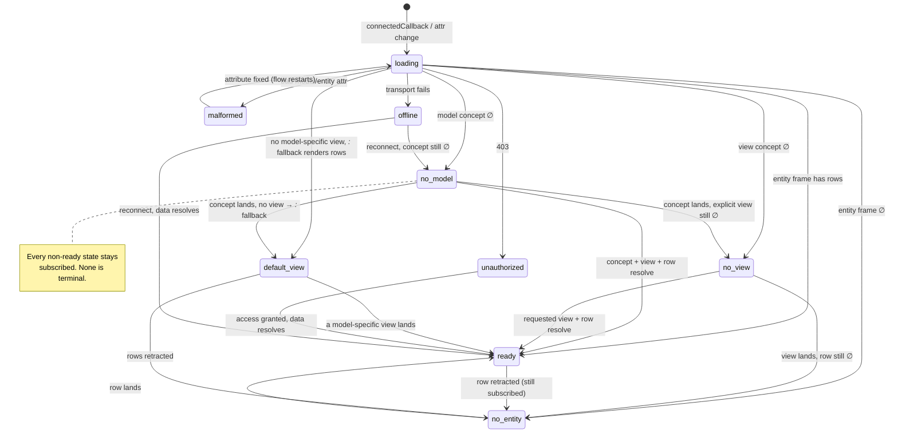
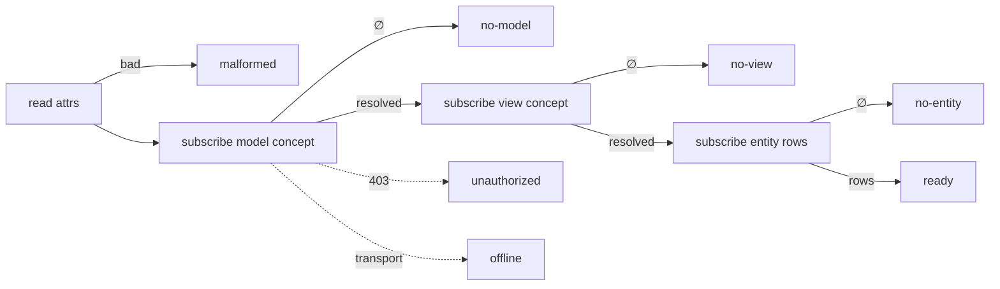

# tonk-display — lifecycle states and embedder handling

Status: Decision 1 shipped; Decision 2 deferred. Maps the states a
`<tonk-display>` moves through, the two bugs in how it currently handles
the unhappy ones, and a design for letting the embedder decide what each
state renders.

Decision 1 (reactive model resolution + the richer state enum) is
implemented: the model resolve is a live `"model"` subscription, an
absent concept is the recoverable `no-model` state (no latched red box),
and the loud callout is reserved for `offline` / `unauthorized` /
`malformed`. The recoverable absences (`no-model` / `no-view` /
`no-entity` / `default-view` / `empty`) are skinned by the embedder's
CSS off `data-state`, not a forced callout. Decision 2 (shadow-root state
slots) stays deferred until the light-DOM-dependents question is settled.

See [tonk-display.md](./tonk-display.md) for the element's resolve flow.
The element consumes routing context supplied by its host.

## Why this exists

The Hub lists each space by reading its name from the space's own repo
through a nested `<tonk-display model=tonk:repository view=tonk:view/label
entity={subject}>`. Two failure modes surfaced there that are general to
every `<tonk-display>`, not specific to the Hub:

1. A freshly created space is still seeding when its card mounts, so the
   `tonk:repository` **concept does not exist yet** on the branch. The
   display's one-shot phase-1 concept resolve returns "no concept
   matched", the display latches into an error, injects a red callout,
   and never recovers — even though the concept lands a moment later.

2. The display **forces** a red `<wa-callout>` into its own DOM on error.
   The embedder gets a `data-state` attribute but cannot opt out of or
   replace that callout, so a card that wants to show a quiet "Untitled"
   while a name resolves instead shows a red error box.

The fix has two halves: make concept resolution reactive (recover when
the concept lands) and hand state rendering to the embedder.

## The resolve chain

`<tonk-display>` resolves a three-link chain, each link a live
subscription so a definition that lands later is picked up without a
reload (see [Decision 1](#decision-1--concept-resolution-becomes-reactive)):

1. **model concept** — phase-1 lookup of the concept named by `model`.
   Gives the descriptor that projects the subject's fields.
2. **view concept** — phase-1 lookup of the concept named by `view`
   (skipped when `view` is omitted: the built-in `tonk:view` is used).
   Constrained by the resolved model; gives the `display` template.
3. **entity row(s)** — subscription on the resolved model+view for the
   `entity` (single mode) or every instance (directory mode).

Each link is either *resolving*, *resolved*, or *absent*. "Absent" means
something different at each link, which is why one `empty` state is too
coarse.

## The states

`<tonk-display>` reflects its lifecycle on a `data-state` attribute.
Today the enum is `Loading | Ready | Empty | Error`, which collapses the
three distinct absences and three distinct errors. The proposed set
names each link's absence and keeps the genuinely-broken cases apart:

| `data-state` | Meaning | Leaves when… |
|--------------|---------|--------------|
| `loading` | A resolve query is in flight; nothing known yet | a frame (or error) arrives |
| `ready` | Row(s) rendered by a **model-specific** view | re-renders on updates (stays `ready`) |
| `default-view` | No view is defined for the model, so the built-in `_:_` fallback view is rendering (directory carousel / notation dump). Rows render, but via the generic fallback, not a model-specific view | a model-specific view lands (subscription) |
| `no-model` | The `model` **concept** is not defined on the branch | the concept lands (subscription) |
| `no-view` | Model resolved; an **explicit** `view` was requested but is not defined, and there is no `_:_` fallback to fall through to | the requested view lands (subscription) |
| `no-entity` | Concept + view resolved, the **instance row** is absent | the row lands (subscription) |
| `unauthorized` | A query returned 403 — no access to this repo/branch | access is granted |
| `offline` | Transport failure / the service worker is unreachable | the connection returns |
| `malformed` | Author/protocol error — bad `model`/`entity` attr, decode failure | the author fixes the attribute |

`default-view` is a real, currently-hidden state: the display already
falls back to the `_:_` view when a model has no specific view (tracked
internally as `default_slide`), but that fact is invisible to the
embedder today — it just looks like `ready`. Surfacing it lets an
embedder distinguish "rendered the way I intended" from "rendered through
the generic fallback". `no-view` is the stricter case: an *explicit*
`view=` was named and is absent with no fallback.

### There is no terminal state

With every link a subscription, no absence is final — each is a
steady-state the display *keeps listening from*. `no-model` is not "the
concept will never exist", it is "the concept is not here **right
now**"; the display stays subscribed and recovers the instant it lands.
Even `malformed` recovers when the author edits the attribute
(`attribute_changed_callback` restarts the flow). So the embedder never
has to reason about whether a state will recover — it always can; it just
picks what to render for the current truth.

This is the key correction to the original framing: the design is not
"transient vs terminal" but "current truth, fully subscribed, will
update". The display reports where it is; the embedder renders it.

## State machine



Transitions are not exhaustive (any state can drop to `offline` on a
transport failure, or to `loading` on an attribute change that bumps the
generation and restarts the flow); the diagram shows the load-bearing
paths. The cross-cutting rules:

- **Any state → `loading`**: an observed attribute (`model`, `entity`,
  `view`, `data-active`) changes, bumping the generation and restarting
  `run()`.
- **Any state → `offline`**: the underlying subscription's transport
  fails.
- **`ready` is not a sink**: a retracted row drops it back to
  `no-entity`; the subscription stays open.

## How the chain maps to the diagram



Each box is a subscription whose empty frame is a *state*, not a
teardown. A later non-empty frame advances to the next box.

## Decision 1 — concept resolution becomes reactive

Today `resolve_model` runs a one-shot `host_consumer::query` for phase-1
(resolve the concept-of-concepts row for the model / view). On an empty
result it errors `UnknownSource` and `run()` propagates that into a
latched `fail()`.

The view and entity queries are already **subscriptions** (the host
pushes a fresh frame on every branch revision). The model resolve should
be too: subscribe to the phase-1 concept query so a concept defined later
pushes a frame, and the resolve completes then.

Because the downstream flow (view + entity subscriptions) depends on the
resolved `model_entity` / `descriptor_json`, the shape is: keep a model
subscription; when its frame is empty, enter `no-model` without tearing
down, and when a non-empty frame arrives, (re)start the downstream flow
with the resolved descriptor. Generation bumping already guards against
overlapping flows, so a late model frame restarting the flow is safe. The
same applies to the view link (`no-view`). The entity link already works
this way after the recent `no-entity` fix.

`no-model` / `no-view` are honest states (the concept/view is not on the
branch), not latched failures: the display stays subscribed and leaves
them the instant the definition lands.

(Alternatives considered: retry-with-backoff is polling and can flash or
give up early; fixing seed ordering so the concept always exists before
the card mounts addresses this one case but not the general "data lands
late" resilience. The subscription is the principled fix.)

## Decision 2 — the embedder renders the states (shadow slots + fallbacks)

Give `<tonk-display>` a **shadow root** with one named `<slot>` per
non-`ready` state, plus a **built-in fallback** rendered inside each slot.
The embedder's light-DOM children with `slot="…"` *override* the
fallback; a slot the embedder leaves empty falls back to the display's
own default for that state. Show the slot matching the current
`data-state`; hide the rest.

```html
<tonk-display model=tonk:repository entity={subject} view=tonk:view/label>
  <span slot="no-entity" class="muted">Untitled</span>
  <!-- no-model, loading, error, … left to the built-in fallbacks -->
</tonk-display>
```

### Slots override, fallbacks are the default

Unlike "opt-in or blank", every state slot has a default. The fallback is
roughly today's callout but **more detailed**, naming what was missing:

- `no-model` → "No concept matched for model `{model}`."
- `no-view` → "No view `{view}` defined for `{model}`."
- `no-entity` → "Nothing here yet." (or the entity URI in single mode)
- `unauthorized` → "You don't have access to this space."
- `offline` → "Reconnecting…"
- `malformed` → the structured author-error message (this one stays
  loud — it is a bug to fix).

A `<slot name="no-model">…</slot>` in the shadow root carries this
default as its slot content; the embedder's `slot="no-model"` children
replace it when present (standard slot fallback semantics). So nothing is
silently blank by default, and the `tonk-display:error` event still fires
for diagnostics independent of what renders.

### Slot context — state views can templatize

State slots should see the same templating the view templates get, so a
fallback (or an embedder's slot content) can interpolate the model name,
view name, and error details. Reuse the existing `dom.host/*`
augmentation (`with_host_attributes`, the mechanism behind
`{dom.host/data-active}`): the display renders a slot's content through
the same `render_segments` pass against a conclusion carrying the state
context. The display already exposes `model` / `view` as host attributes,
so `{dom.host/data-model}` / `{dom.host/data-view}` work directly; the
error message is added under a state attribute (e.g.
`{dom.host/data-error}`) so:

```html
<span slot="no-model">Couldn't find {dom.host/data-model} here.</span>
```

renders with the real model name. This makes the built-in fallbacks and
embedder overrides use one templating path, and lets a state view be as
specific as the data allows.

### Why a real shadow root

- The shadow root holds a `<slot name="…">` per state (each with its
  fallback) plus the rendered `ready` output. The display flips which slot
  shows by mapping `data-state` → the visible slot (a
  `:host([data-state="no-model"]) [part="no-model"]` style rule, others
  hidden).
- It **resolves the template-vs-slot collision cleanly**: the view's
  rendered output lives in the shadow root (the `ready` presentation),
  while the embedder's slotted children stay in light DOM and project in.
  The snapshot/render code stops competing with state content because
  they live in different trees.

Slot names map 1:1 to the non-`ready` `data-state` values: `loading`,
`default-view`, `no-model`, `no-view`, `no-entity`, `unauthorized`,
`offline`, `malformed`. (`default-view` shows the fallback view's rendered
output *and* could expose a slot for chrome around it — TBD.) `ready` is
the rendered view output, the default shadow content.

Open questions for this decision:

- **Light-DOM dependents.** Event delegation and `snapshot_template`
  currently read the host's *light-DOM children* as the row template.
  Moving the view's rendered output into a shadow root is the right end
  state, but the view-template authoring (children that become the row
  template) must be reconciled with the shadow boundary — confirm whether
  authoring stays light-DOM and only *rendered output* moves to the
  shadow, or the template is snapshotted into the shadow. Main
  implementation risk; verify against `render.rs` / `view.rs` / event
  delegation before committing.
- **`default-view` slot shape.** Does `default-view` get a wrapper slot
  (so the embedder can frame the fallback carousel/notation) or is it just
  `ready`-with-a-flag? Leaning: a distinct `data-state` so it is
  *observable*, with the fallback view rendered as usual; a wrapper slot
  is a later nicety.
- **State-context attribute names.** Settle the `dom.host/*` keys the
  slots read: `data-model`, `data-view` exist; add `data-error` (message)
  and perhaps `data-error-kind`. Keep them as plain host attributes so the
  existing augmentation picks them up with no new mechanism.

## Build order

1. **Reactive resolution + the richer state enum** (Decision 1) — the
   functional fix. Make the model (and view) resolve a subscription, add
   the `no-model` / `no-view` states (and split out `unauthorized` /
   `offline` / `malformed` from the generic error). The card recovers and
   shows the name once the concept lands. Verifiable: create a fresh
   space, the card flips `loading → no-model → ready` with no reload, no
   red box latched.
2. **State slots** (Decision 2) — give the element a shadow root with a
   named slot per state, stop force-injecting the callout, and have the
   Hub card fill `slot="no-entity"` / `slot="no-model"` with its
   placeholder. Verifiable: a still-seeding card shows the embedder's
   placeholder, not a red box.

Land 1 first (so the card works and the states exist), then 2 in the same
`<tonk-display>` state-handling change. The shadow-root move (2) is the
higher-risk half — gate it on the light-DOM-dependents question above.

## Verification

- A freshly created space's Hub card never shows a red box; it shows the
  embedder's placeholder while seeding, then the name, with no reload —
  the `loading → no-model → ready` path.
- A genuinely missing entity (bad bookmark) surfaces `no-entity` (or
  `no-model` for a missing concept) and the `tonk-display:error` event
  still fires where applicable.
- Existing display routes (`/space/...`) still render; the view template
  and event delegation survive the shadow-root change.
- Native tests for the state enum + the transition table; wasm tests for
  the `no-model → ready` recovery (concept seeded late) and for which slot
  is shown per `data-state`.
